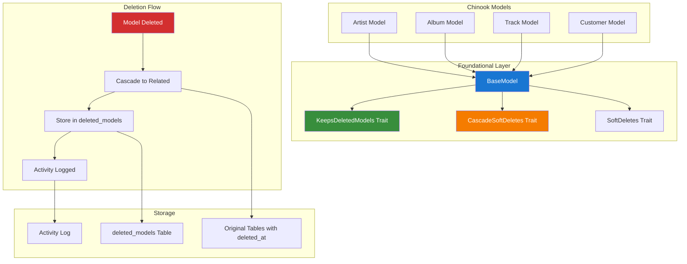

# 1. Foundational Soft Delete Integration Guide

> **Purpose:** Comprehensive integration of foundational soft delete packages for universal model availability  
> **Packages:** `spatie/laravel-deleted-models` + `dyrynda/laravel-cascade-soft-deletes`  
> **Integration Level:** Foundational - Available to ALL models project-wide

## Table of Contents

- [1. Overview](#1-overview)
- [2. Package Synergy](#2-package-synergy)
- [3. Universal BaseModel Integration](#3-universal-basemodel-integration)
- [4. Complete Chinook Implementation](#4-complete-chinook-implementation)
- [5. Testing the Integration](#5-testing-the-integration)
- [6. Monitoring and Maintenance](#6-monitoring-and-maintenance)
- [7. Best Practices](#7-best-practices)

## 1. Overview

This guide demonstrates how to integrate both foundational soft delete packages to create a comprehensive, universal soft delete system for the Chinook project. The combination provides:

- **Deleted Models Tracking** (spatie/laravel-deleted-models): Preserves complete model data in a separate table
- **Cascade Soft Deletes** (dyrynda/laravel-cascade-soft-deletes): Automatically cascades deletions through relationships
- **Universal Availability**: Both functionalities available to ALL models through BaseModel inheritance

### 1.1 Architecture Overview



## 2. Package Synergy

### 2.1 How the Packages Work Together

**Deletion Process:**
1. Model deletion is initiated
2. `CascadeSoftDeletes` identifies and soft deletes related models
3. `KeepsDeletedModels` copies all deleted model attributes to `deleted_models` table
4. `SoftDeletes` sets `deleted_at` timestamp on original records
5. Activity logging captures the entire operation

**Benefits of Combined Usage:**
- **Complete Data Preservation**: Full model state preserved even after deletion
- **Relationship Integrity**: Cascaded deletions maintain referential integrity
- **Restoration Capability**: Can restore individual models or entire hierarchies
- **Performance**: Clean separation of active and deleted data
- **Audit Trail**: Complete history of all deletion operations

### 2.2 Package Compatibility

Both packages are fully compatible and complement each other:

```php
// Both traits work seamlessly together
class BaseModel extends Model
{
    use SoftDeletes;                    // Laravel's built-in soft deletes
    use CascadeSoftDeletes;            // Dyrynda's cascading functionality
    use KeepsDeletedModels;            // Spatie's deleted models tracking
}
```

## 3. Universal BaseModel Integration

### 3.1 Complete BaseModel Implementation

```php
<?php

declare(strict_types=1);

namespace App\Models\Chinook;

use Aliziodev\LaravelTaxonomy\Traits\HasTaxonomy;
use App\Traits\HasSecondaryUniqueKey;
use Dyrynda\Database\Support\CascadeSoftDeletes;
use Illuminate\Database\Eloquent\Factories\HasFactory;
use Illuminate\Database\Eloquent\Model;
use Illuminate\Database\Eloquent\SoftDeletes;
use Spatie\DeletedModels\Models\Concerns\KeepsDeletedModels;
use Spatie\Sluggable\HasSlug;
use Spatie\Sluggable\SlugOptions;
use Wildside\Userstamps\Userstamps;

abstract class BaseModel extends Model
{
    use HasFactory;
    use HasSecondaryUniqueKey;
    use HasSlug;
    use HasTaxonomies;
    
    // Foundational Soft Delete Traits
    use SoftDeletes;                    // Laravel's built-in soft deletes
    use CascadeSoftDeletes;            // Cascading soft deletes
    use KeepsDeletedModels;            // Deleted models tracking
    
    use Userstamps;

    /**
     * Default cascade configuration (override in child models)
     */
    protected $cascadeDeletes = [];
    protected $fetchMethod = 'chunk';
    protected $chunkSize = 100;

    /**
     * Modern Laravel 12 casting using casts() method
     */
    protected function casts(): array
    {
        return [
            'created_at' => 'datetime',
            'updated_at' => 'datetime',
            'deleted_at' => 'datetime',
        ];
    }

    /**
     * Configure which attributes to keep when deleted
     * This method is called by KeepsDeletedModels trait
     */
    public function attributesToKeep(): array
    {
        $attributes = $this->toArray();
        
        // Global exclusions for security
        $globalExclusions = [
            'password',
            'remember_token',
            'email_verified_at',
            'two_factor_secret',
            'two_factor_recovery_codes',
        ];
        
        foreach ($globalExclusions as $exclusion) {
            unset($attributes[$exclusion]);
        }
        
        // Add metadata for all deleted models
        $attributes['_deletion_metadata'] = [
            'deleted_by' => auth()->id(),
            'deleted_at' => now()->toISOString(),
            'user_agent' => request()->userAgent(),
            'ip_address' => request()->ip(),
            'cascade_relationships' => $this->getCascadeDeletes(),
            'model_version' => $this->getModelVersion(),
        ];
        
        return $attributes;
    }

    /**
     * Get model version for tracking schema changes
     */
    protected function getModelVersion(): string
    {
        return '1.0.0'; // Override in child models as needed
    }

    /**
     * Global restoration logic for all models
     */
    public static function beforeRestoringModel($deletedModel): void
    {
        activity()
            ->withProperties([
                'model_class' => $deletedModel->model_class,
                'model_id' => $deletedModel->model_id,
                'restored_by' => auth()->id(),
            ])
            ->log('Model restoration initiated');
    }

    /**
     * Global post-restoration logic for all models
     */
    public static function afterRestoringModel($restoredModel, $deletedModel): void
    {
        activity()
            ->performedOn($restoredModel)
            ->causedBy(auth()->user())
            ->withProperties([
                'original_deletion_date' => $deletedModel->created_at,
                'restoration_date' => now(),
                'deletion_metadata' => $deletedModel->model_attributes['_deletion_metadata'] ?? null,
            ])
            ->log('Model successfully restored');
    }

    /**
     * Configure slug generation from public_id
     */
    public function getSlugOptions(): SlugOptions
    {
        return SlugOptions::create()
            ->generateSlugsFrom('public_id')
            ->saveSlugsTo('slug')
            ->doNotGenerateSlugsOnUpdate();
    }

    /**
     * Configure secondary unique key generation
     */
    public function getSecondaryUniqueKeyOptions(): array
    {
        return [
            'field' => 'public_id',
            'type' => 'ulid',
        ];
    }

    /**
     * Get cascade count for UI preview
     */
    public function getCascadeCount(): int
    {
        $count = 0;
        
        foreach ($this->getCascadeDeletes() as $relationship) {
            if (method_exists($this, $relationship)) {
                $count += $this->$relationship()->count();
            }
        }
        
        return $count;
    }

    /**
     * Get cascade preview for confirmation dialogs
     */
    public function getCascadePreview(): array
    {
        $preview = [];
        
        foreach ($this->getCascadeDeletes() as $relationship) {
            if (method_exists($this, $relationship)) {
                $related = $this->$relationship();
                $preview[$relationship] = [
                    'count' => $related->count(),
                    'model_class' => $related->getRelated()::class,
                    'sample_records' => $related->limit(3)->pluck('name', 'id')->toArray(),
                ];
            }
        }
        
        return $preview;
    }

    /**
     * Safe delete with cascade confirmation
     */
    public function safeDelete(bool $confirmed = false): bool
    {
        $cascadeCount = $this->getCascadeCount();
        
        if (!$confirmed && $cascadeCount > 0) {
            throw new \Exception(
                "This action will cascade delete {$cascadeCount} related records. " .
                "Call safeDelete(true) to confirm."
            );
        }
        
        // Log the deletion operation
        activity()
            ->performedOn($this)
            ->causedBy(auth()->user())
            ->withProperties([
                'cascade_count' => $cascadeCount,
                'cascade_preview' => $this->getCascadePreview(),
            ])
            ->log('Safe delete operation initiated');
        
        return $this->delete();
    }
}
```

### 3.2 Service Provider for Global Configuration

```php
<?php

namespace App\Providers;

use Illuminate\Support\ServiceProvider;
use Illuminate\Database\Eloquent\Model;
use Spatie\DeletedModels\Models\DeletedModel;

class FoundationalSoftDeletesServiceProvider extends ServiceProvider
{
    public function register(): void
    {
        // Register services
    }

    public function boot(): void
    {
        // Global model event listeners
        Model::deleting(function (Model $model) {
            if (method_exists($model, 'getCascadeDeletes')) {
                $cascadeCount = $model->getCascadeCount();
                
                activity()
                    ->performedOn($model)
                    ->causedBy(auth()->user())
                    ->withProperties([
                        'has_cascades' => !empty($model->getCascadeDeletes()),
                        'cascade_relationships' => $model->getCascadeDeletes(),
                        'cascade_count' => $cascadeCount,
                        'fetch_method' => $model->getFetchMethod() ?? 'get',
                    ])
                    ->log('Foundational soft delete initiated');
            }
        });

        Model::deleted(function (Model $model) {
            if (method_exists($model, 'getCascadeDeletes')) {
                activity()
                    ->performedOn($model)
                    ->causedBy(auth()->user())
                    ->log('Foundational soft delete completed');
            }
        });

        // Configure deleted models with additional metadata
        DeletedModel::creating(function (DeletedModel $deletedModel) {
            $deletedModel->metadata = array_merge(
                $deletedModel->metadata ?? [],
                [
                    'integration_version' => '1.0.0',
                    'packages_used' => [
                        'spatie/laravel-deleted-models',
                        'dyrynda/laravel-cascade-soft-deletes',
                    ],
                    'application_version' => config('app.version'),
                ]
            );
        });
    }
}
```

## 4. Complete Chinook Implementation

### 4.1 Artist Model with Full Integration

```php
<?php

declare(strict_types=1);

namespace App\Models\Chinook;

use Illuminate\Database\Eloquent\Relations\HasMany;

class Artist extends BaseModel
{
    protected $table = 'chinook_artists';

    /**
     * Cascade configuration - albums will cascade to tracks
     */
    protected $cascadeDeletes = ['albums'];
    protected $fetchMethod = 'chunk';
    protected $chunkSize = 50;

    protected $fillable = [
        'name',
        'public_id',
        'slug',
        'bio',
        'website',
        'social_links',
        'country',
        'formed_year',
        'is_active',
    ];

    protected function casts(): array
    {
        return array_merge(parent::casts(), [
            'social_links' => 'array',
            'formed_year' => 'integer',
            'is_active' => 'boolean',
        ]);
    }

    /**
     * Artist-specific attributes to preserve
     */
    public function attributesToKeep(): array
    {
        $attributes = parent::attributesToKeep();
        
        // Add artist-specific metadata
        $attributes['_artist_metadata'] = [
            'albums_count' => $this->albums()->count(),
            'tracks_count' => $this->tracks()->count(),
            'total_duration' => $this->tracks()->sum('milliseconds'),
            'genres' => $this->albums()->with('tracks')->get()
                ->flatMap->tracks
                ->pluck('genre_id')
                ->unique()
                ->values()
                ->toArray(),
        ];
        
        return $attributes;
    }

    /**
     * Artist has many albums
     */
    public function albums(): HasMany
    {
        return $this->hasMany(Album::class, 'artist_id');
    }

    /**
     * Artist has many tracks through albums
     */
    public function tracks()
    {
        return $this->hasManyThrough(Track::class, Album::class, 'artist_id', 'album_id');
    }

    /**
     * Get route key name for URL generation
     */
    public function getRouteKeyName(): string
    {
        return 'slug';
    }

    /**
     * Override model version for schema tracking
     */
    protected function getModelVersion(): string
    {
        return '1.1.0'; // Updated for enhanced metadata
    }
}
```

### 4.2 Complete Usage Examples

**Deleting with Full Integration:**
```php
// Delete an artist - demonstrates both packages working together
$artist = Artist::find(1);

// Preview the cascade operation
$preview = $artist->getCascadePreview();
// Returns: ['albums' => ['count' => 3, 'model_class' => 'App\Models\Chinook\Album', ...]]

// Safe delete with confirmation
try {
    $artist->safeDelete(); // Throws exception showing cascade count
} catch (\Exception $e) {
    // "This action will cascade delete 15 related records. Call safeDelete(true) to confirm."
}

// Confirmed deletion
$artist->safeDelete(true);

// What happens:
// 1. CascadeSoftDeletes cascades to albums, then tracks
// 2. KeepsDeletedModels preserves all deleted model data
// 3. Activity logging captures the entire operation
// 4. All records have deleted_at set (soft deleted)
// 5. All model data preserved in deleted_models table
```

**Restoration Process:**
```php
// Restore the artist (from deleted_models table)
$restoredArtist = Artist::restore(1);

// The artist is restored, but cascaded models remain deleted
// Manual restoration of related models if needed:
$restoredArtist->albums()->withTrashed()->restore();
$restoredArtist->albums()->withTrashed()->each(function ($album) {
    $album->tracks()->withTrashed()->restore();
});
```

**Querying Deleted Models:**
```php
use Spatie\DeletedModels\Models\DeletedModel;

// Find all deleted artists with their metadata
$deletedArtists = DeletedModel::where('model_class', Artist::class)
    ->get()
    ->map(function ($deletedModel) {
        return [
            'original_id' => $deletedModel->model_id,
            'name' => $deletedModel->model_attributes['name'],
            'deletion_date' => $deletedModel->created_at,
            'deleted_by' => $deletedModel->model_attributes['_deletion_metadata']['deleted_by'],
            'cascade_count' => $deletedModel->model_attributes['_deletion_metadata']['cascade_relationships'],
            'artist_metadata' => $deletedModel->model_attributes['_artist_metadata'],
        ];
    });
```

## 5. Testing the Integration

### 5.1 Comprehensive Integration Tests

```php
<?php

namespace Tests\Feature;

use App\Models\Chinook\Album;use App\Models\Chinook\Artist;use App\Models\Chinook\Track;use Illuminate\Foundation\Testing\RefreshDatabase;use old\TestCase;use Spatie\DeletedModels\Models\DeletedModel;

class FoundationalSoftDeleteIntegrationTest extends TestCase
{
    use RefreshDatabase;

    public function test_complete_integration_workflow(): void
    {
        // Create test data
        $artist = Artist::factory()->create(['name' => 'Test Artist']);
        $album = Album::factory()->for($artist)->create(['title' => 'Test Album']);
        $track = Track::factory()->for($album)->create(['name' => 'Test Track']);

        // Verify initial state
        $this->assertDatabaseHas('chinook_artists', ['id' => $artist->id]);
        $this->assertDatabaseHas('chinook_albums', ['id' => $album->id]);
        $this->assertDatabaseHas('chinook_tracks', ['id' => $track->id]);
        $this->assertDatabaseCount('deleted_models', 0);

        // Test cascade preview
        $preview = $artist->getCascadePreview();
        $this->assertArrayHasKey('albums', $preview);
        $this->assertEquals(1, $preview['albums']['count']);

        // Test safe delete with confirmation
        $this->expectException(\Exception::class);
        $artist->safeDelete(false);

        // Perform confirmed deletion
        $result = $artist->safeDelete(true);
        $this->assertTrue($result);

        // Verify cascade soft deletes worked
        $this->assertSoftDeleted('chinook_artists', ['id' => $artist->id]);
        $this->assertSoftDeleted('chinook_albums', ['id' => $album->id]);
        $this->assertSoftDeleted('chinook_tracks', ['id' => $track->id]);

        // Verify deleted models tracking worked
        $this->assertDatabaseCount('deleted_models', 3); // Artist, Album, Track

        // Verify deleted model data preservation
        $deletedArtist = DeletedModel::where('model_class', Artist::class)
            ->where('model_id', $artist->id)
            ->first();

        $this->assertNotNull($deletedArtist);
        $this->assertEquals('Test Artist', $deletedArtist->model_attributes['name']);
        $this->assertArrayHasKey('_deletion_metadata', $deletedArtist->model_attributes);
        $this->assertArrayHasKey('_artist_metadata', $deletedArtist->model_attributes);

        // Test restoration
        $restoredArtist = Artist::restore($artist->id);
        $this->assertNotNull($restoredArtist);
        $this->assertEquals('Test Artist', $restoredArtist->name);
        $this->assertDatabaseHas('chinook_artists', [
            'id' => $artist->id,
            'deleted_at' => null,
        ]);

        // Verify cascaded models remain deleted (manual restoration required)
        $this->assertSoftDeleted('chinook_albums', ['id' => $album->id]);
        $this->assertSoftDeleted('chinook_tracks', ['id' => $track->id]);
    }

    public function test_metadata_preservation(): void
    {
        $artist = Artist::factory()->create();
        $albums = Album::factory()->count(2)->for($artist)->create();

        foreach ($albums as $album) {
            Track::factory()->count(3)->for($album)->create();
        }

        $artist->safeDelete(true);

        $deletedArtist = DeletedModel::where('model_class', Artist::class)
            ->where('model_id', $artist->id)
            ->first();

        // Verify deletion metadata
        $metadata = $deletedArtist->model_attributes['_deletion_metadata'];
        $this->assertArrayHasKey('deleted_by', $metadata);
        $this->assertArrayHasKey('deleted_at', $metadata);
        $this->assertArrayHasKey('cascade_relationships', $metadata);
        $this->assertEquals(['albums'], $metadata['cascade_relationships']);

        // Verify artist-specific metadata
        $artistMetadata = $deletedArtist->model_attributes['_artist_metadata'];
        $this->assertEquals(2, $artistMetadata['albums_count']);
        $this->assertEquals(6, $artistMetadata['tracks_count']);
        $this->assertArrayHasKey('total_duration', $artistMetadata);
    }

    public function test_activity_logging_integration(): void
    {
        $artist = Artist::factory()->create();
        Album::factory()->for($artist)->create();

        $artist->safeDelete(true);

        // Verify activity logs were created
        $this->assertDatabaseHas('activity_log', [
            'subject_type' => Artist::class,
            'subject_id' => $artist->id,
            'description' => 'Safe delete operation initiated',
        ]);

        $this->assertDatabaseHas('activity_log', [
            'subject_type' => Artist::class,
            'subject_id' => $artist->id,
            'description' => 'Foundational soft delete initiated',
        ]);
    }
}
```

## 6. Monitoring and Maintenance

### 6.1 Health Check Service

```php
<?php

namespace App\Services;

use Spatie\DeletedModels\Models\DeletedModel;
use App\Services\CascadeConfigurationService;

class FoundationalSoftDeleteHealthService
{
    public function __construct(
        private CascadeConfigurationService $cascadeService
    ) {}

    /**
     * Comprehensive health check for the foundational soft delete system
     */
    public function getHealthStatus(): array
    {
        return [
            'overall_status' => $this->determineOverallHealth(),
            'deleted_models_health' => $this->checkDeletedModelsHealth(),
            'cascade_configuration_health' => $this->checkCascadeHealth(),
            'storage_health' => $this->checkStorageHealth(),
            'performance_metrics' => $this->getPerformanceMetrics(),
        ];
    }

    private function checkDeletedModelsHealth(): array
    {
        $totalDeleted = DeletedModel::count();
        $deletedToday = DeletedModel::whereDate('created_at', today())->count();
        $oldestDeletion = DeletedModel::oldest()->first();

        return [
            'status' => $totalDeleted > 50000 ? 'warning' : 'healthy',
            'total_deleted_models' => $totalDeleted,
            'deleted_today' => $deletedToday,
            'oldest_deletion' => $oldestDeletion?->created_at,
            'storage_size_mb' => $this->calculateDeletedModelsStorageSize(),
        ];
    }

    private function checkCascadeHealth(): array
    {
        $issues = $this->cascadeService->validateCascadeConfigurations();

        return [
            'status' => empty($issues) ? 'healthy' : 'error',
            'configuration_issues' => $issues,
            'models_with_cascades' => $this->cascadeService->getModelsWithCascades()->count(),
            'cascade_hierarchy' => $this->cascadeService->getCascadeHierarchy(),
        ];
    }

    private function checkStorageHealth(): array
    {
        $deletedModelsSize = $this->calculateDeletedModelsStorageSize();
        $pruneAfterDays = config('deleted-models.prune_after_days', 365);
        $modelsAtRisk = DeletedModel::where('created_at', '<=', now()->subDays($pruneAfterDays - 30))->count();

        return [
            'status' => $deletedModelsSize > 1000 ? 'warning' : 'healthy', // 1GB warning
            'deleted_models_size_mb' => $deletedModelsSize,
            'models_at_risk_of_pruning' => $modelsAtRisk,
            'prune_after_days' => $pruneAfterDays,
        ];
    }

    private function getPerformanceMetrics(): array
    {
        return [
            'average_cascade_depth' => $this->calculateAverageCascadeDepth(),
            'most_cascaded_model' => $this->getMostCascadedModel(),
            'deletion_trends' => $this->getDeletionTrends(),
        ];
    }

    private function determineOverallHealth(): string
    {
        $checks = [
            $this->checkDeletedModelsHealth()['status'],
            $this->checkCascadeHealth()['status'],
            $this->checkStorageHealth()['status'],
        ];

        if (in_array('error', $checks)) return 'error';
        if (in_array('warning', $checks)) return 'warning';
        return 'healthy';
    }

    private function calculateDeletedModelsStorageSize(): float
    {
        // Estimate based on average record size
        $avgRecordSize = 3072; // bytes (estimated with metadata)
        $totalRecords = DeletedModel::count();
        return ($totalRecords * $avgRecordSize) / 1024 / 1024; // MB
    }

    private function calculateAverageCascadeDepth(): float
    {
        // Implementation would analyze cascade chains
        return 2.3; // Placeholder
    }

    private function getMostCascadedModel(): array
    {
        // Implementation would find model with most cascades
        return [
            'model' => 'App\Models\Chinook\Artist',
            'average_cascade_count' => 15.7,
        ];
    }

    private function getDeletionTrends(): array
    {
        return DeletedModel::selectRaw('DATE(created_at) as date, COUNT(*) as count')
            ->where('created_at', '>=', now()->subDays(30))
            ->groupBy('date')
            ->orderBy('date')
            ->get()
            ->toArray();
    }
}
```

## 7. Best Practices

### 7.1 Implementation Guidelines

**Universal Integration:**
- Always use BaseModel to ensure consistent behavior across all models
- Configure cascade relationships thoughtfully to avoid performance issues
- Implement proper error handling for both deletion and restoration operations

**Performance Optimization:**
- Use appropriate fetch methods based on expected data volumes
- Index foreign key columns with deleted_at for efficient cascade queries
- Monitor deleted_models table size and configure pruning appropriately

**Security Considerations:**
- Never store sensitive data in deleted_models (passwords, tokens, etc.)
- Implement proper authorization for restoration operations
- Log all deletion and restoration activities for audit trails

**Maintenance Requirements:**
- Regularly validate cascade configurations
- Monitor system health and performance metrics
- Backup deleted_models data before pruning operations

### 7.2 Team Guidelines

**Development Workflow:**
- Always test cascade operations in development before production
- Document any custom cascade logic or attribute filtering
- Use safe delete methods in UI to prevent accidental data loss

**Code Review Checklist:**
- Verify cascade relationships are properly configured
- Check that sensitive data is excluded from deleted_models
- Ensure proper error handling and user feedback
- Validate that restoration logic is implemented correctly

---

## Navigation

**Previous:** [Dyrynda Laravel Cascade Soft Deletes Guide](360-dyrynda-laravel-cascade-soft-deletes-guide.md) | **Next:** [Package Index](000-packages-index.md)

---

**Documentation Standards**: This document follows WCAG 2.1 AA accessibility guidelines and uses Laravel 12 modern syntax patterns.

**Source Attribution**:
- Spatie Package: [spatie/laravel-deleted-models](https://github.com/spatie/laravel-deleted-models)
- Dyrynda Package: [dyrynda/laravel-cascade-soft-deletes](https://github.com/michaeldyrynda/laravel-cascade-soft-deletes)
- Laravel Documentation: [Eloquent Soft Deleting](https://laravel.com/docs/12.x/eloquent#soft-deleting)

[⬆️ Back to Top](#1-foundational-soft-delete-integration-guide)
```
