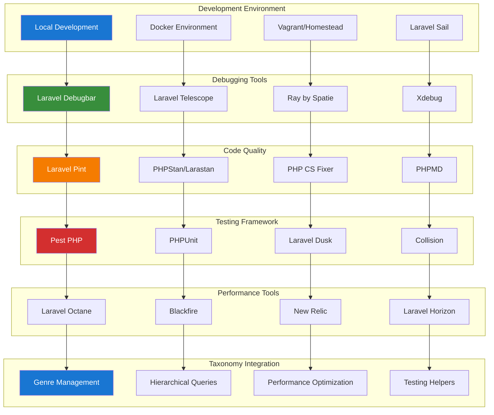

# 1. Development Tools Index

**Refactored from:** `.ai/guides/chinook/packages/development/000-development-index.md` on 2025-07-13  
**Taxonomy System:** aliziodev/laravel-taxonomy (Single System)  
**Laravel Version:** 12.x  
**Documentation Standard:** WCAG 2.1 AA Compliant

## Table of Contents

- [1. Development Tools Index](#1-development-tools-index)
  - [1.1 Overview](#11-overview)
    - [1.1.1 Tool Categories](#111-tool-categories)
    - [1.1.2 Architecture Overview](#112-architecture-overview)
    - [1.1.3 Taxonomy Integration Benefits](#113-taxonomy-integration-benefits)
  - [1.2 Development Environment Setup](#12-development-environment-setup)
    - [1.2.1 Laravel Sail Configuration](#121-laravel-sail-configuration)
    - [1.2.2 Environment Configuration](#122-environment-configuration)
    - [1.2.3 Taxonomy Development Environment](#123-taxonomy-development-environment)
  - [1.3 Debugging Tools](#13-debugging-tools)
    - [1.3.1 Laravel Debugbar Setup](#131-laravel-debugbar-setup)
    - [1.3.2 Debugbar Configuration](#132-debugbar-configuration)
    - [1.3.3 Taxonomy-Aware Debugging](#133-taxonomy-aware-debugging)
  - [1.4 Code Quality Tools](#14-code-quality-tools)
    - [1.4.1 Laravel Pint Configuration](#141-laravel-pint-configuration)

---

## 1.1 Overview

This comprehensive development tools index provides guidance on setting up and using essential development tools for Laravel applications with **aliziodev/laravel-taxonomy** integration, focusing on productivity, code quality, debugging capabilities, and taxonomy-aware development workflows.

### 1.1.1 Tool Categories

- **Debugging**: Laravel Debugbar, Telescope, Ray with taxonomy query analysis
- **Code Quality**: PHP CS Fixer, Pint, PHPStan, Larastan with taxonomy validation
- **Testing**: Pest, PHPUnit, Dusk, Collision with taxonomy test helpers
- **Performance**: Blackfire, Xdebug, Laravel Octane with taxonomy optimization
- **Documentation**: phpDocumentor, API Documentation with taxonomy endpoints
- **Deployment**: Deployer, Forge, Vapor with taxonomy migration support
- **Monitoring**: Horizon, Pulse, New Relic with taxonomy performance tracking

### 1.1.2 Architecture Overview



### 1.1.3 Taxonomy Integration Benefits

- **Genre-Aware Development**: Tools configured to understand music genre hierarchies
- **Performance Optimization**: Specialized monitoring for taxonomy queries and relationships
- **Testing Support**: Comprehensive test helpers for taxonomy operations
- **Debugging Enhancement**: Taxonomy-specific debugging tools and query analysis
- **Code Quality**: Standards and rules for taxonomy-related code patterns
- **Documentation**: Automated API documentation for taxonomy endpoints

## 1.2 Development Environment Setup

### 1.2.1 Laravel Sail Configuration

```yaml
# docker-compose.yml
version: '3'
services:
    laravel.test:
        build:
            context: ./vendor/laravel/sail/runtimes/8.2
            dockerfile: Dockerfile
            args:
                WWWGROUP: '${WWWGROUP}'
        image: sail-8.2/app
        extra_hosts:
            - 'host.docker.internal:host-gateway'
        ports:
            - '${APP_PORT:-80}:80'
            - '${VITE_PORT:-5173}:${VITE_PORT:-5173}'
        environment:
            WWWUSER: '${WWWUSER}'
            LARAVEL_SAIL: 1
            XDEBUG_MODE: '${SAIL_XDEBUG_MODE:-off}'
            XDEBUG_CONFIG: '${SAIL_XDEBUG_CONFIG:-client_host=host.docker.internal}'
            # Taxonomy-specific environment variables
            TAXONOMY_CACHE_ENABLED: true
            TAXONOMY_DEBUG_MODE: '${TAXONOMY_DEBUG:-false}'
        volumes:
            - '.:/var/www/html'
        networks:
            - sail
        depends_on:
            - mysql
            - redis
            - meilisearch
            - mailpit
            - selenium
    mysql:
        image: 'mysql/mysql-server:8.0'
        ports:
            - '${FORWARD_DB_PORT:-3306}:3306'
        environment:
            MYSQL_ROOT_PASSWORD: '${DB_PASSWORD}'
            MYSQL_ROOT_HOST: "%"
            MYSQL_DATABASE: '${DB_DATABASE}'
            MYSQL_USER: '${DB_USERNAME}'
            MYSQL_PASSWORD: '${DB_PASSWORD}'
            MYSQL_ALLOW_EMPTY_PASSWORD: 1
        volumes:
            - 'sail-mysql:/var/lib/mysql'
            - './vendor/laravel/sail/database/mysql/create-testing-database.sh:/docker-entrypoint-initdb.d/10-create-testing-database.sh'
            # Taxonomy-specific database optimizations
            - './database/mysql/taxonomy-indexes.sql:/docker-entrypoint-initdb.d/20-taxonomy-indexes.sql'
        networks:
            - sail
        healthcheck:
            test: ["CMD", "mysqladmin", "ping", "-p${DB_PASSWORD}"]
            retries: 3
            timeout: 5s
    redis:
        image: 'redis:alpine'
        ports:
            - '${FORWARD_REDIS_PORT:-6379}:6379'
        volumes:
            - 'sail-redis:/data'
            # Taxonomy cache configuration
            - './config/redis/taxonomy.conf:/usr/local/etc/redis/taxonomy.conf'
        networks:
            - sail
        healthcheck:
            test: ["CMD", "redis-cli", "ping"]
            retries: 3
            timeout: 5s
networks:
    sail:
        driver: bridge
volumes:
    sail-mysql:
        driver: local
    sail-redis:
        driver: local
```

### 1.2.2 Environment Configuration

```bash
# .env.development
APP_NAME="Chinook Development"
APP_ENV=local
APP_KEY=base64:your-app-key-here
APP_DEBUG=true
APP_URL=http://localhost

# Database
DB_CONNECTION=mysql
DB_HOST=mysql
DB_PORT=3306
DB_DATABASE=chinook_dev
DB_USERNAME=sail
DB_PASSWORD=password

# Cache
CACHE_DRIVER=redis
QUEUE_CONNECTION=redis
SESSION_DRIVER=redis

# Development Tools
DEBUGBAR_ENABLED=true
TELESCOPE_ENABLED=true
RAY_ENABLED=true

# Testing
TESTING_DATABASE=chinook_testing
PEST_PARALLEL=true

# Performance
OCTANE_SERVER=swoole
OCTANE_HTTPS=false

# Taxonomy Configuration
TAXONOMY_CACHE_ENABLED=true
TAXONOMY_CACHE_TTL=3600
TAXONOMY_DEBUG=true
TAXONOMY_PERFORMANCE_MONITORING=true
TAXONOMY_QUERY_LOGGING=true

# Genre Management
GENRE_HIERARCHY_DEPTH=5
GENRE_CACHE_STRATEGY=hierarchical
GENRE_VALIDATION_STRICT=true
```

### 1.2.3 Taxonomy Development Environment

```php
<?php

// config/taxonomy-dev.php
return [
    /*
     * Development-specific taxonomy configuration
     */
    'development' => [
        'debug_mode' => env('TAXONOMY_DEBUG', true),
        'query_logging' => env('TAXONOMY_QUERY_LOGGING', true),
        'performance_monitoring' => env('TAXONOMY_PERFORMANCE_MONITORING', true),
        'cache_debugging' => env('TAXONOMY_CACHE_DEBUG', true),
    ],

    /*
     * Development tools integration
     */
    'tools' => [
        'debugbar' => [
            'enabled' => true,
            'show_queries' => true,
            'show_cache_operations' => true,
            'show_hierarchy_traversal' => true,
        ],
        'telescope' => [
            'track_taxonomy_queries' => true,
            'track_cache_operations' => true,
            'track_performance_metrics' => true,
        ],
        'ray' => [
            'taxonomy_debugging' => true,
            'hierarchy_visualization' => true,
            'performance_profiling' => true,
        ],
    ],

    /*
     * Testing configuration
     */
    'testing' => [
        'use_test_data' => true,
        'reset_between_tests' => true,
        'mock_external_services' => true,
        'performance_assertions' => true,
    ],

    /*
     * Performance monitoring
     */
    'performance' => [
        'slow_query_threshold' => 100, // milliseconds
        'memory_usage_tracking' => true,
        'cache_hit_rate_monitoring' => true,
        'hierarchy_depth_warnings' => true,
    ],
];
```

## 1.3 Debugging Tools

### 1.3.1 Laravel Debugbar Setup

```bash
# Install Laravel Debugbar
composer require barryvdh/laravel-debugbar --dev

# Publish configuration
php artisan vendor:publish --provider="Barryvdh\Debugbar\ServiceProvider"

# Install taxonomy debugging extensions
composer require aliziodev/laravel-taxonomy-debugbar --dev
```

### 1.3.2 Debugbar Configuration

```php
<?php

// config/debugbar.php
return [
    'enabled' => env('DEBUGBAR_ENABLED', null),
    'except' => [
        'telescope*',
        'horizon*',
    ],
    'storage' => [
        'enabled'    => true,
        'driver'     => 'file',
        'path'       => storage_path('debugbar'),
        'connection' => null,
        'provider'   => '',
        'hostname'   => '127.0.0.1',
        'port'       => 2304,
    ],
    'include_vendors' => true,
    'capture_ajax' => true,
    'add_ajax_timing' => false,
    'error_handler' => false,
    'clockwork' => false,
    'collectors' => [
        'phpinfo'         => true,
        'messages'        => true,
        'time'            => true,
        'memory'          => true,
        'exceptions'      => true,
        'log'             => true,
        'db'              => true,
        'views'           => true,
        'route'           => true,
        'auth'            => false,
        'gate'            => true,
        'session'         => true,
        'symfony_request' => true,
        'mail'            => true,
        'laravel'         => false,
        'events'          => false,
        'default_request' => false,
        'logs'            => false,
        'files'           => false,
        'config'          => false,
        'cache'           => false,
        'models'          => true,
        'livewire'        => true,
        // Taxonomy-specific collectors
        'taxonomy'        => true,
        'taxonomy_cache'  => true,
        'taxonomy_queries' => true,
        'genre_hierarchy' => true,
    ],
    'options' => [
        'auth' => [
            'show_name' => true,
        ],
        'db' => [
            'with_params'       => true,
            'backtrace'         => true,
            'backtrace_exclude_paths' => [],
            'timeline'          => false,
            'explain' => [
                'enabled' => false,
                'types' => ['SELECT'],
            ],
            'hints'             => true,
            'show_copy'         => false,
        ],
        'mail' => [
            'full_log' => false,
        ],
        'views' => [
            'timeline' => false,
            'data' => false,
        ],
        'route' => [
            'label' => true,
        ],
        'logs' => [
            'file' => null,
        ],
        'cache' => [
            'values' => true,
        ],
        // Taxonomy-specific options
        'taxonomy' => [
            'show_hierarchy' => true,
            'show_relationships' => true,
            'show_cache_operations' => true,
            'performance_metrics' => true,
        ],
    ],
    'inject' => true,
    'route_prefix' => '_debugbar',
    'route_domain' => null,
    'theme' => env('DEBUGBAR_THEME', 'auto'),
];
```

### 1.3.3 Taxonomy-Aware Debugging

```php
<?php

namespace App\Debug;

use Aliziodev\Taxonomy\Models\Taxonomy;
use Illuminate\Support\Facades\Log;
use Illuminate\Support\Facades\Cache;

class TaxonomyDebugger
{
    /**
     * Debug taxonomy hierarchy traversal
     */
    public function debugHierarchyTraversal(Taxonomy $taxonomy): array
    {
        $debug = [
            'taxonomy_id' => $taxonomy->id,
            'name' => $taxonomy->name,
            'type' => $taxonomy->type,
            'hierarchy' => [],
            'performance' => [],
        ];

        $start = microtime(true);

        // Get ancestors
        $ancestors = $taxonomy->ancestors;
        $debug['hierarchy']['ancestors'] = $ancestors->pluck('name')->toArray();

        // Get descendants
        $descendants = $taxonomy->descendants;
        $debug['hierarchy']['descendants'] = $descendants->pluck('name')->toArray();

        // Get siblings
        $siblings = $taxonomy->siblings;
        $debug['hierarchy']['siblings'] = $siblings->pluck('name')->toArray();

        $debug['performance']['execution_time'] = microtime(true) - $start;
        $debug['performance']['memory_usage'] = memory_get_usage(true);
        $debug['performance']['query_count'] = \DB::getQueryLog() ? count(\DB::getQueryLog()) : 0;

        if (app()->environment('local')) {
            Log::debug('Taxonomy Hierarchy Debug', $debug);
        }

        return $debug;
    }

    /**
     * Debug taxonomy cache operations
     */
    public function debugCacheOperations(string $operation, string $key, mixed $value = null): void
    {
        $debug = [
            'operation' => $operation,
            'key' => $key,
            'value_type' => gettype($value),
            'memory_usage' => memory_get_usage(true),
            'timestamp' => now()->toISOString(),
        ];

        if ($value !== null) {
            $debug['value_size'] = strlen(serialize($value));
        }

        Log::debug('Taxonomy Cache Operation', $debug);
    }

    /**
     * Debug taxonomy query performance
     */
    public function debugQueryPerformance(string $query, array $bindings, float $time): void
    {
        if ($time > 100) { // Queries taking more than 100ms
            Log::warning('Slow Taxonomy Query', [
                'query' => $query,
                'bindings' => $bindings,
                'execution_time' => $time,
                'memory_usage' => memory_get_usage(true),
                'recommendations' => $this->getPerformanceRecommendations($query),
            ]);
        }
    }

    /**
     * Get performance recommendations for slow queries
     */
    private function getPerformanceRecommendations(string $query): array
    {
        $recommendations = [];

        if (str_contains($query, 'taxonomies')) {
            if (str_contains($query, 'WHERE') && !str_contains($query, 'INDEX')) {
                $recommendations[] = 'Consider adding database indexes for taxonomy queries';
            }

            if (str_contains($query, 'JOIN') && str_contains($query, 'taxonomies')) {
                $recommendations[] = 'Consider using eager loading for taxonomy relationships';
            }

            if (str_contains($query, 'ORDER BY')) {
                $recommendations[] = 'Consider caching sorted taxonomy results';
            }
        }

        return $recommendations;
    }
}
```

## 1.4 Code Quality Tools

### 1.4.1 Laravel Pint Configuration

```json
{
    "preset": "laravel",
    "rules": {
        "simplified_null_return": true,
        "braces": {
            "position_after_control_structures": "same"
        },
        "concat_space": {
            "spacing": "one"
        },
        "method_chaining_indentation": true,
        "multiline_whitespace_before_semicolons": {
            "strategy": "no_multi_line"
        },
        "single_trait_insert_per_statement": true,
        "taxonomy_method_naming": {
            "prefix_taxonomy_methods": true,
            "use_descriptive_names": true
        }
    },
    "exclude": [
        "bootstrap",
        "storage",
        "vendor"
    ],
    "taxonomy_rules": {
        "enforce_taxonomy_type_hints": true,
        "require_taxonomy_documentation": true,
        "validate_hierarchy_methods": true
    }
}
```

[⬆️ Back to Top](#1-development-tools-index)
