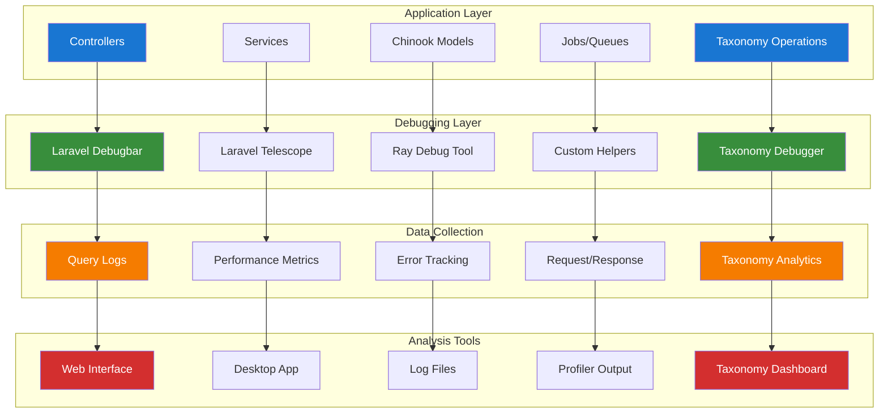

# 1. Development Debugging Tools Guide

**Refactored from:** `.ai/guides/chinook/packages/development/010-debugbar-guide.md` on 2025-07-13  
**Purpose:** Comprehensive debugging tools and techniques for Laravel development with taxonomy integration  
**Scope:** Laravel Debugbar, Telescope, Ray, Xdebug, and custom debugging utilities

## 1.1 Table of Contents

- [1.1 Table of Contents](#11-table-of-contents)
- [1.2 Overview](#12-overview)
- [1.3 Laravel Debugbar Setup](#13-laravel-debugbar-setup)
- [1.4 Laravel Telescope Integration](#14-laravel-telescope-integration)
- [1.5 Ray Debugging Tool](#15-ray-debugging-tool)
- [1.6 Xdebug Configuration](#16-xdebug-configuration)
- [1.7 Custom Debug Helpers](#17-custom-debug-helpers)
- [1.11 Taxonomy-Specific Debugging](#111-taxonomy-specific-debugging)
- [1.12 Best Practices](#112-best-practices)

## 1.2 Overview

This guide provides comprehensive debugging tools and techniques for Laravel development, focusing on identifying performance issues, tracking database queries, debugging application logic, and monitoring taxonomy operations effectively.

### 1.2.1 Debugging Tool Stack

- **Laravel Debugbar**: Web-based debugging toolbar with taxonomy query monitoring
- **Laravel Telescope**: Application monitoring and debugging with taxonomy watchers
- **Ray**: Advanced debugging tool by Spatie with taxonomy data visualization
- **Xdebug**: PHP debugging and profiling for taxonomy operations
- **Custom Helpers**: Application-specific debugging utilities for taxonomy relationships

### 1.2.2 Taxonomy Integration Benefits

- **Genre Relationship Debugging**: Monitor taxonomy relationships and hierarchies
- **Performance Analysis**: Track taxonomy query performance and optimization
- **Data Integrity**: Validate taxonomy data consistency and relationships
- **Migration Debugging**: Debug taxonomy migration and seeding processes

### 1.2.3 Architecture Overview



## 1.3 Laravel Debugbar Setup

### 1.3.1 Installation and Configuration

```bash
# Install Laravel Debugbar
composer require barryvdh/laravel-debugbar --dev

# Publish configuration
php artisan vendor:publish --provider="Barryvdh\Debugbar\ServiceProvider"
```

### 1.3.2 Enhanced Configuration with Taxonomy Support

```php
<?php

// config/debugbar.php
return [
    'enabled' => env('DEBUGBAR_ENABLED', null),
    
    'except' => [
        'telescope*',
        'horizon*',
        'nova*',
        '_debugbar*',
        'filament*',
    ],
    
    'storage' => [
        'enabled'    => true,
        'driver'     => 'file',
        'path'       => storage_path('debugbar'),
        'connection' => null,
    ],
    
    'include_vendors' => true,
    'capture_ajax' => true,
    'add_ajax_timing' => true,
    'error_handler' => false,
    
    'collectors' => [
        'phpinfo'         => true,
        'messages'        => true,
        'time'            => true,
        'memory'          => true,
        'exceptions'      => true,
        'log'             => true,
        'db'              => true,
        'views'           => true,
        'route'           => true,
        'auth'            => true,
        'gate'            => true,
        'session'         => true,
        'symfony_request' => true,
        'mail'            => true,
        'laravel'         => false,
        'events'          => true,
        'default_request' => false,
        'logs'            => false,
        'files'           => false,
        'config'          => false,
        'cache'           => true,
        'models'          => true,
        'livewire'        => true,
        'taxonomy'        => true, // Custom taxonomy collector
    ],
    
    'options' => [
        'db' => [
            'with_params'       => true,
            'backtrace'         => true,
            'backtrace_exclude_paths' => [
                base_path('vendor'),
            ],
            'timeline'          => true,
            'explain' => [
                'enabled' => true,
                'types' => ['SELECT'],
            ],
            'hints'             => true,
            'show_copy'         => true,
            'taxonomy_queries'  => true, // Track taxonomy-specific queries
        ],
        'mail' => [
            'full_log' => true,
        ],
        'views' => [
            'timeline' => true,
            'data' => true,
        ],
        'route' => [
            'label' => true,
        ],
        'cache' => [
            'values' => true,
        ],
        'taxonomy' => [
            'track_relationships' => true,
            'monitor_performance' => true,
            'log_hierarchy_queries' => true,
        ],
    ],
    
    'inject' => true,
    'route_prefix' => '_debugbar',
    'route_domain' => null,
    'theme' => env('DEBUGBAR_THEME', 'auto'),
];
```

### 1.3.3 Custom Debugbar Messages with Taxonomy Support

```php
<?php

namespace App\Services;

use Barryvdh\Debugbar\Facades\Debugbar;
use Aliziodev\LaravelTaxonomy\Models\Taxonomy;

class DebugService
{
    /**
     * Log debug information with taxonomy context
     */
    public function debug(string $message, array $context = []): void
    {
        if (app()->environment('local') && config('debugbar.enabled')) {
            $taxonomyContext = $this->getTaxonomyContext();
            $fullContext = array_merge($context, $taxonomyContext);
            
            Debugbar::info($message, $fullContext);
        }
    }

    /**
     * Log taxonomy relationship operations
     */
    public function logTaxonomyOperation(string $operation, $model, array $taxonomies = []): void
    {
        if (!app()->environment('local')) {
            return;
        }

        $taxonomyData = [
            'operation' => $operation,
            'model_type' => get_class($model),
            'model_id' => $model->id ?? 'new',
            'taxonomies' => collect($taxonomies)->map(function ($taxonomy) {
                return [
                    'id' => $taxonomy->id ?? null,
                    'name' => $taxonomy->name ?? $taxonomy,
                    'type' => $taxonomy->type ?? 'unknown',
                    'parent_id' => $taxonomy->parent_id ?? null,
                ];
            })->toArray(),
            'timestamp' => now()->toISOString(),
        ];

        Debugbar::addMessage($taxonomyData, 'taxonomy');
    }

    /**
     * Log performance metrics with taxonomy context
     */
    public function logPerformance(string $operation, float $startTime, array $taxonomyContext = []): void
    {
        $duration = microtime(true) - $startTime;
        
        $performanceData = [
            'operation' => $operation,
            'duration' => $duration,
            'formatted_duration' => number_format($duration * 1000, 2) . 'ms',
            'taxonomy_context' => $taxonomyContext,
            'memory_usage' => memory_get_usage(true),
            'peak_memory' => memory_get_peak_usage(true),
        ];
        
        Debugbar::addMessage($performanceData, 'performance');
        
        if ($duration > 1.0) {
            Debugbar::warning("Slow operation detected: {$operation}", $performanceData);
        }
    }

    /**
     * Get current taxonomy context for debugging
     */
    private function getTaxonomyContext(): array
    {
        return [
            'taxonomy_cache_enabled' => config('taxonomy.cache.enabled', false),
            'taxonomy_driver' => config('taxonomy.driver', 'database'),
            'active_taxonomies' => $this->getActiveTaxonomyCount(),
            'request_taxonomy_queries' => $this->getTaxonomyQueryCount(),
        ];
    }

    /**
     * Get count of active taxonomies
     */
    private function getActiveTaxonomyCount(): int
    {
        try {
            return Taxonomy::count();
        } catch (\Exception $e) {
            return 0;
        }
    }

    /**
     * Get taxonomy-related query count for current request
     */
    private function getTaxonomyQueryCount(): int
    {
        $queries = \DB::getQueryLog();
        
        return collect($queries)->filter(function ($query) {
            return str_contains($query['query'], 'taxonomies') ||
                   str_contains($query['query'], 'taxonomy_');
        })->count();
    }
}
```

## 1.4 Laravel Telescope Integration

### 1.4.1 Installation and Setup

```bash
# Install Laravel Telescope
composer require laravel/telescope --dev

# Publish assets and configuration
php artisan telescope:install

# Run migrations
php artisan migrate

# Publish configuration (optional)
php artisan vendor:publish --tag=telescope-config
```

### 1.4.2 Enhanced Telescope Configuration with Taxonomy Monitoring

```php
<?php

// config/telescope.php
use Laravel\Telescope\Watchers;

return [
    'enabled' => env('TELESCOPE_ENABLED', true),

    'domain' => env('TELESCOPE_DOMAIN'),
    'path' => env('TELESCOPE_PATH', 'telescope'),

    'driver' => env('TELESCOPE_DRIVER', 'database'),

    'storage' => [
        'database' => [
            'connection' => env('DB_CONNECTION', 'sqlite'),
            'chunk' => 1000,
        ],
    ],

    'queue' => [
        'connection' => env('TELESCOPE_QUEUE_CONNECTION', 'redis'),
        'queue' => env('TELESCOPE_QUEUE', 'default'),
    ],

    'watchers' => [
        Watchers\BatchWatcher::class => env('TELESCOPE_BATCH_WATCHER', true),
        Watchers\CacheWatcher::class => [
            'enabled' => env('TELESCOPE_CACHE_WATCHER', true),
            'hidden' => [],
        ],
        Watchers\CommandWatcher::class => [
            'enabled' => env('TELESCOPE_COMMAND_WATCHER', true),
            'ignore' => [
                'telescope:prune',
                'horizon:*',
                'queue:*',
            ],
        ],
        Watchers\DumpWatcher::class => env('TELESCOPE_DUMP_WATCHER', true),
        Watchers\EventWatcher::class => [
            'enabled' => env('TELESCOPE_EVENT_WATCHER', true),
            'ignore' => [
                'Illuminate\Auth\Events\*',
                'Illuminate\Cache\Events\*',
                'Illuminate\Database\Events\*',
            ],
        ],
        Watchers\ExceptionWatcher::class => env('TELESCOPE_EXCEPTION_WATCHER', true),
        Watchers\JobWatcher::class => env('TELESCOPE_JOB_WATCHER', true),
        Watchers\LogWatcher::class => [
            'enabled' => env('TELESCOPE_LOG_WATCHER', true),
            'level' => 'error',
        ],
        Watchers\MailWatcher::class => env('TELESCOPE_MAIL_WATCHER', true),
        Watchers\ModelWatcher::class => [
            'enabled' => env('TELESCOPE_MODEL_WATCHER', true),
            'events' => ['eloquent.*'],
            'hydrations' => true,
        ],
        Watchers\NotificationWatcher::class => env('TELESCOPE_NOTIFICATION_WATCHER', true),
        Watchers\QueryWatcher::class => [
            'enabled' => env('TELESCOPE_QUERY_WATCHER', true),
            'ignore_packages' => true,
            'ignore_paths' => [],
            'slow' => 100,
        ],
        Watchers\RedisWatcher::class => env('TELESCOPE_REDIS_WATCHER', true),
        Watchers\RequestWatcher::class => [
            'enabled' => env('TELESCOPE_REQUEST_WATCHER', true),
            'size_limit' => env('TELESCOPE_RESPONSE_SIZE_LIMIT', 64),
            'ignore_http_methods' => [],
            'ignore_status_codes' => [],
        ],
        Watchers\ScheduleWatcher::class => env('TELESCOPE_SCHEDULE_WATCHER', true),
        Watchers\ViewWatcher::class => env('TELESCOPE_VIEW_WATCHER', true),

        // Custom taxonomy watcher
        \App\Telescope\Watchers\TaxonomyWatcher::class => [
            'enabled' => env('TELESCOPE_TAXONOMY_WATCHER', true),
            'track_relationships' => true,
            'monitor_performance' => true,
        ],
    ],
];
```

### 1.4.3 Custom Taxonomy Watcher

```php
<?php

namespace App\Telescope\Watchers;

use Laravel\Telescope\IncomingEntry;
use Laravel\Telescope\Telescope;
use Laravel\Telescope\Watchers\Watcher;
use Aliziodev\LaravelTaxonomy\Models\Taxonomy;

class TaxonomyWatcher extends Watcher
{
    /**
     * Register the watcher.
     */
    public function register($app): void
    {
        $app['events']->listen('eloquent.created: ' . Taxonomy::class, [$this, 'recordTaxonomyCreated']);
        $app['events']->listen('eloquent.updated: ' . Taxonomy::class, [$this, 'recordTaxonomyUpdated']);
        $app['events']->listen('eloquent.deleted: ' . Taxonomy::class, [$this, 'recordTaxonomyDeleted']);
    }

    /**
     * Record taxonomy creation.
     */
    public function recordTaxonomyCreated($event): void
    {
        if (!$this->shouldRecord()) {
            return;
        }

        Telescope::recordTaxonomy(IncomingEntry::make([
            'type' => 'created',
            'taxonomy_id' => $event->id,
            'name' => $event->name,
            'type_name' => $event->type,
            'parent_id' => $event->parent_id,
            'attributes' => $event->getAttributes(),
            'timestamp' => now(),
        ]));
    }

    /**
     * Record taxonomy updates.
     */
    public function recordTaxonomyUpdated($event): void
    {
        if (!$this->shouldRecord()) {
            return;
        }

        Telescope::recordTaxonomy(IncomingEntry::make([
            'type' => 'updated',
            'taxonomy_id' => $event->id,
            'name' => $event->name,
            'type_name' => $event->type,
            'parent_id' => $event->parent_id,
            'changes' => $event->getDirty(),
            'original' => $event->getOriginal(),
            'timestamp' => now(),
        ]));
    }

    /**
     * Record taxonomy deletion.
     */
    public function recordTaxonomyDeleted($event): void
    {
        if (!$this->shouldRecord()) {
            return;
        }

        Telescope::recordTaxonomy(IncomingEntry::make([
            'type' => 'deleted',
            'taxonomy_id' => $event->id,
            'name' => $event->name,
            'type_name' => $event->type,
            'parent_id' => $event->parent_id,
            'attributes' => $event->getOriginal(),
            'timestamp' => now(),
        ]));
    }

    /**
     * Determine if the watcher should record the entry.
     */
    private function shouldRecord(): bool
    {
        return $this->options['enabled'] ?? true;
    }
}
```

## 1.5 Ray Debugging Tool

### 1.5.1 Installation and Setup

```bash
# Install Ray
composer require spatie/laravel-ray --dev

# Publish configuration
php artisan vendor:publish --provider="Spatie\LaravelRay\RayServiceProvider"
```

### 1.5.2 Ray Configuration with Taxonomy Support

```php
<?php

// config/ray.php
return [
    'enable' => env('RAY_ENABLED', true),

    'host' => env('RAY_HOST', 'localhost'),
    'port' => env('RAY_PORT', 23517),

    'remote_path' => env('RAY_REMOTE_PATH'),
    'local_path' => env('RAY_LOCAL_PATH'),

    'always_send_raw_values' => false,

    'not_defined' => true,

    // Taxonomy-specific settings
    'taxonomy' => [
        'auto_track_relationships' => env('RAY_TAXONOMY_AUTO_TRACK', true),
        'show_hierarchy_depth' => env('RAY_TAXONOMY_HIERARCHY', true),
        'color_code_types' => env('RAY_TAXONOMY_COLORS', true),
    ],
];
```

### 1.5.3 Advanced Ray Usage with Taxonomy Debugging

```php
<?php

namespace App\Services;

use Spatie\Ray\Ray;
use Aliziodev\LaravelTaxonomy\Models\Taxonomy;

class RayDebugService
{
    /**
     * Debug taxonomy data structures
     */
    public function debugTaxonomy($taxonomy, string $label = 'Taxonomy Data'): void
    {
        if (!app()->environment('local')) {
            return;
        }

        $taxonomyData = [
            'id' => $taxonomy->id ?? null,
            'name' => $taxonomy->name ?? 'N/A',
            'type' => $taxonomy->type ?? 'N/A',
            'parent_id' => $taxonomy->parent_id ?? null,
            'children_count' => $taxonomy->children()->count() ?? 0,
            'models_count' => $taxonomy->models()->count() ?? 0,
            'hierarchy_path' => $this->getTaxonomyPath($taxonomy),
            'metadata' => $taxonomy->meta ?? [],
        ];

        ray($taxonomyData)->label($label)->blue();
    }

    /**
     * Debug taxonomy relationships
     */
    public function debugTaxonomyRelationships($model, string $label = 'Model Taxonomies'): void
    {
        if (!app()->environment('local') || !method_exists($model, 'taxonomies')) {
            return;
        }

        $relationshipData = [
            'model_type' => get_class($model),
            'model_id' => $model->id ?? 'new',
            'taxonomies' => $model->taxonomies->map(function ($taxonomy) {
                return [
                    'id' => $taxonomy->id,
                    'name' => $taxonomy->name,
                    'type' => $taxonomy->type,
                    'pivot_data' => $taxonomy->pivot ?? null,
                ];
            })->toArray(),
            'taxonomy_count' => $model->taxonomies->count(),
        ];

        ray($relationshipData)->label($label)->green();
    }

    /**
     * Debug taxonomy hierarchy
     */
    public function debugTaxonomyHierarchy(string $type = null): void
    {
        if (!app()->environment('local')) {
            return;
        }

        $query = Taxonomy::with(['parent', 'children']);

        if ($type) {
            $query->where('type', $type);
        }

        $taxonomies = $query->get();

        $hierarchyData = $this->buildHierarchyTree($taxonomies);

        ray($hierarchyData)->label('Taxonomy Hierarchy')->orange();
    }

    /**
     * Debug performance with taxonomy context
     */
    public function debugTaxonomyPerformance(callable $callback, string $label = 'Taxonomy Performance'): mixed
    {
        if (!app()->environment('local')) {
            return $callback();
        }

        $startTime = microtime(true);
        $startQueries = \DB::getQueryLog();

        $result = $callback();

        $endTime = microtime(true);
        $endQueries = \DB::getQueryLog();

        $duration = $endTime - $startTime;
        $queryCount = count($endQueries) - count($startQueries);

        $performanceData = [
            'duration' => number_format($duration * 1000, 2) . 'ms',
            'query_count' => $queryCount,
            'memory_usage' => $this->formatBytes(memory_get_usage(true)),
            'peak_memory' => $this->formatBytes(memory_get_peak_usage(true)),
        ];

        ray($performanceData)->label($label)->purple();

        return $result;
    }

    /**
     * Get taxonomy hierarchy path
     */
    private function getTaxonomyPath($taxonomy): array
    {
        $path = [];
        $current = $taxonomy;

        while ($current) {
            array_unshift($path, [
                'id' => $current->id,
                'name' => $current->name,
                'type' => $current->type,
            ]);

            $current = $current->parent;
        }

        return $path;
    }

    /**
     * Build hierarchy tree structure
     */
    private function buildHierarchyTree($taxonomies): array
    {
        $tree = [];
        $lookup = [];

        // Create lookup array
        foreach ($taxonomies as $taxonomy) {
            $lookup[$taxonomy->id] = [
                'id' => $taxonomy->id,
                'name' => $taxonomy->name,
                'type' => $taxonomy->type,
                'parent_id' => $taxonomy->parent_id,
                'children' => [],
            ];
        }

        // Build tree structure
        foreach ($lookup as $id => $item) {
            if ($item['parent_id']) {
                if (isset($lookup[$item['parent_id']])) {
                    $lookup[$item['parent_id']]['children'][] = &$lookup[$id];
                }
            } else {
                $tree[] = &$lookup[$id];
            }
        }

        return $tree;
    }

    /**
     * Format bytes for display
     */
    private function formatBytes(int $bytes): string
    {
        $units = ['B', 'KB', 'MB', 'GB'];
        $bytes = max($bytes, 0);
        $pow = floor(($bytes ? log($bytes) : 0) / log(1024));
        $pow = min($pow, count($units) - 1);

        $bytes /= pow(1024, $pow);

        return round($bytes, 2) . ' ' . $units[$pow];
    }
}
```

## 1.6 Xdebug Configuration

### 1.6.1 PHP Configuration for Taxonomy Debugging

```ini
; php.ini or .env configuration for Xdebug 3
[xdebug]
zend_extension=xdebug.so
xdebug.mode=debug,develop,coverage
xdebug.start_with_request=yes
xdebug.client_host=host.docker.internal
xdebug.client_port=9003
xdebug.log=/tmp/xdebug.log
xdebug.idekey=PHPSTORM
xdebug.max_nesting_level=512

; Taxonomy-specific debugging settings
xdebug.var_display_max_depth=10
xdebug.var_display_max_children=256
xdebug.var_display_max_data=2048
```

### 1.6.2 VS Code Configuration with Taxonomy Breakpoints

```json
{
    "version": "0.2.0",
    "configurations": [
        {
            "name": "Listen for Xdebug",
            "type": "php",
            "request": "launch",
            "port": 9003,
            "pathMappings": {
                "/var/www/html": "${workspaceFolder}"
            },
            "ignore": [
                "**/vendor/**/*.php"
            ],
            "xdebugSettings": {
                "max_depth": 10,
                "max_children": 256,
                "max_data": 2048
            }
        },
        {
            "name": "Debug Taxonomy Operations",
            "type": "php",
            "request": "launch",
            "port": 9003,
            "pathMappings": {
                "/var/www/html": "${workspaceFolder}"
            },
            "ignore": [
                "**/vendor/**/*.php"
            ],
            "stopOnEntry": false,
            "log": true,
            "breakpoints": [
                {
                    "file": "${workspaceFolder}/app/Models/Album.php",
                    "line": 50
                },
                {
                    "file": "${workspaceFolder}/app/Services/TaxonomyService.php",
                    "line": 25
                }
            ]
        }
    ]
}
```

## 1.7 Custom Debug Helpers

### 1.7.1 Taxonomy-Aware Debug Helper Service

```php
<?php

namespace App\Services;

use Illuminate\Support\Facades\Log;
use Illuminate\Support\Facades\DB;
use Aliziodev\LaravelTaxonomy\Models\Taxonomy;

class CustomDebugHelper
{
    /**
     * Debug with taxonomy context
     */
    public function debugWithTaxonomyContext(mixed $data, array $context = []): void
    {
        if (!app()->environment('local')) {
            return;
        }

        $taxonomyContext = $this->getTaxonomyDebugContext();

        $debugInfo = [
            'timestamp' => now()->toISOString(),
            'memory_usage' => memory_get_usage(true),
            'request_id' => request()->header('X-Request-ID'),
            'user_id' => auth()->id(),
            'taxonomy_context' => $taxonomyContext,
            'context' => $context,
            'data' => $data,
        ];

        Log::debug('Custom Debug with Taxonomy', $debugInfo);

        if (function_exists('ray')) {
            ray($debugInfo)->label('Debug Context')->blue();
        }
    }

    /**
     * Debug taxonomy query execution plan
     */
    public function debugTaxonomyQueryPlan(string $sql, array $bindings = []): void
    {
        if (!app()->environment('local')) {
            return;
        }

        try {
            $explainQuery = "EXPLAIN QUERY PLAN " . $sql;
            $plan = DB::select($explainQuery, $bindings);

            $queryAnalysis = [
                'sql' => $sql,
                'bindings' => $bindings,
                'execution_plan' => $plan,
                'is_taxonomy_query' => $this->isTaxonomyQuery($sql),
                'estimated_complexity' => $this->estimateQueryComplexity($sql),
            ];

            ray($queryAnalysis)->label('Taxonomy Query Plan')->orange();
        } catch (\Exception $e) {
            Log::error('Taxonomy query plan analysis failed', [
                'sql' => $sql,
                'error' => $e->getMessage(),
            ]);
        }
    }

    /**
     * Debug taxonomy cache operations
     */
    public function debugTaxonomyCache(string $operation, string $key, mixed $value = null): void
    {
        if (!app()->environment('local')) {
            return;
        }

        $cacheInfo = [
            'operation' => $operation,
            'key' => $key,
            'value' => $value,
            'is_taxonomy_key' => str_contains($key, 'taxonomy'),
            'cache_driver' => config('cache.default'),
            'timestamp' => now()->toISOString(),
        ];

        ray($cacheInfo)->label('Taxonomy Cache Operation')->green();
    }

    /**
     * Get taxonomy debug context
     */
    private function getTaxonomyDebugContext(): array
    {
        return [
            'total_taxonomies' => $this->getTaxonomyCount(),
            'taxonomy_types' => $this->getTaxonomyTypes(),
            'recent_taxonomy_queries' => $this->getRecentTaxonomyQueries(),
            'taxonomy_cache_hits' => $this->getTaxonomyCacheStats(),
        ];
    }

    /**
     * Check if query is taxonomy-related
     */
    private function isTaxonomyQuery(string $sql): bool
    {
        $taxonomyTables = ['taxonomies', 'taxonomy_models', 'taxonomy_meta'];

        foreach ($taxonomyTables as $table) {
            if (str_contains(strtolower($sql), $table)) {
                return true;
            }
        }

        return false;
    }

    /**
     * Estimate query complexity
     */
    private function estimateQueryComplexity(string $sql): string
    {
        $sql = strtolower($sql);
        $complexity = 'low';

        if (str_contains($sql, 'join')) {
            $complexity = 'medium';
        }

        if (str_contains($sql, 'subquery') || substr_count($sql, 'select') > 1) {
            $complexity = 'high';
        }

        if (str_contains($sql, 'recursive') || str_contains($sql, 'with')) {
            $complexity = 'very_high';
        }

        return $complexity;
    }

    /**
     * Get taxonomy count safely
     */
    private function getTaxonomyCount(): int
    {
        try {
            return Taxonomy::count();
        } catch (\Exception $e) {
            return 0;
        }
    }

    /**
     * Get taxonomy types
     */
    private function getTaxonomyTypes(): array
    {
        try {
            return Taxonomy::distinct('type')->pluck('type')->toArray();
        } catch (\Exception $e) {
            return [];
        }
    }

    /**
     * Get recent taxonomy queries
     */
    private function getRecentTaxonomyQueries(): int
    {
        $queries = DB::getQueryLog();

        return collect($queries)->filter(function ($query) {
            return $this->isTaxonomyQuery($query['query']);
        })->count();
    }

    /**
     * Get taxonomy cache statistics
     */
    private function getTaxonomyCacheStats(): array
    {
        // This would integrate with your cache monitoring system
        return [
            'hits' => 0,
            'misses' => 0,
            'hit_ratio' => '0%',
        ];
    }
}
```

## 1.11 Taxonomy-Specific Debugging

### 1.11.1 Taxonomy Relationship Debugger

```php
<?php

namespace App\Debug;

use Aliziodev\LaravelTaxonomy\Models\Taxonomy;
use Illuminate\Database\Eloquent\Model;

class TaxonomyRelationshipDebugger
{
    /**
     * Debug taxonomy attachments for a model
     */
    public function debugModelTaxonomies(Model $model): array
    {
        if (!method_exists($model, 'taxonomies')) {
            return ['error' => 'Model does not have taxonomy relationships'];
        }

        $debugData = [
            'model_info' => [
                'class' => get_class($model),
                'id' => $model->id,
                'table' => $model->getTable(),
            ],
            'taxonomy_relationships' => [],
            'relationship_counts' => [],
            'hierarchy_analysis' => [],
        ];

        // Get all taxonomies for this model
        $taxonomies = $model->taxonomies()->with(['parent', 'children'])->get();

        foreach ($taxonomies as $taxonomy) {
            $debugData['taxonomy_relationships'][] = [
                'id' => $taxonomy->id,
                'name' => $taxonomy->name,
                'type' => $taxonomy->type,
                'parent_id' => $taxonomy->parent_id,
                'parent_name' => $taxonomy->parent?->name,
                'children_count' => $taxonomy->children->count(),
                'depth_level' => $this->calculateDepthLevel($taxonomy),
                'pivot_data' => $taxonomy->pivot?->toArray(),
            ];
        }

        // Count by type
        $debugData['relationship_counts'] = $taxonomies->groupBy('type')
            ->map(fn($group) => $group->count())
            ->toArray();

        // Hierarchy analysis
        $debugData['hierarchy_analysis'] = $this->analyzeHierarchies($taxonomies);

        return $debugData;
    }

    /**
     * Debug taxonomy hierarchy integrity
     */
    public function debugHierarchyIntegrity(string $type = null): array
    {
        $query = Taxonomy::with(['parent', 'children']);

        if ($type) {
            $query->where('type', $type);
        }

        $taxonomies = $query->get();

        $issues = [];
        $statistics = [
            'total_taxonomies' => $taxonomies->count(),
            'root_taxonomies' => $taxonomies->whereNull('parent_id')->count(),
            'leaf_taxonomies' => 0,
            'max_depth' => 0,
            'orphaned_taxonomies' => 0,
        ];

        foreach ($taxonomies as $taxonomy) {
            // Check for orphaned taxonomies
            if ($taxonomy->parent_id && !$taxonomies->find($taxonomy->parent_id)) {
                $issues[] = [
                    'type' => 'orphaned',
                    'taxonomy_id' => $taxonomy->id,
                    'name' => $taxonomy->name,
                    'parent_id' => $taxonomy->parent_id,
                ];
                $statistics['orphaned_taxonomies']++;
            }

            // Check for circular references
            if ($this->hasCircularReference($taxonomy, $taxonomies)) {
                $issues[] = [
                    'type' => 'circular_reference',
                    'taxonomy_id' => $taxonomy->id,
                    'name' => $taxonomy->name,
                ];
            }

            // Calculate depth and leaf status
            $depth = $this->calculateDepthLevel($taxonomy);
            $statistics['max_depth'] = max($statistics['max_depth'], $depth);

            if ($taxonomy->children->isEmpty()) {
                $statistics['leaf_taxonomies']++;
            }
        }

        return [
            'statistics' => $statistics,
            'issues' => $issues,
            'hierarchy_health' => empty($issues) ? 'healthy' : 'issues_detected',
        ];
    }

    /**
     * Calculate depth level of taxonomy
     */
    private function calculateDepthLevel(Taxonomy $taxonomy): int
    {
        $depth = 0;
        $current = $taxonomy;
        $visited = [];

        while ($current->parent_id && !in_array($current->parent_id, $visited)) {
            $visited[] = $current->id;
            $current = $current->parent;
            $depth++;

            // Prevent infinite loops
            if ($depth > 10) {
                break;
            }
        }

        return $depth;
    }

    /**
     * Check for circular references
     */
    private function hasCircularReference(Taxonomy $taxonomy, $allTaxonomies): bool
    {
        $visited = [];
        $current = $taxonomy;

        while ($current->parent_id) {
            if (in_array($current->id, $visited)) {
                return true;
            }

            $visited[] = $current->id;
            $current = $allTaxonomies->find($current->parent_id);

            if (!$current) {
                break;
            }
        }

        return false;
    }

    /**
     * Analyze hierarchies
     */
    private function analyzeHierarchies($taxonomies): array
    {
        $analysis = [];

        $rootTaxonomies = $taxonomies->whereNull('parent_id');

        foreach ($rootTaxonomies as $root) {
            $analysis[] = [
                'root_id' => $root->id,
                'root_name' => $root->name,
                'total_descendants' => $this->countDescendants($root, $taxonomies),
                'max_depth' => $this->getMaxDepth($root, $taxonomies),
                'branch_count' => $root->children->count(),
            ];
        }

        return $analysis;
    }

    /**
     * Count descendants
     */
    private function countDescendants(Taxonomy $taxonomy, $allTaxonomies): int
    {
        $count = 0;
        $children = $allTaxonomies->where('parent_id', $taxonomy->id);

        foreach ($children as $child) {
            $count++;
            $count += $this->countDescendants($child, $allTaxonomies);
        }

        return $count;
    }

    /**
     * Get maximum depth
     */
    private function getMaxDepth(Taxonomy $taxonomy, $allTaxonomies, int $currentDepth = 0): int
    {
        $maxDepth = $currentDepth;
        $children = $allTaxonomies->where('parent_id', $taxonomy->id);

        foreach ($children as $child) {
            $childDepth = $this->getMaxDepth($child, $allTaxonomies, $currentDepth + 1);
            $maxDepth = max($maxDepth, $childDepth);
        }

        return $maxDepth;
    }
}
```

## 1.12 Best Practices

### 1.12.1 Taxonomy Debugging Guidelines

1. **Environment-Specific Debugging**
   - Only enable taxonomy debugging tools in development
   - Use environment variables for taxonomy debug configuration
   - Implement proper security for taxonomy debugging endpoints
   - Clean up taxonomy debug code before production

2. **Performance Considerations for Taxonomy Operations**
   - Monitor the impact of taxonomy debugging tools on performance
   - Use selective debugging for specific taxonomy issues
   - Implement proper logging levels for taxonomy operations
   - Regular cleanup of taxonomy debug logs

3. **Security Best Practices for Taxonomy Data**
   - Never expose sensitive taxonomy metadata in debug output
   - Restrict access to taxonomy debugging tools
   - Use proper authentication for taxonomy debug interfaces
   - Sanitize taxonomy debug information

4. **Taxonomy Debugging Workflow**
   - Start with Laravel Debugbar for general taxonomy issues
   - Use Telescope for taxonomy operation monitoring
   - Use Ray for complex taxonomy relationship debugging
   - Use Xdebug for step-by-step taxonomy logic debugging
   - Use custom taxonomy debuggers for hierarchy analysis

### 1.12.2 Common Taxonomy Debugging Scenarios

1. **Taxonomy Relationship Issues**
   - Debug missing or incorrect taxonomy attachments
   - Validate taxonomy hierarchy integrity
   - Monitor taxonomy query performance
   - Analyze taxonomy cache effectiveness

2. **Performance Optimization**
   - Identify slow taxonomy queries
   - Monitor taxonomy relationship loading
   - Optimize taxonomy hierarchy traversal
   - Cache taxonomy data effectively

3. **Data Integrity Validation**
   - Check for orphaned taxonomy records
   - Validate taxonomy hierarchy consistency
   - Monitor taxonomy metadata integrity
   - Ensure proper taxonomy type usage

This comprehensive debugging guide provides the tools and techniques needed for effective Laravel application debugging with comprehensive taxonomy integration and performance analysis.

---

## Navigation

**Previous:** [Development Index](000-development-index.md)
**Next:** [Pint Code Quality Guide](020-pint-code-quality-guide.md)
**Up:** [Packages Index](../000-packages-index.md)
**Home:** [Chinook Documentation](../../README.md)

[⬆️ Back to Top](#1-development-debugging-tools-guide)
