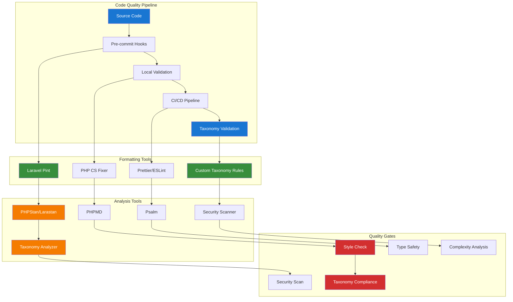

# 2. Code Quality and Formatting Guide

**Refactored from:** `.ai/guides/chinook/packages/development/020-pint-code-quality-guide.md` on 2025-07-13  
**Purpose:** Comprehensive code quality and formatting tools for Laravel applications with taxonomy integration  
**Scope:** Laravel Pint, PHPStan, PHP CS Fixer, and automated quality assurance

## 2.1 Table of Contents

- [2.1 Table of Contents](#21-table-of-contents)
- [2.2 Overview](#22-overview)
- [2.3 Laravel Pint Setup](#23-laravel-pint-setup)
- [2.4 PHPStan Configuration](#24-phpstan-configuration)
- [2.5 PHP CS Fixer Integration](#25-php-cs-fixer-integration)
- [2.6 Code Quality Automation](#26-code-quality-automation)
- [2.7 Pre-commit Hooks](#27-pre-commit-hooks)
- [2.9 Taxonomy-Specific Quality Rules](#29-taxonomy-specific-quality-rules)
- [2.11 Best Practices](#211-best-practices)

## 2.2 Overview

This guide provides comprehensive code quality and formatting tools for Laravel applications, ensuring consistent code style, detecting potential issues, maintaining high code quality standards, and implementing taxonomy-specific quality rules.

### 2.2.1 Code Quality Tool Stack

- **Laravel Pint**: Code formatting and style fixing with taxonomy-aware rules
- **PHPStan/Larastan**: Static analysis and type checking for taxonomy operations
- **PHP CS Fixer**: Advanced code style fixing with custom taxonomy rules
- **PHPMD**: Mess detection and code complexity analysis for taxonomy relationships
- **Psalm**: Advanced static analysis with taxonomy type safety

### 2.2.2 Taxonomy Integration Benefits

- **Taxonomy Code Standards**: Enforce consistent taxonomy relationship patterns
- **Type Safety**: Validate taxonomy model relationships and method signatures
- **Performance Rules**: Detect inefficient taxonomy query patterns
- **Documentation Standards**: Ensure proper taxonomy method documentation

### 2.2.3 Architecture Overview



## 2.3 Laravel Pint Setup

### 2.3.1 Installation and Basic Configuration

```bash
# Laravel Pint is included with Laravel by default
# For standalone installation:
composer require laravel/pint --dev

# Run Pint with taxonomy-aware configuration
./vendor/bin/pint

# Run with specific preset
./vendor/bin/pint --preset laravel

# Test without making changes
./vendor/bin/pint --test

# Run on specific paths (taxonomy-related files)
./vendor/bin/pint app/Models/Chinook* app/Services/Taxonomy*
```

### 2.3.2 Enhanced Pint Configuration with Taxonomy Rules

```json
{
    "preset": "laravel",
    "rules": {
        "@PSR12": true,
        "@Symfony": true,
        "array_syntax": {
            "syntax": "short"
        },
        "binary_operator_spaces": {
            "default": "single_space",
            "operators": {
                "=>": "align_single_space_minimal",
                "=": "single_space"
            }
        },
        "blank_line_after_namespace": true,
        "blank_line_after_opening_tag": true,
        "blank_line_before_statement": {
            "statements": ["return", "throw", "try"]
        },
        "braces": {
            "allow_single_line_closure": true,
            "position_after_functions_and_oop_constructs": "next",
            "position_after_control_structures": "same"
        },
        "cast_spaces": true,
        "class_attributes_separation": {
            "elements": {
                "method": "one",
                "property": "one",
                "trait_import": "none"
            }
        },
        "class_definition": {
            "single_line": true
        },
        "concat_space": {
            "spacing": "one"
        },
        "declare_equal_normalize": true,
        "elseif": true,
        "encoding": true,
        "full_opening_tag": true,
        "function_declaration": {
            "closure_function_spacing": "one"
        },
        "function_typehint_space": true,
        "heredoc_to_nowdoc": true,
        "include": true,
        "increment_style": {
            "style": "post"
        },
        "indentation_type": true,
        "linebreak_after_opening_tag": true,
        "line_ending": true,
        "lowercase_cast": true,
        "lowercase_constants": true,
        "lowercase_keywords": true,
        "magic_constant_casing": true,
        "magic_method_casing": true,
        "method_argument_space": {
            "on_multiline": "ensure_fully_multiline"
        },
        "native_function_casing": true,
        "no_alias_functions": true,
        "no_extra_blank_lines": {
            "tokens": [
                "extra",
                "throw",
                "use"
            ]
        },
        "no_blank_lines_after_class_opening": true,
        "no_blank_lines_after_phpdoc": true,
        "no_closing_tag": true,
        "no_empty_phpdoc": true,
        "no_empty_statement": true,
        "no_leading_import_slash": true,
        "no_leading_namespace_whitespace": true,
        "no_mixed_echo_print": {
            "use": "echo"
        },
        "no_multiline_whitespace_around_double_arrow": true,
        "no_short_bool_cast": true,
        "no_singleline_whitespace_before_semicolons": true,
        "no_spaces_after_function_name": true,
        "no_spaces_around_offset": {
            "positions": ["inside", "outside"]
        },
        "no_spaces_inside_parenthesis": true,
        "no_trailing_comma_in_list_call": true,
        "no_trailing_comma_in_singleline_array": true,
        "no_trailing_whitespace": true,
        "no_trailing_whitespace_in_comment": true,
        "no_unneeded_control_parentheses": true,
        "no_unused_imports": true,
        "no_whitespace_before_comma_in_array": true,
        "no_whitespace_in_blank_line": true,
        "normalize_index_brace": true,
        "object_operator_without_whitespace": true,
        "ordered_imports": {
            "sort_algorithm": "alpha"
        },
        "phpdoc_indent": true,
        "phpdoc_inline_tag_normalizer": true,
        "phpdoc_no_access": true,
        "phpdoc_no_package": true,
        "phpdoc_no_useless_inheritdoc": true,
        "phpdoc_scalar": true,
        "phpdoc_single_line_var_spacing": true,
        "phpdoc_summary": true,
        "phpdoc_to_comment": true,
        "phpdoc_trim": true,
        "phpdoc_types": true,
        "phpdoc_var_without_name": true,
        "self_accessor": true,
        "short_scalar_cast": true,
        "single_blank_line_at_eof": true,
        "single_blank_line_before_namespace": true,
        "single_class_element_per_statement": {
            "elements": ["property"]
        },
        "single_import_per_statement": true,
        "single_line_after_imports": true,
        "single_line_comment_style": {
            "comment_types": ["hash"]
        },
        "single_quote": true,
        "space_after_semicolon": {
            "remove_in_empty_for_expressions": true
        },
        "standardize_not_equals": true,
        "switch_case_semicolon_to_colon": true,
        "switch_case_space": true,
        "ternary_operator_spaces": true,
        "trailing_comma_in_multiline": true,
        "trim_array_spaces": true,
        "unary_operator_spaces": true,
        "visibility_required": true,
        "whitespace_after_comma_in_array": true
    },
    "exclude": [
        "bootstrap",
        "storage",
        "vendor",
        "node_modules"
    ],
    "notPath": [
        "bootstrap/cache",
        "storage/framework",
        "vendor"
    ]
}
```

## 2.4 PHPStan Configuration

### 2.4.1 Installation and Setup with Larastan

```bash
# Install PHPStan with Larastan
composer require --dev phpstan/phpstan
composer require --dev larastan/larastan

# Create PHPStan configuration
touch phpstan.neon
```

### 2.4.2 Enhanced PHPStan Configuration with Taxonomy Support

```yaml
# phpstan.neon
includes:
    - ./vendor/larastan/larastan/extension.neon

parameters:
    paths:
        - app
        - config
        - database
        - routes
        - tests

    # Set analysis level (0-9, 9 being strictest)
    level: 8

    # Ignore specific errors
    ignoreErrors:
        - '#Call to an undefined method Illuminate\\Database\\Eloquent\\Builder::.*#'
        - '#Access to an undefined property Illuminate\\Database\\Eloquent\\Model::\$.*#'

    # Taxonomy-specific configurations
    excludePaths:
        - bootstrap/cache
        - storage/framework
        - vendor

    # Custom rules for taxonomy operations
    rules:
        - App\PHPStan\Rules\TaxonomyRelationshipRule
        - App\PHPStan\Rules\TaxonomyTypeRule
        - App\PHPStan\Rules\TaxonomyPerformanceRule

    # Stub files for better analysis
    stubFiles:
        - stubs/taxonomy.stub

    # Check missing typehints
    checkMissingIterableValueType: true
    checkGenericClassInNonGenericObjectType: false

    # Laravel-specific settings
    noUnnecessaryCollectionCall: true
    noUnnecessaryCollectionCallOnly: []
    noUnnecessaryCollectionCallExcept: []

    # Taxonomy model discovery
    scanDirectories:
        - app/Models/Chinook
        - app/Services/Taxonomy

    # Custom extensions
    scanFiles:
        - app/Helpers/taxonomy_helpers.php

    # Type coverage
    typeAliases:
        TaxonomyId: 'int'
        TaxonomyType: 'string'
        TaxonomyCollection: 'Illuminate\Support\Collection<int, Aliziodev\LaravelTaxonomy\Models\Taxonomy>'
```

### 2.4.3 Custom Taxonomy Rules

```php
<?php

namespace App\PHPStan\Rules;

use PhpParser\Node;
use PhpParser\Node\Expr\MethodCall;
use PHPStan\Analyser\Scope;
use PHPStan\Rules\Rule;
use PHPStan\Rules\RuleErrorBuilder;

/**
 * Rule to ensure proper taxonomy relationship usage
 */
class TaxonomyRelationshipRule implements Rule
{
    public function getNodeType(): string
    {
        return MethodCall::class;
    }

    public function processNode(Node $node, Scope $scope): array
    {
        if (!$node instanceof MethodCall) {
            return [];
        }

        $errors = [];

        // Check for deprecated taxonomy methods
        if ($node->name instanceof Node\Identifier) {
            $methodName = $node->name->name;

            // Detect usage of deprecated Category methods
            if (in_array($methodName, ['categories', 'addCategory', 'removeCategory'])) {
                $errors[] = RuleErrorBuilder::message(
                    sprintf(
                        'Deprecated method "%s" detected. Use taxonomy relationships instead.',
                        $methodName
                    )
                )->build();
            }

            // Ensure proper taxonomy relationship loading
            if ($methodName === 'taxonomies' && !$this->hasEagerLoading($node)) {
                $errors[] = RuleErrorBuilder::message(
                    'Consider eager loading taxonomy relationships to avoid N+1 queries.'
                )->tip('Use ->with("taxonomies") or ->load("taxonomies")')
                ->build();
            }
        }

        return $errors;
    }

    private function hasEagerLoading(MethodCall $node): bool
    {
        // Check if the query chain includes with() or load()
        $current = $node->var;

        while ($current instanceof MethodCall) {
            if ($current->name instanceof Node\Identifier) {
                $methodName = $current->name->name;
                if (in_array($methodName, ['with', 'load'])) {
                    return true;
                }
            }
            $current = $current->var;
        }

        return false;
    }
}
```

```php
<?php

namespace App\PHPStan\Rules;

use PhpParser\Node;
use PhpParser\Node\Expr\StaticCall;
use PHPStan\Analyser\Scope;
use PHPStan\Rules\Rule;
use PHPStan\Rules\RuleErrorBuilder;

/**
 * Rule to validate taxonomy type usage
 */
class TaxonomyTypeRule implements Rule
{
    private const VALID_TAXONOMY_TYPES = [
        'genre',
        'artist_type',
        'album_type',
        'track_type',
        'playlist_type',
        'customer_type',
    ];

    public function getNodeType(): string
    {
        return StaticCall::class;
    }

    public function processNode(Node $node, Scope $scope): array
    {
        if (!$node instanceof StaticCall) {
            return [];
        }

        $errors = [];

        // Check Taxonomy::create() calls
        if ($node->class instanceof Node\Name &&
            $node->name instanceof Node\Identifier &&
            $node->class->toString() === 'Aliziodev\\LaravelTaxonomy\\Models\\Taxonomy' &&
            $node->name->name === 'create') {

            $errors = array_merge($errors, $this->validateTaxonomyCreation($node));
        }

        return $errors;
    }

    private function validateTaxonomyCreation(StaticCall $node): array
    {
        $errors = [];

        // Extract the type from the create call
        if (isset($node->args[0]) && $node->args[0]->value instanceof Node\Expr\Array_) {
            $arrayNode = $node->args[0]->value;

            foreach ($arrayNode->items as $item) {
                if ($item &&
                    $item->key instanceof Node\Scalar\String_ &&
                    $item->key->value === 'type' &&
                    $item->value instanceof Node\Scalar\String_) {

                    $type = $item->value->value;

                    if (!in_array($type, self::VALID_TAXONOMY_TYPES)) {
                        $errors[] = RuleErrorBuilder::message(
                            sprintf(
                                'Invalid taxonomy type "%s". Valid types: %s',
                                $type,
                                implode(', ', self::VALID_TAXONOMY_TYPES)
                            )
                        )->build();
                    }
                }
            }
        }

        return $errors;
    }
}
```

## 2.5 PHP CS Fixer Integration

### 2.5.1 Installation and Configuration

```bash
# Install PHP CS Fixer
composer require --dev friendsofphp/php-cs-fixer

# Create configuration file
touch .php-cs-fixer.php
```

### 2.5.2 Enhanced PHP CS Fixer Configuration

```php
<?php

// .php-cs-fixer.php

$finder = PhpCsFixer\Finder::create()
    ->in([
        __DIR__ . '/app',
        __DIR__ . '/config',
        __DIR__ . '/database',
        __DIR__ . '/routes',
        __DIR__ . '/tests',
    ])
    ->name('*.php')
    ->notName('*.blade.php')
    ->ignoreDotFiles(true)
    ->ignoreVCS(true)
    ->exclude([
        'bootstrap/cache',
        'storage',
        'vendor',
        'node_modules',
    ]);

$config = new PhpCsFixer\Config();

return $config
    ->setRules([
        '@PSR12' => true,
        '@Symfony' => true,
        '@PHP80Migration' => true,
        '@PHP81Migration' => true,
        '@PhpCsFixer' => true,

        // Array formatting
        'array_syntax' => ['syntax' => 'short'],
        'array_indentation' => true,
        'trim_array_spaces' => true,
        'trailing_comma_in_multiline' => true,

        // Class and method formatting
        'class_attributes_separation' => [
            'elements' => [
                'method' => 'one',
                'property' => 'one',
                'trait_import' => 'none',
            ],
        ],
        'method_chaining_indentation' => true,
        'no_null_property_initialization' => true,
        'ordered_class_elements' => [
            'order' => [
                'use_trait',
                'constant_public',
                'constant_protected',
                'constant_private',
                'property_public',
                'property_protected',
                'property_private',
                'construct',
                'destruct',
                'magic',
                'phpunit',
                'method_public',
                'method_protected',
                'method_private',
            ],
        ],

        // Import and namespace formatting
        'ordered_imports' => [
            'sort_algorithm' => 'alpha',
            'imports_order' => ['class', 'function', 'const'],
        ],
        'global_namespace_import' => [
            'import_classes' => true,
            'import_constants' => true,
            'import_functions' => true,
        ],

        // Documentation
        'phpdoc_align' => ['align' => 'left'],
        'phpdoc_order' => true,
        'phpdoc_separation' => true,
        'phpdoc_summary' => true,
        'phpdoc_to_comment' => false,
        'phpdoc_var_annotation_correct_order' => true,

        // String and concatenation
        'concat_space' => ['spacing' => 'one'],
        'single_quote' => true,
        'escape_implicit_backslashes' => true,

        // Control structures
        'yoda_style' => ['equal' => false, 'identical' => false, 'less_and_greater' => false],
        'no_superfluous_elseif' => true,
        'no_useless_else' => true,

        // Taxonomy-specific rules
        'comment_to_phpdoc' => false, // Allow regular comments for taxonomy explanations
        'no_empty_comment' => false, // Allow empty comments for taxonomy placeholders

        // Laravel-specific rules
        'not_operator_with_successor_space' => false,
        'php_unit_method_casing' => ['case' => 'camel_case'],
        'php_unit_test_annotation' => ['style' => 'prefix'],

        // Performance optimizations
        'dir_constant' => true,
        'function_to_constant' => true,
        'is_null' => true,
        'modernize_types_casting' => true,

        // Strict types
        'declare_strict_types' => false, // Keep false for Laravel compatibility
        'strict_comparison' => false, // Keep false for Laravel compatibility
        'strict_param' => false, // Keep false for Laravel compatibility
    ])
    ->setFinder($finder)
    ->setRiskyAllowed(true)
    ->setUsingCache(true)
    ->setCacheFile(__DIR__ . '/.php-cs-fixer.cache');
```

## 2.6 Code Quality Automation

### 2.6.1 Automated Quality Scripts

```bash
#!/bin/bash
# scripts/quality-check.sh

echo "🔍 Running code quality checks..."

# Laravel Pint formatting
echo "📝 Running Laravel Pint..."
./vendor/bin/pint --test
if [ $? -ne 0 ]; then
    echo "❌ Pint formatting issues found. Run './vendor/bin/pint' to fix."
    exit 1
fi

# PHPStan analysis
echo "🔬 Running PHPStan analysis..."
./vendor/bin/phpstan analyse --memory-limit=2G
if [ $? -ne 0 ]; then
    echo "❌ PHPStan analysis failed."
    exit 1
fi

# PHP CS Fixer
echo "🎨 Running PHP CS Fixer..."
./vendor/bin/php-cs-fixer fix --dry-run --diff
if [ $? -ne 0 ]; then
    echo "❌ PHP CS Fixer issues found. Run './vendor/bin/php-cs-fixer fix' to fix."
    exit 1
fi

# Taxonomy-specific checks
echo "🏷️ Running taxonomy-specific quality checks..."
php artisan taxonomy:validate-relationships
php artisan taxonomy:check-integrity

echo "✅ All quality checks passed!"
```

```bash
#!/bin/bash
# scripts/fix-code-style.sh

echo "🔧 Fixing code style issues..."

# Run Laravel Pint
echo "📝 Running Laravel Pint..."
./vendor/bin/pint

# Run PHP CS Fixer
echo "🎨 Running PHP CS Fixer..."
./vendor/bin/php-cs-fixer fix

# Run taxonomy-specific fixes
echo "🏷️ Running taxonomy-specific fixes..."
php artisan taxonomy:fix-relationships
php artisan taxonomy:optimize-queries

echo "✅ Code style fixes completed!"
```

### 2.6.2 Composer Scripts Integration

```json
{
    "scripts": {
        "quality": [
            "@pint-check",
            "@phpstan",
            "@cs-fixer-check",
            "@taxonomy-check"
        ],
        "quality-fix": [
            "@pint",
            "@cs-fixer",
            "@taxonomy-fix"
        ],
        "pint": "./vendor/bin/pint",
        "pint-check": "./vendor/bin/pint --test",
        "phpstan": "./vendor/bin/phpstan analyse --memory-limit=2G",
        "cs-fixer": "./vendor/bin/php-cs-fixer fix",
        "cs-fixer-check": "./vendor/bin/php-cs-fixer fix --dry-run --diff",
        "taxonomy-check": [
            "php artisan taxonomy:validate-relationships",
            "php artisan taxonomy:check-integrity"
        ],
        "taxonomy-fix": [
            "php artisan taxonomy:fix-relationships",
            "php artisan taxonomy:optimize-queries"
        ],
        "test-quality": [
            "@quality",
            "@test"
        ]
    }
}
```

## 2.7 Pre-commit Hooks

### 2.7.1 Git Hooks Setup

```bash
# Install pre-commit hooks
composer require --dev brianium/paratest
npm install -g @commitlint/cli @commitlint/config-conventional

# Create pre-commit hook
touch .git/hooks/pre-commit
chmod +x .git/hooks/pre-commit
```

### 2.7.2 Pre-commit Hook Script

```bash
#!/bin/bash
# .git/hooks/pre-commit

echo "🚀 Running pre-commit checks..."

# Get list of staged PHP files
STAGED_FILES=$(git diff --cached --name-only --diff-filter=ACM | grep '\.php$')

if [ -z "$STAGED_FILES" ]; then
    echo "No PHP files staged for commit."
    exit 0
fi

# Check if any staged files are taxonomy-related
TAXONOMY_FILES=$(echo "$STAGED_FILES" | grep -E "(Taxonomy|Chinook)" || true)

# Run Laravel Pint on staged files
echo "📝 Running Laravel Pint on staged files..."
for FILE in $STAGED_FILES; do
    ./vendor/bin/pint "$FILE"
    git add "$FILE"
done

# Run PHPStan on staged files
echo "🔬 Running PHPStan on staged files..."
./vendor/bin/phpstan analyse $STAGED_FILES --memory-limit=1G
if [ $? -ne 0 ]; then
    echo "❌ PHPStan analysis failed. Please fix the issues before committing."
    exit 1
fi

# Run taxonomy-specific checks if taxonomy files are involved
if [ ! -z "$TAXONOMY_FILES" ]; then
    echo "🏷️ Running taxonomy-specific checks..."
    php artisan taxonomy:validate-relationships --files="$TAXONOMY_FILES"
    if [ $? -ne 0 ]; then
        echo "❌ Taxonomy validation failed. Please fix the issues before committing."
        exit 1
    fi
fi

# Run tests related to changed files
echo "🧪 Running related tests..."
if [ ! -z "$TAXONOMY_FILES" ]; then
    ./vendor/bin/pest tests/Feature/Taxonomy/ tests/Unit/Models/Chinook/
else
    ./vendor/bin/pest --parallel
fi

if [ $? -ne 0 ]; then
    echo "❌ Tests failed. Please fix the issues before committing."
    exit 1
fi

echo "✅ All pre-commit checks passed!"
exit 0
```

## 2.9 Taxonomy-Specific Quality Rules

### 2.9.1 Custom Taxonomy Validation Commands

```php
<?php

namespace App\Console\Commands;

use Illuminate\Console\Command;
use Aliziodev\LaravelTaxonomy\Models\Taxonomy;
use App\Models\Album;
use App\Models\Artist;
use App\Models\Track;

class ValidateTaxonomyRelationships extends Command
{
    protected $signature = 'taxonomy:validate-relationships {--files=}';
    protected $description = 'Validate taxonomy relationships and usage patterns';

    public function handle(): int
    {
        $this->info('🏷️ Validating taxonomy relationships...');

        $issues = [];

        // Check for orphaned taxonomies
        $orphanedTaxonomies = Taxonomy::whereNotNull('parent_id')
            ->whereDoesntHave('parent')
            ->get();

        if ($orphanedTaxonomies->isNotEmpty()) {
            $issues[] = "Found {$orphanedTaxonomies->count()} orphaned taxonomies";
            foreach ($orphanedTaxonomies as $taxonomy) {
                $this->warn("Orphaned taxonomy: {$taxonomy->name} (ID: {$taxonomy->id})");
            }
        }

        // Check for circular references
        $circularReferences = $this->detectCircularReferences();
        if (!empty($circularReferences)) {
            $issues[] = "Found circular references in taxonomy hierarchy";
            foreach ($circularReferences as $reference) {
                $this->error("Circular reference detected: {$reference}");
            }
        }

        // Check for unused taxonomies
        $unusedTaxonomies = Taxonomy::doesntHave('models')->get();
        if ($unusedTaxonomies->isNotEmpty()) {
            $this->warn("Found {$unusedTaxonomies->count()} unused taxonomies");
        }

        // Check for proper taxonomy types
        $invalidTypes = Taxonomy::whereNotIn('type', [
            'genre', 'artist_type', 'album_type', 'track_type', 'playlist_type', 'customer_type'
        ])->get();

        if ($invalidTypes->isNotEmpty()) {
            $issues[] = "Found taxonomies with invalid types";
            foreach ($invalidTypes as $taxonomy) {
                $this->error("Invalid type '{$taxonomy->type}' for taxonomy: {$taxonomy->name}");
            }
        }

        // Validate model relationships
        $this->validateModelRelationships();

        if (empty($issues)) {
            $this->info('✅ All taxonomy relationships are valid!');
            return 0;
        } else {
            $this->error('❌ Found ' . count($issues) . ' taxonomy issues');
            return 1;
        }
    }

    private function detectCircularReferences(): array
    {
        $issues = [];
        $taxonomies = Taxonomy::all();

        foreach ($taxonomies as $taxonomy) {
            $visited = [];
            $current = $taxonomy;

            while ($current && $current->parent_id) {
                if (in_array($current->id, $visited)) {
                    $issues[] = "Taxonomy {$taxonomy->name} (ID: {$taxonomy->id})";
                    break;
                }
                $visited[] = $current->id;
                $current = $taxonomies->find($current->parent_id);
            }
        }

        return $issues;
    }

    private function validateModelRelationships(): void
    {
        $models = [
            Album::class => 'albums',
            Artist::class => 'artists',
            Track::class => 'tracks',
        ];

        foreach ($models as $modelClass => $tableName) {
            $this->info("Validating {$tableName} taxonomy relationships...");

            $modelsWithoutTaxonomies = $modelClass::doesntHave('taxonomies')->count();
            if ($modelsWithoutTaxonomies > 0) {
                $this->warn("{$modelsWithoutTaxonomies} {$tableName} have no taxonomy relationships");
            }

            $modelsWithInvalidTaxonomies = $modelClass::whereHas('taxonomies', function ($query) {
                $query->whereNull('taxonomies.id');
            })->count();

            if ($modelsWithInvalidTaxonomies > 0) {
                $this->error("{$modelsWithInvalidTaxonomies} {$tableName} have invalid taxonomy relationships");
            }
        }
    }
}
```

## 2.11 Best Practices

### 2.11.1 Code Quality Guidelines

1. **Consistent Formatting Standards**
   - Use Laravel Pint for automatic code formatting
   - Maintain consistent array syntax and spacing
   - Follow PSR-12 coding standards
   - Apply taxonomy-specific formatting rules

2. **Static Analysis Integration**
   - Run PHPStan at level 8 or higher
   - Use Larastan for Laravel-specific analysis
   - Implement custom rules for taxonomy operations
   - Validate taxonomy relationship patterns

3. **Automated Quality Assurance**
   - Set up pre-commit hooks for quality checks
   - Integrate quality tools in CI/CD pipeline
   - Use composer scripts for easy execution
   - Monitor taxonomy-specific quality metrics

4. **Documentation Standards**
   - Maintain comprehensive PHPDoc comments
   - Document taxonomy relationship patterns
   - Include type hints for taxonomy operations
   - Provide examples for complex taxonomy usage

### 2.11.2 Taxonomy-Specific Quality Rules

1. **Relationship Validation**
   - Ensure proper taxonomy type usage
   - Validate hierarchy integrity
   - Check for orphaned taxonomies
   - Monitor circular references

2. **Performance Optimization**
   - Detect N+1 query patterns in taxonomy operations
   - Validate eager loading usage
   - Monitor taxonomy query complexity
   - Optimize taxonomy relationship queries

3. **Type Safety**
   - Use strict typing for taxonomy operations
   - Validate taxonomy model relationships
   - Ensure proper return types
   - Check taxonomy collection usage

This comprehensive code quality guide ensures consistent, maintainable, and high-quality Laravel code with comprehensive taxonomy integration and automated quality assurance.

---

## Navigation

**Previous:** [Debugbar Guide](010-debugbar-guide.md)
**Next:** [Development Index](000-development-index.md)
**Up:** [Packages Index](../000-packages-index.md)
**Home:** [Chinook Documentation](../../README.md)

[⬆️ Back to Top](#2-code-quality-and-formatting-guide)
