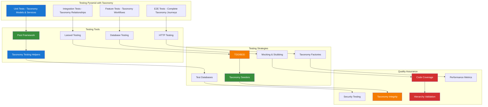

# 1. Testing Documentation Index

**Refactored from:** `.ai/guides/chinook/packages/testing/000-testing-index.md` on 2025-07-13  
**Purpose:** Comprehensive testing documentation for Laravel applications with taxonomy integration  
**Scope:** Modern testing practices, tools, and strategies with taxonomy-specific testing patterns

## 1.1 Table of Contents

- [1.1 Table of Contents](#11-table-of-contents)
- [1.2 Overview](#12-overview)
- [1.3 Testing Philosophy](#13-testing-philosophy)
- [1.4 Testing Tools & Frameworks](#14-testing-tools--frameworks)
- [1.5 Taxonomy Testing Architecture](#15-taxonomy-testing-architecture)
- [1.6 Testing Best Practices](#16-testing-best-practices)
- [1.7 Testing Workflow](#17-testing-workflow)
- [1.8 Testing Environment Setup](#18-testing-environment-setup)
- [1.9 Taxonomy-Specific Testing Strategies](#19-taxonomy-specific-testing-strategies)
- [1.10 Integration with Development Tools](#110-integration-with-development-tools)
- [1.11 Resources and References](#111-resources-and-references)

## 1.2 Overview

This directory contains comprehensive testing documentation for Laravel applications, focusing on modern testing practices, tools, and strategies for building robust, maintainable test suites with comprehensive taxonomy integration using aliziodev/laravel-taxonomy.

## 1.3 Testing Philosophy

Our testing approach emphasizes:

- **Test-Driven Development (TDD)**: Writing tests before implementation, especially for taxonomy operations
- **Behavior-Driven Development (BDD)**: Testing user behavior and business requirements with taxonomy context
- **Comprehensive Coverage**: Unit, integration, feature, and end-to-end testing for taxonomy relationships
- **Performance Testing**: Ensuring taxonomy query performance under load
- **Security Testing**: Validating taxonomy-based permissions and access control

### 1.3.1 Taxonomy Testing Principles

- **Relationship Integrity**: Validate taxonomy relationships and hierarchies
- **Data Consistency**: Ensure taxonomy data integrity across operations
- **Performance Optimization**: Test taxonomy query efficiency and caching
- **Type Safety**: Validate taxonomy type constraints and validation rules
- **Migration Testing**: Test taxonomy schema changes and data migrations

## 1.4 Testing Tools & Frameworks

### 1.4.1 Core Testing Framework
- **[Pest Testing Guide](010-pest-testing-guide.md)** - Modern PHP testing framework with elegant syntax and taxonomy-specific testing patterns

### 1.4.2 Testing Categories with Taxonomy Integration

#### 1.4.2.1 Unit Testing
- Taxonomy model testing and relationship validation
- Taxonomy service class testing with dependency injection
- Taxonomy utility function and helper testing
- Taxonomy query optimization and performance testing

#### 1.4.2.2 Integration Testing
- Taxonomy API endpoint testing and validation
- Taxonomy database integration and migration testing
- Taxonomy cache integration and performance testing
- Taxonomy event and listener integration testing

#### 1.4.2.3 Feature Testing
- Taxonomy-based user workflow and journey testing
- Taxonomy-driven authorization and permission testing
- Taxonomy form submission and validation testing
- Taxonomy import/export and bulk operation testing

#### 1.4.2.4 Performance Testing
- Taxonomy hierarchy traversal performance testing
- Taxonomy query optimization and N+1 prevention testing
- Taxonomy cache effectiveness and invalidation testing
- Taxonomy bulk operation performance testing

## 1.5 Taxonomy Testing Architecture



## 1.6 Testing Best Practices

### 1.6.1 Test Organization with Taxonomy Context
- **Descriptive Test Names**: Use clear, descriptive test method names that include taxonomy context
- **Arrange-Act-Assert Pattern**: Structure tests with clear taxonomy setup, execution, and verification
- **Test Isolation**: Ensure taxonomy tests don't depend on each other or external state
- **Taxonomy Test Data Management**: Use factories and seeders for consistent taxonomy test data

### 1.6.2 Taxonomy Test Coverage
- **Aim for High Coverage**: Target 90%+ code coverage for taxonomy business logic
- **Quality over Quantity**: Focus on meaningful taxonomy relationship tests
- **Edge Case Testing**: Test taxonomy hierarchy boundaries and circular reference prevention
- **Regression Testing**: Maintain tests for previously fixed taxonomy bugs

### 1.6.3 Performance Considerations for Taxonomy Testing
- **Fast Test Execution**: Keep taxonomy unit tests under 100ms each
- **Database Optimization**: Use in-memory databases for faster taxonomy testing
- **Parallel Testing**: Run taxonomy tests in parallel when possible
- **Test Environment Optimization**: Optimize test environment for taxonomy operations

### 1.6.4 Taxonomy Test Maintenance
- **Regular Test Review**: Regularly review and update taxonomy test suites
- **Refactor Tests**: Keep taxonomy tests clean and maintainable
- **Remove Obsolete Tests**: Remove tests for deprecated taxonomy functionality
- **Documentation**: Document complex taxonomy test scenarios and setup requirements

## 1.7 Testing Workflow

### 1.7.1 Development Workflow with Taxonomy
1. **Write Failing Taxonomy Test**: Start with a failing test that describes the desired taxonomy behavior
2. **Implement Taxonomy Feature**: Write minimal code to make the taxonomy test pass
3. **Refactor**: Improve taxonomy code quality while keeping tests green
4. **Add Taxonomy Edge Cases**: Test taxonomy hierarchy boundaries and error scenarios
5. **Integration Testing**: Verify taxonomy component interactions work correctly

### 1.7.2 Continuous Integration with Taxonomy Validation
1. **Automated Test Execution**: Run all taxonomy tests on every commit
2. **Coverage Reporting**: Generate and track taxonomy code coverage metrics
3. **Performance Monitoring**: Track taxonomy test execution time and query performance
4. **Quality Gates**: Prevent deployment if taxonomy tests fail or coverage drops
5. **Notification System**: Alert team of taxonomy test failures and integrity issues

## 1.8 Testing Environment Setup

### 1.8.1 Local Development with Taxonomy Support

```bash
# Install testing dependencies
composer require --dev pestphp/pest
composer require --dev pestphp/pest-plugin-laravel
composer require --dev pestphp/pest-plugin-livewire

# Install taxonomy testing helpers
composer require --dev aliziodev/laravel-taxonomy-testing

# Initialize Pest with taxonomy configuration
./vendor/bin/pest --init

# Run taxonomy tests
./vendor/bin/pest --filter=Taxonomy
./vendor/bin/pest tests/Feature/Taxonomy/
./vendor/bin/pest tests/Unit/Models/Chinook/
```

### 1.8.2 CI/CD Configuration with Taxonomy Testing

```yaml
# GitHub Actions example with taxonomy testing
name: Tests with Taxonomy Validation
on: [push, pull_request]
jobs:
  test:
    runs-on: ubuntu-latest
    services:
      sqlite:
        image: sqlite:latest
    steps:
      - uses: actions/checkout@v3
      - name: Setup PHP
        uses: shivammathur/setup-php@v2
        with:
          php-version: '8.2'
          extensions: sqlite3, pdo_sqlite
      - name: Install Dependencies
        run: composer install
      - name: Setup Test Database
        run: |
          touch database/testing.sqlite
          php artisan migrate --env=testing
          php artisan db:seed --class=TaxonomySeeder --env=testing
      - name: Run Taxonomy Tests
        run: |
          ./vendor/bin/pest --coverage --filter=Taxonomy
          ./vendor/bin/pest tests/Feature/Taxonomy/ --coverage
          ./vendor/bin/pest tests/Unit/Models/Chinook/ --coverage
      - name: Validate Taxonomy Integrity
        run: php artisan taxonomy:validate-test-data
```

## 1.9 Taxonomy-Specific Testing Strategies

### 1.9.1 Taxonomy Model Testing
- **Relationship Testing**: Validate taxonomy model relationships and constraints
- **Hierarchy Testing**: Test parent-child relationships and depth calculations
- **Type Validation**: Ensure taxonomy type constraints are enforced
- **Metadata Testing**: Validate taxonomy metadata storage and retrieval

### 1.9.2 Taxonomy Service Testing
- **Business Logic Testing**: Test taxonomy service methods and operations
- **Performance Testing**: Validate taxonomy query optimization and caching
- **Error Handling**: Test taxonomy exception handling and validation
- **Integration Testing**: Test taxonomy service integration with other components

### 1.9.3 Taxonomy API Testing
- **Endpoint Testing**: Validate taxonomy API endpoints and responses
- **Authentication Testing**: Test taxonomy-based permissions and access control
- **Data Validation**: Test taxonomy API input validation and sanitization
- **Performance Testing**: Test taxonomy API response times and throughput

## 1.10 Integration with Development Tools

### 1.10.1 IDE Integration for Taxonomy Testing
- **PHPStorm**: Built-in test runner with taxonomy test configuration
- **VS Code**: Pest extension with taxonomy test snippets and debugging
- **Vim/Neovim**: Pest plugins with taxonomy test navigation

### 1.10.2 Debugging Tools for Taxonomy Testing
- **Xdebug**: Step-through debugging for complex taxonomy test scenarios
- **Laravel Debugbar**: Performance profiling during taxonomy test execution
- **Ray**: Advanced debugging and inspection for taxonomy data structures

### 1.10.3 Code Quality Tools for Taxonomy Testing
- **PHPStan/Larastan**: Static analysis for taxonomy test code quality
- **PHP CS Fixer**: Code style consistency in taxonomy test files
- **Rector**: Automated refactoring for taxonomy test modernization

## 1.11 Resources and References

### 1.11.1 Official Documentation
- [Pest PHP Documentation](https://pestphp.com/)
- [Laravel Testing Documentation](https://laravel.com/docs/testing)
- [aliziodev/laravel-taxonomy Documentation](https://github.com/aliziodev/laravel-taxonomy)

### 1.11.2 Community Resources
- [Laravel Testing Examples](https://github.com/laravel/framework/tree/master/tests)
- [Pest Plugin Ecosystem](https://pestphp.com/docs/plugins)
- [Taxonomy Testing Patterns](https://github.com/aliziodev/laravel-taxonomy/wiki/testing)

### 1.11.3 Books and Guides
- "Test Driven Development: By Example" by Kent Beck
- "Growing Object-Oriented Software, Guided by Tests" by Steve Freeman
- "The Art of Unit Testing" by Roy Osherove

---

## Navigation

**Previous:** [Development Index](../development/000-development-index.md)  
**Next:** [Pest Testing Guide](010-pest-testing-guide.md)  
**Up:** [Packages Index](../000-packages-index.md)  
**Home:** [Chinook Documentation](../../README.md)

[⬆️ Back to Top](#1-testing-documentation-index)
