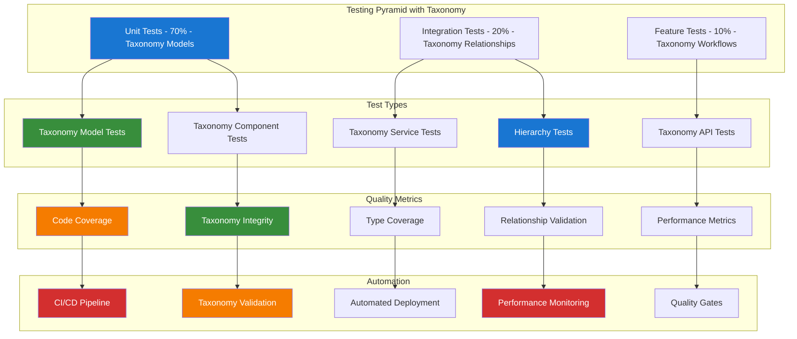

# 2. Modern Testing with Pest Guide

**Refactored from:** `.ai/guides/chinook/packages/testing/010-pest-testing-guide.md` on 2025-07-13  
**Purpose:** Comprehensive Pest testing framework guide with taxonomy integration  
**Scope:** Modern PHP testing with elegant syntax, Laravel integration, and taxonomy-specific testing patterns

## 2.1 Table of Contents

- [2.1 Table of Contents](#21-table-of-contents)
- [2.2 Overview](#22-overview)
- [2.3 Installation & Configuration](#23-installation--configuration)
- [2.4 Taxonomy Test Architecture](#24-taxonomy-test-architecture)
- [2.5 Plugin Ecosystem](#25-plugin-ecosystem)
- [2.6 Advanced Testing Patterns](#26-advanced-testing-patterns)
- [2.7 Taxonomy-Specific Testing](#27-taxonomy-specific-testing)
- [2.8 Performance Testing](#28-performance-testing)
- [2.12 Best Practices](#212-best-practices)

## 2.2 Overview

Pest is a modern PHP testing framework that provides an elegant and expressive syntax for writing tests. This guide demonstrates how to implement comprehensive testing strategies using Pest with Laravel, including advanced patterns, performance testing, taxonomy integration, and CI/CD integration.

### 2.2.1 Key Features with Taxonomy Support

- **Elegant Syntax**: Clean, readable test syntax with minimal boilerplate for taxonomy operations
- **Laravel Integration**: Seamless integration with Laravel testing features and taxonomy models
- **Plugin Ecosystem**: Rich ecosystem of plugins for specialized taxonomy testing
- **Performance Testing**: Built-in performance testing for taxonomy query optimization
- **Type Coverage**: Static analysis integration for taxonomy type safety
- **Parallel Testing**: Fast test execution with parallel taxonomy test processing

### 2.2.2 Taxonomy Testing Philosophy



## 2.3 Installation & Configuration

### 2.3.1 Package Installation with Taxonomy Support

```bash
# Install Pest and Laravel plugin
composer require --dev pestphp/pest
composer require --dev pestphp/pest-plugin-laravel

# Install additional plugins for taxonomy testing
composer require --dev pestphp/pest-plugin-livewire
composer require --dev pestphp/pest-plugin-faker
composer require --dev pestphp/pest-plugin-type-coverage
composer require --dev pestphp/pest-plugin-watch
composer require --dev pestphp/pest-plugin-parallel

# Install taxonomy testing helpers
composer require --dev aliziodev/laravel-taxonomy-testing

# Initialize Pest with taxonomy configuration
./vendor/bin/pest --init
```

### 2.3.2 Enhanced Pest Configuration

```php
<?php

// tests/Pest.php

use Aliziodev\LaravelTaxonomy\Models\Taxonomy;use Illuminate\Foundation\Testing\RefreshDatabase;use Illuminate\Foundation\Testing\WithFaker;use old\TestCase;

/*
|--------------------------------------------------------------------------
| Test Case
|--------------------------------------------------------------------------
*/

uses(TestCase::class)->in('Feature', 'Unit');

/*
|--------------------------------------------------------------------------
| Expectations
|--------------------------------------------------------------------------
*/

expect()->extend('toBeOne', function () {
    return $this->toBe(1);
});

expect()->extend('toHaveTaxonomy', function (string $taxonomyName) {
    return $this->toHaveCount(1, 'taxonomies')
        ->and($this->value->taxonomies->first()->name)->toBe($taxonomyName);
});

expect()->extend('toHaveTaxonomyType', function (string $type) {
    return $this->toHave('taxonomies')
        ->and($this->value->taxonomies->where('type', $type))->toHaveCount(1);
});

/*
|--------------------------------------------------------------------------
| Functions
|--------------------------------------------------------------------------
*/

function createTaxonomy(array $attributes = []): Taxonomy
{
    return Taxonomy::factory()->create($attributes);
}

function createTaxonomyHierarchy(string $type = 'genre', int $depth = 3): array
{
    $taxonomies = [];
    $parent = null;
    
    for ($i = 0; $i < $depth; $i++) {
        $taxonomy = Taxonomy::factory()->create([
            'type' => $type,
            'name' => "Level {$i} {$type}",
            'parent_id' => $parent?->id,
        ]);
        
        $taxonomies[] = $taxonomy;
        $parent = $taxonomy;
    }
    
    return $taxonomies;
}

function assertTaxonomyIntegrity(): void
{
    // Check for orphaned taxonomies
    $orphaned = Taxonomy::whereNotNull('parent_id')
        ->whereDoesntHave('parent')
        ->count();
    
    expect($orphaned)->toBe(0, 'Found orphaned taxonomies');
    
    // Check for circular references
    $taxonomies = Taxonomy::with('parent')->get();
    foreach ($taxonomies as $taxonomy) {
        $visited = [];
        $current = $taxonomy;
        
        while ($current && $current->parent_id) {
            expect($visited)->not->toContain($current->id, 'Circular reference detected');
            $visited[] = $current->id;
            $current = $current->parent;
        }
    }
}

/*
|--------------------------------------------------------------------------
| Datasets
|--------------------------------------------------------------------------
*/

dataset('taxonomy_types', [
    'genre',
    'artist_type',
    'album_type',
    'track_type',
    'playlist_type',
    'customer_type',
]);

dataset('chinook_models', [
    [\App\Models\Album::class, 'album'],
    [\App\Models\Artist::class, 'artist'],
    [\App\Models\Track::class, 'track'],
]);

/*
|--------------------------------------------------------------------------
| Traits
|--------------------------------------------------------------------------
*/

uses(RefreshDatabase::class)->in('Feature', 'Unit');
uses(WithFaker::class)->in('Feature', 'Unit');
```

### 2.3.3 Taxonomy Test Configuration

```php
<?php

// tests/TestCase.php

namespace Tests;

use Illuminate\Foundation\Testing\TestCase as BaseTestCase;
use Illuminate\Foundation\Testing\RefreshDatabase;
use Aliziodev\LaravelTaxonomy\Models\Taxonomy;

abstract class TestCase extends BaseTestCase
{
    use CreatesApplication, RefreshDatabase;

    protected function setUp(): void
    {
        parent::setUp();
        
        // Seed basic taxonomy types for testing
        $this->seedBasicTaxonomies();
    }

    protected function seedBasicTaxonomies(): void
    {
        $taxonomyTypes = [
            'genre' => ['Rock', 'Jazz', 'Classical', 'Pop', 'Electronic'],
            'artist_type' => ['Solo Artist', 'Band', 'Orchestra', 'Ensemble'],
            'album_type' => ['Studio Album', 'Live Album', 'Compilation', 'EP'],
            'track_type' => ['Original', 'Cover', 'Remix', 'Instrumental'],
        ];

        foreach ($taxonomyTypes as $type => $names) {
            foreach ($names as $name) {
                Taxonomy::factory()->create([
                    'type' => $type,
                    'name' => $name,
                ]);
            }
        }
    }

    protected function createTaxonomyWithChildren(string $type, int $childrenCount = 3): Taxonomy
    {
        $parent = Taxonomy::factory()->create(['type' => $type]);
        
        for ($i = 0; $i < $childrenCount; $i++) {
            Taxonomy::factory()->create([
                'type' => $type,
                'parent_id' => $parent->id,
            ]);
        }
        
        return $parent->fresh(['children']);
    }

    protected function assertTaxonomyRelationshipIntegrity($model): void
    {
        if (!method_exists($model, 'taxonomies')) {
            return;
        }

        $taxonomies = $model->taxonomies;
        
        foreach ($taxonomies as $taxonomy) {
            $this->assertInstanceOf(Taxonomy::class, $taxonomy);
            $this->assertNotNull($taxonomy->id);
            $this->assertNotEmpty($taxonomy->name);
            $this->assertNotEmpty($taxonomy->type);
        }
    }
}
```

## 2.4 Taxonomy Test Architecture

### 2.4.1 Test Directory Structure

```
tests/
├── Feature/
│   ├── Taxonomy/
│   │   ├── TaxonomyManagementTest.php
│   │   ├── TaxonomyHierarchyTest.php
│   │   ├── TaxonomyRelationshipTest.php
│   │   └── TaxonomyPerformanceTest.php
│   ├── Models/
│   │   ├── AlbumTest.php
│   │   ├── ArtistTest.php
│   │   └── TrackTest.php
│   └── API/
│       ├── TaxonomyApiTest.php
│       └── ChinookApiTest.php
├── Unit/
│   ├── Models/
│   │   ├── Chinook/
│   │   │   ├── AlbumTest.php
│   │   │   ├── ArtistTest.php
│   │   │   └── TrackTest.php
│   │   └── TaxonomyTest.php
│   ├── Services/
│   │   ├── TaxonomyServiceTest.php
│   │   └── ChinookServiceTest.php
│   └── Helpers/
│       └── TaxonomyHelpersTest.php
└── Datasets/
    ├── TaxonomyDataset.php
    └── ChinookDataset.php
```

### 2.4.2 Test Naming Conventions

```php
<?php

// Feature tests - describe user workflows
it('allows users to create taxonomy hierarchies')
    ->group('taxonomy', 'feature');

it('prevents circular references in taxonomy relationships')
    ->group('taxonomy', 'validation');

it('optimizes taxonomy queries for large datasets')
    ->group('taxonomy', 'performance');

// Unit tests - describe specific behaviors
it('validates taxonomy type constraints')
    ->group('taxonomy', 'unit', 'validation');

it('calculates taxonomy hierarchy depth correctly')
    ->group('taxonomy', 'unit', 'hierarchy');

it('caches taxonomy relationships efficiently')
    ->group('taxonomy', 'unit', 'performance');
```

## 2.5 Plugin Ecosystem

### 2.5.1 Essential Plugins for Taxonomy Testing

```bash
# Core plugins
composer require --dev pestphp/pest-plugin-laravel
composer require --dev pestphp/pest-plugin-livewire
composer require --dev pestphp/pest-plugin-faker

# Performance and coverage plugins
composer require --dev pestphp/pest-plugin-type-coverage
composer require --dev pestphp/pest-plugin-parallel
composer require --dev pestphp/pest-plugin-watch

# Custom taxonomy plugin (if available)
composer require --dev aliziodev/pest-plugin-taxonomy
```

### 2.5.2 Plugin Configuration

```php
<?php

// tests/Pest.php - Plugin configuration

use Pest\Laravel\Plugins\Parallel;
use Pest\Plugins\TypeCoverage;

// Configure parallel testing for taxonomy tests
Parallel::configure()
    ->processes(4)
    ->testsuite('taxonomy');

// Configure type coverage for taxonomy models
TypeCoverage::configure()
    ->minimum(90)
    ->include('app/Models/Chinook*')
    ->include('app/Services/Taxonomy*');
```

## 2.6 Advanced Testing Patterns

### 2.6.1 Taxonomy Model Testing

```php
<?php

// tests/Unit/Models/TaxonomyTest.php

use Aliziodev\LaravelTaxonomy\Models\Taxonomy;

describe('Taxonomy Model', function () {
    it('creates taxonomy with valid attributes', function () {
        $taxonomy = Taxonomy::factory()->create([
            'name' => 'Rock',
            'type' => 'genre',
        ]);

        expect($taxonomy)
            ->toBeInstanceOf(Taxonomy::class)
            ->name->toBe('Rock')
            ->type->toBe('genre')
            ->parent_id->toBeNull();
    });

    it('establishes parent-child relationships', function () {
        $parent = createTaxonomy(['name' => 'Rock', 'type' => 'genre']);
        $child = createTaxonomy([
            'name' => 'Progressive Rock',
            'type' => 'genre',
            'parent_id' => $parent->id,
        ]);

        expect($child->parent)->toBe($parent)
            ->and($parent->children)->toContain($child);
    });

    it('validates taxonomy type constraints', function (string $type) {
        $taxonomy = createTaxonomy(['type' => $type]);

        expect($taxonomy->type)->toBe($type);
    })->with('taxonomy_types');

    it('prevents circular references', function () {
        $parent = createTaxonomy(['name' => 'Parent']);
        $child = createTaxonomy(['name' => 'Child', 'parent_id' => $parent->id]);

        expect(fn() => $parent->update(['parent_id' => $child->id]))
            ->toThrow(InvalidArgumentException::class);
    });

    it('calculates hierarchy depth correctly', function () {
        $taxonomies = createTaxonomyHierarchy('genre', 4);

        expect($taxonomies[0]->getDepth())->toBe(0)
            ->and($taxonomies[1]->getDepth())->toBe(1)
            ->and($taxonomies[2]->getDepth())->toBe(2)
            ->and($taxonomies[3]->getDepth())->toBe(3);
    });
});
```

### 2.6.2 Taxonomy Relationship Testing

```php
<?php

// tests/Feature/Taxonomy/TaxonomyRelationshipTest.php

use App\Models\Album;
use Aliziodev\LaravelTaxonomy\Models\Taxonomy;

describe('Taxonomy Relationships', function () {
    it('attaches taxonomies to models', function () {
        $album = Album::factory()->create();
        $genre = createTaxonomy(['name' => 'Rock', 'type' => 'genre']);

        $album->taxonomies()->attach($genre);

        expect($album->fresh())
            ->toHaveTaxonomy('Rock')
            ->toHaveTaxonomyType('genre');
    });

    it('detaches taxonomies from models', function () {
        $album = Album::factory()->create();
        $genre = createTaxonomy(['name' => 'Jazz', 'type' => 'genre']);

        $album->taxonomies()->attach($genre);
        expect($album->taxonomies)->toHaveCount(1);

        $album->taxonomies()->detach($genre);
        expect($album->fresh()->taxonomies)->toHaveCount(0);
    });

    it('syncs multiple taxonomies efficiently', function () {
        $album = Album::factory()->create();
        $genres = Taxonomy::factory()->count(3)->create(['type' => 'genre']);

        $album->taxonomies()->sync($genres->pluck('id'));

        expect($album->fresh()->taxonomies)->toHaveCount(3);

        // Sync with different set
        $newGenres = Taxonomy::factory()->count(2)->create(['type' => 'genre']);
        $album->taxonomies()->sync($newGenres->pluck('id'));

        expect($album->fresh()->taxonomies)->toHaveCount(2);
    });

    it('handles bulk taxonomy operations', function () {
        $albums = Album::factory()->count(10)->create();
        $genre = createTaxonomy(['name' => 'Electronic', 'type' => 'genre']);

        $startTime = microtime(true);

        foreach ($albums as $album) {
            $album->taxonomies()->attach($genre);
        }

        $duration = microtime(true) - $startTime;

        expect($duration)->toBeLessThan(1.0) // Should complete in under 1 second
            ->and(Album::whereHas('taxonomies', function ($query) use ($genre) {
                $query->where('taxonomies.id', $genre->id);
            }))->toHaveCount(10);
    });
});
```

## 2.7 Taxonomy-Specific Testing

### 2.7.1 Hierarchy Validation Testing

```php
<?php

// tests/Feature/Taxonomy/TaxonomyHierarchyTest.php

describe('Taxonomy Hierarchy', function () {
    it('builds complex hierarchies', function () {
        // Create: Rock -> Progressive Rock -> Tool
        $rock = createTaxonomy(['name' => 'Rock', 'type' => 'genre']);
        $progressive = createTaxonomy([
            'name' => 'Progressive Rock',
            'type' => 'genre',
            'parent_id' => $rock->id,
        ]);
        $tool = createTaxonomy([
            'name' => 'Tool Style',
            'type' => 'genre',
            'parent_id' => $progressive->id,
        ]);

        expect($tool->getAncestors())
            ->toHaveCount(2)
            ->toContain($progressive)
            ->toContain($rock);

        expect($rock->getDescendants())
            ->toHaveCount(2)
            ->toContain($progressive)
            ->toContain($tool);
    });

    it('validates hierarchy integrity', function () {
        createTaxonomyHierarchy('genre', 5);

        assertTaxonomyIntegrity();
    });

    it('prevents deep nesting beyond limits', function () {
        $taxonomies = createTaxonomyHierarchy('genre', 10);
        $deepest = end($taxonomies);

        expect(fn() => createTaxonomy([
            'parent_id' => $deepest->id,
            'type' => 'genre',
        ]))->toThrow(InvalidArgumentException::class, 'Maximum hierarchy depth exceeded');
    });

    it('efficiently queries hierarchy paths', function () {
        $taxonomies = createTaxonomyHierarchy('genre', 4);
        $leaf = end($taxonomies);

        $startTime = microtime(true);
        $path = $leaf->getPath();
        $duration = microtime(true) - $startTime;

        expect($duration)->toBeLessThan(0.1) // Should be very fast
            ->and($path)->toHaveCount(4);
    });
});
```

## 2.8 Performance Testing

### 2.8.1 Taxonomy Query Performance

```php
<?php

// tests/Feature/Taxonomy/TaxonomyPerformanceTest.php

describe('Taxonomy Performance', function () {
    it('handles large taxonomy datasets efficiently', function () {
        // Create 1000 taxonomies
        Taxonomy::factory()->count(1000)->create(['type' => 'genre']);

        $startTime = microtime(true);
        $taxonomies = Taxonomy::where('type', 'genre')->get();
        $duration = microtime(true) - $startTime;

        expect($duration)->toBeLessThan(0.5) // Should load in under 500ms
            ->and($taxonomies)->toHaveCount(1000);
    });

    it('optimizes taxonomy relationship queries', function () {
        $albums = Album::factory()->count(100)->create();
        $genres = Taxonomy::factory()->count(10)->create(['type' => 'genre']);

        // Attach random genres to albums
        foreach ($albums as $album) {
            $album->taxonomies()->attach($genres->random(rand(1, 3)));
        }

        $startTime = microtime(true);

        // Load albums with taxonomies (should use eager loading)
        $albumsWithTaxonomies = Album::with('taxonomies')->get();

        $duration = microtime(true) - $startTime;

        expect($duration)->toBeLessThan(0.2) // Should be very fast with eager loading
            ->and($albumsWithTaxonomies)->toHaveCount(100);
    });

    it('caches taxonomy hierarchies effectively', function () {
        $hierarchies = [];
        for ($i = 0; $i < 5; $i++) {
            $hierarchies[] = createTaxonomyHierarchy('genre', 5);
        }

        // First query (cache miss)
        $startTime = microtime(true);
        $result1 = Taxonomy::getHierarchyTree('genre');
        $firstDuration = microtime(true) - $startTime;

        // Second query (cache hit)
        $startTime = microtime(true);
        $result2 = Taxonomy::getHierarchyTree('genre');
        $secondDuration = microtime(true) - $startTime;

        expect($secondDuration)->toBeLessThan($firstDuration * 0.1) // Should be 10x faster
            ->and($result1)->toEqual($result2);
    });
});
```

## 2.12 Best Practices

### 2.12.1 Taxonomy Testing Guidelines

1. **Test Isolation and Independence**
   - Each taxonomy test should be independent and not rely on other tests
   - Use fresh database state for each test with RefreshDatabase trait
   - Clean up taxonomy relationships after each test

2. **Comprehensive Coverage for Taxonomy Operations**
   - Test all CRUD operations for taxonomies
   - Validate hierarchy operations (parent-child relationships)
   - Test taxonomy attachment/detachment to models
   - Verify taxonomy type constraints and validation

3. **Performance Testing for Taxonomy Queries**
   - Test taxonomy query performance with large datasets
   - Validate N+1 query prevention with eager loading
   - Test taxonomy cache effectiveness and invalidation
   - Monitor memory usage during bulk taxonomy operations

4. **Error Handling and Edge Cases**
   - Test circular reference prevention in hierarchies
   - Validate maximum hierarchy depth constraints
   - Test orphaned taxonomy handling
   - Verify taxonomy type validation and constraints

### 2.12.2 Common Taxonomy Testing Patterns

```php
<?php

// Pattern 1: Testing taxonomy relationships
it('maintains taxonomy relationship integrity', function () {
    $model = Album::factory()->create();
    $taxonomy = createTaxonomy(['type' => 'genre']);

    $model->taxonomies()->attach($taxonomy);

    expect($model->taxonomies)->toContain($taxonomy)
        ->and($taxonomy->models)->toContain($model);
});

// Pattern 2: Testing hierarchy operations
it('calculates hierarchy metrics correctly', function () {
    $hierarchy = createTaxonomyHierarchy('genre', 3);

    expect($hierarchy[0]->getDepth())->toBe(0)
        ->and($hierarchy[2]->getAncestors())->toHaveCount(2)
        ->and($hierarchy[0]->getDescendants())->toHaveCount(2);
});

// Pattern 3: Testing performance with datasets
it('performs efficiently with large datasets', function (int $count) {
    Taxonomy::factory()->count($count)->create();

    $startTime = microtime(true);
    $result = Taxonomy::all();
    $duration = microtime(true) - $startTime;

    expect($duration)->toBeLessThan(1.0)
        ->and($result)->toHaveCount($count);
})->with([100, 500, 1000]);
```

This comprehensive Pest testing guide provides the foundation for robust, maintainable testing with comprehensive taxonomy integration and modern Laravel 12 patterns.

---

## Navigation

**Previous:** [Testing Index](000-testing-index.md)
**Next:** [Development Index](../development/000-development-index.md)
**Up:** [Packages Index](../000-packages-index.md)
**Home:** [Chinook Documentation](../../README.md)

[⬆️ Back to Top](#2-modern-testing-with-pest-guide)
