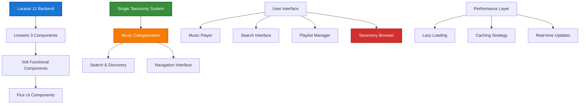

# 1. Frontend Development Documentation

> **Refactored from:** `.ai/guides/chinook/frontend/000-frontend-index.md` on 2025-07-11  
> **Focus:** Single taxonomy system using aliziodev/laravel-taxonomy package exclusively

## 1.1. Table of Contents

- [1.2. Overview](#12-overview)
- [1.3. Documentation Structure](#13-documentation-structure)
  - [1.3.1. Core Architecture](#131-core-architecture)
- [1.4. Technology Stack](#14-technology-stack)
- [1.5. Development Patterns](#15-development-patterns)

## 1.2. Overview

The Chinook frontend is built with **Laravel 12**, **Livewire 3**, **Volt functional components**, and **Flux UI** to create a modern, accessible, and performant music catalog interface. The frontend features **single taxonomy system integration** for seamless music categorization and discovery.

### 1.2.1. Key Features

**🚀 Modern Frontend Stack:**
- **Livewire 3**: Reactive components with real-time updates
- **Volt Functional Components**: Simplified component development
- **Flux UI**: Beautiful, accessible component library
- **SPA Experience**: Seamless navigation without full page reloads
- **Accessibility First**: WCAG 2.1 AA compliance built into every component
- **Performance Optimized**: Lazy loading, caching, and efficient data handling

**🏗️ Technical Patterns:**
- **Single Taxonomy System**: Unified categorization using aliziodev/laravel-taxonomy
- **Polymorphic Relationships**: Flexible data associations
- **RBAC Integration**: Role-based access control throughout the UI
- **Real-time Updates**: Live data synchronization with Livewire
- **Progressive Enhancement**: Works without JavaScript, enhanced with it

**🎵 Music-Specific Features:**
- **Advanced Search**: Multi-dimensional search with taxonomy filtering
- **Music Player**: Integrated audio player with playlist support
- **Taxonomy Browser**: Hierarchical music categorization interface
- **Artist/Album Discovery**: Intelligent recommendation system
- **Playlist Management**: Create and manage custom playlists

### 1.2.2. Architecture Overview



## 1.3. Documentation Structure

### 1.3.1. Core Architecture

1. **[Frontend Architecture Overview](100-frontend-architecture-overview.md)**
   - **Single Taxonomy Integration**: Complete taxonomy system architecture
   - **Component Hierarchy**: Livewire + Volt + Flux component structure
   - **Data Flow Patterns**: State management and data synchronization
   - **Performance Architecture**: Optimization strategies and caching

2. **[Volt Functional Patterns Guide](110-volt-functional-patterns-guide.md)**
   - **Functional Components**: Modern component development patterns
   - **Taxonomy Integration**: Taxonomy-aware component development
   - **State Management**: Reactive state with taxonomy data
   - **Event Handling**: User interactions and taxonomy operations

3. **[Flux Component Integration Guide](120-flux-component-integration-guide.md)**
   - **UI Component Library**: Flux component usage and customization
   - **Taxonomy UI Components**: Specialized taxonomy interface elements
   - **Form Components**: Taxonomy selection and management forms
   - **Navigation Components**: Taxonomy-based navigation systems

### 1.3.2. Component Development

4. **[SPA Navigation Guide](130-spa-navigation-guide.md)**
   - **Single Page Application**: Seamless navigation implementation
   - **Taxonomy Navigation**: Hierarchical taxonomy browsing
   - **URL Management**: SEO-friendly URLs with taxonomy paths
   - **History Management**: Browser history and deep linking

5. **[Accessibility WCAG Guide](140-accessibility-wcag-guide.md)**
   - **WCAG 2.1 AA Compliance**: Complete accessibility implementation
   - **Taxonomy Accessibility**: Screen reader support for taxonomy navigation
   - **Keyboard Navigation**: Full keyboard accessibility
   - **Color Contrast**: High contrast design patterns

6. **[Livewire Volt Integration Guide](160-livewire-volt-integration-guide.md)**
   - **Component Integration**: Livewire and Volt working together
   - **Taxonomy Components**: Real-time taxonomy filtering and search
   - **Data Binding**: Reactive data with taxonomy relationships
   - **Performance Optimization**: Efficient component updates

### 1.3.3. User Experience

7. **[Performance Optimization Guide](150-performance-optimization-guide.md)**
   - **Loading Strategies**: Lazy loading and progressive enhancement
   - **Taxonomy Caching**: Efficient taxonomy data caching
   - **Asset Optimization**: CSS/JS optimization and bundling
   - **Database Optimization**: Efficient taxonomy queries

8. **[Performance Monitoring Guide](170-performance-monitoring-guide.md)**
   - **Real-time Monitoring**: Performance tracking and analytics
   - **Taxonomy Performance**: Monitoring taxonomy query performance
   - **User Experience Metrics**: Core Web Vitals and UX metrics
   - **Error Tracking**: Frontend error monitoring and reporting

### 1.3.4. Performance & Testing

9. **[Testing Approaches Guide](165-testing-approaches-guide.md)**
   - **Component Testing**: Livewire and Volt component testing
   - **Taxonomy Testing**: Testing taxonomy-related functionality
   - **Integration Testing**: End-to-end testing with taxonomy data
   - **Accessibility Testing**: Automated accessibility validation

10. **[API Testing Guide](180-api-testing-guide.md)**
    - **API Integration**: Testing API endpoints with taxonomy data
    - **Real-time Testing**: Testing Livewire real-time updates
    - **Performance Testing**: Load testing with taxonomy operations
    - **Security Testing**: Frontend security validation

11. **[CI/CD Integration Guide](190-cicd-integration-guide.md)**
    - **Automated Testing**: CI/CD pipeline with taxonomy testing
    - **Deployment Strategies**: Frontend deployment with taxonomy data
    - **Quality Gates**: Automated quality checks and validation
    - **Performance Monitoring**: Continuous performance monitoring

12. **[Media Library Enhancement Guide](200-media-library-enhancement-guide.md)**
    - **Media Integration**: Enhanced media library with taxonomy support
    - **File Management**: Taxonomy-based file organization
    - **Image Optimization**: Responsive images and optimization
    - **Audio Player Integration**: Music player with taxonomy features

## 1.4. Technology Stack

### 1.4.1. Core Technologies

**Backend Framework:**
- **Laravel 12**: Latest framework features with modern syntax
- **PHP 8.4**: Latest language features and performance improvements
- **SQLite with WAL**: Optimized database configuration

**Frontend Stack:**
- **Livewire 3**: Full-stack reactive components
- **Volt**: Functional component development
- **Flux UI**: Modern component library
- **Alpine.js**: Lightweight JavaScript framework

**Taxonomy System:**
- **aliziodev/laravel-taxonomy**: **EXCLUSIVE** taxonomy package
- **Closure Table Architecture**: Efficient hierarchical queries
- **Polymorphic Relationships**: Flexible taxonomy assignments

### 1.4.2. Development Tools

**Build Tools:**
- **Vite**: Fast build tool and development server
- **Tailwind CSS**: Utility-first CSS framework
- **PostCSS**: CSS processing and optimization

**Testing Framework:**
- **Pest PHP**: Modern testing framework
- **Laravel Dusk**: Browser testing
- **Playwright**: End-to-end testing

**Quality Assurance:**
- **PHPStan**: Static analysis
- **Laravel Pint**: Code formatting
- **Accessibility Testing**: Automated WCAG validation

## 1.5. Development Patterns

### 1.5.1. Component Architecture

**Volt Functional Components:**
```php
<?php

use Aliziodev\LaravelTaxonomy\Models\Taxonomy;
use Aliziodev\LaravelTaxonomy\Models\TaxonomyTerm;
use App\Models\Track;
use Livewire\Volt\Component;

new class extends Component
{
    public string $search = '';
    public array $selectedGenres = [];
    public array $selectedMoods = [];
    
    public function with(): array
    {
        return [
            'tracks' => $this->getFilteredTracks(),
            'genres' => $this->getGenres(),
            'moods' => $this->getMoods(),
        ];
    }
    
    public function getFilteredTracks()
    {
        return Track::query()
            ->when($this->search, function ($query) {
                $query->where('name', 'like', "%{$this->search}%");
            })
            ->when($this->selectedGenres, function ($query) {
                $query->whereHas('taxonomies', function ($q) {
                    $q->whereIn('taxonomy_term_id', $this->selectedGenres);
                });
            })
            ->when($this->selectedMoods, function ($query) {
                $query->whereHas('taxonomies', function ($q) {
                    $q->whereIn('taxonomy_term_id', $this->selectedMoods);
                });
            })
            ->with(['album.artist', 'taxonomies.taxonomy', 'taxonomies.term'])
            ->paginate(20);
    }
    
    public function getGenres()
    {
        return TaxonomyTerm::whereHas('taxonomy', function ($q) {
            $q->where('slug', 'music-genres');
        })->orderBy('name')->get();
    }
    
    public function getMoods()
    {
        return TaxonomyTerm::whereHas('taxonomy', function ($q) {
            $q->where('slug', 'moods');
        })->orderBy('name')->get();
    }
}; ?>

<div class="space-y-6">
    <!-- Search and Filters -->
    <div class="bg-white rounded-lg shadow p-6">
        <div class="grid grid-cols-1 md:grid-cols-3 gap-4">
            <!-- Search Input -->
            <div>
                <label for="search" class="block text-sm font-medium text-gray-700">Search Tracks</label>
                <input 
                    type="text" 
                    id="search"
                    wire:model.live.debounce.300ms="search"
                    class="mt-1 block w-full rounded-md border-gray-300 shadow-sm"
                    placeholder="Search by track name..."
                >
            </div>
            
            <!-- Genre Filter -->
            <div>
                <label for="genres" class="block text-sm font-medium text-gray-700">Genres</label>
                <select 
                    id="genres"
                    wire:model.live="selectedGenres"
                    multiple
                    class="mt-1 block w-full rounded-md border-gray-300 shadow-sm"
                >
                    @foreach($genres as $genre)
                        <option value="{{ $genre->id }}">{{ $genre->name }}</option>
                    @endforeach
                </select>
            </div>
            
            <!-- Mood Filter -->
            <div>
                <label for="moods" class="block text-sm font-medium text-gray-700">Moods</label>
                <select 
                    id="moods"
                    wire:model.live="selectedMoods"
                    multiple
                    class="mt-1 block w-full rounded-md border-gray-300 shadow-sm"
                >
                    @foreach($moods as $mood)
                        <option value="{{ $mood->id }}">{{ $mood->name }}</option>
                    @endforeach
                </select>
            </div>
        </div>
    </div>
    
    <!-- Results -->
    <div class="bg-white rounded-lg shadow">
        <div class="px-6 py-4 border-b border-gray-200">
            <h3 class="text-lg font-medium text-gray-900">
                Tracks ({{ $tracks->total() }})
            </h3>
        </div>
        
        <div class="divide-y divide-gray-200">
            @foreach($tracks as $track)
                <div class="p-6 hover:bg-gray-50">
                    <div class="flex items-center justify-between">
                        <div class="flex-1">
                            <h4 class="text-lg font-medium text-gray-900">
                                {{ $track->name }}
                            </h4>
                            <p class="text-sm text-gray-600">
                                {{ $track->album->artist->name }} - {{ $track->album->title }}
                            </p>
                            
                            <!-- Taxonomy Tags -->
                            <div class="mt-2 flex flex-wrap gap-2">
                                @foreach($track->taxonomies as $taxonomyRelation)
                                    <span class="inline-flex items-center px-2.5 py-0.5 rounded-full text-xs font-medium
                                        @if($taxonomyRelation->taxonomy->slug === 'music-genres')
                                            bg-blue-100 text-blue-800
                                        @elseif($taxonomyRelation->taxonomy->slug === 'moods')
                                            bg-green-100 text-green-800
                                        @else
                                            bg-gray-100 text-gray-800
                                        @endif
                                    ">
                                        {{ $taxonomyRelation->term->name }}
                                    </span>
                                @endforeach
                            </div>
                        </div>
                        
                        <div class="ml-4">
                            <span class="text-sm text-gray-500">
                                {{ gmdate('i:s', intval($track->milliseconds / 1000)) }}
                            </span>
                        </div>
                    </div>
                </div>
            @endforeach
        </div>
        
        <!-- Pagination -->
        <div class="px-6 py-4 border-t border-gray-200">
            {{ $tracks->links() }}
        </div>
    </div>
</div>
```

### 1.5.2. Taxonomy Navigation Component

**Hierarchical Taxonomy Browser:**
```php
<?php

use Aliziodev\LaravelTaxonomy\Models\Taxonomy;
use Livewire\Volt\Component;

new class extends Component
{
    public ?string $selectedTaxonomy = null;
    public ?int $selectedTerm = null;
    
    public function with(): array
    {
        return [
            'taxonomies' => Taxonomy::with(['terms' => function ($query) {
                $query->whereNull('parent_id')->orderBy('name');
            }])->get(),
            'selectedTermChildren' => $this->getSelectedTermChildren(),
        ];
    }
    
    public function selectTaxonomy(string $taxonomySlug): void
    {
        $this->selectedTaxonomy = $taxonomySlug;
        $this->selectedTerm = null;
    }
    
    public function selectTerm(int $termId): void
    {
        $this->selectedTerm = $termId;
        $this->dispatch('term-selected', termId: $termId);
    }
    
    public function getSelectedTermChildren()
    {
        if (!$this->selectedTerm) {
            return collect();
        }
        
        return TaxonomyTerm::where('parent_id', $this->selectedTerm)
            ->orderBy('name')
            ->get();
    }
}; ?>

<div class="bg-white rounded-lg shadow">
    <div class="px-6 py-4 border-b border-gray-200">
        <h3 class="text-lg font-medium text-gray-900">Browse Music</h3>
    </div>
    
    <!-- Taxonomy Types -->
    <div class="p-6">
        <div class="grid grid-cols-2 md:grid-cols-4 gap-4 mb-6">
            @foreach($taxonomies as $taxonomy)
                <button
                    wire:click="selectTaxonomy('{{ $taxonomy->slug }}')"
                    class="p-4 text-center rounded-lg border-2 transition-colors
                        @if($selectedTaxonomy === $taxonomy->slug)
                            border-blue-500 bg-blue-50 text-blue-700
                        @else
                            border-gray-200 hover:border-gray-300 text-gray-700
                        @endif
                    "
                >
                    <div class="text-sm font-medium">{{ $taxonomy->name }}</div>
                    <div class="text-xs text-gray-500 mt-1">
                        {{ $taxonomy->terms->count() }} terms
                    </div>
                </button>
            @endforeach
        </div>
        
        <!-- Terms -->
        @if($selectedTaxonomy)
            @php
                $selectedTaxonomyModel = $taxonomies->firstWhere('slug', $selectedTaxonomy);
            @endphp
            
            <div class="space-y-4">
                <h4 class="font-medium text-gray-900">{{ $selectedTaxonomyModel->name }}</h4>
                
                <div class="grid grid-cols-1 md:grid-cols-2 lg:grid-cols-3 gap-2">
                    @foreach($selectedTaxonomyModel->terms as $term)
                        <button
                            wire:click="selectTerm({{ $term->id }})"
                            class="p-3 text-left rounded-md border transition-colors
                                @if($selectedTerm === $term->id)
                                    border-blue-500 bg-blue-50 text-blue-700
                                @else
                                    border-gray-200 hover:border-gray-300 text-gray-700
                                @endif
                            "
                        >
                            <div class="font-medium">{{ $term->name }}</div>
                            @if($term->description)
                                <div class="text-xs text-gray-500 mt-1">
                                    {{ Str::limit($term->description, 50) }}
                                </div>
                            @endif
                        </button>
                    @endforeach
                </div>
                
                <!-- Child Terms -->
                @if($selectedTermChildren->isNotEmpty())
                    <div class="mt-6 pt-6 border-t border-gray-200">
                        <h5 class="font-medium text-gray-900 mb-3">Subcategories</h5>
                        <div class="grid grid-cols-1 md:grid-cols-2 lg:grid-cols-3 gap-2">
                            @foreach($selectedTermChildren as $childTerm)
                                <button
                                    wire:click="selectTerm({{ $childTerm->id }})"
                                    class="p-2 text-left rounded-md border border-gray-200 hover:border-gray-300 text-gray-700"
                                >
                                    <div class="text-sm font-medium">{{ $childTerm->name }}</div>
                                </button>
                            @endforeach
                        </div>
                    </div>
                @endif
            </div>
        @endif
    </div>
</div>
```

---

## Navigation

**Index:** [Documentation Root](../000-chinook-index.md) | **Next:** [Frontend Architecture Overview](100-frontend-architecture-overview.md)

---

**Documentation Standards**: This document follows WCAG 2.1 AA accessibility guidelines and uses Laravel 12 modern syntax patterns.

[⬆️ Back to Top](#1-frontend-development-documentation)
