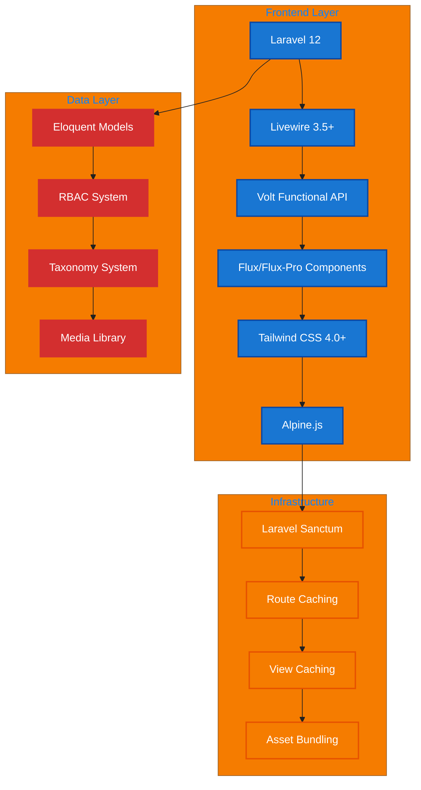
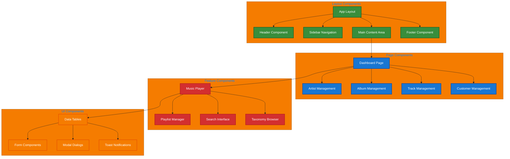
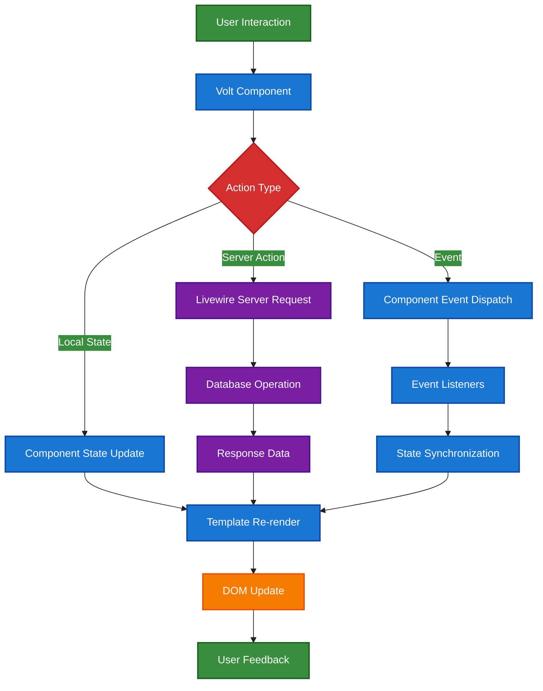

# 1. Chinook Frontend Architecture Overview

## Table of Contents

- [1. Overview](#1-overview)
- [2. Architecture Principles](#2-architecture-principles)
- [3. Technology Stack](#3-technology-stack)
- [4. Component Hierarchy](#4-component-hierarchy)
- [5. SPA Navigation Patterns](#5-spa-navigation-patterns)
- [6. Integration Architecture](#6-integration-architecture)
- [7. Data Flow Patterns](#7-data-flow-patterns)
- [8. Performance Considerations](#8-performance-considerations)
- [9. Accessibility Foundation](#9-accessibility-foundation)
- [10. Development Workflow](#10-development-workflow)
- [11. Best Practices](#11-best-practices)
- [12. Navigation](#12-navigation)

## 1. Overview

The Chinook frontend architecture leverages modern Laravel 12 patterns with Livewire/Volt functional components and Flux/Flux-Pro UI components to create a sophisticated, accessible, and performant Single Page Application (SPA) experience. This architecture provides seamless navigation, real-time interactivity, and enterprise-grade user experience while maintaining the simplicity and power of Laravel's ecosystem.

## 2. Architecture Principles

### 2.1 Core Principles

- **Functional-First**: Utilize Livewire/Volt functional API for component logic
- **Component Composition**: Build complex UIs through component composition
- **SPA Experience**: Seamless navigation without full page reloads
- **Accessibility First**: WCAG 2.1 AA compliance built into every component
- **Performance Optimized**: Lazy loading, caching, and efficient data handling
- **Type Safety**: Leverage Laravel 12 modern patterns and type hints
- **Testable**: Comprehensive testing strategies for all components

### 2.2 Architectural Patterns

- **Hybrid Hierarchical Data**: Efficient taxonomy and navigation management using aliziodev/laravel-taxonomy
- **Polymorphic Relationships**: Flexible data associations through taxonomy system
- **RBAC Integration**: Role-based access control throughout the UI
- **Real-time Updates**: Live data synchronization with Livewire
- **Progressive Enhancement**: Works without JavaScript, enhanced with it

## 3. Technology Stack

### 3.1 Core Technologies



### 3.2 Component Libraries

- **Flux Free**: Essential UI components (buttons, inputs, modals, etc.)
- **Flux Pro**: Advanced components (charts, calendars, editors, etc.)
- **Custom Components**: Application-specific components built on Flux foundation

## 4. Component Hierarchy

### 4.1 Application Structure



### 4.2 Component Responsibilities

#### 4.2.1 Layout Components
- **App Layout**: Main application shell with navigation and content areas
- **Header**: Branding, user menu, global search, notifications
- **Sidebar**: Primary navigation, taxonomy filters, user context
- **Footer**: Secondary links, copyright, system status

#### 4.2.2 Page Components
- **Dashboard**: Overview metrics, recent activity, quick actions
- **Management Pages**: CRUD operations for artists, albums, tracks, customers
- **Detail Pages**: Individual item views with related data and actions

#### 4.2.3 Feature Components
- **Music Player**: Audio playback controls, queue management, volume
- **Search**: Global search with filters, suggestions, and results
- **Taxonomy Browser**: Hierarchical taxonomy navigation and filtering using aliziodev/laravel-taxonomy

## 5. SPA Navigation Patterns

### 5.1 Livewire Navigate Integration

```php
<?php
// Example: Artist listing page with SPA navigation
use function Livewire\Volt\{state, computed, mount};
use App\Models\Artist;

state(['search' => '', 'taxonomyFilter' => null]);

$artists = computed(function () {
    return Artist::query()
        ->when($this->search, fn($q) => $q->where('name', 'like', "%{$this->search}%"))
        ->when($this->taxonomyFilter, fn($q) => $q->whereHasTaxonomies($this->taxonomyFilter))
        ->with(['taxonomies', 'albums'])
        ->paginate(20);
});

$navigateToArtist = function ($artistSlug) {
    return $this->redirect(route('artists.show', $artistSlug), navigate: true);
};
?>

<div>
    <flux:input 
        wire:model.live.debounce.300ms="search" 
        placeholder="Search artists..." 
        icon="magnifying-glass"
    />
    
    @foreach($this->artists as $artist)
        <flux:card 
            wire:click="navigateToArtist('{{ $artist->slug }}')"
            class="cursor-pointer hover:shadow-lg transition-shadow"
        >
            <flux:heading size="lg">{{ $artist->name }}</flux:heading>
            <flux:text>{{ $artist->albums_count }} albums</flux:text>
        </flux:card>
    @endforeach
</div>
```

### 5.2 Navigation State Management

- **URL Synchronization**: Component state synced with browser URL
- **History Management**: Proper back/forward button support
- **Deep Linking**: Direct access to any application state
- **Progressive Loading**: Smooth transitions between pages

## 6. Integration Architecture

### 6.1 Livewire + Flux Integration

```php
<?php
// Example: Album form with Flux components
use function Livewire\Volt\{state, rules, form};
use App\Livewire\Forms\AlbumForm;

form(AlbumForm::class);

$save = function () {
    $this->form->validate();
    $this->form->store();
    
    $this->dispatch('album-saved');
    return $this->redirect(route('albums.index'), navigate: true);
};
?>

<flux:modal wire:model="showModal">
    <flux:modal.header>
        <flux:heading size="lg">Create New Album</flux:heading>
    </flux:modal.header>
    
    <form wire:submit="save">
        <flux:field>
            <flux:label>Album Title</flux:label>
            <flux:input wire:model="form.title" />
            <flux:error name="form.title" />
        </flux:field>
        
        <flux:field>
            <flux:label>Artist</flux:label>
            <flux:select wire:model="form.artist_id" placeholder="Select artist...">
                @foreach($artists as $artist)
                    <flux:option value="{{ $artist->id }}">{{ $artist->name }}</flux:option>
                @endforeach
            </flux:select>
            <flux:error name="form.artist_id" />
        </flux:field>
        
        <flux:modal.footer>
            <flux:button type="submit" variant="primary">Save Album</flux:button>
            <flux:button wire:click="$set('showModal', false)" variant="ghost">Cancel</flux:button>
        </flux:modal.footer>
    </form>
</flux:modal>
```

## 7. Data Flow Patterns

### 7.1 Component Communication



## 8. Performance Considerations

### 8.1 Optimization Strategies

- **Lazy Loading**: Components loaded on demand
- **Computed Properties**: Cached calculations
- **Efficient Queries**: Optimized database interactions
- **Asset Optimization**: Minified CSS/JS, image optimization
- **Caching Layers**: View caching, query caching, route caching

## 9. Accessibility Foundation

### 9.1 WCAG 2.1 AA Compliance

- **Semantic HTML**: Proper heading hierarchy and landmarks
- **Keyboard Navigation**: Full keyboard accessibility
- **Screen Reader Support**: ARIA labels and descriptions
- **Color Contrast**: Minimum 4.5:1 contrast ratios
- **Focus Management**: Visible focus indicators and logical tab order

## 10. Development Workflow

### 10.1 Component Development Process

1. **Design**: Create component specifications and wireframes
2. **Structure**: Build Volt functional component with state and actions
3. **UI**: Integrate Flux components for consistent styling
4. **Logic**: Implement business logic and data handling
5. **Test**: Write comprehensive tests for functionality
6. **Optimize**: Performance tuning and accessibility validation

## 11. Best Practices

### 11.1 Code Organization

- **Single Responsibility**: Each component has one clear purpose
- **Composition Over Inheritance**: Build complex UIs through composition
- **Consistent Naming**: Follow Laravel and Livewire conventions
- **Documentation**: Comprehensive inline documentation
- **Type Safety**: Use Laravel 12 type hints and validation

### 11.2 Performance Guidelines

- **Minimize Server Requests**: Use local state when possible
- **Optimize Database Queries**: Eager loading and query optimization
- **Cache Strategically**: Cache expensive operations and computed data
- **Lazy Load**: Load components and data on demand

## 12. Navigation

**Next →** [Volt Functional Component Patterns Guide](110-volt-functional-patterns-guide.md)

---

**Source Attribution:** Refactored from: .ai/guides/chinook/frontend/100-frontend-architecture-overview.md on 2025-07-11

*This guide provides the foundation for understanding the Chinook frontend architecture. Continue with the specific implementation guides for detailed patterns and examples.*

[⬆️ Back to Top](#1-chinook-frontend-architecture-overview)
