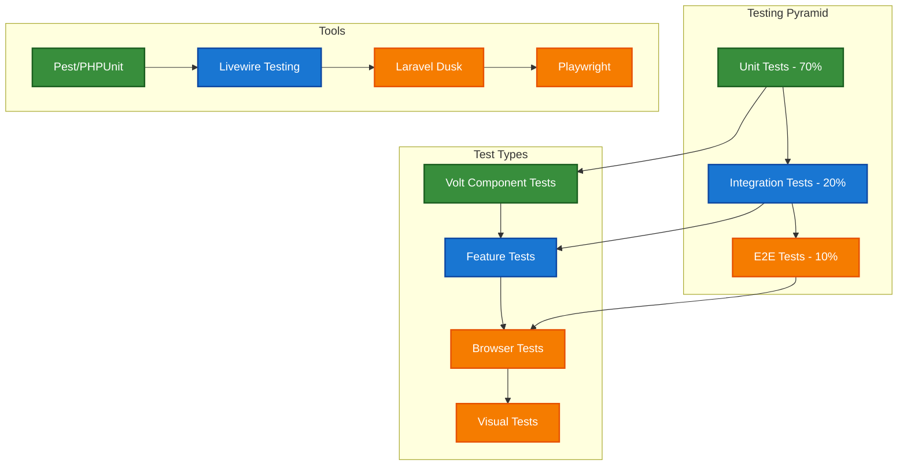

# 1. Testing Approaches Guide

## Table of Contents

- [1. Overview](#1-overview)
- [2. Testing Strategy](#2-testing-strategy)
- [3. Unit Testing Volt Components](#3-unit-testing-volt-components)
- [4. Feature Testing](#4-feature-testing)
- [5. Browser Testing](#5-browser-testing)
- [6. Accessibility Testing](#6-accessibility-testing)
- [7. Performance Testing](#7-performance-testing)
- [8. Visual Regression Testing](#8-visual-regression-testing)
- [9. Test Data Management](#9-test-data-management)
- [10. Best Practices](#10-best-practices)
- [11. Navigation](#11-navigation)

## 1. Overview

This guide provides comprehensive testing strategies for the Chinook application's frontend components built with Livewire/Volt. Testing ensures reliability, performance, and accessibility while maintaining code quality and preventing regressions using the aliziodev/laravel-taxonomy system.

## 2. Testing Strategy

### 2.1 Testing Pyramid



### 2.2 Test Classifications

1. **Unit Tests**: Individual component logic and computed properties
2. **Feature Tests**: Component interactions and data flow
3. **Browser Tests**: Full user workflows and JavaScript interactions
4. **Accessibility Tests**: WCAG compliance and screen reader compatibility
5. **Performance Tests**: Load times and resource usage
6. **Visual Tests**: UI consistency and responsive design

## 3. Unit Testing Volt Components

### 3.1 Basic Component Testing

```php
// tests/Feature/Livewire/ArtistCardTest.php
<?php

use Livewire\Volt\Volt;
use App\Models\Artist;
use App\Models\Album;
use Aliziodev\LaravelTaxonomy\Models\Taxonomy;

it('displays artist information correctly', function () {
    $artist = Artist::factory()->create([
        'name' => 'Test Artist',
        'country' => 'United States'
    ]);
    
    Volt::test('artists.artist-card', ['artist' => $artist])
        ->assertSee('Test Artist')
        ->assertSee('United States')
        ->assertViewHas('artist', $artist);
});

it('shows album count', function () {
    $artist = Artist::factory()
        ->has(Album::factory()->count(3))
        ->create();
    
    Volt::test('artists.artist-card', ['artist' => $artist])
        ->assertSee('3 albums');
});

it('displays taxonomies correctly', function () {
    $artist = Artist::factory()->create();
    $taxonomy = Taxonomy::factory()->create([
        'name' => 'Rock',
        'type' => 'genre'
    ]);
    
    $artist->syncTaxonomies([$taxonomy->id]);
    
    Volt::test('artists.artist-card', ['artist' => $artist])
        ->assertSee('Rock');
});

it('handles favorite toggle', function () {
    $user = User::factory()->create();
    $artist = Artist::factory()->create();
    
    $this->actingAs($user);
    
    Volt::test('artists.artist-card', ['artist' => $artist])
        ->assertSet('isFavorite', false)
        ->call('toggleFavorite')
        ->assertSet('isFavorite', true)
        ->assertDispatched('favorite-added');
});
```

### 3.2 State Management Testing

```php
// tests/Feature/Livewire/ArtistBrowserTest.php
<?php

use Livewire\Volt\Volt;
use App\Models\Artist;
use Aliziodev\LaravelTaxonomy\Models\Taxonomy;

describe('Artist Browser Component', function () {
    it('filters artists by search term', function () {
        Artist::factory()->create(['name' => 'The Beatles']);
        Artist::factory()->create(['name' => 'Led Zeppelin']);

        Volt::test('artists.artist-browser')
            ->set('search', 'Beatles')
            ->assertSee('The Beatles')
            ->assertDontSee('Led Zeppelin');
    });

    it('filters artists by taxonomy', function () {
        $rockTaxonomy = Taxonomy::factory()->create([
            'name' => 'Rock',
            'type' => 'genre'
        ]);
        $jazzTaxonomy = Taxonomy::factory()->create([
            'name' => 'Jazz',
            'type' => 'genre'
        ]);
        
        $rockArtist = Artist::factory()->create(['name' => 'Rock Band']);
        $jazzArtist = Artist::factory()->create(['name' => 'Jazz Ensemble']);
        
        $rockArtist->syncTaxonomies([$rockTaxonomy->id]);
        $jazzArtist->syncTaxonomies([$jazzTaxonomy->id]);

        Volt::test('artists.artist-browser')
            ->set('selectedTaxonomies', [$rockTaxonomy->id])
            ->assertSee('Rock Band')
            ->assertDontSee('Jazz Ensemble');
    });

    it('sorts artists correctly', function () {
        Artist::factory()->create(['name' => 'Zebra']);
        Artist::factory()->create(['name' => 'Alpha']);

        Volt::test('artists.artist-browser')
            ->call('sortBy', 'name')
            ->assertSeeInOrder(['Alpha', 'Zebra']);
    });

    it('handles pagination', function () {
        Artist::factory()->count(25)->create();

        $component = Volt::test('artists.artist-browser');
        
        $component->assertSee('1')
              ->assertSee('2')
              ->call('gotoPage', 2)
              ->assertSet('page', 2);
    });

    it('resets page when search changes', function () {
        Artist::factory()->count(25)->create();

        Volt::test('artists.artist-browser')
            ->call('gotoPage', 2)
            ->assertSet('page', 2)
            ->set('search', 'test')
            ->assertSet('page', 1);
    });
});
```

### 3.3 Computed Properties Testing

```php
// tests/Feature/Livewire/TaxonomyStatsTest.php
<?php

use Livewire\Volt\Volt;
use App\Models\Track;
use Aliziodev\LaravelTaxonomy\Models\Taxonomy;

describe('Taxonomy Statistics Component', function () {
    it('calculates genre statistics correctly', function () {
        $rockTaxonomy = Taxonomy::factory()->create([
            'name' => 'Rock',
            'type' => 'genre'
        ]);
        
        $tracks = Track::factory()->count(5)->create();
        
        foreach ($tracks as $track) {
            $track->syncTaxonomies([$rockTaxonomy->id]);
        }

        $component = Volt::test('analytics.taxonomy-stats')
            ->set('selectedTaxonomy', $rockTaxonomy->id);

        $stats = $component->get('genreStats');
        
        expect($stats['total_tracks'])->toBe(5);
        expect($stats['taxonomy_name'])->toBe('Rock');
    });

    it('handles empty taxonomy selection', function () {
        Volt::test('analytics.taxonomy-stats')
            ->assertSet('selectedTaxonomy', null)
            ->assertSee('Select a taxonomy to view statistics');
    });

    it('caches expensive computations', function () {
        $taxonomy = Taxonomy::factory()->create(['type' => 'genre']);
        Track::factory()->count(100)->create();

        $component = Volt::test('analytics.taxonomy-stats')
            ->set('selectedTaxonomy', $taxonomy->id);

        // First call should compute
        $startTime = microtime(true);
        $stats1 = $component->get('expensiveStats');
        $firstCallTime = microtime(true) - $startTime;

        // Second call should be cached
        $startTime = microtime(true);
        $stats2 = $component->get('expensiveStats');
        $secondCallTime = microtime(true) - $startTime;

        expect($secondCallTime)->toBeLessThan($firstCallTime);
        expect($stats1)->toEqual($stats2);
    });
});
```

## 4. Feature Testing

### 4.1 Component Integration Testing

```php
// tests/Feature/ArtistManagementTest.php
<?php

use App\Models\User;
use App\Models\Artist;
use Aliziodev\LaravelTaxonomy\Models\Taxonomy;
use Livewire\Volt\Volt;

describe('Artist Management Features', function () {
    beforeEach(function () {
        $this->user = User::factory()->create();
        $this->actingAs($this->user);
    });

    it('creates artist with taxonomies', function () {
        $rockTaxonomy = Taxonomy::factory()->create([
            'name' => 'Rock',
            'type' => 'genre'
        ]);
        $bluesTaxonomy = Taxonomy::factory()->create([
            'name' => 'Blues',
            'type' => 'genre'
        ]);

        Volt::test('artists.create-form')
            ->set('form.name', 'New Artist')
            ->set('form.country', 'US')
            ->set('selectedTaxonomies', [$rockTaxonomy->id, $bluesTaxonomy->id])
            ->call('save')
            ->assertRedirect();

        $artist = Artist::where('name', 'New Artist')->first();

        expect($artist)->not->toBeNull();
        expect($artist->taxonomies)->toHaveCount(2);
        expect($artist->taxonomies->pluck('name')->toArray())
            ->toContain('Rock', 'Blues');
    });

    it('validates required fields', function () {
        Volt::test('artists.create-form')
            ->set('form.name', '')
            ->call('save')
            ->assertHasErrors(['form.name']);
    });

    it('handles taxonomy limit validation', function () {
        $taxonomies = Taxonomy::factory()->count(15)->create(['type' => 'genre']);

        Volt::test('artists.create-form')
            ->set('form.name', 'Test Artist')
            ->set('selectedTaxonomies', $taxonomies->pluck('id')->toArray())
            ->call('save')
            ->assertHasErrors(['selectedTaxonomies']);
    });
});
```

### 4.2 Search and Filter Testing

```php
// tests/Feature/SearchFunctionalityTest.php
<?php

use App\Models\Artist;
use App\Models\Album;
use App\Models\Track;
use Aliziodev\LaravelTaxonomy\Models\Taxonomy;
use Livewire\Volt\Volt;

describe('Search Functionality', function () {
    it('searches across multiple models', function () {
        $artist = Artist::factory()->create(['name' => 'Unique Artist Name']);
        $album = Album::factory()->create(['title' => 'Unique Album Title']);
        $track = Track::factory()->create(['name' => 'Unique Track Name']);

        Volt::test('search.global-search')
            ->set('query', 'Unique')
            ->assertSee('Unique Artist Name')
            ->assertSee('Unique Album Title')
            ->assertSee('Unique Track Name');
    });

    it('filters search results by taxonomy', function () {
        $rockTaxonomy = Taxonomy::factory()->create([
            'name' => 'Rock',
            'type' => 'genre'
        ]);

        $rockArtist = Artist::factory()->create(['name' => 'Rock Artist']);
        $popArtist = Artist::factory()->create(['name' => 'Pop Artist']);

        $rockArtist->syncTaxonomies([$rockTaxonomy->id]);

        Volt::test('search.global-search')
            ->set('query', 'Artist')
            ->set('taxonomyFilter', $rockTaxonomy->id)
            ->assertSee('Rock Artist')
            ->assertDontSee('Pop Artist');
    });

    it('provides search suggestions', function () {
        Artist::factory()->create(['name' => 'The Beatles']);
        Artist::factory()->create(['name' => 'The Rolling Stones']);

        Volt::test('search.search-suggestions')
            ->set('query', 'The')
            ->assertSee('The Beatles')
            ->assertSee('The Rolling Stones');
    });

    it('handles empty search gracefully', function () {
        Volt::test('search.global-search')
            ->set('query', '')
            ->assertSee('Start typing to search...');
    });
});
```

## 5. Browser Testing

### 5.1 End-to-End User Workflows

```php
// tests/Browser/ArtistBrowsingTest.php
<?php

use Laravel\Dusk\Browser;
use App\Models\Artist;
use Aliziodev\LaravelTaxonomy\Models\Taxonomy;

describe('Artist Browsing Workflows', function () {
    it('allows users to browse and filter artists', function () {
        $rockTaxonomy = Taxonomy::factory()->create([
            'name' => 'Rock',
            'type' => 'genre'
        ]);

        $rockArtist = Artist::factory()->create(['name' => 'Rock Band']);
        $jazzArtist = Artist::factory()->create(['name' => 'Jazz Band']);

        $rockArtist->syncTaxonomies([$rockTaxonomy->id]);

        $this->browse(function (Browser $browser) use ($rockTaxonomy) {
            $browser->visit('/artists')
                ->assertSee('Rock Band')
                ->assertSee('Jazz Band')
                ->select('@taxonomy-filter', $rockTaxonomy->id)
                ->waitForLivewire()
                ->assertSee('Rock Band')
                ->assertDontSee('Jazz Band');
        });
    });

    it('supports keyboard navigation', function () {
        Artist::factory()->count(5)->create();

        $this->browse(function (Browser $browser) {
            $browser->visit('/artists')
                ->keys('@search-input', '{tab}')
                ->assertFocused('@taxonomy-filter')
                ->keys('@taxonomy-filter', '{tab}')
                ->assertFocused('@sort-select');
        });
    });

    it('maintains state during navigation', function () {
        $artist = Artist::factory()->create(['name' => 'Test Artist']);

        $this->browse(function (Browser $browser) use ($artist) {
            $browser->visit('/artists')
                ->type('@search-input', 'Test')
                ->waitForLivewire()
                ->click('@artist-card-' . $artist->id)
                ->assertUrlIs('/artists/' . $artist->slug)
                ->back()
                ->assertInputValue('@search-input', 'Test');
        });
    });
});
```

## 6. Accessibility Testing

### 6.1 WCAG Compliance Testing

```php
// tests/Feature/AccessibilityTest.php
<?php

use App\Models\Artist;
use Aliziodev\LaravelTaxonomy\Models\Taxonomy;

describe('Accessibility Compliance', function () {
    it('provides proper ARIA labels for taxonomy filters', function () {
        $taxonomy = Taxonomy::factory()->create(['name' => 'Rock', 'type' => 'genre']);

        $response = $this->get('/artists');

        $response->assertSee('aria-label="Filter by genre"', false);
        $response->assertSee('role="listbox"', false);
    });

    it('maintains focus management in modals', function () {
        $this->browse(function (Browser $browser) {
            $browser->visit('/artists')
                ->click('@create-artist-button')
                ->waitFor('@artist-modal')
                ->assertFocused('@artist-name-input')
                ->keys('', '{escape}')
                ->waitUntilMissing('@artist-modal')
                ->assertFocused('@create-artist-button');
        });
    });

    it('provides keyboard navigation for taxonomy selection', function () {
        $taxonomies = Taxonomy::factory()->count(5)->create(['type' => 'genre']);

        $this->browse(function (Browser $browser) {
            $browser->visit('/artists/create')
                ->keys('@taxonomy-section', '{tab}')
                ->keys('', '{space}') // Select first taxonomy
                ->keys('', '{tab}')
                ->keys('', '{space}') // Select second taxonomy
                ->assertSeeIn('@selected-taxonomies', '2 selected');
        });
    });
});
```

## 7. Performance Testing

### 7.1 Load Time Testing

```php
// tests/Performance/ComponentPerformanceTest.php
<?php

use App\Models\Artist;
use Aliziodev\LaravelTaxonomy\Models\Taxonomy;
use Livewire\Volt\Volt;

describe('Component Performance', function () {
    it('loads artist browser efficiently with large datasets', function () {
        Artist::factory()->count(1000)->create();
        $taxonomies = Taxonomy::factory()->count(50)->create(['type' => 'genre']);

        $startTime = microtime(true);

        $component = Volt::test('artists.artist-browser');
        $artists = $component->get('artists');

        $loadTime = microtime(true) - $startTime;

        expect($loadTime)->toBeLessThan(1.0); // Should load in under 1 second
        expect($artists)->toHaveCount(20); // Paginated results
    });

    it('caches taxonomy queries efficiently', function () {
        $taxonomy = Taxonomy::factory()->create(['type' => 'genre']);
        Artist::factory()->count(100)->create();

        // First query
        $startTime = microtime(true);
        $component1 = Volt::test('analytics.taxonomy-stats')
            ->set('selectedTaxonomy', $taxonomy->id);
        $stats1 = $component1->get('taxonomyStats');
        $firstQueryTime = microtime(true) - $startTime;

        // Second query (should be cached)
        $startTime = microtime(true);
        $component2 = Volt::test('analytics.taxonomy-stats')
            ->set('selectedTaxonomy', $taxonomy->id);
        $stats2 = $component2->get('taxonomyStats');
        $secondQueryTime = microtime(true) - $startTime;

        expect($secondQueryTime)->toBeLessThan($firstQueryTime * 0.1);
    });
});
```

## 8. Visual Regression Testing

### 8.1 Component Visual Testing

```php
// tests/Visual/ComponentVisualTest.php
<?php

use App\Models\Artist;
use Aliziodev\LaravelTaxonomy\Models\Taxonomy;

describe('Visual Regression Tests', function () {
    it('maintains consistent artist card appearance', function () {
        $artist = Artist::factory()->create(['name' => 'Test Artist']);
        $taxonomy = Taxonomy::factory()->create(['name' => 'Rock', 'type' => 'genre']);
        $artist->syncTaxonomies([$taxonomy->id]);

        $this->browse(function (Browser $browser) use ($artist) {
            $browser->visit('/artists')
                ->screenshot('artist-card-' . $artist->id);
        });

        // Compare with baseline screenshot
        $this->assertScreenshotMatches('artist-card-baseline');
    });

    it('renders taxonomy filters consistently', function () {
        Taxonomy::factory()->count(10)->create(['type' => 'genre']);

        $this->browse(function (Browser $browser) {
            $browser->visit('/artists')
                ->screenshot('taxonomy-filters');
        });

        $this->assertScreenshotMatches('taxonomy-filters-baseline');
    });
});
```

## 9. Test Data Management

### 9.1 Factory Patterns for Taxonomies

```php
// database/factories/TaxonomyFactory.php
<?php

use Aliziodev\LaravelTaxonomy\Models\Taxonomy;

class TaxonomyFactory extends Factory
{
    protected $model = Taxonomy::class;

    public function definition(): array
    {
        return [
            'name' => $this->faker->unique()->word(),
            'type' => $this->faker->randomElement(['genre', 'style', 'mood']),
            'slug' => fn(array $attributes) => Str::slug($attributes['name']),
            'description' => $this->faker->sentence(),
        ];
    }

    public function genre(): static
    {
        return $this->state(['type' => 'genre']);
    }

    public function style(): static
    {
        return $this->state(['type' => 'style']);
    }

    public function mood(): static
    {
        return $this->state(['type' => 'mood']);
    }
}
```

### 9.2 Test Seeders

```php
// database/seeders/TestTaxonomySeeder.php
<?php

use Aliziodev\LaravelTaxonomy\Models\Taxonomy;

class TestTaxonomySeeder extends Seeder
{
    public function run(): void
    {
        $genres = [
            'Rock', 'Pop', 'Jazz', 'Classical', 'Electronic',
            'Hip Hop', 'Country', 'Blues', 'Folk', 'Reggae'
        ];

        foreach ($genres as $genre) {
            Taxonomy::factory()->create([
                'name' => $genre,
                'type' => 'genre'
            ]);
        }

        $moods = ['Energetic', 'Relaxing', 'Melancholic', 'Uplifting', 'Aggressive'];

        foreach ($moods as $mood) {
            Taxonomy::factory()->create([
                'name' => $mood,
                'type' => 'mood'
            ]);
        }
    }
}
```

## 10. Best Practices

### 10.1 Testing Guidelines

1. **Test Pyramid**: Follow the 70/20/10 rule (Unit/Integration/E2E)
2. **Descriptive Names**: Use clear, descriptive test names
3. **Arrange-Act-Assert**: Structure tests with clear phases
4. **Test Data**: Use factories and seeders for consistent test data
5. **Isolation**: Each test should be independent and isolated
6. **Performance**: Monitor test execution times and optimize slow tests

### 10.2 Taxonomy Testing Patterns

1. **Consistent Factories**: Use standardized taxonomy factories
2. **Relationship Testing**: Test taxonomy-model relationships thoroughly
3. **Validation Testing**: Test taxonomy assignment limits and rules
4. **Performance Testing**: Test taxonomy queries with large datasets
5. **UI Testing**: Test taxonomy selection interfaces and filters

### 10.3 Maintenance Strategies

1. **Regular Updates**: Keep test dependencies updated
2. **Baseline Management**: Maintain visual regression baselines
3. **Test Coverage**: Monitor and maintain high test coverage
4. **Documentation**: Document complex test scenarios
5. **Continuous Integration**: Run tests automatically on code changes

## 11. Navigation

**← Previous** [Livewire/Volt Integration Guide](160-livewire-volt-integration-guide.md)
**Next →** [Performance Monitoring Guide](170-performance-monitoring-guide.md)

---

**Source Attribution:** Refactored from: .ai/guides/chinook/frontend/160-testing-approaches-guide.md on 2025-07-11

*This guide provides comprehensive testing strategies for Livewire/Volt components with aliziodev/laravel-taxonomy integration. Continue with the performance monitoring guide for production monitoring strategies.*

[⬆️ Back to Top](#1-testing-approaches-guide)
