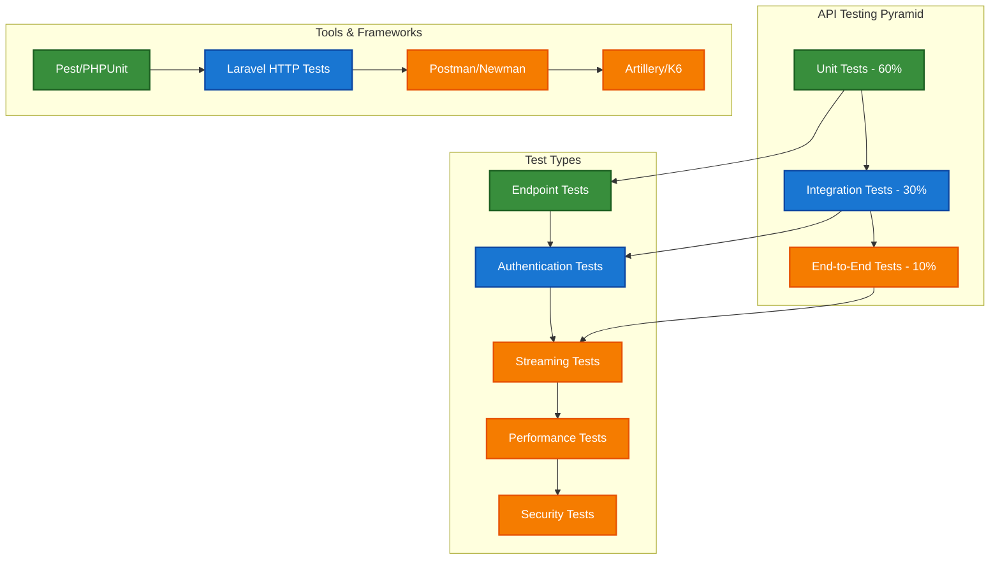

# 1. API Testing Guide

## Table of Contents

- [1. Overview](#1-overview)
- [2. API Testing Strategy](#2-api-testing-strategy)
- [3. Music Platform Endpoints](#3-music-platform-endpoints)
- [4. Authentication Testing](#4-authentication-testing)
- [5. Streaming API Testing](#5-streaming-api-testing)
- [6. Performance Testing](#6-performance-testing)
- [7. Security Testing](#7-security-testing)
- [8. Best Practices](#8-best-practices)
- [9. Navigation](#9-navigation)

## 1. Overview

This guide provides comprehensive API testing strategies specifically designed for the Chinook music platform. It covers testing methodologies for music streaming, search functionality, user management, analytics, and performance optimization with practical examples and automated testing approaches using the aliziodev/laravel-taxonomy system.

## 2. API Testing Strategy

### 2.1 Testing Pyramid for Music Platform APIs



### 2.2 Core Testing Principles

1. **Comprehensive Coverage**: Test all CRUD operations for each resource
2. **Authentication & Authorization**: Verify proper access controls
3. **Data Validation**: Test input validation and error handling
4. **Performance**: Ensure APIs meet response time requirements
5. **Security**: Test for common vulnerabilities and data protection

## 3. Music Platform Endpoints

### 3.1 Artist Management API Testing

```php
<?php
// tests/Feature/Api/ArtistApiTest.php

use App\Models\Artist;
use App\Models\User;
use Aliziodev\LaravelTaxonomy\Models\Taxonomy;
use Laravel\Sanctum\Sanctum;

it('can list artists with pagination', function () {
    Artist::factory()->count(25)->create();
    
    $response = $this->getJson('/api/artists');
    
    $response->assertOk()
        ->assertJsonStructure([
            'data' => [
                '*' => [
                    'id',
                    'public_id',
                    'name',
                    'country',
                    'formed_year',
                    'is_active',
                    'albums_count',
                    'tracks_count',
                    'taxonomies',
                    'created_at',
                    'updated_at',
                ]
            ],
            'links',
            'meta'
        ])
        ->assertJsonCount(15, 'data'); // Default pagination
});

it('can create artist with taxonomies', function () {
    $user = User::factory()->create();
    Sanctum::actingAs($user);
    
    $rockTaxonomy = Taxonomy::factory()->create(['name' => 'Rock', 'type' => 'genre']);
    $bluesTaxonomy = Taxonomy::factory()->create(['name' => 'Blues', 'type' => 'genre']);
    
    $artistData = [
        'name' => 'Test Artist',
        'country' => 'United States',
        'formed_year' => 1990,
        'biography' => 'A test artist biography',
        'taxonomies' => [$rockTaxonomy->id, $bluesTaxonomy->id]
    ];
    
    $response = $this->postJson('/api/artists', $artistData);
    
    $response->assertCreated()
        ->assertJsonStructure([
            'data' => [
                'id',
                'public_id',
                'name',
                'country',
                'formed_year',
                'biography',
                'taxonomies' => [
                    '*' => [
                        'id',
                        'name',
                        'type',
                        'slug'
                    ]
                ]
            ]
        ]);
    
    $artist = Artist::where('name', 'Test Artist')->first();
    expect($artist->taxonomies)->toHaveCount(2);
    expect($artist->taxonomies->pluck('name')->toArray())->toContain('Rock', 'Blues');
});

it('can update artist taxonomies', function () {
    $user = User::factory()->create();
    Sanctum::actingAs($user);
    
    $artist = Artist::factory()->create();
    $rockTaxonomy = Taxonomy::factory()->create(['name' => 'Rock', 'type' => 'genre']);
    $jazzTaxonomy = Taxonomy::factory()->create(['name' => 'Jazz', 'type' => 'genre']);
    
    // Initially assign Rock taxonomy
    $artist->syncTaxonomies([$rockTaxonomy->id]);
    
    // Update to Jazz taxonomy
    $updateData = [
        'name' => $artist->name,
        'taxonomies' => [$jazzTaxonomy->id]
    ];
    
    $response = $this->putJson("/api/artists/{$artist->public_id}", $updateData);
    
    $response->assertOk();
    
    $artist->refresh();
    expect($artist->taxonomies)->toHaveCount(1);
    expect($artist->taxonomies->first()->name)->toBe('Jazz');
});

it('validates required fields when creating artist', function () {
    $user = User::factory()->create();
    Sanctum::actingAs($user);
    
    $response = $this->postJson('/api/artists', []);
    
    $response->assertUnprocessable()
        ->assertJsonValidationErrors(['name']);
});

it('can filter artists by taxonomy', function () {
    $rockTaxonomy = Taxonomy::factory()->create(['name' => 'Rock', 'type' => 'genre']);
    $jazzTaxonomy = Taxonomy::factory()->create(['name' => 'Jazz', 'type' => 'genre']);
    
    $rockArtist = Artist::factory()->create(['name' => 'Rock Band']);
    $jazzArtist = Artist::factory()->create(['name' => 'Jazz Ensemble']);
    $untaggedArtist = Artist::factory()->create(['name' => 'Untagged Artist']);
    
    $rockArtist->syncTaxonomies([$rockTaxonomy->id]);
    $jazzArtist->syncTaxonomies([$jazzTaxonomy->id]);
    
    $response = $this->getJson("/api/artists?taxonomy={$rockTaxonomy->id}");
    
    $response->assertOk()
        ->assertJsonCount(1, 'data')
        ->assertJsonPath('data.0.name', 'Rock Band');
});
```

### 3.2 Track Management API Testing

```php
<?php
// tests/Feature/Api/TrackApiTest.php

use App\Models\Track;
use App\Models\Album;
use App\Models\Artist;
use Aliziodev\LaravelTaxonomy\Models\Taxonomy;

it('can list tracks with relationships', function () {
    $artist = Artist::factory()->create();
    $album = Album::factory()->for($artist)->create();
    Track::factory()->for($album)->count(5)->create();
    
    $response = $this->getJson('/api/tracks');
    
    $response->assertOk()
        ->assertJsonStructure([
            'data' => [
                '*' => [
                    'id',
                    'public_id',
                    'name',
                    'milliseconds',
                    'bytes',
                    'unit_price',
                    'album' => [
                        'id',
                        'title',
                        'artist' => [
                            'id',
                            'name'
                        ]
                    ],
                    'taxonomies'
                ]
            ]
        ]);
});

it('can filter tracks by taxonomy', function () {
    $rockTaxonomy = Taxonomy::factory()->create(['name' => 'Rock', 'type' => 'genre']);
    $jazzTaxonomy = Taxonomy::factory()->create(['name' => 'Jazz', 'type' => 'genre']);
    
    $rockTracks = Track::factory()->count(3)->create();
    $jazzTracks = Track::factory()->count(2)->create();
    
    // Assign taxonomies using aliziodev/laravel-taxonomy
    foreach ($rockTracks as $track) {
        $track->syncTaxonomies([$rockTaxonomy->id]);
    }
    
    foreach ($jazzTracks as $track) {
        $track->syncTaxonomies([$jazzTaxonomy->id]);
    }
    
    $response = $this->getJson("/api/tracks?taxonomy={$rockTaxonomy->id}");
    
    $response->assertOk()
        ->assertJsonCount(3, 'data');
    
    // Verify all returned tracks have the Rock taxonomy
    $tracks = $response->json('data');
    foreach ($tracks as $track) {
        expect(collect($track['taxonomies'])->pluck('name'))->toContain('Rock');
    }
});

it('can search tracks by name and taxonomy', function () {
    $rockTaxonomy = Taxonomy::factory()->create(['name' => 'Rock', 'type' => 'genre']);
    
    $track1 = Track::factory()->create(['name' => 'Rock Anthem']);
    $track2 = Track::factory()->create(['name' => 'Jazz Ballad']);
    $track3 = Track::factory()->create(['name' => 'Rock Symphony']);
    
    $track1->syncTaxonomies([$rockTaxonomy->id]);
    $track3->syncTaxonomies([$rockTaxonomy->id]);
    
    // Search by name and taxonomy
    $response = $this->getJson("/api/tracks?search=Rock&taxonomy={$rockTaxonomy->id}");
    
    $response->assertOk()
        ->assertJsonCount(2, 'data');
});
```

### 3.3 Taxonomy Management API Testing

```php
<?php
// tests/Feature/Api/TaxonomyApiTest.php

use Aliziodev\LaravelTaxonomy\Models\Taxonomy;
use App\Models\User;
use Laravel\Sanctum\Sanctum;

it('can list taxonomies by type', function () {
    Taxonomy::factory()->count(5)->create(['type' => 'genre']);
    Taxonomy::factory()->count(3)->create(['type' => 'mood']);
    Taxonomy::factory()->count(2)->create(['type' => 'style']);

    $response = $this->getJson('/api/taxonomies?type=genre');

    $response->assertOk()
        ->assertJsonCount(5, 'data')
        ->assertJsonStructure([
            'data' => [
                '*' => [
                    'id',
                    'name',
                    'type',
                    'slug',
                    'description',
                    'tracks_count',
                    'albums_count',
                    'artists_count'
                ]
            ]
        ]);
});

it('can create new taxonomy', function () {
    $user = User::factory()->create();
    Sanctum::actingAs($user);

    $taxonomyData = [
        'name' => 'Progressive Rock',
        'type' => 'genre',
        'description' => 'A subgenre of rock music'
    ];

    $response = $this->postJson('/api/taxonomies', $taxonomyData);

    $response->assertCreated()
        ->assertJsonStructure([
            'data' => [
                'id',
                'name',
                'type',
                'slug',
                'description'
            ]
        ])
        ->assertJsonPath('data.name', 'Progressive Rock')
        ->assertJsonPath('data.type', 'genre')
        ->assertJsonPath('data.slug', 'progressive-rock');
});

it('validates taxonomy type', function () {
    $user = User::factory()->create();
    Sanctum::actingAs($user);

    $taxonomyData = [
        'name' => 'Invalid Type',
        'type' => 'invalid_type'
    ];

    $response = $this->postJson('/api/taxonomies', $taxonomyData);

    $response->assertUnprocessable()
        ->assertJsonValidationErrors(['type']);
});

it('can get taxonomy with usage statistics', function () {
    $taxonomy = Taxonomy::factory()->create(['name' => 'Rock', 'type' => 'genre']);

    // Create some content with this taxonomy
    $artist = Artist::factory()->create();
    $album = Album::factory()->for($artist)->create();
    $tracks = Track::factory()->for($album)->count(5)->create();

    $artist->syncTaxonomies([$taxonomy->id]);
    $album->syncTaxonomies([$taxonomy->id]);
    foreach ($tracks as $track) {
        $track->syncTaxonomies([$taxonomy->id]);
    }

    $response = $this->getJson("/api/taxonomies/{$taxonomy->id}");

    $response->assertOk()
        ->assertJsonStructure([
            'data' => [
                'id',
                'name',
                'type',
                'slug',
                'description',
                'tracks_count',
                'albums_count',
                'artists_count',
                'usage_statistics' => [
                    'total_usage',
                    'recent_usage',
                    'trending_score'
                ]
            ]
        ])
        ->assertJsonPath('data.tracks_count', 5)
        ->assertJsonPath('data.albums_count', 1)
        ->assertJsonPath('data.artists_count', 1);
});
```

## 4. Authentication Testing

### 4.1 API Authentication Flow Testing

```php
<?php
// tests/Feature/Api/AuthenticationTest.php

use App\Models\User;
use Laravel\Sanctum\Sanctum;

it('can register new user', function () {
    $userData = [
        'name' => 'Test User',
        'email' => 'test@example.com',
        'password' => 'password123',
        'password_confirmation' => 'password123'
    ];

    $response = $this->postJson('/api/auth/register', $userData);

    $response->assertCreated()
        ->assertJsonStructure([
            'data' => [
                'user' => [
                    'id',
                    'name',
                    'email',
                    'email_verified_at'
                ],
                'token'
            ]
        ]);

    $this->assertDatabaseHas('users', [
        'email' => 'test@example.com'
    ]);
});

it('can login with valid credentials', function () {
    $user = User::factory()->create([
        'email' => 'test@example.com',
        'password' => bcrypt('password123')
    ]);

    $response = $this->postJson('/api/auth/login', [
        'email' => 'test@example.com',
        'password' => 'password123'
    ]);

    $response->assertOk()
        ->assertJsonStructure([
            'data' => [
                'user',
                'token'
            ]
        ]);
});

it('cannot login with invalid credentials', function () {
    $user = User::factory()->create([
        'email' => 'test@example.com',
        'password' => bcrypt('password123')
    ]);

    $response = $this->postJson('/api/auth/login', [
        'email' => 'test@example.com',
        'password' => 'wrongpassword'
    ]);

    $response->assertUnauthorized()
        ->assertJsonStructure([
            'message'
        ]);
});

it('can logout authenticated user', function () {
    $user = User::factory()->create();
    Sanctum::actingAs($user);

    $response = $this->postJson('/api/auth/logout');

    $response->assertOk()
        ->assertJsonStructure([
            'message'
        ]);
});

it('requires authentication for protected endpoints', function () {
    $response = $this->getJson('/api/artists');

    $response->assertUnauthorized();
});

it('can refresh user token', function () {
    $user = User::factory()->create();
    $token = $user->createToken('test-token')->plainTextToken;

    $response = $this->withHeaders([
        'Authorization' => "Bearer {$token}"
    ])->postJson('/api/auth/refresh');

    $response->assertOk()
        ->assertJsonStructure([
            'data' => [
                'token'
            ]
        ]);
});
```

### 4.2 Role-Based Access Control Testing

```php
<?php
// tests/Feature/Api/AuthorizationTest.php

use App\Models\User;
use Spatie\Permission\Models\Role;
use Laravel\Sanctum\Sanctum;

it('admin can access all endpoints', function () {
    $admin = User::factory()->create();
    $admin->assignRole('admin');
    Sanctum::actingAs($admin);

    $response = $this->getJson('/api/admin/users');
    $response->assertOk();

    $response = $this->getJson('/api/admin/taxonomies');
    $response->assertOk();

    $response = $this->getJson('/api/admin/analytics');
    $response->assertOk();
});

it('regular user cannot access admin endpoints', function () {
    $user = User::factory()->create();
    $user->assignRole('user');
    Sanctum::actingAs($user);

    $response = $this->getJson('/api/admin/users');
    $response->assertForbidden();

    $response = $this->getJson('/api/admin/taxonomies');
    $response->assertForbidden();
});

it('moderator can manage taxonomies but not users', function () {
    $moderator = User::factory()->create();
    $moderator->assignRole('moderator');
    Sanctum::actingAs($moderator);

    $response = $this->getJson('/api/admin/taxonomies');
    $response->assertOk();

    $response = $this->getJson('/api/admin/users');
    $response->assertForbidden();
});
```

## 5. Streaming API Testing

### 5.1 Audio Streaming Endpoint Testing

```php
<?php
// tests/Feature/Api/StreamingApiTest.php

use App\Models\Track;
use App\Models\User;
use Laravel\Sanctum\Sanctum;

it('can stream track with valid authentication', function () {
    $user = User::factory()->create();
    $track = Track::factory()->create();
    Sanctum::actingAs($user);

    $response = $this->getJson("/api/stream/{$track->public_id}");

    $response->assertOk()
        ->assertHeader('Content-Type', 'audio/mpeg')
        ->assertHeader('Accept-Ranges', 'bytes');
});

it('can handle range requests for streaming', function () {
    $user = User::factory()->create();
    $track = Track::factory()->create();
    Sanctum::actingAs($user);

    $response = $this->get("/api/stream/{$track->public_id}", [
        'Range' => 'bytes=0-1023'
    ]);

    $response->assertStatus(206) // Partial Content
        ->assertHeader('Content-Range')
        ->assertHeader('Content-Length', '1024');
});

it('tracks streaming analytics', function () {
    $user = User::factory()->create();
    $track = Track::factory()->create();
    Sanctum::actingAs($user);

    $response = $this->postJson("/api/stream/{$track->public_id}/start", [
        'quality' => 'high',
        'format' => 'mp3'
    ]);

    $response->assertOk()
        ->assertJsonStructure([
            'data' => [
                'stream_id',
                'track_id',
                'quality',
                'format',
                'started_at'
            ]
        ]);

    $streamId = $response->json('data.stream_id');

    // End streaming session
    $endResponse = $this->postJson("/api/stream/{$streamId}/end", [
        'duration' => 180.5,
        'bytes_transferred' => 5242880
    ]);

    $endResponse->assertOk();

    // Verify analytics were recorded
    $this->assertDatabaseHas('streaming_sessions', [
        'track_id' => $track->id,
        'user_id' => $user->id,
        'duration' => 180.5
    ]);
});

it('can get streaming quality options', function () {
    $user = User::factory()->create();
    $track = Track::factory()->create();
    Sanctum::actingAs($user);

    $response = $this->getJson("/api/stream/{$track->public_id}/options");

    $response->assertOk()
        ->assertJsonStructure([
            'data' => [
                'qualities' => [
                    '*' => [
                        'name',
                        'bitrate',
                        'format',
                        'file_size'
                    ]
                ],
                'preview_available',
                'requires_subscription'
            ]
        ]);
});
```

### 5.2 Playlist Streaming Testing

```php
<?php
// tests/Feature/Api/PlaylistStreamingTest.php

use App\Models\Playlist;
use App\Models\Track;
use App\Models\User;
use Laravel\Sanctum\Sanctum;

it('can stream entire playlist', function () {
    $user = User::factory()->create();
    $playlist = Playlist::factory()->for($user)->create();
    $tracks = Track::factory()->count(5)->create();

    $playlist->tracks()->attach($tracks->pluck('id'));

    Sanctum::actingAs($user);

    $response = $this->postJson("/api/playlists/{$playlist->public_id}/stream", [
        'quality' => 'high',
        'shuffle' => false
    ]);

    $response->assertOk()
        ->assertJsonStructure([
            'data' => [
                'session_id',
                'playlist_id',
                'track_order',
                'current_track',
                'total_tracks',
                'estimated_duration'
            ]
        ]);
});

it('can get next track in playlist', function () {
    $user = User::factory()->create();
    $playlist = Playlist::factory()->for($user)->create();
    $tracks = Track::factory()->count(3)->create();

    $playlist->tracks()->attach($tracks->pluck('id'));

    Sanctum::actingAs($user);

    // Start playlist streaming
    $startResponse = $this->postJson("/api/playlists/{$playlist->public_id}/stream");
    $sessionId = $startResponse->json('data.session_id');

    // Get next track
    $response = $this->postJson("/api/playlists/stream/{$sessionId}/next");

    $response->assertOk()
        ->assertJsonStructure([
            'data' => [
                'track',
                'position',
                'has_next',
                'stream_url'
            ]
        ]);
});
```

## 6. Performance Testing

### 6.1 Load Testing with Artillery

```yaml
# tests/Performance/artillery-config.yml
config:
  target: 'http://localhost:8000'
  phases:
    - duration: 60
      arrivalRate: 10
      name: "Warm up"
    - duration: 120
      arrivalRate: 50
      name: "Ramp up load"
    - duration: 300
      arrivalRate: 100
      name: "Sustained load"
  variables:
    auth_token: "{{ $processEnvironment.API_TOKEN }}"

scenarios:
  - name: "Browse artists and tracks"
    weight: 40
    flow:
      - get:
          url: "/api/artists"
          headers:
            Authorization: "Bearer {{ auth_token }}"
          capture:
            - json: "$.data[0].public_id"
              as: "artist_id"
      - get:
          url: "/api/artists/{{ artist_id }}"
          headers:
            Authorization: "Bearer {{ auth_token }}"
      - get:
          url: "/api/tracks?artist={{ artist_id }}"
          headers:
            Authorization: "Bearer {{ auth_token }}"

  - name: "Search functionality"
    weight: 30
    flow:
      - get:
          url: "/api/search?q=rock&type=track"
          headers:
            Authorization: "Bearer {{ auth_token }}"
      - get:
          url: "/api/taxonomies?type=genre"
          headers:
            Authorization: "Bearer {{ auth_token }}"

  - name: "Streaming simulation"
    weight: 30
    flow:
      - get:
          url: "/api/tracks"
          headers:
            Authorization: "Bearer {{ auth_token }}"
          capture:
            - json: "$.data[0].public_id"
              as: "track_id"
      - post:
          url: "/api/stream/{{ track_id }}/start"
          headers:
            Authorization: "Bearer {{ auth_token }}"
          json:
            quality: "high"
            format: "mp3"
      - think: 30
      - post:
          url: "/api/stream/{{ track_id }}/end"
          headers:
            Authorization: "Bearer {{ auth_token }}"
          json:
            duration: 30
            bytes_transferred: 1048576
```

### 6.2 Database Performance Testing

```php
<?php
// tests/Performance/DatabasePerformanceTest.php

use App\Models\Artist;
use App\Models\Track;
use Aliziodev\LaravelTaxonomy\Models\Taxonomy;

it('can handle large dataset queries efficiently', function () {
    // Create large dataset
    $artists = Artist::factory()->count(1000)->create();
    $taxonomies = Taxonomy::factory()->count(50)->create(['type' => 'genre']);

    // Assign random taxonomies to artists
    foreach ($artists as $artist) {
        $randomTaxonomies = $taxonomies->random(rand(1, 5));
        $artist->syncTaxonomies($randomTaxonomies->pluck('id')->toArray());
    }

    $startTime = microtime(true);

    $response = $this->getJson('/api/artists?per_page=50');

    $endTime = microtime(true);
    $executionTime = $endTime - $startTime;

    $response->assertOk();
    expect($executionTime)->toBeLessThan(1.0); // Should complete within 1 second
});

it('can handle complex taxonomy filtering efficiently', function () {
    $rockTaxonomy = Taxonomy::factory()->create(['name' => 'Rock', 'type' => 'genre']);
    $bluesTaxonomy = Taxonomy::factory()->create(['name' => 'Blues', 'type' => 'genre']);

    // Create tracks with taxonomies
    $tracks = Track::factory()->count(5000)->create();

    foreach ($tracks as $track) {
        if (rand(1, 100) <= 30) { // 30% chance
            $track->syncTaxonomies([$rockTaxonomy->id]);
        }
        if (rand(1, 100) <= 20) { // 20% chance
            $track->syncTaxonomies([$bluesTaxonomy->id]);
        }
    }

    $startTime = microtime(true);

    $response = $this->getJson("/api/tracks?taxonomy={$rockTaxonomy->id}&per_page=100");

    $endTime = microtime(true);
    $executionTime = $endTime - $startTime;

    $response->assertOk();
    expect($executionTime)->toBeLessThan(0.5); // Should complete within 500ms
});
```

## 7. Security Testing

### 7.1 Input Validation and Sanitization

```php
<?php
// tests/Feature/Api/SecurityTest.php

use App\Models\User;
use Laravel\Sanctum\Sanctum;

it('prevents SQL injection in search parameters', function () {
    $user = User::factory()->create();
    Sanctum::actingAs($user);

    $maliciousInput = "'; DROP TABLE artists; --";

    $response = $this->getJson("/api/artists?search=" . urlencode($maliciousInput));

    $response->assertOk(); // Should not crash

    // Verify artists table still exists
    $this->assertDatabaseCount('artists', 0); // Should be empty but exist
});

it('prevents XSS in API responses', function () {
    $user = User::factory()->create();
    Sanctum::actingAs($user);

    $maliciousScript = '<script>alert("XSS")</script>';

    $response = $this->postJson('/api/artists', [
        'name' => $maliciousScript,
        'country' => 'US'
    ]);

    if ($response->status() === 201) {
        $artistData = $response->json('data');
        expect($artistData['name'])->not->toContain('<script>');
    }
});

it('validates file upload security', function () {
    $user = User::factory()->create();
    Sanctum::actingAs($user);

    // Attempt to upload PHP file as image
    $maliciousFile = UploadedFile::fake()->create('malicious.php', 100, 'image/jpeg');

    $response = $this->postJson('/api/artists/1/avatar', [
        'avatar' => $maliciousFile
    ]);

    $response->assertUnprocessable()
        ->assertJsonValidationErrors(['avatar']);
});

it('enforces rate limiting', function () {
    $user = User::factory()->create();
    Sanctum::actingAs($user);

    // Make multiple rapid requests
    for ($i = 0; $i < 100; $i++) {
        $response = $this->getJson('/api/artists');

        if ($response->status() === 429) {
            // Rate limit hit
            expect($i)->toBeGreaterThan(50); // Should allow at least 50 requests
            break;
        }
    }
});
```

### 7.2 Authorization Security Testing

```php
<?php
// tests/Feature/Api/AuthorizationSecurityTest.php

use App\Models\User;
use App\Models\Artist;
use Laravel\Sanctum\Sanctum;

it('prevents unauthorized access to other users data', function () {
    $user1 = User::factory()->create();
    $user2 = User::factory()->create();

    $playlist1 = Playlist::factory()->for($user1)->create();

    Sanctum::actingAs($user2);

    $response = $this->getJson("/api/playlists/{$playlist1->public_id}");

    $response->assertForbidden();
});

it('prevents privilege escalation', function () {
    $user = User::factory()->create();
    $user->assignRole('user');
    Sanctum::actingAs($user);

    // Try to access admin endpoint
    $response = $this->getJson('/api/admin/users');
    $response->assertForbidden();

    // Try to modify user role
    $response = $this->putJson("/api/users/{$user->id}", [
        'roles' => ['admin']
    ]);
    $response->assertForbidden();
});

it('validates token expiration', function () {
    $user = User::factory()->create();
    $token = $user->createToken('test-token', ['*'], now()->subHour())->plainTextToken;

    $response = $this->withHeaders([
        'Authorization' => "Bearer {$token}"
    ])->getJson('/api/artists');

    $response->assertUnauthorized();
});
```

## 8. Best Practices

### 8.1 API Testing Guidelines

1. **Comprehensive Coverage**: Test all CRUD operations and edge cases
2. **Authentication Testing**: Verify proper access controls and token management
3. **Data Validation**: Test input validation and error handling
4. **Performance Testing**: Ensure APIs meet response time requirements
5. **Security Testing**: Test for common vulnerabilities and data protection

### 8.2 Test Organization

1. **Logical Grouping**: Organize tests by feature or endpoint
2. **Descriptive Names**: Use clear, descriptive test names
3. **Setup and Teardown**: Use proper test setup and cleanup
4. **Data Factories**: Use factories for consistent test data
5. **Assertions**: Use appropriate assertions for different scenarios

### 8.3 Continuous Integration

1. **Automated Testing**: Run tests automatically on code changes
2. **Environment Consistency**: Use consistent test environments
3. **Test Reporting**: Generate comprehensive test reports
4. **Performance Monitoring**: Track API performance over time
5. **Security Scanning**: Include security tests in CI pipeline

### 8.4 Taxonomy-Specific Testing

1. **Relationship Testing**: Test taxonomy-model relationships thoroughly
2. **Type Validation**: Ensure taxonomy types are properly validated
3. **Performance Testing**: Test taxonomy queries with large datasets
4. **Search Integration**: Test taxonomy-based search and filtering
5. **Data Integrity**: Verify taxonomy assignments and synchronization

## 9. Navigation

**← Previous** [Performance Monitoring Guide](170-performance-monitoring-guide.md)
**Next →** [CI/CD Integration Guide](190-cicd-integration-guide.md)

---

**Source Attribution:** Refactored from: .ai/guides/chinook/frontend/180-api-testing-guide.md on 2025-07-11

*This guide provides comprehensive API testing strategies for the Chinook music platform with aliziodev/laravel-taxonomy integration. Continue with the CI/CD integration guide for deployment workflows.*

[⬆️ Back to Top](#1-api-testing-guide)
