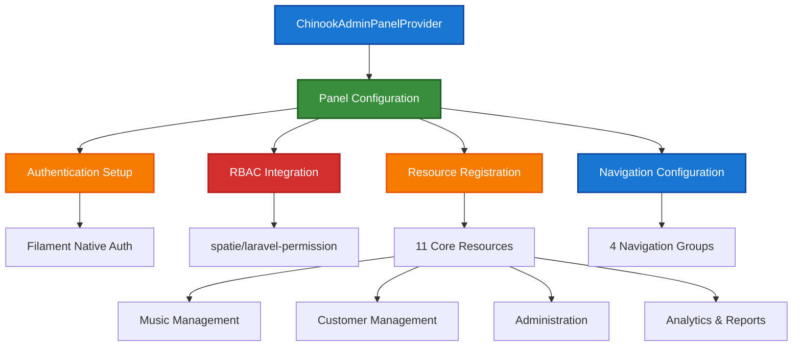

# 1. Filament 4 Admin Panel Documentation

> **Refactored from:** `.ai/guides/chinook/filament/000-filament-index.md` on 2025-07-11  
> **Focus:** Single taxonomy system using aliziodev/laravel-taxonomy package exclusively

## 1.1. Table of Contents

- [1.2. Overview](#12-overview)
- [2. Architecture](#2-architecture)
- [3. Documentation Structure](#3-documentation-structure)
    - [3.1. Setup Documentation](#31-setup-documentation)
    - [3.2. Resources Documentation](#32-resources-documentation)
    - [3.3. Features Documentation](#33-features-documentation)
    - [3.4. Models Documentation](#34-models-documentation)
    - [3.5. Testing Documentation](#35-testing-documentation)
    - [3.6. Deployment Documentation](#36-deployment-documentation)
    - [3.7. Diagrams Documentation](#37-diagrams-documentation)
- [4. Quick Start Guide](#4-quick-start-guide)
    - [4.1. Prerequisites](#41-prerequisites)
    - [4.2. Installation Steps](#42-installation-steps)
    - [4.3. Configuration](#43-configuration)
- [5. Panel Features](#5-panel-features)
    - [5.1. Authentication & Authorization](#51-authentication--authorization)
    - [5.2. Resource Management](#52-resource-management)
    - [5.3. Advanced Features](#53-advanced-features)
- [6. RBAC Integration](#6-rbac-integration)
    - [6.1. Hierarchical Roles](#61-hierarchical-roles)
    - [6.2. Granular Permissions](#62-granular-permissions)
    - [6.3. Access Control](#63-access-control)
- [7. Performance & Security](#7-performance--security)
    - [7.1. Optimization Strategies](#71-optimization-strategies)
    - [7.2. Security Measures](#72-security-measures)
- [8. Standards Compliance](#8-standards-compliance)
    - [8.1. Laravel 12 Modern Patterns](#81-laravel-12-modern-patterns)
    - [8.2. WCAG 2.1 AA Accessibility](#82-wcag-21-aa-accessibility)
    - [8.3. Documentation Standards](#83-documentation-standards)

## 1.2. Overview

The Chinook Filament 4 admin panel provides a comprehensive, enterprise-grade administrative interface for managing the
Chinook music database. Built with modern Laravel 12 patterns and Filament 4 best practices, it features complete RBAC
integration, **single taxonomy system management**, and accessibility-compliant design.

### 1.2.1. Key Features

**🚀 Enterprise Features:**

- **Dedicated Panel**: Isolated `chinook-admin` panel with custom configuration
- **RBAC Integration**: Complete spatie/laravel-permission integration with 7-tier hierarchical roles
- **Single Taxonomy System**: Advanced taxonomy management using aliziodev/laravel-taxonomy exclusively
- **Resource Management**: 11 comprehensive Filament resources with relationship managers
- **Advanced Widgets**: Dashboard widgets with analytics and performance metrics
- **Security Features**: Comprehensive middleware stack and access control
- **Testing Coverage**: Complete testing suite with feature and integration tests

**🎯 Modern Implementation:**

- **Laravel 12 Patterns**: casts() method, modern Eloquent syntax, PHP 8.4 features
- **Filament 4 Best Practices**: Latest component patterns, form builders, table features
- **Accessibility Compliance**: WCAG 2.1 AA compliant interface with proper contrast ratios
- **Performance Optimization**: Efficient queries, caching strategies, lazy loading
- **Single Taxonomy Architecture**: Unified categorization system for all entities

## 2. Architecture

### 2.1. Panel Structure

The Chinook admin panel follows a dedicated panel architecture:



### 2.2. Technology Stack

**Core Framework:**
- **Laravel 12**: Latest framework features with modern syntax patterns
- **Filament 4**: Advanced admin panel with comprehensive component library
- **PHP 8.4**: Latest language features and performance improvements

**Authentication & Authorization:**
- **spatie/laravel-permission**: Hierarchical RBAC with 7-tier role structure
- **Filament Native Auth**: Integrated authentication with panel isolation

**Taxonomy Management:**
- **aliziodev/laravel-taxonomy**: **EXCLUSIVE** taxonomy package for all categorization
- **Hierarchical Structure**: Unlimited depth taxonomy trees with efficient queries
- **Polymorphic Relationships**: Attach taxonomies to any model in the system

**Additional Packages:**
- **spatie/laravel-medialibrary**: Advanced media management with conversions
- **spatie/laravel-activitylog**: Comprehensive audit trails and activity monitoring

## 3. Documentation Structure

### 3.1. Setup Documentation

**Directory**: `deployment/`
**Purpose**: Complete panel installation, configuration, and environment setup

1. **[Deployment Index](deployment/000-deployment-index.md)** - Comprehensive deployment and configuration guide
2. **[Deployment Guide](deployment/010-deployment-guide.md)** - Complete setup and configuration procedures

### 3.2. Resources Documentation

**Directory**: `resources/`
**Purpose**: Complete Filament resource implementations with relationship managers

1. **[Resources Index](resources/000-resources-index.md)** - Complete resource implementation overview
2. **[Tracks Resource](resources/030-tracks-resource.md)** - Track management with taxonomy relationships
3. **[Taxonomy Resource](resources/040-taxonomy-resource.md)** - **Hierarchical taxonomy management using aliziodev/laravel-taxonomy**

### 3.3. Features Documentation

**Directory**: `features/`
**Purpose**: Advanced features, widgets, and custom functionality

1. **[Features Index](features/000-features-index.md)** - Complete features implementation overview

### 3.4. Models Documentation

**Directory**: `models/`
**Purpose**: Model architecture, traits, and relationships for Filament integration

1. **[Models Index](models/000-models-index.md)** - Complete model architecture overview
2. **[Taxonomy Integration](models/090-taxonomy-integration.md)** - **Single taxonomy system integration**

### 3.5. Testing Documentation

**Directory**: `../testing/`
**Purpose**: Comprehensive testing strategies for Filament resources and features

1. **[Testing Index](../testing/000-testing-index.md)** - Complete testing framework overview

### 3.6. Deployment Documentation

**Directory**: `deployment/`
**Purpose**: Production deployment, optimization, and maintenance

1. **[Deployment Index](deployment/000-deployment-index.md)** - Complete deployment overview
2. **[Deployment Guide](deployment/010-deployment-guide.md)** - Complete production deployment process

### 3.7. Diagrams Documentation

**Directory**: `diagrams/`
**Purpose**: Visual documentation and architecture diagrams

1. **[Diagrams Index](diagrams/000-diagrams-index.md)** - Complete visual documentation overview
2. **[Entity Relationship Diagrams](diagrams/010-entity-relationship-diagrams.md)** - Database relationships and structure

## 4. Quick Start Guide

### 4.1. Prerequisites

**System Requirements:**
- PHP 8.4+
- Laravel 12
- SQLite 3.35+ (with WAL mode support)
- Node.js 18+ (for asset compilation)

**Required Laravel Packages:**
```bash
# Core packages
composer require filament/filament:"^4.0"
composer require spatie/laravel-permission
composer require spatie/laravel-medialibrary
composer require aliziodev/laravel-taxonomy  # EXCLUSIVE taxonomy package
composer require spatie/laravel-activitylog

# Filament plugins
composer require filament/spatie-laravel-media-library-plugin:"^4.0"
composer require filament/spatie-laravel-activitylog-plugin:"^4.0"
```

> **⚠️ IMPORTANT**: We use **aliziodev/laravel-taxonomy** exclusively for all categorization needs. Do NOT install spatie/laravel-tags as it conflicts with our single taxonomy system approach.

### 4.2. Installation Steps

1. **Install Filament**:
```bash
composer require filament/filament:"^4.0"
php artisan filament:install --panels
```

2. **Create Dedicated Panel**:
```bash
php artisan make:filament-panel chinook-admin
```

3. **Install Required Packages**:
```bash
composer require spatie/laravel-permission
composer require spatie/laravel-medialibrary
composer require aliziodev/laravel-taxonomy
composer require spatie/laravel-activitylog
```

4. **Install Filament Plugins**:
```bash
composer require filament/spatie-laravel-media-library-plugin:"^4.0"
composer require filament/spatie-laravel-activitylog-plugin:"^4.0"
```

5. **Publish and Run Migrations**:
```bash
php artisan vendor:publish --provider="Spatie\Permission\PermissionServiceProvider"
php artisan vendor:publish --provider="Spatie\MediaLibrary\MediaLibraryServiceProvider"
php artisan vendor:publish --provider="Aliziodev\LaravelTaxonomy\TaxonomyServiceProvider"
php artisan migrate
```

### 4.3. Configuration

**Panel Configuration** (`app/Providers/Filament/ChinookAdminPanelProvider.php`):
```php
<?php

namespace App\Providers\Filament;

use Filament\Http\Middleware\Authenticate;
use Filament\Http\Middleware\DisableBladeIconComponents;
use Filament\Http\Middleware\DispatchServingFilamentEvent;
use Filament\Panel;
use Filament\PanelProvider;
use Filament\Support\Colors\Color;
use Illuminate\Cookie\Middleware\AddQueuedCookiesToResponse;
use Illuminate\Cookie\Middleware\EncryptCookies;
use Illuminate\Foundation\Http\Middleware\VerifyCsrfToken;
use Illuminate\Routing\Middleware\SubstituteBindings;
use Illuminate\Session\Middleware\AuthenticateSession;
use Illuminate\Session\Middleware\StartSession;
use Illuminate\View\Middleware\ShareErrorsFromSession;

class ChinookAdminPanelProvider extends PanelProvider
{
    public function panel(Panel $panel): Panel
    {
        return $panel
            ->id('chinook-admin')
            ->path('chinook-admin')
            ->colors([
                'primary' => Color::Blue,
            ])
            ->discoverResources(in: app_path('Filament/ChinookAdmin/Resources'), for: 'App\\Filament\\ChinookAdmin\\Resources')
            ->discoverPages(in: app_path('Filament/ChinookAdmin/Pages'), for: 'App\\Filament\\ChinookAdmin\\Pages')
            ->pages([
                // Custom pages
            ])
            ->discoverWidgets(in: app_path('Filament/ChinookAdmin/Widgets'), for: 'App\\Filament\\ChinookAdmin\\Widgets')
            ->widgets([
                // Custom widgets
            ])
            ->middleware([
                EncryptCookies::class,
                AddQueuedCookiesToResponse::class,
                StartSession::class,
                AuthenticateSession::class,
                ShareErrorsFromSession::class,
                VerifyCsrfToken::class,
                SubstituteBindings::class,
                DisableBladeIconComponents::class,
                DispatchServingFilamentEvent::class,
            ])
            ->authMiddleware([
                Authenticate::class,
            ]);
    }
}
```

## 5. Panel Features

### 5.1. Authentication & Authorization

**Filament Native Authentication:**
- Dedicated panel authentication with isolated user sessions
- Custom login/logout flows with proper session management
- Password reset and email verification integration

**RBAC Integration:**
- 7-tier hierarchical role structure (Super Admin → Guest)
- Granular permission system with resource-level access control
- Middleware-based access control for all panel routes

### 5.2. Resource Management

**Core Resources:**
- **Music Management**: Artists, Albums, Tracks with taxonomy relationships
- **Taxonomy Management**: Hierarchical taxonomy system using aliziodev/laravel-taxonomy
- **Customer Management**: Customers, Invoices, Invoice Lines
- **Administration**: Users, Employees with RBAC integration

**Advanced Features:**
- Relationship managers for complex data relationships
- Bulk operations with permission checking
- Advanced filtering and search capabilities
- Export functionality with customizable formats

### 5.3. Advanced Features

**Dashboard Widgets:**
- Analytics widgets with real-time data
- Performance metrics and system health monitoring
- Custom business intelligence dashboards

**Global Search:**
- Cross-resource search functionality
- Intelligent search ranking and relevance
- Permission-aware search results

## 6. RBAC Integration

### 6.1. Hierarchical Roles

**7-Tier Role Structure:**
1. **Super Admin** - Full system access
2. **Admin** - Administrative functions
3. **Manager** - Department management
4. **Editor** - Content management
5. **Customer Service** - Customer support
6. **User** - Basic access
7. **Guest** - Read-only access

### 6.2. Granular Permissions

**Resource Permissions:**
- Create, Read, Update, Delete permissions per resource
- Bulk operation permissions
- Export and import permissions

**Feature Permissions:**
- Dashboard access and widget visibility
- Advanced search capabilities
- System configuration access

### 6.3. Access Control

**Middleware Stack:**
- Authentication verification
- Role-based access control
- Permission checking per action
- Session security and timeout management

## 7. Performance & Security

### 7.1. Optimization Strategies

**Database Optimization:**
- SQLite WAL mode for improved performance
- Efficient query patterns and eager loading
- Caching strategies for frequently accessed data

**Frontend Optimization:**
- Asset optimization and compression
- Lazy loading for large datasets
- Efficient component rendering

### 7.2. Security Measures

**Access Control:**
- Comprehensive middleware stack
- CSRF protection and XSS prevention
- SQL injection protection

**Data Security:**
- Encrypted sensitive data storage
- Secure file upload handling
- Audit trails for all administrative actions

## 8. Standards Compliance

### 8.1. Laravel 12 Modern Patterns

- **casts() Method**: Modern casting syntax throughout
- **PHP 8.4 Features**: Latest language features and improvements
- **Eloquent Best Practices**: Efficient relationship handling and query optimization

### 8.2. WCAG 2.1 AA Accessibility

- **Color Contrast**: Minimum 4.5:1 contrast ratios
- **Keyboard Navigation**: Full keyboard accessibility
- **Screen Reader Support**: Proper ARIA labels and semantic markup

### 8.3. Documentation Standards

- **Hierarchical Numbering**: Consistent 1., 1.1, 1.1.1 format
- **Source Attribution**: Proper citation of refactored content
- **Navigation Enhancement**: Comprehensive cross-linking and TOCs

---

## Navigation

**Previous:** [000-chinook-index.md](../000-chinook-index.md) | **Index:** [Table of Contents](#11-table-of-contents) | **Next:** [Resources Index](resources/000-resources-index.md)

---

**Documentation Standards**: This document follows WCAG 2.1 AA accessibility guidelines and uses Laravel 12 modern syntax patterns.

[⬆️ Back to Top](#1-filament-4-admin-panel-documentation)
