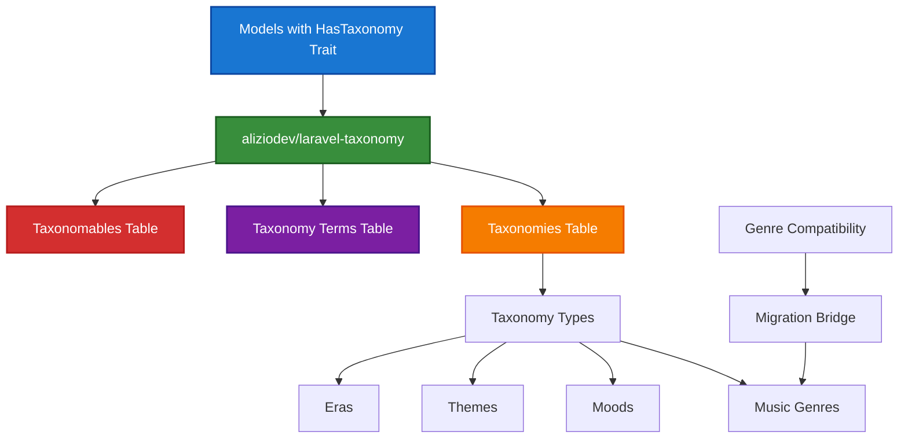

# 9. Taxonomy Integration Guide

> **Refactored from:** `.ai/guides/chinook/filament/models/060-categorizable-trait.md` on 2025-07-11  
> **Focus:** Single taxonomy system using aliziodev/laravel-taxonomy package exclusively

## 9.1. Table of Contents

- [9.2. Overview](#92-overview)
- [10. Single Taxonomy System](#10-single-taxonomy-system)
  - [10.1. Package Integration](#101-package-integration)
- [11. Taxonomy Architecture](#11-taxonomy-architecture)
  - [11.1. Hierarchical Structure](#111-hierarchical-structure)
- [12. Genre Preservation Strategy](#12-genre-preservation-strategy)
  - [12.1. Compatibility Layer](#121-compatibility-layer)
- [13. Query Scopes and Filters](#13-query-scopes-and-filters)
  - [13.1. Basic Filtering](#131-basic-filtering)

## 9.2. Overview

This guide covers the **single taxonomy system implementation** for Laravel 12 models in the Chinook application using the `aliziodev/laravel-taxonomy` package exclusively. The system provides standardized taxonomy support with complete Genre data preservation through a compatibility layer.

### 9.2.1. Key Features

- **Single Taxonomy System**: Uses only `aliziodev/laravel-taxonomy` package
- **Genre Preservation**: Complete backward compatibility with existing Genre data
- **Polymorphic Taxonomies**: Flexible taxonomy system for multiple model types
- **Hierarchical Support**: Tree-structured taxonomies with parent-child relationships
- **Type Classification**: String-based taxonomy types (genre, mood, theme, era, instrument, language, occasion)
- **Query Scopes**: Advanced filtering and search capabilities
- **Performance Optimized**: Closure table pattern for efficient hierarchical queries

### 9.2.2. Architecture Overview



## 10. Single Taxonomy System

### 10.1. Package Integration

**Installation and Setup:**

```bash
# Install the taxonomy package
composer require aliziodev/laravel-taxonomy

# Publish and run migrations
php artisan vendor:publish --provider="Aliziodev\LaravelTaxonomy\TaxonomyServiceProvider"
php artisan migrate
```

**Package Configuration:**

```php
// config/taxonomy.php
return [
    'models' => [
        'taxonomy' => \Aliziodev\LaravelTaxonomy\Models\Taxonomy::class,
        'term' => \Aliziodev\LaravelTaxonomy\Models\TaxonomyTerm::class,
    ],
    
    'table_names' => [
        'taxonomies' => 'taxonomies',
        'terms' => 'taxonomy_terms',
        'taxonomables' => 'taxonomables',
    ],
    
    'cache' => [
        'enabled' => true,
        'ttl' => 3600,
        'prefix' => 'taxonomy',
    ],
];
```

### 10.2. HasTaxonomy Trait

**Basic Trait Implementation:**

```php
<?php

namespace App\Models;

use Aliziodev\LaravelTaxonomy\Traits\HasTaxonomy;
use Aliziodev\LaravelTaxonomy\Models\Taxonomy;
use Aliziodev\LaravelTaxonomy\Models\TaxonomyTerm;
use Illuminate\Database\Eloquent\Model;

class Track extends Model
{
    use HasTaxonomy;

    protected $table = 'chinook_tracks';

    protected $fillable = [
        'name',
        'album_id',
        'media_type_id',
        'composer',
        'milliseconds',
        'bytes',
        'unit_price',
    ];

    protected function casts(): array
    {
        return [
            'milliseconds' => 'integer',
            'bytes' => 'integer',
            'unit_price' => 'decimal:2',
            'created_at' => 'datetime',
            'updated_at' => 'datetime',
        ];
    }

    // Taxonomy methods are automatically available:
    // $track->taxonomies
    // $track->attachTaxonomy($taxonomy, $term)
    // $track->detachTaxonomy($taxonomy, $term)
    // $track->syncTaxonomies($taxonomies)
}
```

### 10.3. Model Implementation

**Extended Model with Taxonomy Helpers:**

```php
class Track extends Model
{
    use HasTaxonomy;

    /**
     * Get genres for this track.
     */
    public function getGenres()
    {
        return $this->taxonomies()
            ->whereHas('taxonomy', function ($query) {
                $query->where('slug', 'music-genres');
            })
            ->with('term')
            ->get()
            ->pluck('term.name');
    }

    /**
     * Get all taxonomy types for this track.
     */
    public function getTaxonomyTypes(): array
    {
        return $this->taxonomies()
            ->with('taxonomy')
            ->get()
            ->groupBy('taxonomy.slug')
            ->keys()
            ->toArray();
    }

    /**
     * Get taxonomy summary for display.
     */
    public function getTaxonomySummary(): array
    {
        return $this->taxonomies()
            ->with(['taxonomy', 'term'])
            ->get()
            ->groupBy('taxonomy.name')
            ->map(function ($items) {
                return $items->pluck('term.name')->toArray();
            })
            ->toArray();
    }

    /**
     * Assign a genre to this track.
     */
    public function assignGenre(string $genreName): void
    {
        $genreTaxonomy = Taxonomy::where('slug', 'music-genres')->first();
        
        if (!$genreTaxonomy) {
            $genreTaxonomy = Taxonomy::create([
                'name' => 'Music Genres',
                'slug' => 'music-genres',
                'description' => 'Musical genre classifications'
            ]);
        }

        $genreTerm = TaxonomyTerm::firstOrCreate([
            'name' => $genreName,
            'taxonomy_id' => $genreTaxonomy->id
        ], [
            'slug' => \Str::slug($genreName),
            'description' => "Genre: {$genreName}"
        ]);

        $this->attachTaxonomy($genreTaxonomy, $genreTerm);
    }

    /**
     * Assign multiple taxonomies to this track.
     */
    public function assignTaxonomies(array $taxonomyData): void
    {
        foreach ($taxonomyData as $taxonomySlug => $termNames) {
            $taxonomy = Taxonomy::where('slug', $taxonomySlug)->first();
            
            if (!$taxonomy) {
                continue;
            }

            foreach ((array) $termNames as $termName) {
                $term = TaxonomyTerm::firstOrCreate([
                    'name' => $termName,
                    'taxonomy_id' => $taxonomy->id
                ], [
                    'slug' => \Str::slug($termName)
                ]);
                
                $this->attachTaxonomy($taxonomy, $term);
            }
        }
    }
}
```

## 11. Taxonomy Architecture

### 11.1. Hierarchical Structure

**Creating Taxonomy Hierarchies:**

```php
// Create main taxonomy
$musicGenres = Taxonomy::create([
    'name' => 'Music Genres',
    'slug' => 'music-genres',
    'description' => 'Musical genre classifications'
]);

// Create hierarchical terms
$rock = TaxonomyTerm::create([
    'name' => 'Rock',
    'slug' => 'rock',
    'taxonomy_id' => $musicGenres->id
]);

$alternativeRock = TaxonomyTerm::create([
    'name' => 'Alternative Rock',
    'slug' => 'alternative-rock',
    'taxonomy_id' => $musicGenres->id,
    'parent_id' => $rock->id
]);

$indieRock = TaxonomyTerm::create([
    'name' => 'Indie Rock',
    'slug' => 'indie-rock',
    'taxonomy_id' => $musicGenres->id,
    'parent_id' => $alternativeRock->id
]);
```

### 11.2. Polymorphic Relationships

**Multi-Model Taxonomy Assignment:**

```php
// Assign taxonomies to different model types
$track = Track::find(1);
$album = Album::find(1);
$artist = Artist::find(1);

$rockGenre = TaxonomyTerm::where('slug', 'rock')->first();
$energeticMood = TaxonomyTerm::where('slug', 'energetic')->first();

// Assign to track
$track->attachTaxonomy($rockGenre->taxonomy, $rockGenre);
$track->attachTaxonomy($energeticMood->taxonomy, $energeticMood);

// Assign to album
$album->attachTaxonomy($rockGenre->taxonomy, $rockGenre);

// Assign to artist
$artist->attachTaxonomy($rockGenre->taxonomy, $rockGenre);
```

### 11.3. Taxonomy Types

**Standard Taxonomy Types for Chinook:**

```php
// Create standard taxonomy types
$taxonomyTypes = [
    'music-genres' => [
        'name' => 'Music Genres',
        'description' => 'Musical genre classifications',
        'terms' => ['Rock', 'Jazz', 'Classical', 'Blues', 'Pop', 'Electronic', 'Hip-Hop']
    ],
    'moods' => [
        'name' => 'Moods',
        'description' => 'Emotional characteristics of music',
        'terms' => ['Energetic', 'Relaxing', 'Melancholic', 'Uplifting', 'Aggressive', 'Peaceful']
    ],
    'themes' => [
        'name' => 'Themes',
        'description' => 'Thematic content of music',
        'terms' => ['Love', 'Freedom', 'Social Commentary', 'Nature', 'Spirituality', 'Party']
    ],
    'eras' => [
        'name' => 'Musical Eras',
        'description' => 'Historical periods of music',
        'terms' => ['Classical Period', 'Romantic Era', 'Modern Era', 'Contemporary']
    ]
];

foreach ($taxonomyTypes as $slug => $data) {
    $taxonomy = Taxonomy::create([
        'name' => $data['name'],
        'slug' => $slug,
        'description' => $data['description']
    ]);

    foreach ($data['terms'] as $termName) {
        TaxonomyTerm::create([
            'name' => $termName,
            'slug' => \Str::slug($termName),
            'taxonomy_id' => $taxonomy->id
        ]);
    }
}
```

## 12. Genre Preservation Strategy

### 12.1. Compatibility Layer

**Genre Bridge Model:**

```php
<?php

namespace App\Models;

use Aliziodev\LaravelTaxonomy\Models\Taxonomy;
use Aliziodev\LaravelTaxonomy\Models\TaxonomyTerm;
use Illuminate\Database\Eloquent\Model;

class Genre extends Model
{
    protected $table = 'chinook_genres';

    protected $fillable = ['name'];

    /**
     * Get the corresponding taxonomy term.
     */
    public function getTaxonomyTerm(): ?TaxonomyTerm
    {
        $genreTaxonomy = Taxonomy::where('slug', 'music-genres')->first();

        if (!$genreTaxonomy) {
            return null;
        }

        return TaxonomyTerm::where('name', $this->name)
            ->where('taxonomy_id', $genreTaxonomy->id)
            ->first();
    }

    /**
     * Migrate this genre to taxonomy system.
     */
    public function migrateToTaxonomy(): TaxonomyTerm
    {
        $genreTaxonomy = Taxonomy::firstOrCreate([
            'slug' => 'music-genres'
        ], [
            'name' => 'Music Genres',
            'description' => 'Musical genre classifications'
        ]);

        return TaxonomyTerm::firstOrCreate([
            'name' => $this->name,
            'taxonomy_id' => $genreTaxonomy->id
        ], [
            'slug' => \Str::slug($this->name),
            'description' => "Genre: {$this->name}"
        ]);
    }

    /**
     * Get all tracks with this genre.
     */
    public function tracks()
    {
        return $this->hasMany(Track::class, 'genre_id');
    }
}
```

### 12.2. Data Migration

**Migration Command:**

```php
<?php

namespace App\Console\Commands;

use App\Models\Genre;
use App\Models\Track;
use Aliziodev\LaravelTaxonomy\Models\Taxonomy;
use Aliziodev\LaravelTaxonomy\Models\TaxonomyTerm;
use Illuminate\Console\Command;

class MigrateGenresToTaxonomy extends Command
{
    protected $signature = 'chinook:migrate-genres';
    protected $description = 'Migrate Genre data to taxonomy system';

    public function handle()
    {
        $this->info('Starting genre migration to taxonomy system...');

        // Create music genres taxonomy
        $genreTaxonomy = Taxonomy::firstOrCreate([
            'slug' => 'music-genres'
        ], [
            'name' => 'Music Genres',
            'description' => 'Musical genre classifications'
        ]);

        $genreCount = 0;
        $trackCount = 0;

        // Migrate each genre
        foreach (Genre::all() as $genre) {
            $this->info("Migrating genre: {$genre->name}");

            // Create taxonomy term
            $term = $genre->migrateToTaxonomy();
            $genreCount++;

            // Migrate tracks
            foreach ($genre->tracks as $track) {
                $track->attachTaxonomy($genreTaxonomy, $term);
                $trackCount++;
            }
        }

        $this->info("Migration completed!");
        $this->info("Migrated {$genreCount} genres and {$trackCount} track assignments.");
    }
}
```

### 12.3. Bridge Methods

**Backward Compatibility Methods:**

```php
// Add to Track model
class Track extends Model
{
    use HasTaxonomy;

    /**
     * Get genre (backward compatibility).
     */
    public function genre()
    {
        // Return first genre taxonomy term as genre
        $genreTerm = $this->taxonomies()
            ->whereHas('taxonomy', function ($query) {
                $query->where('slug', 'music-genres');
            })
            ->with('term')
            ->first();

        return $genreTerm ? $genreTerm->term : null;
    }

    /**
     * Get genre ID (backward compatibility).
     */
    public function getGenreIdAttribute(): ?int
    {
        $genre = $this->genre();
        return $genre ? $genre->id : null;
    }

    /**
     * Set genre (backward compatibility).
     */
    public function setGenreAttribute($value): void
    {
        if (is_string($value)) {
            $this->assignGenre($value);
        } elseif (is_object($value) && isset($value->name)) {
            $this->assignGenre($value->name);
        }
    }
}
```

## 13. Query Scopes and Filters

### 13.1. Basic Filtering

**Taxonomy Query Scopes:**

```php
// Add to models with HasTaxonomy trait
class Track extends Model
{
    use HasTaxonomy;

    /**
     * Scope to filter by taxonomy.
     */
    public function scopeWithTaxonomy($query, string $taxonomySlug, string $termName = null)
    {
        return $query->whereHas('taxonomies', function ($q) use ($taxonomySlug, $termName) {
            $q->whereHas('taxonomy', function ($taxonomyQuery) use ($taxonomySlug) {
                $taxonomyQuery->where('slug', $taxonomySlug);
            });

            if ($termName) {
                $q->whereHas('term', function ($termQuery) use ($termName) {
                    $termQuery->where('name', $termName);
                });
            }
        });
    }

    /**
     * Scope to filter by genre (backward compatibility).
     */
    public function scopeWithGenre($query, string $genreName)
    {
        return $query->withTaxonomy('music-genres', $genreName);
    }

    /**
     * Scope to filter by mood.
     */
    public function scopeWithMood($query, string $moodName)
    {
        return $query->withTaxonomy('moods', $moodName);
    }

    /**
     * Scope to filter by theme.
     */
    public function scopeWithTheme($query, string $themeName)
    {
        return $query->withTaxonomy('themes', $themeName);
    }
}
```

### 13.2. Advanced Queries

**Complex Taxonomy Filtering:**

```php
// Multiple taxonomy filters (AND logic)
$tracks = Track::withTaxonomy('music-genres', 'Rock')
    ->withTaxonomy('moods', 'Energetic')
    ->withTaxonomy('eras', 'Modern Era')
    ->get();

// Any of multiple taxonomies (OR logic)
$tracks = Track::whereHas('taxonomies', function ($query) {
    $query->where(function ($subQuery) {
        $subQuery->whereHas('taxonomy', function ($q) {
            $q->where('slug', 'music-genres');
        })->whereHas('term', function ($q) {
            $q->where('name', 'Rock');
        });
    })->orWhere(function ($subQuery) {
        $subQuery->whereHas('taxonomy', function ($q) {
            $q->where('slug', 'music-genres');
        })->whereHas('term', function ($q) {
            $q->where('name', 'Jazz');
        });
    });
})->get();

// Taxonomy hierarchy filtering
$tracks = Track::whereHas('taxonomies', function ($query) {
    $query->whereHas('term', function ($termQuery) {
        $termQuery->where('name', 'Alternative Rock')
            ->orWhereHas('descendants', function ($descendantQuery) {
                $descendantQuery->where('name', 'Alternative Rock');
            });
    });
})->get();
```

---

## Navigation

**Previous:** User Stamps *(Documentation pending)* | **Index:** [Models Index](000-models-index.md) | **Next:** Model Factories *(Documentation pending)*

---

**Documentation Standards**: This document follows WCAG 2.1 AA accessibility guidelines and uses Laravel 12 modern syntax patterns.

[⬆️ Back to Top](#9-taxonomy-integration-guide)
