# 1. Filament Advanced Features Documentation

> **Refactored from:** `.ai/guides/chinook/filament/features/000-features-index.md` on 2025-07-11  
> **Focus:** Single taxonomy system using aliziodev/laravel-taxonomy package exclusively

## 1.1. Documentation Structure

### 1.1.1. Dashboard & Widgets
1. **Dashboard Configuration** - Main dashboard setup and layout *(Documentation pending)*
2. **Widget Development** - Custom widgets and KPI cards *(Documentation pending)*
3. **Chart Integration** - Chart.js integration and data visualization *(Documentation pending)*
4. **Real-time Updates** - Live data updates and notifications *(Documentation pending)*

### 1.1.2. Advanced Functionality
1. **Global Search** - Cross-resource search implementation with taxonomy integration *(Documentation pending)*

### 1.1.3. Form & Table Enhancements
1. **Advanced Forms** - Complex form components and validation *(Documentation pending)*
2. **Table Features** - Advanced table functionality and filtering *(Documentation pending)*
3. **Bulk Operations** - Mass operations and batch processing *(Documentation pending)*
4. **Relationship Management** - Complex relationship handling *(Documentation pending)*

### 1.1.4. Integration Features
1. **[Media Library](../../060-chinook-media-library-guide.md)** - File management and media handling
2. **[Activity Logging](../../packages/160-spatie-activitylog-guide.md)** - Audit trails and user activity tracking
3. **[Taxonomy Analytics](../../packages/110-aliziodev-laravel-taxonomy-guide.md)** - **Taxonomy-based analytics and reporting**

## 1.2. Feature Architecture

### 1.2.1. Widget System

The Chinook admin panel implements a comprehensive widget system for real-time analytics and KPI monitoring with **single taxonomy system integration**:

```mermaid
graph TD
    A[Dashboard] --> B[Revenue Widgets]
    A --> C[Music Analytics]
    A --> D[Customer Metrics]
    A --> E[Performance KPIs]
    
    B --> B1[Total Revenue]
    B --> B2[Monthly Growth]
    B --> B3[Revenue by Country]
    
    C --> C1[Top Tracks]
    C --> C2[Popular Artists]
    C --> C3[Taxonomy Distribution]
    C --> C4[Genre Analytics]
    C --> C5[Mood Trends]
    
    D --> D1[Customer Growth]
    D --> D2[Purchase Patterns]
    D --> D3[Geographic Distribution]
    
    E --> E1[System Performance]
    E --> E2[User Activity]
    E --> E3[Taxonomy Usage]
    
    style A fill:#1976d2,stroke:#0d47a1,stroke-width:2px,color:#ffffff
    style C fill:#388e3c,stroke:#1b5e20,stroke-width:2px,color:#ffffff
    style C3 fill:#f57c00,stroke:#e65100,stroke-width:2px,color:#ffffff
    style C4 fill:#1976d2,stroke:#0d47a1,stroke-width:2px,color:#ffffff
    style E3 fill:#d32f2f,stroke:#b71c1c,stroke-width:2px,color:#ffffff
```



### 1.2.2. Taxonomy-Powered Analytics

**Single Taxonomy System Benefits:**
- **Unified Analytics**: Consistent taxonomy-based reporting across all entities
- **Multi-Dimensional Analysis**: Genre, mood, theme, and era analytics
- **Performance Optimization**: Efficient queries using closure table architecture
- **Real-time Updates**: Live taxonomy distribution and trend analysis

**Key Analytics Features:**
```php
// Taxonomy distribution widget
class TaxonomyDistributionWidget extends ChartWidget
{
    protected static ?string $heading = 'Music Genre Distribution';
    
    protected function getData(): array
    {
        $genreTaxonomy = Taxonomy::where('slug', 'music-genres')->first();
        
        $data = TaxonomyTerm::where('taxonomy_id', $genreTaxonomy->id)
            ->withCount(['taxonomables as track_count' => function ($query) {
                $query->where('taxonomable_type', Track::class);
            }])
            ->orderBy('track_count', 'desc')
            ->limit(10)
            ->get();
            
        return [
            'datasets' => [
                [
                    'label' => 'Tracks by Genre',
                    'data' => $data->pluck('track_count'),
                    'backgroundColor' => [
                        '#1976d2', '#388e3c', '#f57c00', '#d32f2f',
                        '#7b1fa2', '#00796b', '#5d4037', '#455a64'
                    ],
                ],
            ],
            'labels' => $data->pluck('name'),
        ];
    }
    
    protected function getType(): string
    {
        return 'doughnut';
    }
}
```

### 1.2.3. Advanced Search Integration

**Taxonomy-Enhanced Global Search:**
```php
// Global search with taxonomy integration
public static function getGlobalSearchEloquentQuery(): Builder
{
    return parent::getGlobalSearchEloquentQuery()
        ->with(['taxonomies.taxonomy', 'taxonomies.term']);
}

public static function getGloballySearchableAttributes(): array
{
    return [
        'name', 
        'composer', 
        'album.title', 
        'album.artist.name',
        'taxonomies.name' // Search by taxonomy terms
    ];
}

public static function getGlobalSearchResultDetails(Model $record): array
{
    $genres = $record->taxonomies()
        ->whereHas('taxonomy', function ($q) {
            $q->where('slug', 'music-genres');
        })
        ->pluck('name')
        ->take(3)
        ->join(', ');
        
    return [
        'Album' => $record->album?->title,
        'Artist' => $record->album?->artist?->name,
        'Genres' => $genres ?: 'No genres assigned',
        'Duration' => gmdate('i:s', intval($record->milliseconds / 1000)),
    ];
}
```

## 1.3. Dashboard Configuration

### 1.3.1. Widget Layout

**Taxonomy-Focused Dashboard:**
```php
class ChinookAdminPanelProvider extends PanelProvider
{
    public function panel(Panel $panel): Panel
    {
        return $panel
            ->widgets([
                // Revenue widgets
                Widgets\RevenueOverviewWidget::class,
                Widgets\MonthlyGrowthWidget::class,
                
                // Taxonomy analytics
                Widgets\TaxonomyDistributionWidget::class,
                Widgets\GenreTrendsWidget::class,
                Widgets\MoodAnalyticsWidget::class,
                
                // Performance metrics
                Widgets\TopTracksWidget::class,
                Widgets\PopularArtistsWidget::class,
                Widgets\CustomerMetricsWidget::class,
            ])
            ->widgetSort([
                'revenue-overview' => 1,
                'taxonomy-distribution' => 2,
                'genre-trends' => 3,
                'top-tracks' => 4,
            ]);
    }
}
```

### 1.3.2. Real-time Updates

**Live Taxonomy Analytics:**
```php
// Real-time taxonomy updates
class TaxonomyTrendsWidget extends ChartWidget implements HasLiveUpdates
{
    protected static ?string $pollingInterval = '30s';
    
    protected function getData(): array
    {
        $recentTracks = Track::with(['taxonomies.taxonomy', 'taxonomies.term'])
            ->where('created_at', '>=', now()->subDays(30))
            ->get();
            
        $genreTrends = $recentTracks
            ->flatMap(function ($track) {
                return $track->taxonomies()
                    ->whereHas('taxonomy', function ($q) {
                        $q->where('slug', 'music-genres');
                    })
                    ->get();
            })
            ->groupBy('name')
            ->map->count()
            ->sortDesc()
            ->take(10);
            
        return [
            'datasets' => [
                [
                    'label' => 'New Tracks by Genre (Last 30 Days)',
                    'data' => $genreTrends->values(),
                    'borderColor' => '#1976d2',
                    'backgroundColor' => 'rgba(25, 118, 210, 0.1)',
                ],
            ],
            'labels' => $genreTrends->keys(),
        ];
    }
}
```

## 1.4. Advanced Widget Development

### 1.4.1. Custom Taxonomy Widgets

**Multi-Taxonomy Analytics Widget:**
```php
class MultiTaxonomyAnalyticsWidget extends Widget
{
    protected static string $view = 'filament.widgets.multi-taxonomy-analytics';
    
    public function getTaxonomyData(): array
    {
        $taxonomies = ['music-genres', 'moods', 'themes', 'musical-eras'];
        $data = [];
        
        foreach ($taxonomies as $taxonomySlug) {
            $taxonomy = Taxonomy::where('slug', $taxonomySlug)->first();
            
            if ($taxonomy) {
                $data[$taxonomy->name] = [
                    'total_terms' => $taxonomy->terms()->count(),
                    'used_terms' => $taxonomy->terms()
                        ->whereHas('taxonomables')
                        ->count(),
                    'total_assignments' => DB::table('taxonomables')
                        ->whereIn('taxonomy_term_id', $taxonomy->terms()->pluck('id'))
                        ->count(),
                ];
            }
        }
        
        return $data;
    }
}
```

### 1.4.2. Performance Metrics

**Taxonomy Performance Widget:**
```php
class TaxonomyPerformanceWidget extends StatsOverviewWidget
{
    protected function getStats(): array
    {
        $totalTaxonomies = Taxonomy::count();
        $totalTerms = TaxonomyTerm::count();
        $totalAssignments = DB::table('taxonomables')->count();
        
        $avgTermsPerTaxonomy = $totalTaxonomies > 0 
            ? round($totalTerms / $totalTaxonomies, 1) 
            : 0;
            
        return [
            Stat::make('Total Taxonomies', $totalTaxonomies)
                ->description('Active taxonomy types')
                ->descriptionIcon('heroicon-m-tag')
                ->color('success'),
                
            Stat::make('Total Terms', $totalTerms)
                ->description('Available taxonomy terms')
                ->descriptionIcon('heroicon-m-squares-2x2')
                ->color('info'),
                
            Stat::make('Total Assignments', $totalAssignments)
                ->description('Taxonomy-entity relationships')
                ->descriptionIcon('heroicon-m-link')
                ->color('warning'),
                
            Stat::make('Avg Terms/Taxonomy', $avgTermsPerTaxonomy)
                ->description('Average terms per taxonomy')
                ->descriptionIcon('heroicon-m-calculator')
                ->color('primary'),
        ];
    }
}
```

## 1.5. Chart Integration

### 1.5.1. Taxonomy Distribution Charts

**Genre Distribution Pie Chart:**
```php
class GenreDistributionChart extends ChartWidget
{
    protected static ?string $heading = 'Music Genre Distribution';
    protected static ?int $sort = 2;
    
    protected function getData(): array
    {
        $genreData = Track::query()
            ->join('taxonomables', function ($join) {
                $join->on('chinook_tracks.id', '=', 'taxonomables.taxonomable_id')
                     ->where('taxonomables.taxonomable_type', Track::class);
            })
            ->join('taxonomy_terms', 'taxonomables.taxonomy_term_id', '=', 'taxonomy_terms.id')
            ->join('taxonomies', 'taxonomy_terms.taxonomy_id', '=', 'taxonomies.id')
            ->where('taxonomies.slug', 'music-genres')
            ->select('taxonomy_terms.name', DB::raw('count(*) as track_count'))
            ->groupBy('taxonomy_terms.id', 'taxonomy_terms.name')
            ->orderBy('track_count', 'desc')
            ->limit(8)
            ->get();
            
        return [
            'datasets' => [
                [
                    'data' => $genreData->pluck('track_count'),
                    'backgroundColor' => [
                        '#1976d2', '#388e3c', '#f57c00', '#d32f2f',
                        '#7b1fa2', '#00796b', '#5d4037', '#455a64'
                    ],
                ],
            ],
            'labels' => $genreData->pluck('name'),
        ];
    }
    
    protected function getType(): string
    {
        return 'doughnut';
    }
    
    protected function getOptions(): array
    {
        return [
            'plugins' => [
                'legend' => [
                    'display' => true,
                    'position' => 'bottom',
                ],
            ],
        ];
    }
}
```

### 1.5.2. Trend Analysis Charts

**Taxonomy Trends Over Time:**
```php
class TaxonomyTrendsChart extends ChartWidget
{
    protected static ?string $heading = 'Genre Trends (Last 12 Months)';
    
    protected function getData(): array
    {
        $months = collect(range(11, 0))->map(function ($monthsAgo) {
            return now()->subMonths($monthsAgo);
        });
        
        $topGenres = TaxonomyTerm::whereHas('taxonomy', function ($q) {
                $q->where('slug', 'music-genres');
            })
            ->withCount('taxonomables')
            ->orderBy('taxonomables_count', 'desc')
            ->limit(5)
            ->get();
            
        $datasets = $topGenres->map(function ($genre, $index) use ($months) {
            $colors = ['#1976d2', '#388e3c', '#f57c00', '#d32f2f', '#7b1fa2'];
            
            $monthlyData = $months->map(function ($month) use ($genre) {
                return $genre->taxonomables()
                    ->where('taxonomable_type', Track::class)
                    ->whereHas('taxonomable', function ($q) use ($month) {
                        $q->whereYear('created_at', $month->year)
                          ->whereMonth('created_at', $month->month);
                    })
                    ->count();
            });
            
            return [
                'label' => $genre->name,
                'data' => $monthlyData->values(),
                'borderColor' => $colors[$index],
                'backgroundColor' => $colors[$index] . '20',
                'tension' => 0.4,
            ];
        });
        
        return [
            'datasets' => $datasets->toArray(),
            'labels' => $months->map(fn ($month) => $month->format('M Y'))->toArray(),
        ];
    }
    
    protected function getType(): string
    {
        return 'line';
    }
}
```

---

## Navigation

**Index:** [Filament Documentation](../000-filament-index.md) | **Next:** Dashboard Configuration *(Documentation pending)*

---

**Documentation Standards**: This document follows WCAG 2.1 AA accessibility guidelines and uses Laravel 12 modern syntax patterns.

[⬆️ Back to Top](#1-filament-advanced-features-documentation)
