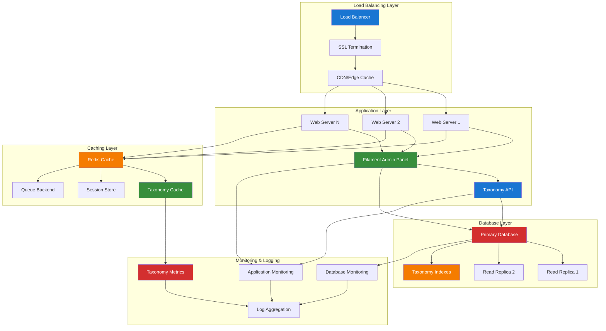

# 1. Filament Deployment Documentation

**Refactored from:** `.ai/guides/chinook/filament/deployment/000-deployment-index.md` on 2025-07-13  
**Purpose:** Comprehensive deployment guides for Chinook admin panel with taxonomy integration  
**Scope:** Production optimization, server configuration, monitoring, and maintenance strategies

## 1.1 Table of Contents

- [1.1 Table of Contents](#11-table-of-contents)
- [1.2 Overview](#12-overview)
- [1.3 Documentation Structure](#13-documentation-structure)
- [1.4 Deployment Architecture](#14-deployment-architecture)
- [1.5 Taxonomy-Specific Deployment Considerations](#15-taxonomy-specific-deployment-considerations)
- [1.6 Performance Optimization](#16-performance-optimization)
- [1.7 Security Hardening](#17-security-hardening)
- [1.8 Monitoring & Maintenance](#18-monitoring--maintenance)
- [1.9 Deployment Automation](#19-deployment-automation)
- [1.10 Best Practices](#110-best-practices)

## 1.2 Overview

This directory contains comprehensive deployment guides for the Chinook admin panel, covering production optimization, server configuration, monitoring, and maintenance strategies with comprehensive taxonomy integration using aliziodev/laravel-taxonomy.

### 1.2.1 Deployment Philosophy

Our deployment approach emphasizes:

- **Scalability**: Horizontal and vertical scaling for taxonomy-heavy workloads
- **Performance**: Optimized taxonomy query performance and caching strategies
- **Security**: Comprehensive security measures for taxonomy data protection
- **Reliability**: High availability and disaster recovery for taxonomy operations
- **Maintainability**: Automated deployment and monitoring for taxonomy systems

### 1.2.2 Taxonomy Integration Benefits

- **Optimized Taxonomy Queries**: Database indexing and query optimization for taxonomy relationships
- **Taxonomy Caching**: Advanced caching strategies for taxonomy hierarchies and relationships
- **Performance Monitoring**: Specialized monitoring for taxonomy query performance
- **Backup Strategies**: Comprehensive backup solutions for taxonomy data integrity
- **Scaling Considerations**: Horizontal scaling strategies for taxonomy-heavy applications

## 1.3 Documentation Structure

### 1.3.1 Production Setup with Taxonomy Optimization
1. **Production Environment** - Server requirements and environment configuration with taxonomy support *(Documentation pending)*
2. **Server Configuration** - Web server, PHP, and database setup optimized for taxonomy operations *(Documentation pending)*
3. **Security Hardening** - Production security measures with taxonomy data protection *(Documentation pending)*
4. **SSL Configuration** - HTTPS setup and certificate management for secure taxonomy operations *(Documentation pending)*

### 1.3.2 Performance Optimization for Taxonomy Operations
1. **Performance Optimization** - Caching, optimization, and tuning for taxonomy queries *(Documentation pending)*
2. **Database Optimization** - Database performance and indexing for taxonomy relationships *(Documentation pending)*
3. **Asset Optimization** - Frontend asset optimization and CDN setup for taxonomy interfaces *(Documentation pending)*
4. **Caching Strategy** - Comprehensive caching implementation for taxonomy hierarchies *(Documentation pending)*

### 1.3.3 Monitoring & Maintenance for Taxonomy Systems
1. **Monitoring Setup** - Application and server monitoring with taxonomy metrics *(Documentation pending)*
2. **Logging Configuration** - Centralized logging and error tracking for taxonomy operations *(Documentation pending)*
3. **Backup Strategy** - Data backup and disaster recovery for taxonomy data *(Documentation pending)*
4. **Maintenance Procedures** - Regular maintenance and updates for taxonomy systems *(Documentation pending)*

### 1.3.4 Deployment Automation with Taxonomy Validation
1. **CI/CD Pipeline** - Automated deployment and testing with taxonomy validation *(Documentation pending)*
2. **Docker Deployment** - Containerized deployment strategies for taxonomy applications *(Documentation pending)*
3. **Scaling Strategies** - Horizontal and vertical scaling approaches for taxonomy workloads *(Documentation pending)*

## 1.4 Deployment Architecture

### 1.4.1 Production Infrastructure with Taxonomy Optimization



### 1.4.2 Taxonomy-Specific Architecture Components

1. **Taxonomy Cache Layer**
   - Dedicated Redis instances for taxonomy hierarchies
   - Optimized cache invalidation strategies
   - Taxonomy relationship caching
   - Hierarchy traversal optimization

2. **Database Optimization**
   - Specialized indexes for taxonomy queries
   - Optimized table structures for hierarchy operations
   - Read replicas for taxonomy-heavy read operations
   - Connection pooling for taxonomy queries

3. **Application Layer**
   - Taxonomy-aware load balancing
   - Optimized taxonomy query routing
   - Taxonomy data validation and sanitization
   - Performance monitoring for taxonomy operations

## 1.5 Taxonomy-Specific Deployment Considerations

### 1.5.1 Database Schema Optimization

```sql
-- Optimized indexes for taxonomy operations
CREATE INDEX idx_taxonomies_type_parent ON taxonomies(type, parent_id);
CREATE INDEX idx_taxonomies_name_type ON taxonomies(name, type);
CREATE INDEX idx_taxonomy_models_model ON taxonomy_models(model_type, model_id);
CREATE INDEX idx_taxonomy_models_taxonomy ON taxonomy_models(taxonomy_id);

-- Composite indexes for common queries
CREATE INDEX idx_taxonomies_hierarchy ON taxonomies(parent_id, type, name);
CREATE INDEX idx_taxonomy_relationships ON taxonomy_models(taxonomy_id, model_type);
```

### 1.5.2 Caching Strategy for Taxonomy Operations

```php
<?php

// config/cache.php - Taxonomy-specific cache configuration
return [
    'stores' => [
        'taxonomy' => [
            'driver' => 'redis',
            'connection' => 'taxonomy',
            'prefix' => env('CACHE_PREFIX', 'chinook') . ':taxonomy',
            'serializer' => 'igbinary',
        ],
        'taxonomy_hierarchy' => [
            'driver' => 'redis',
            'connection' => 'taxonomy',
            'prefix' => env('CACHE_PREFIX', 'chinook') . ':hierarchy',
            'serializer' => 'igbinary',
        ],
    ],
    
    'taxonomy' => [
        'default_ttl' => 3600, // 1 hour
        'hierarchy_ttl' => 7200, // 2 hours
        'relationship_ttl' => 1800, // 30 minutes
        'invalidation_strategy' => 'tag_based',
    ],
];
```

### 1.5.3 Performance Monitoring for Taxonomy Operations

```php
<?php

// config/monitoring.php - Taxonomy performance monitoring
return [
    'taxonomy_metrics' => [
        'query_performance' => [
            'slow_query_threshold' => 100, // milliseconds
            'monitor_hierarchy_queries' => true,
            'monitor_relationship_queries' => true,
        ],
        'cache_performance' => [
            'hit_ratio_threshold' => 0.85,
            'monitor_taxonomy_cache' => true,
            'monitor_hierarchy_cache' => true,
        ],
        'database_performance' => [
            'connection_pool_monitoring' => true,
            'index_usage_monitoring' => true,
            'taxonomy_table_monitoring' => true,
        ],
    ],
];
```

## 1.6 Performance Optimization

### 1.6.1 Taxonomy Query Optimization

- **Eager Loading**: Optimize taxonomy relationship loading
- **Query Caching**: Cache frequently accessed taxonomy queries
- **Index Optimization**: Specialized indexes for taxonomy operations
- **Connection Pooling**: Optimize database connections for taxonomy queries

### 1.6.2 Caching Strategies

- **Hierarchy Caching**: Cache complete taxonomy hierarchies
- **Relationship Caching**: Cache model-taxonomy relationships
- **Query Result Caching**: Cache taxonomy query results
- **Tag-Based Invalidation**: Efficient cache invalidation for taxonomy updates

## 1.7 Security Hardening

### 1.7.1 Taxonomy Data Protection

- **Access Control**: Role-based access to taxonomy operations
- **Data Validation**: Comprehensive validation for taxonomy inputs
- **SQL Injection Prevention**: Parameterized queries for taxonomy operations
- **XSS Protection**: Sanitization of taxonomy display data

### 1.7.2 API Security

- **Authentication**: Secure API access for taxonomy operations
- **Rate Limiting**: Prevent abuse of taxonomy API endpoints
- **Input Validation**: Comprehensive validation for taxonomy API inputs
- **Audit Logging**: Track all taxonomy data modifications

## 1.8 Monitoring & Maintenance

### 1.8.1 Taxonomy System Monitoring

- **Performance Metrics**: Monitor taxonomy query performance
- **Cache Effectiveness**: Track taxonomy cache hit ratios
- **Database Health**: Monitor taxonomy table performance
- **Error Tracking**: Track taxonomy-related errors and exceptions

### 1.8.2 Maintenance Procedures

- **Regular Optimization**: Periodic taxonomy query optimization
- **Cache Warming**: Preload frequently accessed taxonomy data
- **Index Maintenance**: Regular taxonomy index optimization
- **Data Integrity**: Periodic taxonomy relationship validation

## 1.9 Deployment Automation

### 1.9.1 CI/CD Pipeline with Taxonomy Validation

- **Automated Testing**: Comprehensive taxonomy operation testing
- **Database Migrations**: Automated taxonomy schema updates
- **Cache Warming**: Automated taxonomy cache preloading
- **Performance Testing**: Automated taxonomy performance validation

### 1.9.2 Container Orchestration

- **Docker Containers**: Containerized taxonomy applications
- **Kubernetes Deployment**: Orchestrated taxonomy service deployment
- **Service Mesh**: Microservice communication for taxonomy operations
- **Auto-scaling**: Dynamic scaling based on taxonomy workload

## 1.10 Best Practices

### 1.10.1 Deployment Guidelines

1. **Environment Consistency**: Maintain consistent taxonomy configurations across environments
2. **Performance Testing**: Comprehensive taxonomy performance testing before deployment
3. **Rollback Strategy**: Quick rollback procedures for taxonomy-related issues
4. **Monitoring Setup**: Comprehensive monitoring for taxonomy operations

### 1.10.2 Maintenance Guidelines

1. **Regular Updates**: Keep taxonomy packages and dependencies updated
2. **Performance Monitoring**: Continuous monitoring of taxonomy query performance
3. **Backup Verification**: Regular verification of taxonomy data backups
4. **Security Audits**: Regular security audits for taxonomy data access

This comprehensive deployment documentation provides the foundation for robust, scalable production deployment with comprehensive taxonomy integration and modern Laravel 12 patterns.

---

## Navigation

**Previous:** [Filament Index](../000-filament-index.md)  
**Next:** [Deployment Guide](010-deployment-guide.md)
**Up:** [Filament Documentation](../000-filament-index.md)  
**Home:** [Chinook Documentation](../../README.md)

[⬆️ Back to Top](#1-filament-deployment-documentation)
