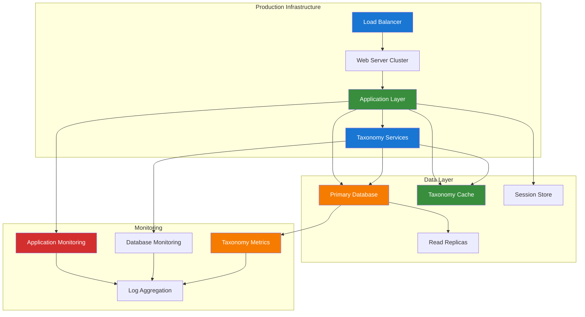

# 2. Comprehensive Deployment Guide

**Refactored from:** `.ai/guides/chinook/filament/deployment/010-deployment-guide.md` on 2025-07-13  
**Purpose:** Production deployment strategies for Chinook Filament application with taxonomy integration  
**Scope:** Docker containerization, cloud deployment, performance optimization, and taxonomy-specific configurations

## 2.1 Table of Contents

- [2.1 Table of Contents](#21-table-of-contents)
- [2.2 Overview](#22-overview)
- [2.3 Production Environment Setup](#23-production-environment-setup)
- [2.4 Docker Deployment](#24-docker-deployment)
- [2.5 Cloud Deployment Options](#25-cloud-deployment-options)
- [2.12 Taxonomy-Specific Deployment](#212-taxonomy-specific-deployment)

## 2.2 Overview

This comprehensive deployment guide covers production deployment strategies for the Chinook Filament application, including Docker containerization, cloud deployment, performance optimization, and comprehensive taxonomy integration using aliziodev/laravel-taxonomy.

### 2.2.1 Deployment Architecture



## 2.3 Production Environment Setup

### 2.3.1 Server Requirements with Taxonomy Optimization

**Minimum Requirements:**
- PHP 8.3+ with taxonomy-optimized extensions
- Node.js 18+ for asset compilation
- SQLite 3.35+ with WAL mode and taxonomy indexes
- Redis 6.0+ for taxonomy caching
- Nginx 1.20+ with taxonomy-aware routing

**Recommended Production Setup:**
- 4 CPU cores (8+ for taxonomy-heavy workloads)
- 8GB RAM (16GB+ for large taxonomy datasets)
- 100GB SSD storage with taxonomy index optimization
- Load balancer with taxonomy-aware session affinity
- Dedicated Redis instance for taxonomy caching

### 2.3.2 Environment Configuration with Taxonomy Support

```bash
# .env.production
APP_NAME="Chinook Music Database"
APP_ENV=production
APP_KEY=base64:your-production-key
APP_DEBUG=false
APP_URL=https://your-domain.com

# Database with taxonomy optimization
DB_CONNECTION=sqlite
DB_DATABASE=/var/www/html/database/production.sqlite
DB_FOREIGN_KEYS=true
DB_WAL_MODE=true
DB_SYNCHRONOUS=NORMAL
DB_CACHE_SIZE=10000
DB_TEMP_STORE=MEMORY

# Taxonomy-specific database settings
TAXONOMY_CACHE_ENABLED=true
TAXONOMY_CACHE_TTL=3600
TAXONOMY_HIERARCHY_CACHE_TTL=7200
TAXONOMY_RELATIONSHIP_CACHE_TTL=1800

# Cache configuration for taxonomy
CACHE_DRIVER=redis
SESSION_DRIVER=redis
QUEUE_CONNECTION=redis
TAXONOMY_CACHE_STORE=taxonomy

# Redis with taxonomy-specific configuration
REDIS_HOST=127.0.0.1
REDIS_PASSWORD=your-redis-password
REDIS_PORT=6379
REDIS_TAXONOMY_DB=1
REDIS_HIERARCHY_DB=2

# Performance optimization
OCTANE_SERVER=frankenphp
OCTANE_HTTPS=true
OCTANE_WORKERS=4
OCTANE_TASK_WORKERS=2

# Taxonomy performance settings
TAXONOMY_EAGER_LOADING=true
TAXONOMY_QUERY_CACHE=true
TAXONOMY_INDEX_OPTIMIZATION=true

# Monitoring and logging
LOG_CHANNEL=stack
LOG_LEVEL=error
TAXONOMY_LOG_QUERIES=false
TAXONOMY_LOG_PERFORMANCE=true

# Security
TAXONOMY_VALIDATION_STRICT=true
TAXONOMY_XSS_PROTECTION=true
TAXONOMY_SQL_INJECTION_PROTECTION=true
```

## 2.4 Docker Deployment

### 2.4.1 Enhanced Dockerfile with Taxonomy Support

```dockerfile
# Dockerfile
FROM dunglas/frankenphp:1-php8.3

# Install system dependencies for taxonomy operations
RUN apt-get update && apt-get install -y \
    git \
    curl \
    libpng-dev \
    libonig-dev \
    libxml2-dev \
    zip \
    unzip \
    sqlite3 \
    redis-tools \
    htop \
    nano \
    && docker-php-ext-install pdo_sqlite mbstring exif pcntl bcmath gd \
    && docker-php-ext-enable opcache

# Install Composer
COPY --from=composer:latest /usr/bin/composer /usr/bin/composer

# Set working directory
WORKDIR /app

# Copy composer files for dependency caching
COPY composer.json composer.lock ./

# Install PHP dependencies with taxonomy packages
RUN composer install --no-dev --optimize-autoloader --no-scripts

# Copy application code
COPY . .

# Set permissions for taxonomy cache and storage
RUN chown -R www-data:www-data /app/storage /app/bootstrap/cache \
    && chmod -R 775 /app/storage /app/bootstrap/cache

# Create taxonomy-specific directories
RUN mkdir -p /app/storage/taxonomy-cache \
    && chown -R www-data:www-data /app/storage/taxonomy-cache \
    && chmod -R 775 /app/storage/taxonomy-cache

# Optimize for production with taxonomy considerations
RUN php artisan config:cache \
    && php artisan route:cache \
    && php artisan view:cache \
    && php artisan taxonomy:cache-hierarchies

# Install Node.js dependencies and build assets
RUN npm ci --only=production \
    && npm run build \
    && rm -rf node_modules

# Configure FrankenPHP for taxonomy operations
COPY docker/frankenphp/Caddyfile /etc/caddy/Caddyfile

# Health check with taxonomy validation
HEALTHCHECK --interval=30s --timeout=10s --start-period=5s --retries=3 \
    CMD curl -f http://localhost/health || exit 1

EXPOSE 80 443

CMD ["frankenphp", "run", "--config", "/etc/caddy/Caddyfile"]
```

### 2.4.2 Docker Compose with Taxonomy Services

```yaml
# docker-compose.yml
version: '3.8'

services:
  app:
    build: .
    ports:
      - "80:80"
      - "443:443"
    environment:
      - APP_ENV=production
      - DB_CONNECTION=sqlite
      - CACHE_DRIVER=redis
      - REDIS_HOST=redis
      - TAXONOMY_CACHE_ENABLED=true
    volumes:
      - ./database:/app/database
      - ./storage:/app/storage
      - taxonomy-cache:/app/storage/taxonomy-cache
    depends_on:
      - redis
    networks:
      - chinook-network

  redis:
    image: redis:7-alpine
    command: redis-server --appendonly yes --maxmemory 512mb --maxmemory-policy allkeys-lru
    volumes:
      - redis-data:/data
      - ./docker/redis/redis.conf:/usr/local/etc/redis/redis.conf
    ports:
      - "6379:6379"
    networks:
      - chinook-network

  redis-taxonomy:
    image: redis:7-alpine
    command: redis-server --appendonly yes --maxmemory 256mb --maxmemory-policy allkeys-lru
    volumes:
      - redis-taxonomy-data:/data
    ports:
      - "6380:6379"
    networks:
      - chinook-network

  monitoring:
    image: prom/prometheus:latest
    ports:
      - "9090:9090"
    volumes:
      - ./docker/prometheus/prometheus.yml:/etc/prometheus/prometheus.yml
      - prometheus-data:/prometheus
    networks:
      - chinook-network

volumes:
  redis-data:
  redis-taxonomy-data:
  taxonomy-cache:
  prometheus-data:

networks:
  chinook-network:
    driver: bridge
```

### 2.4.3 Taxonomy-Optimized Redis Configuration

```conf
# docker/redis/redis.conf
# Memory optimization for taxonomy caching
maxmemory 512mb
maxmemory-policy allkeys-lru

# Persistence for taxonomy data
save 900 1
save 300 10
save 60 10000

# Network optimization
tcp-keepalive 300
timeout 0

# Taxonomy-specific optimizations
hash-max-ziplist-entries 512
hash-max-ziplist-value 64
list-max-ziplist-size -2
set-max-intset-entries 512

# Logging
loglevel notice
logfile /var/log/redis/redis-server.log

# Security
requirepass your-redis-password
```

## 2.5 Cloud Deployment Options

### 2.5.1 AWS Deployment with Taxonomy Optimization

```yaml
# aws-deployment.yml
AWSTemplateFormatVersion: '2010-09-09'
Description: 'Chinook Filament Application with Taxonomy Support'

Parameters:
  InstanceType:
    Type: String
    Default: t3.medium
    Description: EC2 instance type optimized for taxonomy operations

Resources:
  ChinookVPC:
    Type: AWS::EC2::VPC
    Properties:
      CidrBlock: 10.0.0.0/16
      EnableDnsHostnames: true
      EnableDnsSupport: true

  ChinookSubnet:
    Type: AWS::EC2::Subnet
    Properties:
      VpcId: !Ref ChinookVPC
      CidrBlock: 10.0.1.0/24
      AvailabilityZone: !Select [0, !GetAZs '']

  ChinookSecurityGroup:
    Type: AWS::EC2::SecurityGroup
    Properties:
      GroupDescription: Security group for Chinook application
      VpcId: !Ref ChinookVPC
      SecurityGroupIngress:
        - IpProtocol: tcp
          FromPort: 80
          ToPort: 80
          CidrIp: 0.0.0.0/0
        - IpProtocol: tcp
          FromPort: 443
          ToPort: 443
          CidrIp: 0.0.0.0/0

  ChinookInstance:
    Type: AWS::EC2::Instance
    Properties:
      InstanceType: !Ref InstanceType
      ImageId: ami-0c02fb55956c7d316  # Amazon Linux 2
      SubnetId: !Ref ChinookSubnet
      SecurityGroupIds:
        - !Ref ChinookSecurityGroup
      UserData:
        Fn::Base64: !Sub |
          #!/bin/bash
          yum update -y
          yum install -y docker
          service docker start
          usermod -a -G docker ec2-user

          # Install Docker Compose
          curl -L "https://github.com/docker/compose/releases/latest/download/docker-compose-$(uname -s)-$(uname -m)" -o /usr/local/bin/docker-compose
          chmod +x /usr/local/bin/docker-compose

          # Deploy Chinook application
          git clone https://github.com/your-repo/chinook-app.git /opt/chinook
          cd /opt/chinook
          docker-compose up -d

  ElastiCacheSubnetGroup:
    Type: AWS::ElastiCache::SubnetGroup
    Properties:
      Description: Subnet group for taxonomy cache
      SubnetIds:
        - !Ref ChinookSubnet

  TaxonomyCache:
    Type: AWS::ElastiCache::CacheCluster
    Properties:
      CacheNodeType: cache.t3.micro
      Engine: redis
      NumCacheNodes: 1
      CacheSubnetGroupName: !Ref ElastiCacheSubnetGroup
      VpcSecurityGroupIds:
        - !Ref ChinookSecurityGroup
```

### 2.5.2 Kubernetes Deployment with Taxonomy Services

```yaml
# k8s-deployment.yml
apiVersion: apps/v1
kind: Deployment
metadata:
  name: chinook-app
  labels:
    app: chinook
spec:
  replicas: 3
  selector:
    matchLabels:
      app: chinook
  template:
    metadata:
      labels:
        app: chinook
    spec:
      containers:
      - name: chinook
        image: your-registry/chinook:latest
        ports:
        - containerPort: 80
        env:
        - name: APP_ENV
          value: "production"
        - name: REDIS_HOST
          value: "redis-service"
        - name: TAXONOMY_CACHE_ENABLED
          value: "true"
        resources:
          requests:
            memory: "512Mi"
            cpu: "250m"
          limits:
            memory: "1Gi"
            cpu: "500m"
        livenessProbe:
          httpGet:
            path: /health
            port: 80
          initialDelaySeconds: 30
          periodSeconds: 10
        readinessProbe:
          httpGet:
            path: /ready
            port: 80
          initialDelaySeconds: 5
          periodSeconds: 5

---
apiVersion: v1
kind: Service
metadata:
  name: chinook-service
spec:
  selector:
    app: chinook
  ports:
  - protocol: TCP
    port: 80
    targetPort: 80
  type: LoadBalancer

---
apiVersion: apps/v1
kind: Deployment
metadata:
  name: redis-taxonomy
spec:
  replicas: 1
  selector:
    matchLabels:
      app: redis-taxonomy
  template:
    metadata:
      labels:
        app: redis-taxonomy
    spec:
      containers:
      - name: redis
        image: redis:7-alpine
        ports:
        - containerPort: 6379
        resources:
          requests:
            memory: "256Mi"
            cpu: "100m"
          limits:
            memory: "512Mi"
            cpu: "200m"

---
apiVersion: v1
kind: Service
metadata:
  name: redis-service
spec:
  selector:
    app: redis-taxonomy
  ports:
  - protocol: TCP
    port: 6379
    targetPort: 6379
```

## 2.12 Taxonomy-Specific Deployment

### 2.12.1 Taxonomy Database Optimization

```sql
-- Production database optimization for taxonomy operations
PRAGMA journal_mode = WAL;
PRAGMA synchronous = NORMAL;
PRAGMA cache_size = 10000;
PRAGMA temp_store = MEMORY;
PRAGMA mmap_size = 268435456; -- 256MB

-- Taxonomy-specific indexes for production
CREATE INDEX IF NOT EXISTS idx_taxonomies_type_parent_name ON taxonomies(type, parent_id, name);
CREATE INDEX IF NOT EXISTS idx_taxonomies_hierarchy_path ON taxonomies(parent_id, id);
CREATE INDEX IF NOT EXISTS idx_taxonomy_models_composite ON taxonomy_models(taxonomy_id, model_type, model_id);
CREATE INDEX IF NOT EXISTS idx_taxonomy_models_reverse ON taxonomy_models(model_type, model_id, taxonomy_id);

-- Performance optimization for hierarchy queries
CREATE INDEX IF NOT EXISTS idx_taxonomies_depth_calculation ON taxonomies(parent_id) WHERE parent_id IS NOT NULL;
CREATE INDEX IF NOT EXISTS idx_taxonomies_root_nodes ON taxonomies(type, id) WHERE parent_id IS NULL;

-- Analyze tables for query optimization
ANALYZE taxonomies;
ANALYZE taxonomy_models;
```

### 2.12.2 Taxonomy Cache Warming Strategy

```php
<?php

// app/Console/Commands/WarmTaxonomyCache.php
namespace App\Console\Commands;

use Illuminate\Console\Command;
use Aliziodev\LaravelTaxonomy\Models\Taxonomy;
use Illuminate\Support\Facades\Cache;

class WarmTaxonomyCache extends Command
{
    protected $signature = 'taxonomy:warm-cache {--type=* : Taxonomy types to warm}';
    protected $description = 'Warm taxonomy cache for production deployment';

    public function handle(): int
    {
        $this->info('Warming taxonomy cache...');

        $types = $this->option('type') ?: ['genre', 'artist_type', 'album_type', 'track_type'];

        foreach ($types as $type) {
            $this->warmTaxonomyType($type);
        }

        $this->info('Taxonomy cache warming completed!');
        return 0;
    }

    private function warmTaxonomyType(string $type): void
    {
        $this->line("Warming cache for type: {$type}");

        // Cache all taxonomies of this type
        $taxonomies = Taxonomy::where('type', $type)->get();
        Cache::store('taxonomy')->put("taxonomies.{$type}", $taxonomies, 3600);

        // Cache hierarchy tree
        $hierarchyTree = $this->buildHierarchyTree($taxonomies);
        Cache::store('taxonomy_hierarchy')->put("hierarchy.{$type}", $hierarchyTree, 7200);

        // Cache root nodes
        $rootNodes = $taxonomies->whereNull('parent_id');
        Cache::store('taxonomy')->put("roots.{$type}", $rootNodes, 3600);

        $this->line("  - Cached {$taxonomies->count()} taxonomies");
        $this->line("  - Cached hierarchy tree");
        $this->line("  - Cached {$rootNodes->count()} root nodes");
    }

    private function buildHierarchyTree($taxonomies): array
    {
        $tree = [];
        $lookup = [];

        foreach ($taxonomies as $taxonomy) {
            $lookup[$taxonomy->id] = $taxonomy->toArray();
            $lookup[$taxonomy->id]['children'] = [];
        }

        foreach ($lookup as $id => $item) {
            if ($item['parent_id']) {
                if (isset($lookup[$item['parent_id']])) {
                    $lookup[$item['parent_id']]['children'][] = &$lookup[$id];
                }
            } else {
                $tree[] = &$lookup[$id];
            }
        }

        return $tree;
    }
}
```

This comprehensive deployment guide provides the foundation for robust, scalable production deployment with comprehensive taxonomy integration and modern containerization strategies.

---

## Navigation

**Previous:** [Deployment Index](000-deployment-index.md)
**Next:** Production Environment *(Documentation pending)*
**Up:** [Deployment Documentation](000-deployment-index.md)
**Home:** [Chinook Documentation](../../README.md)

[⬆️ Back to Top](#2-comprehensive-deployment-guide)
