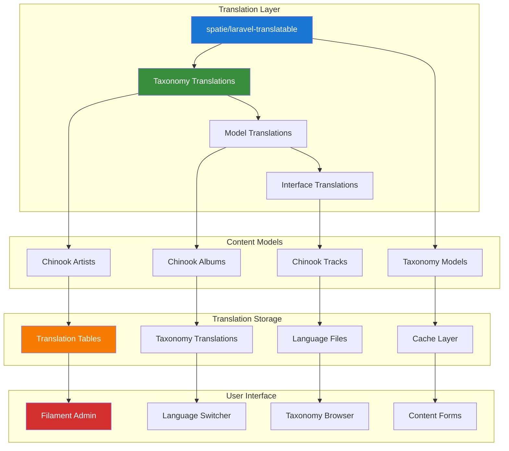

# 1. Filament Internationalization Documentation Index

**Refactored from:** `.ai/guides/chinook/filament/internationalization/000-internationalization-index.md` on 2025-07-13  
**Purpose:** Comprehensive internationalization (i18n) for Chinook Filament admin panel with taxonomy integration  
**Scope:** Multi-language support using spatie/laravel-translatable and modern Laravel 12 patterns

## 1.1 Table of Contents

- [1.1 Table of Contents](#11-table-of-contents)
- [1.2 Overview](#12-overview)
- [1.3 Supported Languages](#13-supported-languages)
- [1.4 Integration Features](#14-integration-features)
- [1.5 Core Implementation](#15-core-implementation)
- [1.6 Taxonomy Internationalization](#16-taxonomy-internationalization)
- [1.7 Advanced Features](#17-advanced-features)
- [1.8 Implementation Standards](#18-implementation-standards)
- [1.9 Performance Optimization](#19-performance-optimization)
- [1.10 Best Practices](#110-best-practices)

## 1.2 Overview

The Chinook admin panel supports comprehensive internationalization, enabling multi-language content management for global music catalogs, localized user interfaces, and comprehensive taxonomy translation using aliziodev/laravel-taxonomy with spatie/laravel-translatable integration.

### 1.2.1 Internationalization Philosophy

Our i18n approach emphasizes:

- **Comprehensive Translation**: Full translation support for content, interface, and taxonomy data
- **Taxonomy Localization**: Multi-language taxonomy names and descriptions
- **Cultural Adaptation**: Locale-specific formatting for dates, numbers, and currency
- **Accessibility**: WCAG 2.1 AA compliant multi-language interfaces
- **Performance**: Optimized translation loading and caching strategies

## 1.3 Supported Languages

### 1.3.1 Primary Languages with Taxonomy Support
- **English (en)**: Default language with complete taxonomy translations
- **Spanish (es)**: Full translation including music genre taxonomies
- **French (fr)**: Complete localization with cultural music categories
- **German (de)**: Full translation with classical music taxonomy emphasis

### 1.3.2 Extended Language Support
- **Portuguese (pt)**: Brazilian and European variants with regional music taxonomies
- **Italian (it)**: Complete translation with opera and classical focus
- **Japanese (ja)**: Full Unicode support with J-Pop and traditional music taxonomies
- **Chinese (zh)**: Simplified and Traditional variants with regional music categories

### 1.3.3 RTL Language Support
- **Arabic (ar)**: Right-to-left layout with Middle Eastern music taxonomies
- **Hebrew (he)**: RTL support with Jewish and Israeli music categories

### 1.3.4 Custom Locale Configuration
- **Configurable Locales**: Support for additional languages and regional variants
- **Taxonomy Translation**: Custom taxonomy translations for specific markets
- **Cultural Adaptation**: Locale-specific music categorization and terminology

## 1.4 Integration Features

### 1.4.1 Model Translations with Taxonomy Support
- **Translatable Fields**: Multi-language support for all music-related content
- **Taxonomy Translations**: Localized taxonomy names and descriptions
- **Hierarchy Localization**: Translated taxonomy hierarchy structures
- **Metadata Translation**: Localized taxonomy metadata and attributes

### 1.4.2 Admin Interface Localization
- **Filament Components**: Localized Filament resources and components
- **Taxonomy Management**: Multi-language taxonomy administration interface
- **Navigation Translation**: Localized menu items and navigation elements
- **Form Localization**: Translated form labels, placeholders, and validation messages

### 1.4.3 Dynamic Language Features
- **Real-time Switching**: Language switching without page reload
- **Taxonomy Context**: Language-aware taxonomy filtering and display
- **User Preferences**: Per-user language preferences with taxonomy localization
- **Fallback Strategies**: Graceful fallback for missing translations

## 1.5 Core Implementation

### 1.5.1 Model Translations Architecture



### 1.5.2 Taxonomy Translation Implementation

```php
<?php

// Example: Translatable Taxonomy Model
namespace App\Models;

use Aliziodev\LaravelTaxonomy\Models\Taxonomy as BaseTaxonomy;
use Spatie\Translatable\HasTranslations;

class Taxonomy extends BaseTaxonomy
{
    use HasTranslations;

    protected array $translatable = [
        'name',
        'description',
        'meta->display_name',
        'meta->short_description',
    ];

    protected function casts(): array
    {
        return [
            'meta' => 'array',
            'created_at' => 'datetime',
            'updated_at' => 'datetime',
        ];
    }

    /**
     * Get localized taxonomy name with fallback
     */
    public function getLocalizedName(string $locale = null): string
    {
        $locale = $locale ?? app()->getLocale();
        
        return $this->getTranslation('name', $locale) 
            ?? $this->getTranslation('name', config('app.fallback_locale'))
            ?? $this->name;
    }

    /**
     * Get localized taxonomy hierarchy path
     */
    public function getLocalizedPath(string $locale = null, string $separator = ' > '): string
    {
        $path = [];
        $current = $this;

        while ($current) {
            array_unshift($path, $current->getLocalizedName($locale));
            $current = $current->parent;
        }

        return implode($separator, $path);
    }
}
```

## 1.6 Taxonomy Internationalization

### 1.6.1 Taxonomy Translation Strategies

1. **Direct Translation**: Translate taxonomy names and descriptions directly
2. **Cultural Adaptation**: Adapt taxonomies for cultural and regional differences
3. **Hierarchical Translation**: Maintain taxonomy hierarchy across languages
4. **Metadata Localization**: Translate taxonomy metadata and attributes

### 1.6.2 Multi-Language Taxonomy Management

```php
<?php

// Filament Resource for Taxonomy Translation Management
namespace App\Filament\Resources;

use Filament\Forms;
use Filament\Resources\Resource;
use Filament\Tables;
use App\Models\Taxonomy;

class TaxonomyResource extends Resource
{
    protected static ?string $model = Taxonomy::class;
    protected static ?string $navigationIcon = 'heroicon-o-tag';

    public static function form(Forms\Form $form): Forms\Form
    {
        return $form->schema([
            Forms\Components\Select::make('type')
                ->options([
                    'genre' => __('taxonomy.types.genre'),
                    'artist_type' => __('taxonomy.types.artist_type'),
                    'album_type' => __('taxonomy.types.album_type'),
                ])
                ->required(),

            Forms\Components\Select::make('parent_id')
                ->relationship('parent', 'name')
                ->searchable()
                ->preload()
                ->label(__('taxonomy.fields.parent')),

            // Translatable name field
            Forms\Components\Tabs::make('translations')
                ->tabs([
                    Forms\Components\Tabs\Tab::make(__('languages.english'))
                        ->schema([
                            Forms\Components\TextInput::make('name.en')
                                ->label(__('taxonomy.fields.name'))
                                ->required(),
                            Forms\Components\Textarea::make('description.en')
                                ->label(__('taxonomy.fields.description')),
                        ]),
                    Forms\Components\Tabs\Tab::make(__('languages.spanish'))
                        ->schema([
                            Forms\Components\TextInput::make('name.es')
                                ->label(__('taxonomy.fields.name')),
                            Forms\Components\Textarea::make('description.es')
                                ->label(__('taxonomy.fields.description')),
                        ]),
                    Forms\Components\Tabs\Tab::make(__('languages.french'))
                        ->schema([
                            Forms\Components\TextInput::make('name.fr')
                                ->label(__('taxonomy.fields.name')),
                            Forms\Components\Textarea::make('description.fr')
                                ->label(__('taxonomy.fields.description')),
                        ]),
                ]),
        ]);
    }

    public static function table(Tables\Table $table): Tables\Table
    {
        return $table
            ->columns([
                Tables\Columns\TextColumn::make('type')
                    ->badge()
                    ->formatStateUsing(fn($state) => __("taxonomy.types.{$state}")),
                Tables\Columns\TextColumn::make('name')
                    ->formatStateUsing(fn($record) => $record->getLocalizedName()),
                Tables\Columns\TextColumn::make('parent.name')
                    ->formatStateUsing(fn($record) => $record->parent?->getLocalizedName()),
                Tables\Columns\TextColumn::make('models_count')
                    ->counts('models')
                    ->label(__('taxonomy.fields.usage_count')),
            ])
            ->filters([
                Tables\Filters\SelectFilter::make('type')
                    ->options([
                        'genre' => __('taxonomy.types.genre'),
                        'artist_type' => __('taxonomy.types.artist_type'),
                        'album_type' => __('taxonomy.types.album_type'),
                    ]),
            ]);
    }
}
```

## 1.7 Advanced Features

### 1.7.1 Dynamic Language Switching with Taxonomy Context
- **Context-Aware Switching**: Maintain taxonomy context when switching languages
- **URL Localization**: Localized URLs with taxonomy slug translation
- **Search Localization**: Multi-language taxonomy search and filtering
- **Breadcrumb Translation**: Localized taxonomy hierarchy breadcrumbs

### 1.7.2 Translation Management Tools
- **Translation Editor**: Built-in interface for managing taxonomy translations
- **Bulk Translation**: Mass translation tools for taxonomy hierarchies
- **Translation Validation**: Validation rules for taxonomy translation completeness
- **Import/Export**: Translation import/export for taxonomy data

### 1.7.3 Fallback Strategies for Taxonomy
- **Hierarchical Fallback**: Fall back to parent taxonomy translations
- **Language Fallback**: Fall back to default language for missing translations
- **Smart Fallback**: Intelligent fallback based on language similarity
- **Custom Fallback**: Configurable fallback strategies for specific taxonomies

## 1.8 Implementation Standards

### 1.8.1 Laravel 12 Patterns with Taxonomy
- **Modern Syntax**: Use Laravel 12 casts() method and modern patterns
- **Taxonomy Integration**: Seamless integration with aliziodev/laravel-taxonomy
- **Performance Optimization**: Efficient translation loading and caching
- **Type Safety**: Strong typing for translation methods and taxonomy operations

### 1.8.2 WCAG 2.1 AA Compliance for Multi-Language
- **Language Identification**: Proper lang attributes for translated content
- **Direction Support**: RTL language support for Arabic and Hebrew
- **Keyboard Navigation**: Accessible language switching controls
- **Screen Reader Support**: Proper announcements for language changes

## 1.9 Performance Optimization

### 1.9.1 Translation Caching Strategies
- **Taxonomy Translation Cache**: Cache frequently accessed taxonomy translations
- **Hierarchy Cache**: Cache translated taxonomy hierarchies
- **Lazy Loading**: Load translations only when needed
- **Preloading**: Preload common taxonomy translations

### 1.9.2 Database Optimization
- **Translation Indexes**: Optimized indexes for translation queries
- **Query Optimization**: Efficient queries for translated taxonomy data
- **Eager Loading**: Optimize translation loading with relationships
- **Connection Pooling**: Optimize database connections for translation queries

## 1.10 Best Practices

### 1.10.1 Translation Guidelines
1. **Consistency**: Maintain consistent terminology across all translations
2. **Cultural Sensitivity**: Adapt content for cultural and regional differences
3. **Taxonomy Accuracy**: Ensure accurate translation of music-related terminology
4. **Quality Assurance**: Regular review and validation of translations

### 1.10.2 Maintenance Guidelines
1. **Regular Updates**: Keep translations current with content changes
2. **Community Contribution**: Enable community-driven translation improvements
3. **Automated Testing**: Test translation functionality across all supported languages
4. **Performance Monitoring**: Monitor translation performance and optimization

This comprehensive internationalization documentation provides the foundation for robust multi-language support with comprehensive taxonomy integration and modern Laravel 12 patterns.

---

## Navigation

**Previous:** [Filament Index](../000-filament-index.md)  
**Next:** [Translatable Models Setup](010-translatable-models-setup.md)  
**Up:** [Filament Documentation](../000-filament-index.md)  
**Home:** [Chinook Documentation](../../README.md)

[⬆️ Back to Top](#1-filament-internationalization-documentation-index)
