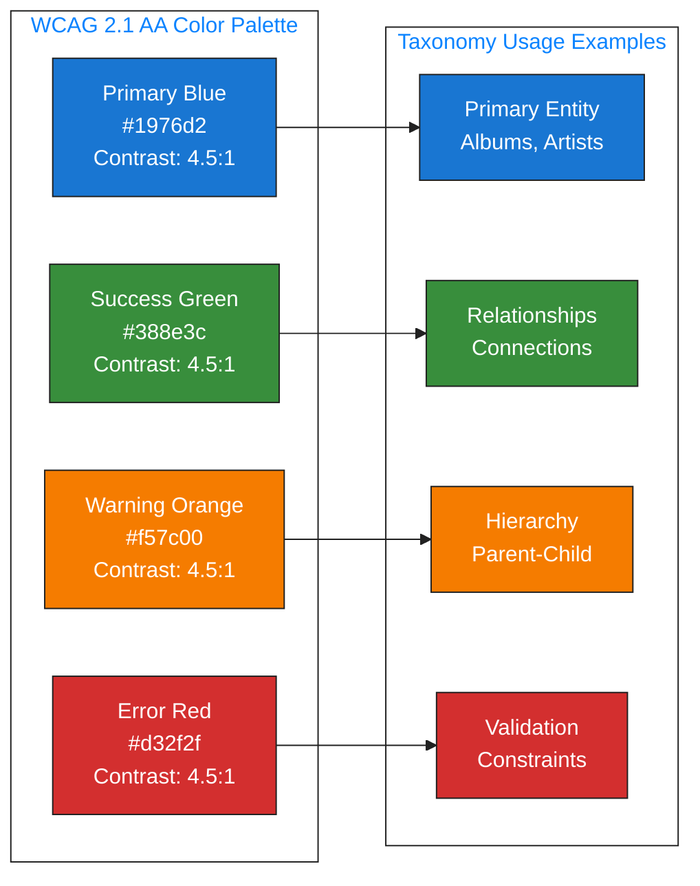
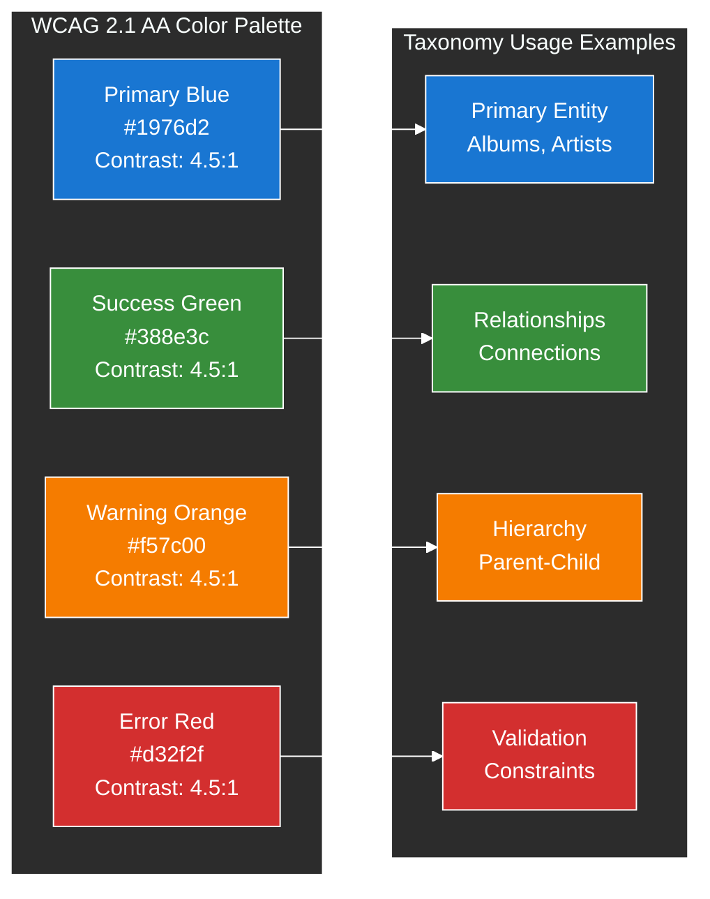
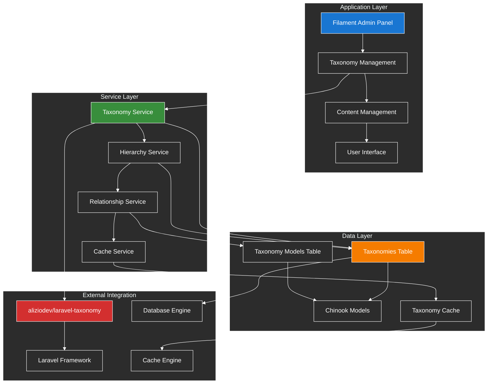
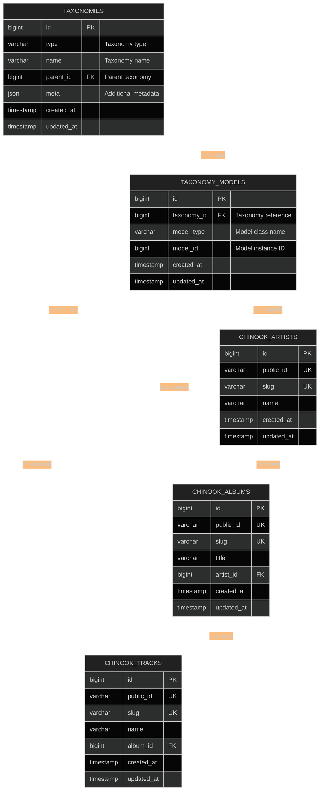
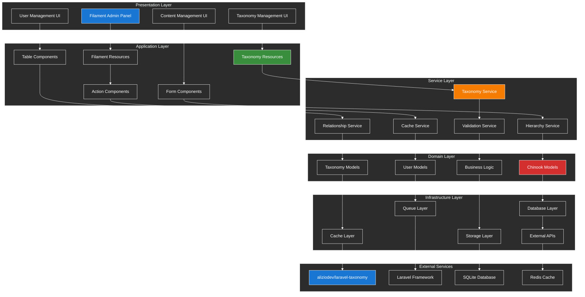
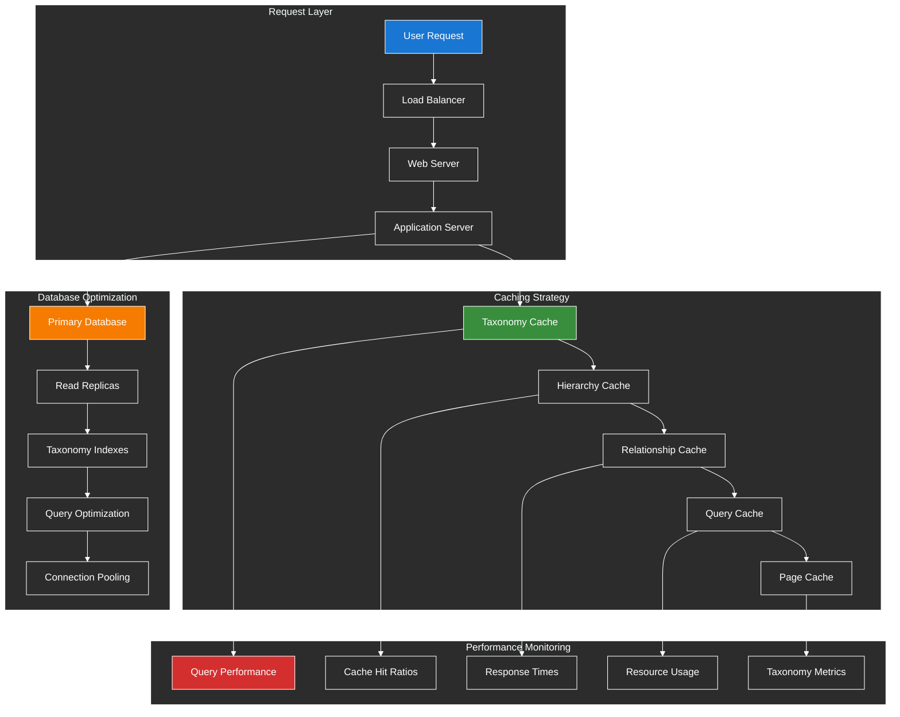
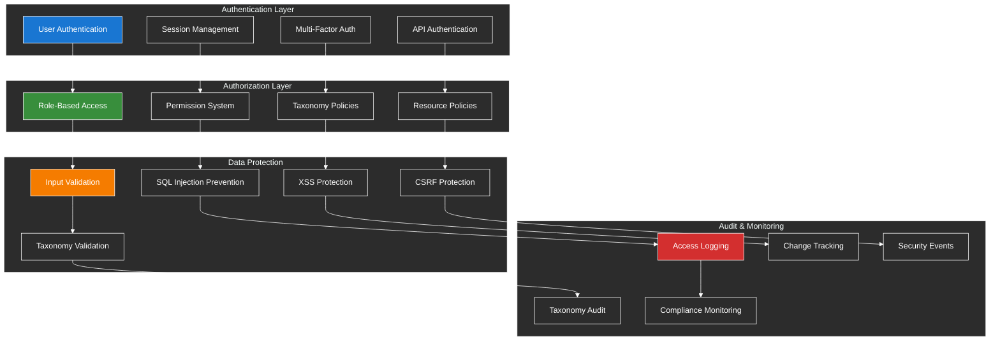

# 1. Visual Documentation & Diagrams

**Refactored from:** `.ai/guides/chinook/filament/diagrams/000-diagrams-index.md` on 2025-07-13  
**Purpose:** Comprehensive visual documentation for Chinook Filament 4 admin panel with taxonomy integration  
**Scope:** Mermaid v10.6+ ERDs, DBML schema files, and accessibility-compliant diagrams with WCAG 2.1 AA compliance

## 1.1 Table of Contents

- [1.1 Table of Contents](#11-table-of-contents)
- [1.2 Overview](#12-overview)
- [1.3 Documentation Structure](#13-documentation-structure)
- [1.4 WCAG 2.1 AA Compliance](#14-wcag-21-aa-compliance)
- [1.5 Taxonomy Integration Architecture](#15-taxonomy-integration-architecture)
- [1.6 Entity Relationship Diagram](#16-entity-relationship-diagram)
- [1.7 System Architecture Overview](#17-system-architecture-overview)
- [1.8 Performance Architecture](#18-performance-architecture)
- [1.9 Security Architecture](#19-security-architecture)
- [1.10 Best Practices](#110-best-practices)

## 1.2 Overview

This directory contains comprehensive visual documentation for the Chinook Filament 4 admin panel, including Mermaid v10.6+ ERDs, DBML schema files, and accessibility-compliant diagrams with WCAG 2.1 AA compliance and comprehensive taxonomy integration using aliziodev/laravel-taxonomy.

### 1.2.1 Visual Documentation Philosophy

Our visual documentation approach emphasizes:

- **Accessibility First**: WCAG 2.1 AA compliant diagrams with proper contrast and semantic structure
- **Taxonomy Integration**: Visual representation of taxonomy relationships and hierarchies
- **Modern Standards**: Mermaid v10.6+ syntax with enhanced features and accessibility
- **Comprehensive Coverage**: Complete system architecture with taxonomy-specific components
- **Performance Focus**: Visual representation of taxonomy query optimization and caching strategies

## 1.3 Documentation Structure

### 1.3.1 Database Diagrams with Taxonomy Integration
1. **[Entity Relationship Diagrams](010-entity-relationship-diagrams.md)** - Complete ERD with Mermaid v10.6+ syntax and taxonomy relationships
2. **Database Schema** - DBML schema files with taxonomy annotations and optimization *(Documentation pending)*
3. **Data Flow Architecture** - Data flow patterns with taxonomy operations *(Documentation pending)*

### 1.3.2 System Architecture with Taxonomy Components
1. **Deployment Architecture** - Production deployment with taxonomy optimization *(Documentation pending)*
2. **System Architecture** - Overall system design with taxonomy services *(Documentation pending)*
3. **Filament Panel Architecture** - Panel structure with taxonomy management *(Documentation pending)*
4. **Performance Optimization Architecture** - Performance patterns with taxonomy caching *(Documentation pending)*

## 1.4 WCAG 2.1 AA Compliance

All visual documentation follows WCAG 2.1 AA accessibility guidelines with taxonomy-specific considerations:

### 1.4.1 Color Contrast Requirements
- **Text Contrast**: Minimum 4.5:1 ratio for normal text in taxonomy diagrams
- **Large Text Contrast**: Minimum 3:1 ratio for large text (18pt+ or 14pt+ bold) in taxonomy labels
- **Non-text Contrast**: Minimum 3:1 ratio for taxonomy UI components and graphics
- **Color Independence**: Taxonomy relationships not conveyed by color alone

### 1.4.2 Accessibility Features for Taxonomy Diagrams
- **Screen Reader Support**: All taxonomy diagrams include descriptive alt text
- **Keyboard Navigation**: Interactive taxonomy elements are keyboard accessible
- **Focus Indicators**: Clear focus indicators for taxonomy interactive elements
- **Semantic Structure**: Proper heading hierarchy and semantic markup for taxonomy documentation

### 1.4.3 High-Contrast Color Palette for Taxonomy Diagrams

This section demonstrates the WCAG 2.1 AA compliant color palette for taxonomy diagrams in both light and dark theme implementations. The approved color palette consists of:

- **Primary Blue:** `#1976d2` - Used for primary entities and key components
- **Success Green:** `#388e3c` - Used for relationships and connections
- **Warning Orange:** `#f57c00` - Used for hierarchical structures and warnings
- **Error Red:** `#d32f2f` - Used for validation, constraints, and errors

#### 1.4.3.1 Light Theme Example

The light theme implementation uses a white background (`#ffffff`) with dark text and connecting lines for optimal readability in bright environments or when printing documentation.

#### 1.4.3.2 Dark Theme Example

The dark theme implementation uses a dark background (`#212121`) with white text and connecting lines for optimal accessibility and reduced eye strain in low-light environments. This is the recommended theme for all taxonomy diagrams.

#### 1.4.3.3 Theme Selection Guidelines

**Use Light Theme When:**
- Creating documentation for print media
- Working in bright environments
- Targeting users who prefer light interfaces
- Integrating with light-themed documentation systems

**Use Dark Theme When:**
- Prioritizing accessibility and eye strain reduction
- Working in low-light environments
- Following modern UI/UX best practices
- Creating interactive or screen-based documentation

**Recommended Default:** Dark theme is recommended for all new taxonomy diagrams due to superior accessibility characteristics and better visibility of connecting lines and relationships.

## 1.5 Taxonomy Integration Architecture

### 1.5.1 Taxonomy System Overview

### 1.5.2 Taxonomy Relationship Patterns

## 1.6 Entity Relationship Diagram

### 1.6.1 Complete Chinook Database ERD with Taxonomy Integration

```mermaid
%%{init: {
  'theme': 'dark',
  'themeVariables': {
    'primaryColor': '#1976d2',
    'primaryTextColor': '#ffffff',
    'primaryBorderColor': '#ffffff',
    'lineColor': '#ffffff',
    'sectionBkColor': '#212121',
    'altSectionBkColor': '#2c2c2c',
    'gridColor': '#ffffff',
    'secondaryColor': '#388e3c',
    'tertiaryColor': '#f57c00',
    'background': '#212121',
    'mainBkg': '#212121',
    'secondBkg': '#2c2c2c',
    'tertiaryBkg': '#2c2c2c',
    'entityBkgColor': '#2c2c2c',
    'entityTextColor': '#ffffff',
    'relationLabelColor': '#ffffff',
    'relationLabelBackground': '#212121'
  }
}}%%
erDiagram
    %% Taxonomy System
    TAXONOMIES {
        bigint id PK
        varchar type "genre, artist_type, etc"
        varchar name "Taxonomy name"
        varchar slug "URL-friendly name"
        text description "Optional description"
        bigint parent_id FK "Parent taxonomy"
        json meta "Additional metadata"
        timestamp created_at
        timestamp updated_at
    }
    
    TAXONOMY_MODELS {
        bigint id PK
        bigint taxonomy_id FK
        varchar model_type "Model class name"
        bigint model_id "Model instance ID"
        timestamp created_at
        timestamp updated_at
    }
    
    %% Core Music Entities with Taxonomy Support
    CHINOOK_ARTISTS {
        bigint id PK
        varchar public_id UK "ULID identifier"
        varchar slug UK "URL-friendly identifier"
        varchar name "Artist or band name"
        text biography "Artist background"
        varchar website "Official website"
        json social_links "Social media profiles"
        varchar country "Country of origin"
        int formed_year "Year formed"
        bigint created_by FK "User who created"
        bigint updated_by FK "User who updated"
        timestamp created_at
        timestamp updated_at
        timestamp deleted_at "Soft delete"
    }
    
    CHINOOK_ALBUMS {
        bigint id PK
        varchar public_id UK "ULID identifier"
        varchar slug UK "URL-friendly identifier"
        varchar title "Album title"
        bigint artist_id FK "Primary artist"
        text description "Album description"
        date release_date "Release date"
        varchar label "Record label"
        varchar catalog_number "Catalog number"
        decimal price "Album price"
        varchar cover_art "Cover art URL"
        bigint created_by FK "User who created"
        bigint updated_by FK "User who updated"
        timestamp created_at
        timestamp updated_at
        timestamp deleted_at "Soft delete"
    }
    
    CHINOOK_TRACKS {
        bigint id PK
        varchar public_id UK "ULID identifier"
        varchar slug UK "URL-friendly identifier"
        varchar name "Track name"
        bigint album_id FK "Album reference"
        bigint media_type_id FK "Media type"
        varchar composer "Track composer"
        int milliseconds "Track length"
        int bytes "File size"
        decimal unit_price "Track price"
        int track_number "Position in album"
        int disc_number "Disc number"
        bigint created_by FK "User who created"
        bigint updated_by FK "User who updated"
        timestamp created_at
        timestamp updated_at
        timestamp deleted_at "Soft delete"
    }
    
    %% Taxonomy Relationships
    TAXONOMIES ||--o{ TAXONOMIES : "parent-child hierarchy"
    TAXONOMIES ||--o{ TAXONOMY_MODELS : "has many relationships"
    
    %% Polymorphic Taxonomy Relationships
    TAXONOMY_MODELS }o--|| CHINOOK_ARTISTS : "artist taxonomies"
    TAXONOMY_MODELS }o--|| CHINOOK_ALBUMS : "album taxonomies"
    TAXONOMY_MODELS }o--|| CHINOOK_TRACKS : "track taxonomies"
    
    %% Core Music Relationships
    CHINOOK_ARTISTS ||--o{ CHINOOK_ALBUMS : "artist has albums"
    CHINOOK_ALBUMS ||--o{ CHINOOK_TRACKS : "album has tracks"
```

## 1.7 System Architecture Overview

### 1.7.1 Comprehensive System Architecture with Taxonomy Integration

## 1.8 Performance Architecture

### 1.8.1 Taxonomy Performance Optimization Architecture

## 1.9 Security Architecture

### 1.9.1 Taxonomy Security Architecture

## 1.10 Best Practices

### 1.10.1 Diagram Creation Guidelines

1. **Accessibility Standards**
   - Use WCAG 2.1 AA compliant color palette for all taxonomy diagrams
   - Include descriptive titles and alt text for taxonomy visual elements
   - Ensure proper contrast ratios for taxonomy diagram components
   - Provide text alternatives for taxonomy visual information

2. **Taxonomy Diagram Standards**
   - Use consistent color coding for taxonomy entities and relationships
   - Include clear labels for taxonomy hierarchy levels and types
   - Show taxonomy relationship cardinalities and constraints
   - Document taxonomy validation rules and business logic

3. **Technical Documentation**
   - Use Mermaid v10.6+ syntax for all taxonomy diagrams
   - Include source code comments for complex taxonomy relationships
   - Provide legend and explanation for taxonomy diagram symbols
   - Maintain version control for taxonomy diagram updates

4. **Performance Considerations**
   - Optimize diagram rendering for large taxonomy hierarchies
   - Use progressive disclosure for complex taxonomy relationships
   - Implement lazy loading for taxonomy diagram components
   - Cache rendered taxonomy diagrams for better performance

### 1.10.2 Maintenance Guidelines

1. **Regular Updates**
   - Keep taxonomy diagrams synchronized with database schema changes
   - Update taxonomy relationship diagrams when business rules change
   - Maintain consistency between taxonomy code and visual documentation
   - Review and update taxonomy performance architecture diagrams

2. **Quality Assurance**
   - Validate taxonomy diagram accessibility compliance regularly
   - Test taxonomy diagram rendering across different devices and browsers
   - Verify taxonomy relationship accuracy in visual documentation
   - Ensure taxonomy diagram consistency across all documentation

This comprehensive visual documentation provides the foundation for understanding the Chinook system architecture with comprehensive taxonomy integration and accessibility-compliant diagrams.

---

## Navigation

**Previous:** [Filament Index](../000-filament-index.md)
**Next:** [Entity Relationship Diagrams](010-entity-relationship-diagrams.md)
**Up:** [Filament Documentation](../000-filament-index.md)
**Home:** [Chinook Documentation](../../README.md)

[⬆️ Back to Top](#1-visual-documentation--diagrams)
