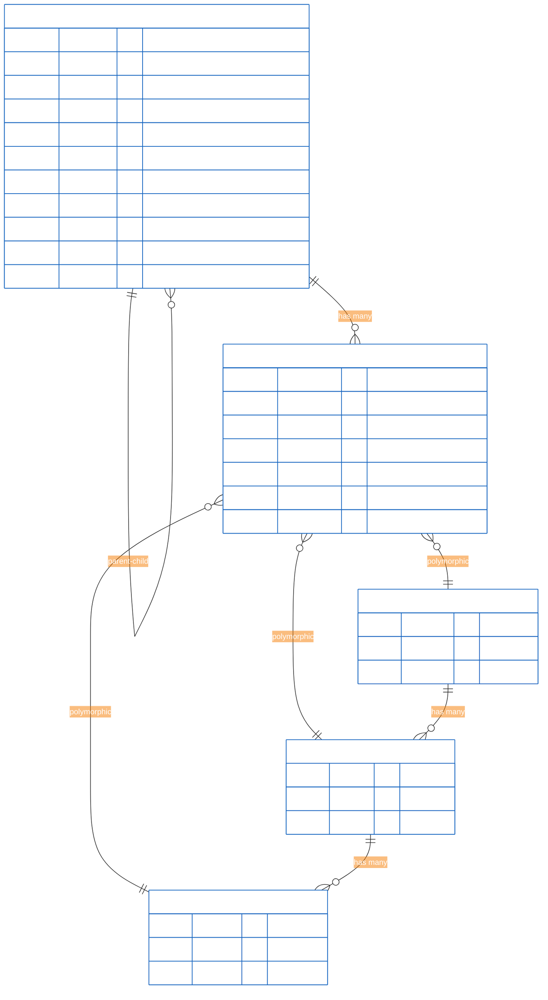

# 2. Entity Relationship Diagrams

**Refactored from:** `.ai/guides/chinook/filament/diagrams/010-entity-relationship-diagrams.md` on 2025-07-13  
**Purpose:** Comprehensive ERDs for Chinook admin panel database with taxonomy integration  
**Scope:** Mermaid v10.6+ syntax with WCAG 2.1 AA compliant colors and accessibility features

## 2.1 Table of Contents

- [2.1 Table of Contents](#21-table-of-contents)
- [2.2 Overview](#22-overview)
- [2.3 Complete Database ERD](#23-complete-database-erd)
- [2.4 Taxonomy System ERD](#24-taxonomy-system-erd)
- [2.7 Performance Optimization](#27-performance-optimization)

## 2.2 Overview

The Chinook database follows modern Laravel 12 patterns with comprehensive relationships, hierarchical taxonomy management using aliziodev/laravel-taxonomy, and enterprise-grade features including audit trails, soft deletes, and polymorphic taxonomy relationships.

### 2.2.1 Design Principles with Taxonomy Integration

- **Taxonomy Architecture**: Uses aliziodev/laravel-taxonomy for flexible categorization
- **Polymorphic Relationships**: Flexible taxonomy relationships across multiple entity types
- **Audit Trails**: Complete user stamps and soft delete functionality with taxonomy tracking
- **Performance Optimization**: Designed for SQLite with proper taxonomy indexing
- **Accessibility**: WCAG 2.1 AA compliant visual design for taxonomy diagrams

## 2.3 Complete Database ERD

```mermaid
%%{init: {
  'theme': 'base',
  'themeVariables': {
    'primaryColor': '#1976d2',
    'primaryTextColor': '#ffffff',
    'primaryBorderColor': '#1565c0',
    'lineColor': '#212121',
    'sectionBkColor': '#f5f5f5',
    'altSectionBkColor': '#e3f2fd',
    'gridColor': '#757575',
    'secondaryColor': '#388e3c',
    'tertiaryColor': '#f57c00',
    'background': '#ffffff',
    'mainBkg': '#ffffff',
    'secondBkg': '#f5f5f5',
    'tertiaryBkg': '#e3f2fd'
  }
}}%%
erDiagram
    %% Taxonomy System (aliziodev/laravel-taxonomy)
    TAXONOMIES {
        bigint id PK
        varchar type "genre, artist_type, album_type, etc"
        varchar name "Taxonomy name"
        varchar slug "URL-friendly name"
        text description "Optional description"
        bigint parent_id FK "Parent taxonomy for hierarchy"
        json meta "Additional metadata"
        timestamp created_at
        timestamp updated_at
    }
    
    TAXONOMY_MODELS {
        bigint id PK
        bigint taxonomy_id FK "Reference to taxonomy"
        varchar model_type "Model class name"
        bigint model_id "Model instance ID"
        timestamp created_at
        timestamp updated_at
    }
    
    %% Core Music Entities with Taxonomy Support
    CHINOOK_ARTISTS {
        bigint id PK
        varchar public_id UK "ULID identifier"
        varchar slug UK "URL-friendly identifier"
        varchar name "Artist or band name"
        text biography "Artist background"
        varchar website "Official website"
        json social_links "Social media profiles"
        varchar country "Country of origin"
        int formed_year "Year formed"
        boolean is_active "Active status"
        bigint created_by FK "User who created"
        bigint updated_by FK "User who updated"
        bigint deleted_by FK "User who deleted"
        timestamp created_at
        timestamp updated_at
        timestamp deleted_at "Soft delete"
    }
    
    CHINOOK_ALBUMS {
        bigint id PK
        varchar public_id UK "ULID identifier"
        varchar slug UK "URL-friendly identifier"
        varchar title "Album title"
        bigint artist_id FK "Primary artist"
        text description "Album description"
        date release_date "Release date"
        varchar label "Record label"
        varchar catalog_number "Catalog number"
        decimal price "Album price"
        varchar cover_art "Cover art URL"
        boolean is_compilation "Compilation album flag"
        bigint created_by FK "User who created"
        bigint updated_by FK "User who updated"
        bigint deleted_by FK "User who deleted"
        timestamp created_at
        timestamp updated_at
        timestamp deleted_at "Soft delete"
    }
    
    CHINOOK_TRACKS {
        bigint id PK
        varchar public_id UK "ULID identifier"
        varchar slug UK "URL-friendly identifier"
        varchar name "Track name"
        bigint album_id FK "Album reference"
        bigint media_type_id FK "Media type"
        varchar composer "Track composer"
        int milliseconds "Track length in ms"
        int bytes "File size in bytes"
        decimal unit_price "Track price"
        int track_number "Position in album"
        int disc_number "Disc number for multi-disc"
        boolean is_explicit "Explicit content flag"
        bigint created_by FK "User who created"
        bigint updated_by FK "User who updated"
        bigint deleted_by FK "User who deleted"
        timestamp created_at
        timestamp updated_at
        timestamp deleted_at "Soft delete"
    }
    
    %% User Management
    USERS {
        bigint id PK
        varchar public_id UK "ULID identifier"
        varchar name "Full name"
        varchar email UK "Email address"
        timestamp email_verified_at
        varchar password "Hashed password"
        varchar remember_token
        timestamp created_at
        timestamp updated_at
    }
    
    %% Media Types
    CHINOOK_MEDIA_TYPES {
        bigint id PK
        varchar public_id UK "ULID identifier"
        varchar name "Media type name"
        varchar extension "File extension"
        varchar mime_type "MIME type"
        boolean is_active "Active status"
        timestamp created_at
        timestamp updated_at
    }
    
    %% Taxonomy Relationships (Polymorphic)
    TAXONOMIES ||--o{ TAXONOMIES : "parent-child hierarchy"
    TAXONOMIES ||--o{ TAXONOMY_MODELS : "has many relationships"
    
    %% Polymorphic Taxonomy Relationships
    TAXONOMY_MODELS }o--|| CHINOOK_ARTISTS : "artist taxonomies (genre, type)"
    TAXONOMY_MODELS }o--|| CHINOOK_ALBUMS : "album taxonomies (genre, type)"
    TAXONOMY_MODELS }o--|| CHINOOK_TRACKS : "track taxonomies (genre, mood)"
    
    %% Core Music Relationships
    CHINOOK_ARTISTS ||--o{ CHINOOK_ALBUMS : "artist has albums"
    CHINOOK_ALBUMS ||--o{ CHINOOK_TRACKS : "album has tracks"
    CHINOOK_MEDIA_TYPES ||--o{ CHINOOK_TRACKS : "media type for tracks"
    
    %% User Relationships (User Stamps)
    USERS ||--o{ CHINOOK_ARTISTS : "created_by"
    USERS ||--o{ CHINOOK_ALBUMS : "created_by"
    USERS ||--o{ CHINOOK_TRACKS : "created_by"
    USERS ||--o{ CHINOOK_ARTISTS : "updated_by"
    USERS ||--o{ CHINOOK_ALBUMS : "updated_by"
    USERS ||--o{ CHINOOK_TRACKS : "updated_by"
```



## 2.4 Taxonomy System ERD



## 2.7 Performance Optimization

### 2.7.1 Database Indexes for Taxonomy Operations

```sql
-- Taxonomy performance indexes
CREATE INDEX idx_taxonomies_type_parent ON taxonomies(type, parent_id);
CREATE INDEX idx_taxonomies_name_type ON taxonomies(name, type);
CREATE INDEX idx_taxonomies_hierarchy ON taxonomies(parent_id, sort_order);

-- Taxonomy relationship indexes
CREATE INDEX idx_taxonomy_models_taxonomy ON taxonomy_models(taxonomy_id);
CREATE INDEX idx_taxonomy_models_model ON taxonomy_models(model_type, model_id);
CREATE INDEX idx_taxonomy_models_composite ON taxonomy_models(taxonomy_id, model_type, model_id);

-- Chinook model indexes with taxonomy support
CREATE INDEX idx_chinook_artists_name ON chinook_artists(name);
CREATE INDEX idx_chinook_albums_artist_title ON chinook_albums(artist_id, title);
CREATE INDEX idx_chinook_tracks_album_number ON chinook_tracks(album_id, track_number);
```

This comprehensive ERD documentation provides the foundation for understanding the Chinook database structure with comprehensive taxonomy integration and modern Laravel 12 patterns.

---

## Navigation

**Previous:** [Diagrams Index](000-diagrams-index.md)  
**Next:** Database Schema *(Documentation pending)*
**Up:** [Diagrams Documentation](000-diagrams-index.md)  
**Home:** [Chinook Documentation](../../README.md)

[⬆️ Back to Top](#2-entity-relationship-diagrams)
