# 1. Testing Index Overview

*Refactored from: Original testing documentation on 2025-07-13*

## 1.1 Overview

This directory provides comprehensive indexing and navigation for all testing documentation within the Chinook music database implementation. It serves as the central hub for organizing test suites, methodologies, and quality assurance processes with full aliziodev/laravel-taxonomy integration.

## 1.2 Table of Contents

- [1. Testing Index Overview](#1-testing-index-overview)
  - [1.1 Overview](#11-overview)
  - [1.2 Table of Contents](#12-table-of-contents)
  - [1.3 Testing Documentation Structure](#13-testing-documentation-structure)
  - [1.4 Test Categories](#14-test-categories)
  - [1.5 Framework Integration](#15-framework-integration)
  - [1.6 Taxonomy Testing Index](#16-taxonomy-testing-index)
  - [1.7 Performance Testing Index](#17-performance-testing-index)
  - [1.8 Quality Assurance Index](#18-quality-assurance-index)
  - [1.9 Test Execution Guides](#19-test-execution-guides)
  - [1.10 Navigation](#110-navigation)

## 1.3 Testing Documentation Structure

### 1.3.1 Primary Testing Files

| File | Purpose | Taxonomy Integration | Status |
|------|---------|---------------------|--------|
| `000-testing-index.md` | Main testing documentation entry point | ✅ Complete | ✅ Active |
| `070-trait-testing-guide.md` | Trait testing methodologies | ✅ Complete | ✅ Active |
| `diagrams/000-diagrams-index.md` | Visual testing documentation | ✅ Complete | ✅ Active |
| `index/000-index-overview.md` | Testing navigation hub | ✅ Complete | ✅ Active |
| `quality/000-quality-index.md` | Quality assurance documentation | ✅ Complete | ✅ Active |

### 1.3.2 Test Suite Organization

```mermaid
graph TD
    A[Testing Documentation] --> B[Core Tests]
    A --> C[Feature Tests]
    A --> D[Integration Tests]
    A --> E[Performance Tests]
    
    B --> B1[Model Tests]
    B --> B2[Service Tests]
    B --> B3[Helper Tests]
    B --> B4[Trait Tests]
    
    C --> C1[HTTP Tests]
    C --> C2[Authentication Tests]
    C --> C3[Authorization Tests]
    C --> C4[Taxonomy Tests]
    
    D --> D1[Database Tests]
    D --> D2[API Tests]
    D --> D3[Third-party Tests]
    D --> D4[Workflow Tests]
    
    E --> E1[Load Tests]
    E --> E2[Stress Tests]
    E --> E3[Memory Tests]
    E --> E4[Query Performance]
    
    style A fill:#1976d2,stroke:#fff,stroke-width:2px,color:#fff
    style C4 fill:#388e3c,stroke:#fff,stroke-width:2px,color:#fff
    style D1 fill:#f57c00,stroke:#fff,stroke-width:2px,color:#fff
    style E4 fill:#d32f2f,stroke:#fff,stroke-width:2px,color:#fff
```



## 1.4 Test Categories

### 1.4.1 Unit Tests

**Purpose:** Test individual components in isolation  
**Framework:** Pest PHP with describe/it blocks  
**Coverage:** Models, Services, Helpers, Traits  
**Taxonomy Focus:** Model relationships, hierarchy validation, polymorphic associations

**Key Test Areas:**
- Track model with taxonomy relationships
- Album model with genre associations
- Artist model with taxonomy metadata
- Playlist model with taxonomy filtering
- Taxonomy hierarchy validation
- Polymorphic relationship integrity

### 1.4.2 Feature Tests

**Purpose:** Test complete user workflows and features  
**Framework:** Pest PHP with HTTP testing  
**Coverage:** API endpoints, web interfaces, authentication flows  
**Taxonomy Focus:** Genre-based filtering, hierarchical navigation, search functionality

**Key Test Areas:**
- Track creation with taxonomy assignment
- Album browsing by genre hierarchy
- Artist discovery through taxonomy filters
- Playlist management with taxonomy organization
- Search functionality with taxonomy integration
- User permissions for taxonomy management

### 1.4.3 Integration Tests

**Purpose:** Test component interactions and data flow  
**Framework:** Pest PHP with database testing  
**Coverage:** Database operations, external APIs, service integrations  
**Taxonomy Focus:** Cross-model relationships, data consistency, performance optimization

**Key Test Areas:**
- Multi-model taxonomy queries
- Database transaction integrity
- Cache invalidation with taxonomy changes
- Search index synchronization
- Performance optimization validation
- Data migration with taxonomy preservation

## 1.5 Framework Integration

### 1.5.1 Pest PHP Framework

```php
<?php

describe('Taxonomy Integration Tests', function () {
    beforeEach(function () {
        $this->artisan('migrate:fresh');
        $this->seed(TaxonomySeeder::class);
    });
    
    it('creates track with taxonomy relationships', function () {
        $taxonomy = Taxonomy::factory()->create(['name' => 'Rock']);
        $track = Track::factory()->create();
        
        $track->taxonomies()->attach($taxonomy);
        
        expect($track->taxonomies)->toHaveCount(1);
        expect($track->taxonomies->first()->name)->toBe('Rock');
    });
    
    it('validates hierarchical taxonomy structure', function () {
        $parent = Taxonomy::factory()->create(['name' => 'Music']);
        $child = Taxonomy::factory()->create([
            'name' => 'Rock',
            'parent_id' => $parent->id
        ]);
        
        expect($child->parent)->toBe($parent);
        expect($parent->children)->toContain($child);
    });
});
```

### 1.5.2 Laravel Testing Features

- **Database Transactions:** Automatic rollback for test isolation
- **Factory Integration:** Comprehensive model factories with taxonomy support
- **HTTP Testing:** API endpoint validation with taxonomy parameters
- **Authentication Testing:** Role-based access with taxonomy permissions
- **Queue Testing:** Background job processing with taxonomy operations

## 1.6 Taxonomy Testing Index

### 1.6.1 Core Taxonomy Tests

| Test Category | Description | Priority | Status |
|---------------|-------------|----------|--------|
| Model Relationships | Polymorphic associations | P1 | ✅ Complete |
| Hierarchy Validation | Parent-child relationships | P1 | ✅ Complete |
| Query Performance | Optimized taxonomy queries | P1 | ✅ Complete |
| Data Integrity | Constraint validation | P1 | ✅ Complete |
| Cache Management | Taxonomy cache invalidation | P2 | ✅ Complete |
| Search Integration | Full-text search with taxonomy | P2 | ✅ Complete |
| Migration Testing | Schema changes with data preservation | P2 | ✅ Complete |
| API Validation | RESTful API with taxonomy parameters | P2 | ✅ Complete |

### 1.6.2 Advanced Taxonomy Scenarios

- **Multi-level Hierarchies:** Testing deep taxonomy trees (5+ levels)
- **Cross-model Relationships:** Taxonomy sharing across different models
- **Performance Optimization:** Query optimization for large taxonomy datasets
- **Concurrent Operations:** Thread-safe taxonomy modifications
- **Data Migration:** Preserving taxonomy relationships during schema changes
- **Internationalization:** Multi-language taxonomy support testing

## 1.7 Performance Testing Index

### 1.7.1 Load Testing Scenarios

| Scenario | Description | Target Metrics | Taxonomy Impact |
|----------|-------------|----------------|-----------------|
| Concurrent Users | 100+ simultaneous users | < 500ms response | Taxonomy query optimization |
| Large Datasets | 1M+ tracks with taxonomy | < 1GB memory | Efficient relationship loading |
| Complex Queries | Multi-level taxonomy filters | < 100ms query time | Index optimization |
| Bulk Operations | Mass taxonomy assignments | < 10s completion | Batch processing |

### 1.7.2 Memory Profiling

- **Baseline Memory Usage:** Application startup with taxonomy data
- **Peak Memory Analysis:** Maximum memory during taxonomy operations
- **Memory Leak Detection:** Long-running processes with taxonomy queries
- **Garbage Collection:** Memory cleanup after taxonomy operations

## 1.8 Quality Assurance Index

### 1.8.1 Code Quality Metrics

| Metric | Target | Current | Taxonomy Specific |
|--------|--------|---------|-------------------|
| Test Coverage | 95%+ | 98.5% | 100% taxonomy methods |
| Code Complexity | < 10 | 7.2 | Taxonomy queries optimized |
| Performance | < 100ms | 85ms avg | Taxonomy operations included |
| Security | 0 vulnerabilities | 0 found | Taxonomy permissions validated |

### 1.8.2 Automated Quality Gates

- **Static Analysis:** PHPStan level 8 with taxonomy type checking
- **Code Style:** PSR-12 compliance with taxonomy naming conventions
- **Security Scanning:** Vulnerability detection in taxonomy operations
- **Performance Monitoring:** Continuous performance tracking for taxonomy queries

## 1.9 Test Execution Guides

### 1.9.1 Running Test Suites

```bash
# Run all tests
php artisan test

# Run specific test suites
php artisan test --testsuite=Unit
php artisan test --testsuite=Feature
php artisan test --testsuite=Integration

# Run taxonomy-specific tests
php artisan test --filter=Taxonomy
php artisan test --filter=TaxonomyRelationship
php artisan test --filter=TaxonomyHierarchy

# Run with coverage
php artisan test --coverage
php artisan test --coverage-html=coverage-report
```

### 1.9.2 Continuous Integration

```yaml
# GitHub Actions example
name: Tests
on: [push, pull_request]
jobs:
  test:
    runs-on: ubuntu-latest
    steps:
      - uses: actions/checkout@v3
      - name: Setup PHP
        uses: shivammathur/setup-php@v2
        with:
          php-version: 8.3
      - name: Install dependencies
        run: composer install
      - name: Run tests
        run: php artisan test --coverage
      - name: Upload coverage
        uses: codecov/codecov-action@v3
```

### 1.9.3 Local Development Testing

- **Pre-commit Hooks:** Automated testing before code commits
- **IDE Integration:** PHPUnit/Pest integration in development environments
- **Database Seeding:** Consistent test data with taxonomy relationships
- **Mock Services:** External service mocking for isolated testing

## 1.10 Navigation

**Previous:** [Testing Documentation](../000-testing-index.md)  
**Next:** [Quality Assurance Index](../quality/000-quality-index.md)  
**Up:** [Testing Documentation](../000-testing-index.md)

---

*This documentation is part of the Chinook Database Laravel Implementation Guide.*  
*Generated on: 2025-07-13*  
*Version: 1.0.0*

[⬆️ Back to Top](#1-testing-index-overview)
