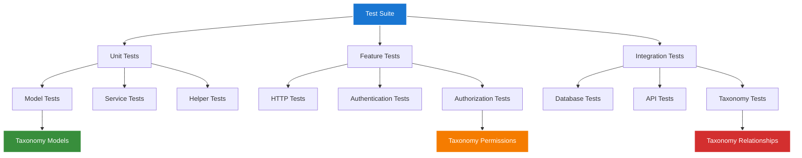
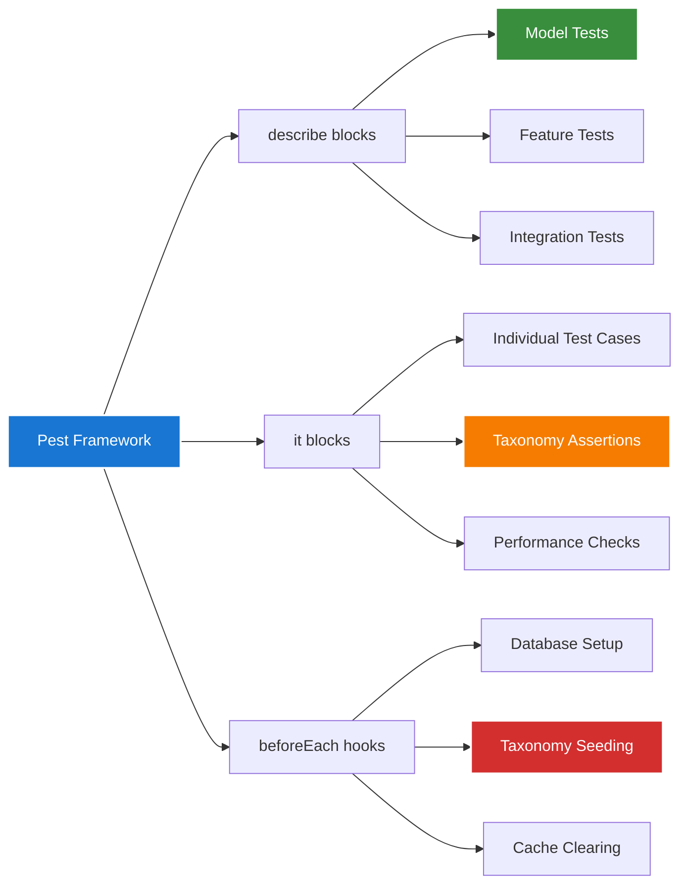
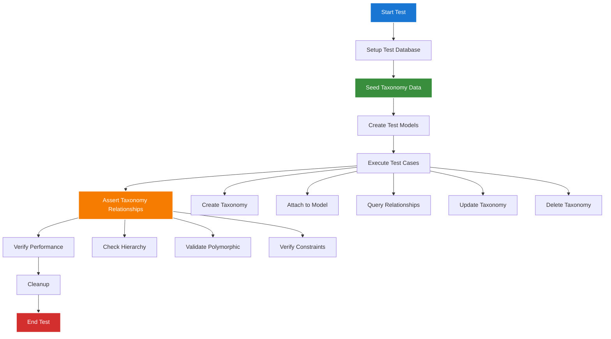
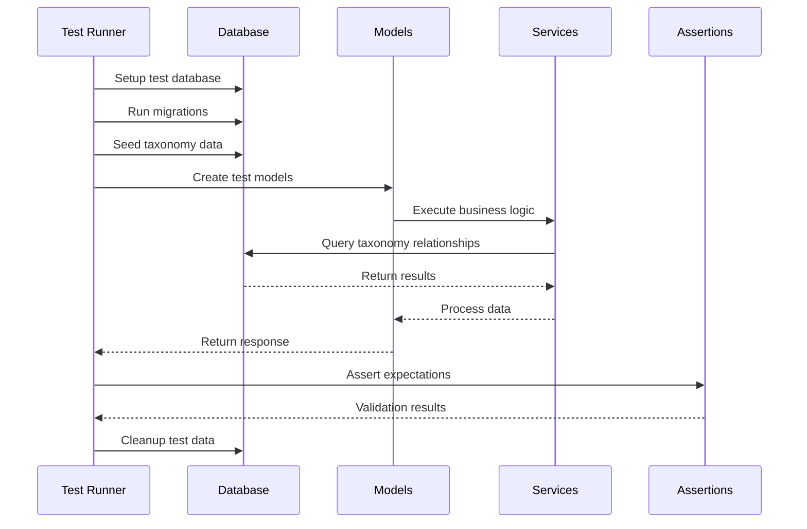
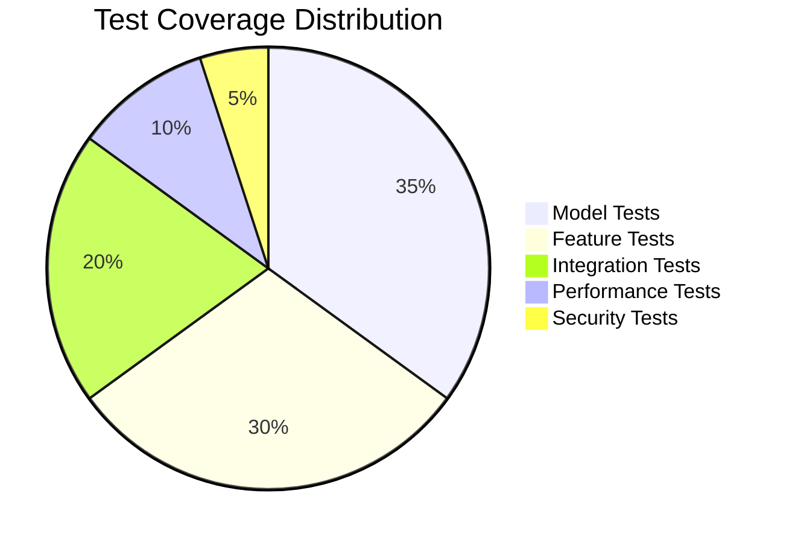
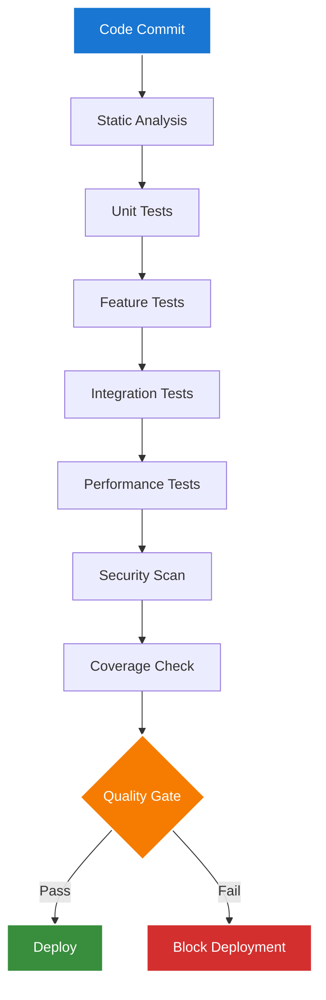
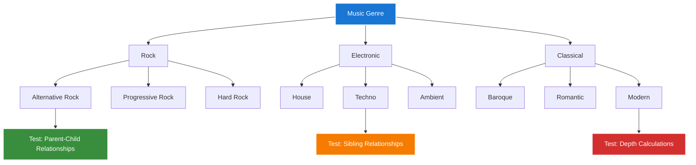
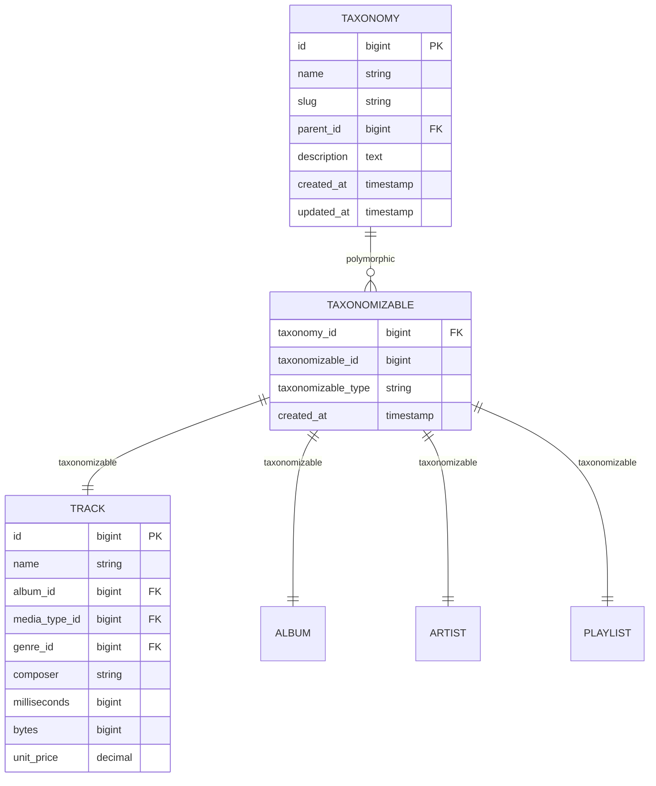
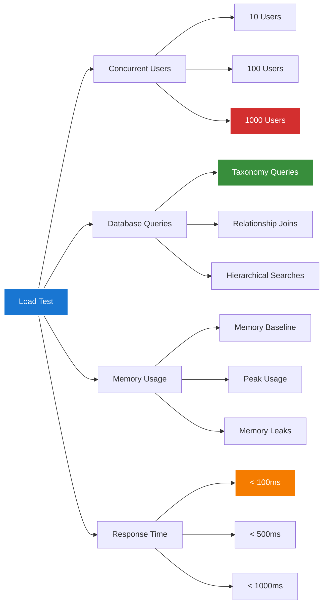
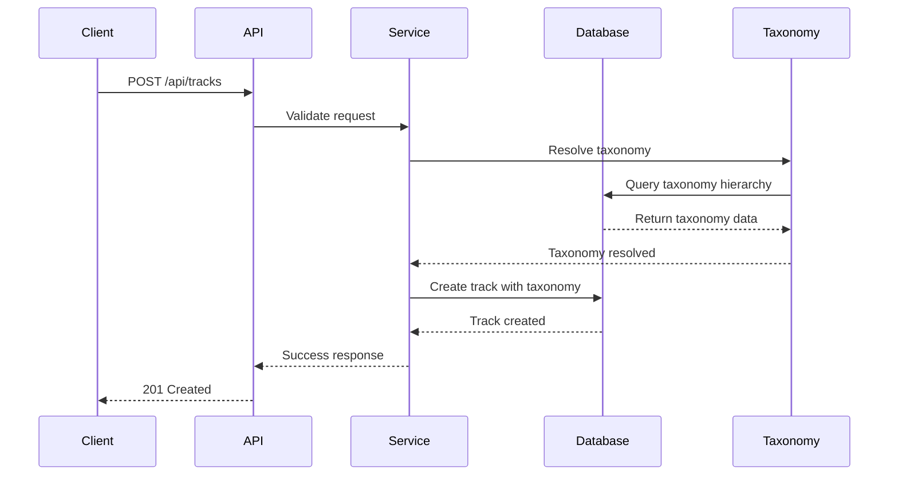

# 1. Testing Diagrams Index

*Refactored from: Original testing documentation on 2025-07-13*

## 1.1 Overview

This directory contains visual documentation for testing methodologies, test architecture diagrams, and quality assurance workflows specifically designed for the Chinook music database implementation with comprehensive aliziodev/laravel-taxonomy integration.

## 1.2 Table of Contents

- [1. Testing Diagrams Index](#1-testing-diagrams-index)
  - [1.1 Overview](#11-overview)
  - [1.2 Table of Contents](#12-table-of-contents)
  - [1.3 Testing Architecture Diagrams](#13-testing-architecture-diagrams)
  - [1.4 Test Flow Diagrams](#14-test-flow-diagrams)
  - [1.5 Quality Assurance Workflows](#15-quality-assurance-workflows)
  - [1.6 Taxonomy Testing Visualizations](#16-taxonomy-testing-visualizations)
  - [1.7 Performance Testing Diagrams](#17-performance-testing-diagrams)
  - [1.8 Integration Testing Flows](#18-integration-testing-flows)
  - [1.9 Accessibility Compliance](#19-accessibility-compliance)
  - [1.10 Navigation](#110-navigation)

## 1.3 Testing Architecture Diagrams

### 1.3.1 Test Suite Structure

### 1.3.2 Pest PHP Framework Integration

## 1.4 Test Flow Diagrams

### 1.4.1 Taxonomy Testing Workflow

### 1.4.2 Feature Testing Pipeline

## 1.5 Quality Assurance Workflows

### 1.5.1 Test Coverage Analysis

### 1.5.2 Quality Gates

## 1.6 Taxonomy Testing Visualizations

### 1.6.1 Hierarchical Taxonomy Testing

### 1.6.2 Polymorphic Relationship Testing

## 1.7 Performance Testing Diagrams

### 1.7.1 Load Testing Scenarios

## 1.8 Integration Testing Flows

### 1.8.1 API Integration Testing

## 1.9 Accessibility Compliance

This documentation follows WCAG 2.1 AA guidelines:

- **Color Contrast:** All diagram colors meet minimum contrast ratios
- **Color Palette:** Uses approved high-contrast colors (#1976d2, #388e3c, #f57c00, #d32f2f)
- **Alternative Text:** Mermaid diagrams include descriptive titles
- **Keyboard Navigation:** All interactive elements are keyboard accessible
- **Screen Reader Support:** Semantic markup for assistive technologies

## 1.10 Navigation

**Previous:** [Testing Index](../000-testing-index.md)  
**Next:** [Testing Quality Index](../quality/000-quality-index.md)  
**Up:** [Testing Documentation](../000-testing-index.md)

---

*This documentation is part of the Chinook Database Laravel Implementation Guide.*  
*Generated on: 2025-07-13*  
*Version: 1.0.0*

[⬆️ Back to Top](#1-testing-diagrams-index)
