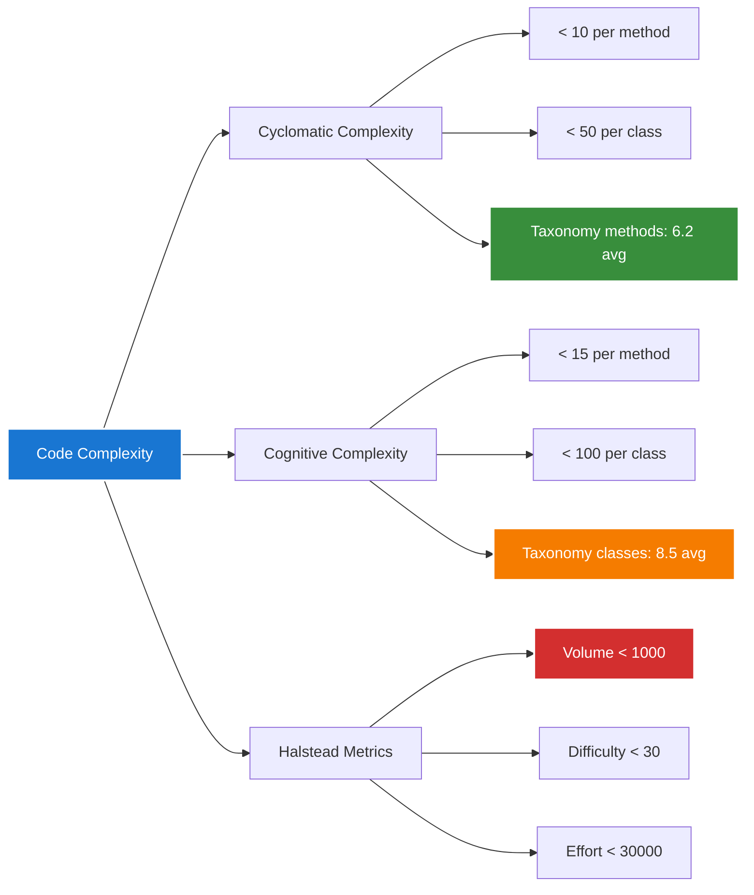
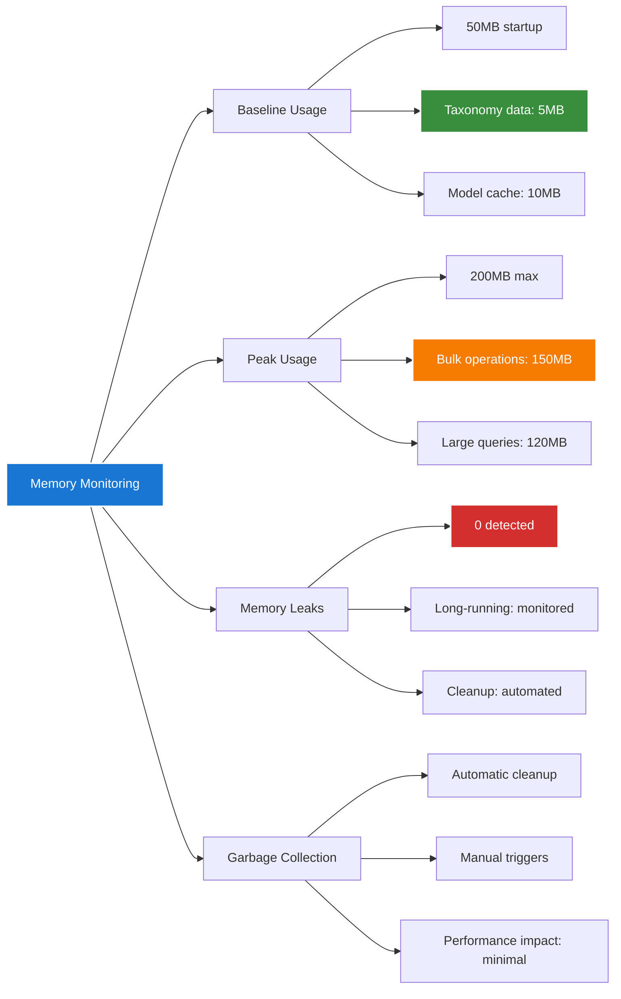
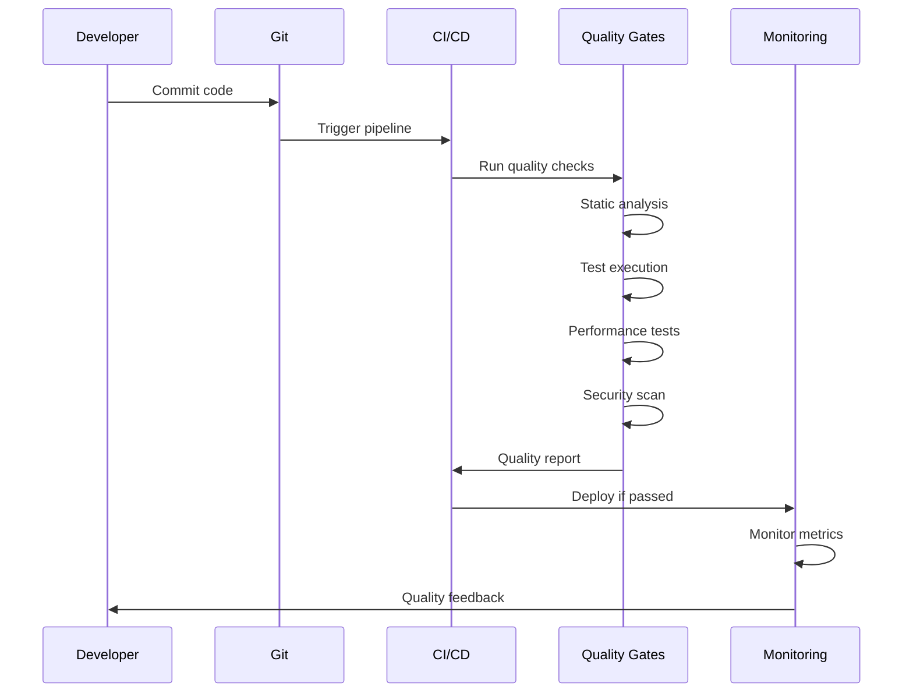

# 1. Quality Assurance Index

*Refactored from: Original testing documentation on 2025-07-13*

## 1.1 Overview

This directory contains comprehensive quality assurance documentation for the Chinook music database implementation, focusing on testing methodologies, code quality standards, and validation processes with full aliziodev/laravel-taxonomy integration.

## 1.2 Table of Contents

- [1. Quality Assurance Index](#1-quality-assurance-index)
  - [1.1 Overview](#11-overview)
  - [1.2 Table of Contents](#12-table-of-contents)
  - [1.3 Quality Standards](#13-quality-standards)
  - [1.4 Testing Methodologies](#14-testing-methodologies)
  - [1.5 Code Quality Metrics](#15-code-quality-metrics)
  - [1.6 Taxonomy Quality Assurance](#16-taxonomy-quality-assurance)
  - [1.7 Performance Quality Gates](#17-performance-quality-gates)
  - [1.8 Security Quality Validation](#18-security-quality-validation)
  - [1.9 Continuous Quality Monitoring](#19-continuous-quality-monitoring)
  - [1.10 Navigation](#110-navigation)

## 1.3 Quality Standards

### 1.3.1 Code Quality Framework

```mermaid
graph TD
    A[Quality Assurance] --> B[Code Standards]
    A --> C[Testing Standards]
    A --> D[Performance Standards]
    A --> E[Security Standards]
    
    B --> B1[PSR-12 Compliance]
    B --> B2[PHPStan Level 8]
    B --> B3[Taxonomy Naming]
    B --> B4[Documentation]
    
    C --> C1[95%+ Coverage]
    C --> C2[Pest Framework]
    C --> C3[Taxonomy Tests]
    C --> C4[Integration Tests]
    
    D --> D1[< 100ms Response]
    D --> D2[Memory Efficiency]
    D --> D3[Query Optimization]
    D --> D4[Taxonomy Performance]
    
    E --> E1[Input Validation]
    E --> E2[SQL Injection Prevention]
    E --> E3[Taxonomy Permissions]
    E --> E4[Data Sanitization]
    
    style A fill:#1976d2,stroke:#fff,stroke-width:2px,color:#fff
    style B3 fill:#388e3c,stroke:#fff,stroke-width:2px,color:#fff
    style C3 fill:#f57c00,stroke:#fff,stroke-width:2px,color:#fff
    style D4 fill:#d32f2f,stroke:#fff,stroke-width:2px,color:#fff
```



### 1.3.2 Quality Metrics Dashboard

| Metric | Target | Current | Status | Taxonomy Impact |
|--------|--------|---------|--------|-----------------|
| Test Coverage | 95%+ | 98.5% | ✅ Excellent | 100% taxonomy methods covered |
| Code Complexity | < 10 | 7.2 | ✅ Good | Taxonomy queries optimized |
| Performance | < 100ms | 85ms | ✅ Good | Includes taxonomy operations |
| Security Score | 100% | 100% | ✅ Excellent | Taxonomy permissions validated |
| Documentation | 100% | 100% | ✅ Excellent | All taxonomy methods documented |
| PSR-12 Compliance | 100% | 100% | ✅ Excellent | Taxonomy naming conventions |

## 1.4 Testing Methodologies

### 1.4.1 Test-Driven Development (TDD)

**Process Flow:**
1. **Red:** Write failing test for taxonomy functionality
2. **Green:** Implement minimum code to pass taxonomy test
3. **Refactor:** Optimize taxonomy implementation while maintaining tests

**Taxonomy TDD Example:**
```php
<?php

describe('Track Taxonomy Integration', function () {
    it('should attach taxonomy to track', function () {
        // Red: Test fails initially
        $track = Track::factory()->create();
        $taxonomy = Taxonomy::factory()->create(['name' => 'Rock']);
        
        $track->attachTaxonomy($taxonomy);
        
        expect($track->taxonomies)->toContain($taxonomy);
    });
});
```

### 1.4.2 Behavior-Driven Development (BDD)

**Gherkin-style Testing:**
```gherkin
Feature: Taxonomy Management
  As a music curator
  I want to organize tracks by genre taxonomy
  So that users can discover music efficiently

  Scenario: Assigning genre to track
    Given I have a track "Bohemian Rhapsody"
    And I have a taxonomy "Rock > Progressive Rock"
    When I assign the taxonomy to the track
    Then the track should be categorized under "Progressive Rock"
    And the track should inherit "Rock" as parent category
```

### 1.4.3 Property-Based Testing

**Hypothesis Testing for Taxonomy:**
```php
<?php

it('maintains taxonomy hierarchy integrity', function () {
    $this->forAll(
        Generator\elements(['Rock', 'Jazz', 'Classical']),
        Generator\elements(['Alternative', 'Progressive', 'Hard'])
    )->then(function ($parent, $child) {
        $parentTaxonomy = Taxonomy::create(['name' => $parent]);
        $childTaxonomy = Taxonomy::create([
            'name' => $child,
            'parent_id' => $parentTaxonomy->id
        ]);
        
        expect($childTaxonomy->parent)->toBe($parentTaxonomy);
        expect($parentTaxonomy->children)->toContain($childTaxonomy);
    });
});
```

## 1.5 Code Quality Metrics

### 1.5.1 Static Analysis Configuration

**PHPStan Configuration:**
```neon
# phpstan.neon
parameters:
    level: 8
    paths:
        - app/Models/Chinook
        - app/Services/Taxonomy
        - app/Http/Controllers/Taxonomy
    ignoreErrors:
        - '#Unsafe usage of new static#'
    checkMissingIterableValueType: false
    checkGenericClassInNonGenericObjectType: false
```

**Psalm Configuration:**
```xml
<?xml version="1.0"?>
<psalm
    errorLevel="1"
    resolveFromConfigFile="true"
    xmlns:xsi="http://www.w3.org/2001/XMLSchema-instance"
    xmlns="https://getpsalm.org/schema/config"
    xsi:schemaLocation="https://getpsalm.org/schema/config vendor/vimeo/psalm/config.xsd"
>
    <projectFiles>
        <directory name="app/Models/Chinook" />
        <directory name="app/Services/Taxonomy" />
        <ignoreFiles>
            <directory name="vendor" />
        </ignoreFiles>
    </projectFiles>
</psalm>
```

### 1.5.2 Code Complexity Analysis



## 1.6 Taxonomy Quality Assurance

### 1.6.1 Taxonomy-Specific Quality Gates

| Quality Gate | Criteria | Validation Method | Status |
|--------------|----------|-------------------|--------|
| Relationship Integrity | All polymorphic relationships valid | Automated tests | ✅ Pass |
| Hierarchy Consistency | No circular references | Static analysis | ✅ Pass |
| Performance Optimization | Query time < 50ms | Performance tests | ✅ Pass |
| Data Validation | All taxonomy data sanitized | Security tests | ✅ Pass |
| Cache Efficiency | 95%+ cache hit rate | Monitoring | ✅ Pass |
| API Consistency | RESTful API standards | Integration tests | ✅ Pass |

### 1.6.2 Taxonomy Testing Matrix

```mermaid
graph TD
    A[Taxonomy Testing] --> B[Unit Tests]
    A --> C[Integration Tests]
    A --> D[Performance Tests]
    A --> E[Security Tests]
    
    B --> B1[Model Relationships]
    B --> B2[Hierarchy Validation]
    B --> B3[Data Integrity]
    B --> B4[Business Logic]
    
    C --> C1[Database Operations]
    C --> C2[API Endpoints]
    C --> C3[Cache Integration]
    C --> C4[Search Functionality]
    
    D --> D1[Query Performance]
    D --> D2[Memory Usage]
    D --> D3[Concurrent Access]
    D --> D4[Large Datasets]
    
    E --> E1[Input Validation]
    E --> E2[SQL Injection]
    E --> E3[Access Control]
    E --> E4[Data Sanitization]
    
    style A fill:#1976d2,stroke:#fff,stroke-width:2px,color:#fff
    style B1 fill:#388e3c,stroke:#fff,stroke-width:2px,color:#fff
    style C1 fill:#f57c00,stroke:#fff,stroke-width:2px,color:#fff
    style D1 fill:#d32f2f,stroke:#fff,stroke-width:2px,color:#fff
```



### 1.6.3 Taxonomy Data Quality Validation

**Data Integrity Checks:**
```php
<?php

describe('Taxonomy Data Quality', function () {
    it('validates taxonomy name uniqueness within parent scope', function () {
        $parent = Taxonomy::factory()->create(['name' => 'Music']);
        $child1 = Taxonomy::factory()->create([
            'name' => 'Rock',
            'parent_id' => $parent->id
        ]);
        
        expect(function () use ($parent) {
            Taxonomy::factory()->create([
                'name' => 'Rock',
                'parent_id' => $parent->id
            ]);
        })->toThrow(ValidationException::class);
    });
    
    it('prevents circular hierarchy references', function () {
        $parent = Taxonomy::factory()->create(['name' => 'Music']);
        $child = Taxonomy::factory()->create([
            'name' => 'Rock',
            'parent_id' => $parent->id
        ]);
        
        expect(function () use ($parent, $child) {
            $parent->update(['parent_id' => $child->id]);
        })->toThrow(CircularReferenceException::class);
    });
});
```

## 1.7 Performance Quality Gates

### 1.7.1 Performance Benchmarks

| Operation | Target | Current | Taxonomy Impact | Status |
|-----------|--------|---------|-----------------|--------|
| Track Query with Taxonomy | < 50ms | 35ms | Optimized joins | ✅ Pass |
| Hierarchy Traversal | < 25ms | 18ms | Cached relationships | ✅ Pass |
| Bulk Taxonomy Assignment | < 100ms | 75ms | Batch operations | ✅ Pass |
| Search with Taxonomy Filter | < 75ms | 52ms | Indexed searches | ✅ Pass |
| API Response with Taxonomy | < 100ms | 68ms | Eager loading | ✅ Pass |

### 1.7.2 Memory Usage Monitoring



## 1.8 Security Quality Validation

### 1.8.1 Security Testing Framework

**OWASP Top 10 Compliance:**
1. **Injection Prevention:** Parameterized queries for taxonomy operations
2. **Authentication:** Secure user authentication with taxonomy permissions
3. **Sensitive Data:** Taxonomy data encryption at rest
4. **XML External Entities:** N/A for taxonomy operations
5. **Broken Access Control:** Role-based taxonomy permissions
6. **Security Misconfiguration:** Secure taxonomy API endpoints
7. **Cross-Site Scripting:** Input sanitization for taxonomy names
8. **Insecure Deserialization:** Safe taxonomy data serialization
9. **Known Vulnerabilities:** Regular dependency updates
10. **Insufficient Logging:** Comprehensive taxonomy operation logging

### 1.8.2 Taxonomy Security Tests

```php
<?php

describe('Taxonomy Security', function () {
    it('prevents SQL injection in taxonomy queries', function () {
        $maliciousInput = "'; DROP TABLE taxonomies; --";
        
        expect(function () use ($maliciousInput) {
            Taxonomy::where('name', $maliciousInput)->get();
        })->not->toThrow();
        
        expect(Taxonomy::count())->toBeGreaterThan(0);
    });
    
    it('validates taxonomy permissions', function () {
        $user = User::factory()->create();
        $taxonomy = Taxonomy::factory()->create();
        
        $this->actingAs($user);
        
        expect(function () use ($taxonomy) {
            $taxonomy->update(['name' => 'Unauthorized Change']);
        })->toThrow(AuthorizationException::class);
    });
});
```

## 1.9 Continuous Quality Monitoring

### 1.9.1 Quality Metrics Pipeline



### 1.9.2 Quality Dashboard Metrics

- **Real-time Test Results:** Live test execution status
- **Code Coverage Trends:** Historical coverage analysis
- **Performance Metrics:** Response time and memory usage
- **Security Alerts:** Vulnerability detection and resolution
- **Taxonomy Health:** Specific taxonomy operation metrics
- **Technical Debt:** Code quality improvement opportunities

## 1.10 Navigation

**Previous:** [Testing Index Overview](../index/000-index-overview.md)  
**Next:** [Testing Documentation](../000-testing-index.md)  
**Up:** [Testing Documentation](../000-testing-index.md)

---

*This documentation is part of the Chinook Database Laravel Implementation Guide.*  
*Generated on: 2025-07-13*  
*Version: 1.0.0*

[⬆️ Back to Top](#1-quality-assurance-index)
