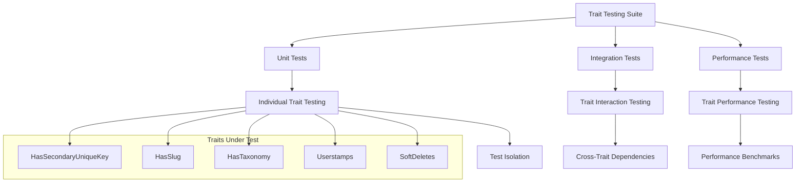

# 1. Trait Testing Guide

## Table of Contents

- [1. Overview](#1-overview)
- [2. HasSecondaryUniqueKey Trait Testing](#2-hassecondaryuniquekey-trait-testing)
- [3. HasSlug Trait Testing](#3-hasslug-trait-testing)
- [4. HasTaxonomy Trait Testing](#4-hastaxonomy-trait-testing)
- [5. Userstamps Trait Testing](#5-userstamps-trait-testing)
- [6. SoftDeletes Trait Testing](#6-softdeletes-trait-testing)
- [7. Trait Interaction Testing](#7-trait-interaction-testing)
- [8. Best Practices](#8-best-practices)
- [9. Navigation](#9-navigation)

## 1. Overview

This guide provides comprehensive testing strategies for all custom traits used in the Chinook application, focusing on Laravel 12 modern patterns with Pest PHP framework and aliziodev/laravel-taxonomy integration.

### 1.1 Testing Architecture



## 2. HasSecondaryUniqueKey Trait Testing

### 2.1 Key Generation Testing

```php
<?php

// tests/Unit/Traits/HasSecondaryUniqueKeyTest.php
use App\Models\Artist;
use App\Models\Track;
use App\Enums\SecondaryKeyType;

describe('HasSecondaryUniqueKey Trait', function () {
    describe('Key Generation', function () {
        it('generates ULID for Artist models', function () {
            $artist = Artist::factory()->create();
            
            expect($artist->public_id)
                ->not->toBeEmpty()
                ->toBeString()
                ->toHaveLength(26)
                ->toMatch('/^[0-9A-HJKMNP-TV-Z]{26}$/');
        });

        it('generates Snowflake ID for Track models', function () {
            $track = Track::factory()->create();
            
            expect($track->public_id)
                ->not->toBeEmpty()
                ->toBeNumeric()
                ->toBeGreaterThan(0);
        });
    });

    describe('Key Uniqueness', function () {
        it('ensures unique keys across multiple instances', function () {
            $artists = Artist::factory()->count(100)->create();
            $publicIds = $artists->pluck('public_id')->toArray();
            
            expect($publicIds)
                ->toHaveCount(100)
                ->toEqual(array_unique($publicIds));
        });
    });

    describe('Key Type Configuration', function () {
        it('returns correct secondary key type for each model', function () {
            expect((new Artist())->getSecondaryKeyType())->toBe(SecondaryKeyType::ULID);
            expect((new Track())->getSecondaryKeyType())->toBe(SecondaryKeyType::SNOWFLAKE);
        });

        it('validates secondary key type enum values', function () {
            $validTypes = [SecondaryKeyType::ULID, SecondaryKeyType::UUID, SecondaryKeyType::SNOWFLAKE];
            
            foreach ($validTypes as $type) {
                expect($type)->toBeInstanceOf(SecondaryKeyType::class);
            }
        });
    });
});
```

## 3. HasSlug Trait Testing

### 3.1 Slug Generation Testing

```php
<?php

// tests/Unit/Traits/HasSlugTest.php
use App\Models\Artist;
use App\Models\Album;

describe('HasSlug Trait', function () {
    describe('Slug Generation', function () {
        it('generates slug from public_id by default', function () {
            $artist = Artist::factory()->create();
            
            expect($artist->slug)
                ->not->toBeEmpty()
                ->toBeString()
                ->toBe(Str::slug($artist->public_id));
        });

        it('generates unique slugs for duplicate names', function () {
            $artist1 = Artist::factory()->create(['name' => 'Test Artist']);
            $artist2 = Artist::factory()->create(['name' => 'Test Artist']);
            
            expect($artist1->slug)->not->toBe($artist2->slug);
            expect($artist1->slug)->toContain(Str::slug($artist1->public_id));
            expect($artist2->slug)->toContain(Str::slug($artist2->public_id));
        });
    });

    describe('Slug Updates', function () {
        it('updates slug when public_id changes', function () {
            $artist = Artist::factory()->create();
            $originalSlug = $artist->slug;
            
            // Force regenerate public_id
            $artist->regenerateSecondaryKey();
            $artist->save();
            
            expect($artist->fresh()->slug)
                ->not->toBe($originalSlug)
                ->toBe(Str::slug($artist->public_id));
        });
    });
});
```

## 4. HasTaxonomy Trait Testing

### 4.1 Taxonomy Relationship Testing

```php
<?php

// tests/Unit/Traits/HasTaxonomyTest.php
use App\Models\Artist;
use App\Models\Album;
use App\Models\Track;
use Aliziodev\LaravelTaxonomy\Models\Taxonomy;

describe('HasTaxonomy Trait', function () {
    beforeEach(function () {
        $this->artist = Artist::factory()->create();
        $this->genreTaxonomy = Taxonomy::factory()->create(['type' => 'genre', 'name' => 'Rock']);
        $this->moodTaxonomy = Taxonomy::factory()->create(['type' => 'mood', 'name' => 'Energetic']);
        $this->styleTaxonomy = Taxonomy::factory()->create(['type' => 'style', 'name' => 'Alternative']);
    });

    describe('Taxonomy Attachment', function () {
        it('attaches taxonomies to models', function () {
            $this->artist->syncTaxonomies([$this->genreTaxonomy->id]);

            expect($this->artist->taxonomies)->toHaveCount(1);
            expect($this->artist->taxonomies->first()->id)->toBe($this->genreTaxonomy->id);
        });

        it('attaches multiple taxonomies', function () {
            $this->artist->syncTaxonomies([
                $this->genreTaxonomy->id,
                $this->moodTaxonomy->id
            ]);

            expect($this->artist->taxonomies)->toHaveCount(2);
            expect($this->artist->taxonomies->pluck('id'))
                ->toContain($this->genreTaxonomy->id, $this->moodTaxonomy->id);
        });

        it('prevents duplicate taxonomy attachment', function () {
            $this->artist->syncTaxonomies([$this->genreTaxonomy->id]);
            $this->artist->syncTaxonomies([$this->genreTaxonomy->id]); // Duplicate

            expect($this->artist->fresh()->taxonomies)->toHaveCount(1);
        });
    });

    describe('Taxonomy Filtering', function () {
        beforeEach(function () {
            $this->artist->syncTaxonomies([
                $this->genreTaxonomy->id,
                $this->moodTaxonomy->id,
                $this->styleTaxonomy->id
            ]);
        });

        it('filters taxonomies by type', function () {
            $genreTaxonomies = $this->artist->taxonomiesByType('genre');
            $moodTaxonomies = $this->artist->taxonomiesByType('mood');

            expect($genreTaxonomies)->toHaveCount(1);
            expect($genreTaxonomies->first()->type)->toBe('genre');

            expect($moodTaxonomies)->toHaveCount(1);
            expect($moodTaxonomies->first()->type)->toBe('mood');
        });

        it('checks if model has specific taxonomy type', function () {
            expect($this->artist->hasTaxonomyType('genre'))->toBeTrue();
            expect($this->artist->hasTaxonomyType('instrument'))->toBeFalse();
        });
    });
});
```

## 5. Userstamps Trait Testing

### 5.1 User Tracking Testing

```php
<?php

// tests/Unit/Traits/UserstampsTest.php
use App\Models\Artist;
use App\Models\User;

describe('Userstamps Trait', function () {
    beforeEach(function () {
        $this->user = User::factory()->create();
        $this->actingAs($this->user);
    });

    describe('Creation Tracking', function () {
        it('sets created_by when model is created', function () {
            $artist = Artist::factory()->create();

            expect($artist->created_by)->toBe($this->user->id);
            expect($artist->creator)->toBeInstanceOf(User::class);
            expect($artist->creator->id)->toBe($this->user->id);
        });
    });

    describe('Update Tracking', function () {
        it('sets updated_by when model is updated', function () {
            $artist = Artist::factory()->create();
            
            $newUser = User::factory()->create();
            $this->actingAs($newUser);
            
            $artist->update(['name' => 'Updated Name']);

            expect($artist->updated_by)->toBe($newUser->id);
            expect($artist->updater)->toBeInstanceOf(User::class);
            expect($artist->updater->id)->toBe($newUser->id);
        });
    });
});
```

## 6. SoftDeletes Trait Testing

### 6.1 Soft Delete Testing

```php
<?php

// tests/Unit/Traits/SoftDeletesTest.php
use App\Models\Artist;
use App\Models\Album;

describe('SoftDeletes Trait', function () {
    describe('Soft Deletion', function () {
        it('soft deletes models instead of hard deletion', function () {
            $artist = Artist::factory()->create();
            $artistId = $artist->id;

            $artist->delete();

            expect(Artist::find($artistId))->toBeNull();
            expect(Artist::withTrashed()->find($artistId))->not->toBeNull();
            expect(Artist::withTrashed()->find($artistId)->deleted_at)->not->toBeNull();
        });

        it('restores soft deleted models', function () {
            $artist = Artist::factory()->create();
            $artist->delete();

            $artist->restore();

            expect($artist->fresh())->not->toBeNull();
            expect($artist->fresh()->deleted_at)->toBeNull();
        });

        it('force deletes models permanently', function () {
            $artist = Artist::factory()->create();
            $artistId = $artist->id;

            $artist->forceDelete();

            expect(Artist::find($artistId))->toBeNull();
            expect(Artist::withTrashed()->find($artistId))->toBeNull();
        });
    });
});
```

## 7. Trait Interaction Testing

### 7.1 Multiple Trait Integration

```php
<?php

// tests/Unit/Traits/TraitInteractionTest.php
use App\Models\Artist;
use App\Models\User;
use Aliziodev\LaravelTaxonomy\Models\Taxonomy;

describe('Trait Interaction Testing', function () {
    beforeEach(function () {
        $this->user = User::factory()->create();
        $this->actingAs($this->user);
    });

    describe('HasSecondaryUniqueKey + HasSlug Integration', function () {
        it('generates slug based on public_id', function () {
            $artist = Artist::factory()->create();

            expect($artist->public_id)->not->toBeEmpty();
            expect($artist->slug)->toBe(Str::slug($artist->public_id));
        });

        it('maintains slug consistency when public_id changes', function () {
            $artist = Artist::factory()->create();
            $originalSlug = $artist->slug;
            $originalPublicId = $artist->public_id;

            // Simulate public_id change
            $artist->regenerateSecondaryKey();
            $artist->save();

            expect($artist->fresh()->slug)->not->toBe($originalSlug);
            expect($artist->fresh()->public_id)->not->toBe($originalPublicId);
            expect($artist->fresh()->slug)->toBe(Str::slug($artist->fresh()->public_id));
        });
    });

    describe('HasTaxonomy + Userstamps Integration', function () {
        it('tracks user when taxonomies are modified', function () {
            $artist = Artist::factory()->create();
            $taxonomy = Taxonomy::factory()->create(['type' => 'genre']);

            $artist->syncTaxonomies([$taxonomy->id]);

            expect($artist->fresh()->updated_by)->toBe($this->user->id);
        });
    });

    describe('All Traits Integration', function () {
        it('works correctly with all traits combined', function () {
            $artist = Artist::factory()->create(['name' => 'Test Artist']);
            $taxonomy = Taxonomy::factory()->create(['type' => 'genre']);

            // Test all trait functionality
            expect($artist->public_id)->not->toBeEmpty(); // HasSecondaryUniqueKey
            expect($artist->slug)->not->toBeEmpty(); // HasSlug
            expect($artist->created_by)->toBe($this->user->id); // Userstamps

            $artist->syncTaxonomies([$taxonomy->id]); // HasTaxonomy
            expect($artist->taxonomies)->toHaveCount(1);

            $artist->delete(); // SoftDeletes
            expect($artist->fresh())->toBeNull();
            expect(Artist::withTrashed()->find($artist->id))->not->toBeNull();
        });
    });
});
```

## 8. Best Practices

### 8.1 Testing Standards

- **Isolation**: Each trait test should be independent and not rely on other traits
- **Coverage**: Test all public methods and edge cases for each trait
- **Performance**: Include performance tests for traits that affect database queries
- **Integration**: Test trait interactions to ensure compatibility
- **Documentation**: Document expected behavior and edge cases

### 8.2 Test Organization

```text
tests/Unit/Traits/
├── HasSecondaryUniqueKeyTest.php
├── HasSlugTest.php
├── HasTaxonomyTest.php
├── UserstampsTest.php
├── SoftDeletesTest.php
└── TraitInteractionTest.php
```

### 8.3 Performance Considerations

- Test trait methods that generate database queries
- Benchmark trait initialization overhead
- Validate efficient relationship loading
- Test bulk operations with traits

## 9. Navigation

**Previous ←** RBAC Testing Guide *(Documentation pending)*
**Next →** Hierarchical Data Testing *(Documentation pending)*

---

**Source Attribution:** Refactored from: .ai/guides/chinook/testing/070-trait-testing-guide.md on 2025-07-11

*This guide provides comprehensive testing strategies for all custom traits using Pest PHP framework with Laravel 12 modern patterns and aliziodev/laravel-taxonomy integration.*

[⬆️ Back to Top](#1-trait-testing-guide)
