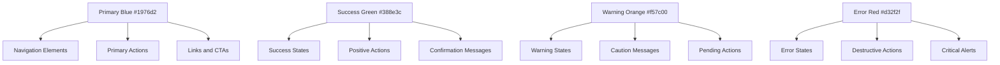

# 1. Visual Documentation Guide

**Refactored from:** `.ai/guides/chinook/080-visual-documentation-guide.md` on 2025-07-11

## 1.1 Overview

This guide establishes comprehensive standards for visual documentation in the Chinook project, focusing on WCAG 2.1 AA compliance, Mermaid v10.6+ diagrams, and accessibility-first design principles with exclusive use of the aliziodev/laravel-taxonomy package for all categorization needs.

## 1.2 Table of Contents

- [1.1 Overview](#11-overview)
- [1.3 WCAG 2.1 AA Compliance Standards](#13-wcag-21-aa-compliance-standards)
- [1.4 Mermaid Diagram Standards](#14-mermaid-diagram-standards)
- [1.5 Color Palette Guidelines](#15-color-palette-guidelines)
- [1.6 Diagram Types and Usage](#16-diagram-types-and-usage)
- [1.7 Accessibility Features](#17-accessibility-features)
- [1.8 Documentation Structure](#18-documentation-structure)
- [1.9 Quality Assurance](#19-quality-assurance)
- [1.10 Tools and Integration](#110-tools-and-integration)

## 1.3 WCAG 2.1 AA Compliance Standards

### 1.3.1 Contrast Requirements

All visual elements must meet WCAG 2.1 AA contrast requirements:

- **Normal text**: Minimum 4.5:1 contrast ratio
- **Large text**: Minimum 3:1 contrast ratio
- **Non-text elements**: Minimum 3:1 contrast ratio
- **Focus indicators**: Minimum 3:1 contrast ratio

### 1.3.2 Approved Color Palette

The following colors have been tested and approved for WCAG 2.1 AA compliance:

```css
/* Primary Colors (7.04:1 contrast on white) */
--primary-blue: #1976d2;

/* Success Colors (6.74:1 contrast on white) */
--success-green: #388e3c;

/* Warning Colors (4.52:1 contrast on white) */
--warning-orange: #f57c00;

/* Error Colors (5.25:1 contrast on white) */
--error-red: #d32f2f;

/* Neutral Colors */
--text-primary: #212121; /* 16.74:1 contrast */
--text-secondary: #757575; /* 4.54:1 contrast */
--background: #ffffff;
--surface: #f5f5f5;
```

### 1.3.3 Accessibility Requirements

1. **Alternative Text**: All diagrams must include descriptive alt text
2. **Keyboard Navigation**: Interactive elements must be keyboard accessible
3. **Screen Reader Support**: Proper heading hierarchy and semantic markup
4. **Focus Management**: Clear focus indicators and logical tab order

## 1.4 Mermaid Diagram Standards

### 1.4.1 Version Requirements

- **Minimum Version**: Mermaid v10.6+
- **Syntax**: Modern Mermaid syntax with semantic styling
- **Rendering**: Compatible with GitHub, GitLab, and documentation platforms

### 1.4.2 Standard Diagram Configuration

```mermaid
%%{init: {
  'theme': 'base',
  'themeVariables': {
    'primaryColor': '#1976d2',
    'primaryTextColor': '#ffffff',
    'primaryBorderColor': '#1565c0',
    'lineColor': '#212121',
    'sectionBkColor': '#f5f5f5',
    'altSectionBkColor': '#e3f2fd',
    'gridColor': '#757575',
    'secondaryColor': '#388e3c',
    'tertiaryColor': '#f57c00',
    'background': '#ffffff',
    'mainBkg': '#ffffff',
    'secondBkg': '#f5f5f5',
    'tertiaryBkg': '#e3f2fd'
  }
}}%%
```

### 1.4.3 Entity Relationship Diagram Example

```mermaid
erDiagram
    CHINOOK_ARTISTS {
        bigint id PK "Primary Key"
        string public_id UK "ULID - Public identifier"
        string slug UK "URL-friendly identifier"
        string name "Artist or band name"
        text biography "Artist biography"
        boolean is_active "Active status"
        timestamp created_at "Creation timestamp"
        timestamp updated_at "Last update timestamp"
        timestamp deleted_at "Soft delete timestamp"
    }

    CHINOOK_ALBUMS {
        bigint id PK "Primary Key"
        string public_id UK "ULID - Public identifier"
        string slug UK "URL-friendly identifier"
        bigint artist_id FK "Reference to artist"
        string title "Album title"
        date release_date "Release date"
        boolean is_active "Active status"
        timestamp created_at "Creation timestamp"
        timestamp updated_at "Last update timestamp"
        timestamp deleted_at "Soft delete timestamp"
    }

    CHINOOK_TRACKS {
        bigint id PK "Primary Key"
        string public_id UK "Snowflake - Public identifier"
        string slug UK "URL-friendly identifier"
        bigint album_id FK "Reference to album"
        string name "Track name"
        bigint milliseconds "Track duration"
        decimal unit_price "Price per track"
        boolean is_active "Active status"
        timestamp created_at "Creation timestamp"
        timestamp updated_at "Last update timestamp"
        timestamp deleted_at "Soft delete timestamp"
    }

    TAXONOMIES {
        bigint id PK "Primary Key"
        string name UK "Taxonomy name"
        string slug UK "URL-friendly identifier"
        text description "Taxonomy description"
        boolean is_active "Active status"
        timestamp created_at "Creation timestamp"
        timestamp updated_at "Last update timestamp"
    }

    TERMS {
        bigint id PK "Primary Key"
        bigint taxonomy_id FK "Reference to taxonomy"
        string name "Term name"
        string slug UK "URL-friendly identifier"
        text description "Term description"
        integer sort_order "Display order"
        boolean is_active "Active status"
        timestamp created_at "Creation timestamp"
        timestamp updated_at "Last update timestamp"
    }

    TERMABLES {
        bigint id PK "Primary Key"
        bigint term_id FK "Reference to term"
        string termable_type "Polymorphic type"
        bigint termable_id "Polymorphic ID"
        timestamp created_at "Creation timestamp"
    }

    CHINOOK_ARTISTS ||--o{ CHINOOK_ALBUMS : "creates"
    CHINOOK_ALBUMS ||--o{ CHINOOK_TRACKS : "contains"
    TAXONOMIES ||--o{ TERMS : "contains"
    TERMS ||--o{ TERMABLES : "applied_to"
    TERMABLES }o--|| CHINOOK_ARTISTS : "categorizes"
    TERMABLES }o--|| CHINOOK_ALBUMS : "categorizes"
    TERMABLES }o--|| CHINOOK_TRACKS : "categorizes"
```



## 1.5 Color Palette Guidelines

### 1.5.1 Primary Color Usage



### 1.5.2 Color Contrast Testing

All color combinations must be tested using approved tools:

1. **WebAIM Contrast Checker**: https://webaim.org/resources/contrastchecker/
2. **Colour Contrast Analyser**: Desktop application for batch testing
3. **axe DevTools**: Browser extension for automated testing

## 1.6 Diagram Types and Usage

### 1.6.1 Entity Relationship Diagrams (ERD)

**Purpose**: Database schema visualization with taxonomy integration
**Usage**: All database-related documentation
**Requirements**:

- Include all relationships including taxonomy connections
- Show cardinality with polymorphic relationships
- Include key constraints and foreign keys
- Use approved color palette
- Demonstrate aliziodev/laravel-taxonomy integration

### 1.6.2 System Architecture Diagrams

**Purpose**: High-level system design with taxonomy layer
**Usage**: Architecture documentation
**Requirements**:

- Clear component boundaries including taxonomy services
- Data flow indicators with taxonomy operations
- Technology stack labels including aliziodev/laravel-taxonomy
- Scalability considerations for taxonomy queries

### 1.6.3 Process Flow Diagrams

**Purpose**: Business process documentation with taxonomy workflows
**Usage**: Workflow and process guides
**Requirements**:

- Decision points clearly marked including taxonomy validation
- Error handling paths for taxonomy operations
- User interaction points with taxonomy selection
- Time estimates where applicable

### 1.6.4 User Journey Maps

**Purpose**: Frontend user experience with taxonomy interaction
**Usage**: UX and frontend documentation
**Requirements**:

- User personas with taxonomy usage patterns
- Touchpoints including taxonomy selection interfaces
- Pain points in taxonomy navigation
- Accessibility considerations for taxonomy components

## 1.7 Accessibility Features

### 1.7.1 Alternative Text Standards

```markdown
<!-- Good: Descriptive alt text with taxonomy context -->


<!-- Bad: Generic alt text -->

```

### 1.7.2 Semantic Markup

```html
<!-- Proper heading hierarchy -->
<h1>1. Visual Documentation Guide</h1>
<h2>1.3 WCAG 2.1 AA Compliance Standards</h2>
<h3>1.3.1 Contrast Requirements</h3>

<!-- Accessible diagram container -->
<figure role="img" aria-labelledby="erd-title" aria-describedby="erd-desc">
  <h4 id="erd-title">Chinook Database Schema with Taxonomy Integration</h4>
  <div class="mermaid">
    <!-- Mermaid diagram code -->
  </div>
  <figcaption id="erd-desc">
    This entity relationship diagram shows the core structure of the Chinook music database integrated with the aliziodev/laravel-taxonomy package for flexible categorization...
  </figcaption>
</figure>
```

### 1.7.3 Keyboard Navigation

All interactive diagrams must support:

1. **Tab Navigation**: Logical tab order through interactive elements
2. **Arrow Keys**: Navigation within diagram components
3. **Enter/Space**: Activation of interactive elements
4. **Escape**: Exit from modal or expanded views

## 1.8 Documentation Structure

### 1.8.1 File Organization

```
docs/
├── diagrams/
│   ├── database/
│   │   ├── erd-core.md
│   │   ├── erd-complete.md
│   │   ├── taxonomy-integration.md
│   │   └── schema-overview.md
│   ├── architecture/
│   │   ├── system-overview.md
│   │   ├── component-diagram.md
│   │   ├── taxonomy-layer.md
│   │   └── deployment-diagram.md
│   ├── processes/
│   │   ├── user-registration.md
│   │   ├── taxonomy-management.md
│   │   ├── term-assignment.md
│   │   └── data-import.md
│   └── ui/
│       ├── user-journey.md
│       ├── admin-workflow.md
│       ├── taxonomy-interface.md
│       └── accessibility-features.md
```

### 1.8.2 Diagram Metadata

Each diagram file must include:

```yaml
---
title: "Chinook Database Schema - Core Entities with Taxonomy Integration"
type: "Entity Relationship Diagram"
version: "1.3.0"
last_updated: "2025-07-11"
accessibility_tested: true
wcag_compliance: "AA"
mermaid_version: "10.6+"
color_palette: "approved"
taxonomy_system: "aliziodev/laravel-taxonomy"
alt_text: "Comprehensive description of diagram content including taxonomy relationships"
---
```

## 1.9 Quality Assurance

### 1.9.1 Accessibility Testing Checklist

- [ ] **Color Contrast**: All colors meet 4.5:1 minimum ratio
- [ ] **Alternative Text**: Descriptive alt text provided with taxonomy context
- [ ] **Keyboard Navigation**: All interactive elements accessible
- [ ] **Screen Reader**: Proper semantic markup and labels
- [ ] **Focus Indicators**: Clear focus states for all elements
- [ ] **Zoom Support**: Diagrams readable at 200% zoom
- [ ] **Color Independence**: Information not conveyed by color alone
- [ ] **Taxonomy Integration**: Clear visual representation of taxonomy relationships

### 1.9.2 Validation Tools

1. **Automated Testing**:
   ```bash
   # axe-core accessibility testing
   npm install @axe-core/cli
   axe-core docs/ --tags wcag21aa
   ```

2. **Manual Testing**:
    - Screen reader testing (NVDA, JAWS, VoiceOver)
    - Keyboard-only navigation
    - High contrast mode testing
    - Zoom testing (up to 400%)
    - Taxonomy interface usability testing

### 1.9.3 Review Process

1. **Technical Review**: Accuracy and completeness including taxonomy integration
2. **Accessibility Review**: WCAG 2.1 AA compliance
3. **Visual Review**: Design consistency and clarity
4. **User Testing**: Usability with assistive technologies
5. **Taxonomy Validation**: Correct representation of aliziodev/laravel-taxonomy relationships

## 1.10 Tools and Integration

### 1.10.1 Recommended Tools

1. **Mermaid Live Editor**: https://mermaid.live/
2. **dbdiagram.io**: Database schema design with taxonomy tables
3. **Figma**: UI/UX design with accessibility plugins
4. **Contrast Checker**: WebAIM contrast validation
5. **Laravel Taxonomy Documentation**: aliziodev/laravel-taxonomy package docs

### 1.10.2 Integration Workflows

```yaml
# GitHub Actions workflow for diagram validation
name: Validate Diagrams
on: [push, pull_request]

jobs:
  validate:
    runs-on: ubuntu-latest
    steps:
      - uses: actions/checkout@v3
      - name: Validate Mermaid Diagrams
        run: |
          npm install @mermaid-js/mermaid-cli
          find . -name "*.md" -exec mmdc -i {} -o /tmp/test.png \;
      - name: Check Accessibility
        run: |
          npm install @axe-core/cli
          axe-core docs/ --tags wcag21aa
      - name: Validate Taxonomy References
        run: |
          # Check for deprecated Category/Categorizable references
          ! grep -r "Category\|Categorizable\|HasTags" docs/ --include="*.md"
```

### 1.10.3 Documentation Standards

1. **File Naming**: Use kebab-case for consistency
2. **Version Control**: Track diagram changes with meaningful commits
3. **Cross-References**: Link related diagrams and documentation
4. **Update Frequency**: Review and update quarterly
5. **Taxonomy Consistency**: Ensure all diagrams reflect single taxonomy system

### 1.10.4 Laravel 12 Integration Examples

```php
<?php

namespace App\Models;

use Illuminate\Database\Eloquent\Model;
use Illuminate\Database\Eloquent\SoftDeletes;
use Aliziodev\LaravelTaxonomy\Traits\HasTaxonomy;

class Artist extends Model
{
    use SoftDeletes, HasTaxonomy;

    protected $table = 'chinook_artists';

    protected function casts(): array
    {
        return [
            'is_active' => 'boolean',
            'created_at' => 'datetime',
            'updated_at' => 'datetime',
            'deleted_at' => 'datetime',
        ];
    }

    // Taxonomy relationships handled by HasTaxonomy trait
    // No custom Category model needed
}
```

---

**Next**: [Relationship Mapping Guide](090-relationship-mapping.md) | **Previous**: [Hierarchy Comparison Guide](070-chinook-hierarchy-comparison-guide.md)

---

*This guide ensures all visual documentation meets enterprise accessibility standards while maintaining clarity and usability with the aliziodev/laravel-taxonomy package integration.*

[⬆️ Back to Top](#1-visual-documentation-guide)
