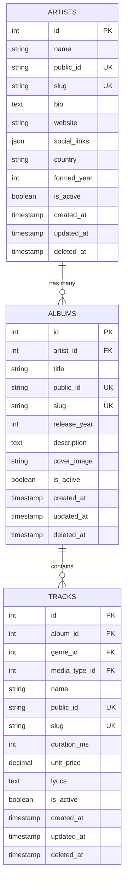
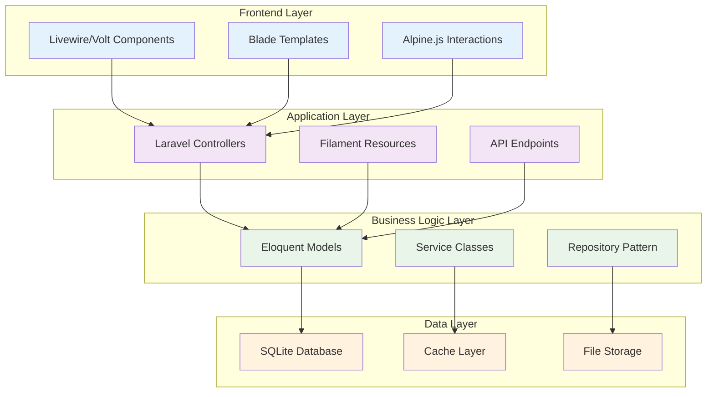
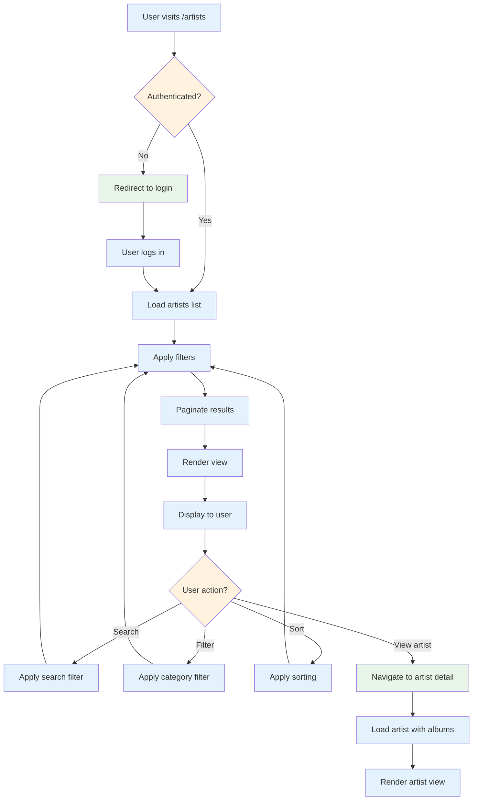

# Visual Documentation Standards

**Version:** 1.0  
**Created:** 2025-07-16  
**Last Updated:** 2025-07-16  
**Scope:** Accessible visual documentation standards for Chinook project

## Table of Contents

1. [Overview](#1-overview)
2. [Accessibility Requirements](#2-accessibility-requirements)
3. [Diagram Standards](#3-diagram-standards)
4. [Image Guidelines](#4-image-guidelines)
5. [Color and Typography](#5-color-and-typography)
6. [Implementation Examples](#6-implementation-examples)

## 1. Overview

This guide establishes standards for all visual documentation in the Chinook project, ensuring accessibility, consistency, and educational value across all visual materials.

### 1.1 Visual Documentation Principles

- **Accessibility First:** All visuals must meet WCAG 2.1 AA standards
- **Educational Focus:** Visuals support learning objectives
- **Consistency:** Uniform style across all documentation
- **Clarity:** Information is easily understood at first glance

### 1.2 Visual Content Types

- **Database Diagrams:** Entity-relationship diagrams, schema visualizations
- **Architecture Diagrams:** System architecture, component relationships
- **Flow Charts:** Process flows, user journeys, decision trees
- **Screenshots:** UI examples, configuration screens
- **Code Diagrams:** Class diagrams, sequence diagrams

## 2. Accessibility Requirements

### 2.1 WCAG 2.1 AA Compliance for Visuals

```markdown
## Color and Contrast Standards

### Text on Images
- **Minimum contrast ratio:** 4.5:1 for normal text
- **Large text contrast:** 3:1 for text 18pt+ or 14pt+ bold
- **Non-text elements:** 3:1 for UI components and graphics

### Color Usage
- **Never use color alone** to convey information
- **Provide patterns or shapes** as alternative indicators
- **Include text labels** for all color-coded elements

### Alternative Text Requirements
- **Descriptive alt text** for all informational images
- **Empty alt text (alt="")** for decorative images
- **Long descriptions** for complex diagrams via aria-describedby
```

### 2.2 Screen Reader Compatibility

```html
<!-- Complex diagram with accessible markup -->
<figure role="img" aria-labelledby="db-diagram-title" aria-describedby="db-diagram-desc">
    
    
    <figcaption id="db-diagram-title">
        Chinook Database Schema Overview
    </figcaption>
    
    <div id="db-diagram-desc" class="sr-only">
        The diagram shows the relationships between main entities:
        Artists table connects to Albums table via artist_id foreign key.
        Albums table connects to Tracks table via album_id foreign key.
        Tracks table connects to InvoiceLines via track_id foreign key.
        InvoiceLines connects to Invoices via invoice_id foreign key.
        Invoices connects to Customers via customer_id foreign key.
        Customers connects to Employees via support_rep_id foreign key.
    </div>
</figure>

<!-- Interactive diagram with keyboard navigation -->
<div role="application" aria-label="Interactive database schema">
    <svg viewBox="0 0 800 600" aria-describedby="schema-instructions">
        <!-- SVG content with focusable elements -->
        <g role="button" tabindex="0" aria-label="Artists table">
            <rect x="10" y="10" width="120" height="80" fill="#e3f2fd"/>
            <text x="70" y="30" text-anchor="middle">Artists</text>
            <text x="20" y="50" font-size="12">id (PK)</text>
            <text x="20" y="65" font-size="12">name</text>
        </g>
    </svg>
    
    <div id="schema-instructions" class="sr-only">
        Use Tab to navigate between tables. Press Enter to view table details.
        Use arrow keys to explore relationships between tables.
    </div>
</div>
```

## 3. Diagram Standards

### 3.1 Database Diagrams



### 3.2 Architecture Diagrams



### 3.3 Process Flow Diagrams



## 4. Image Guidelines

### 4.1 Screenshot Standards

```markdown
## Screenshot Requirements

### Resolution and Quality
- **Minimum resolution:** 1920x1080 for desktop screenshots
- **Mobile screenshots:** 375x667 (iPhone SE) or 414x896 (iPhone 11)
- **File format:** PNG for UI screenshots, JPEG for photos
- **Compression:** Optimize for web while maintaining clarity

### Content Guidelines
- **Clean interface:** Hide personal information, use sample data
- **Consistent browser:** Use Chrome or Firefox with standard settings
- **Standard zoom:** 100% zoom level for consistency
- **Focus indicators:** Show keyboard focus states when relevant

### Annotation Standards
- **Callout numbers:** Use circles with white numbers on colored background
- **Highlight boxes:** Semi-transparent colored rectangles
- **Arrow indicators:** Consistent style and color
- **Text annotations:** High contrast, readable font size
```

### 4.2 Accessible Image Implementation

```html
<!-- Simple informational image -->


<!-- Complex UI screenshot with detailed description -->
<figure>
    
    <figcaption>
        <strong>Artist Management Dashboard</strong>
        <p>The dashboard displays a table with columns for artist name, country, 
        album count, and status. Filter options are available in the sidebar 
        for country and active status. Action buttons for view, edit, and delete 
        are provided for each artist row.</p>
    </figcaption>
</figure>

<!-- Step-by-step tutorial images -->
<div class="tutorial-steps">
    <div class="step">
        <h3>Step 1: Navigate to Artists</h3>
        
        <p>Click on the "Artists" link in the main navigation menu.</p>
    </div>
    
    <div class="step">
        <h3>Step 2: Click Add New</h3>
        
        <p>On the artists listing page, click the "Add New Artist" button 
        in the top right corner.</p>
    </div>
</div>
```

## 5. Color and Typography

### 5.1 Color Palette for Diagrams

```css
/* Accessible color palette for diagrams */
:root {
    /* Primary colors with sufficient contrast */
    --diagram-primary: #1976d2;      /* Blue - 7.04:1 contrast */
    --diagram-secondary: #388e3c;    /* Green - 6.74:1 contrast */
    --diagram-accent: #f57c00;       /* Orange - 5.74:1 contrast */
    --diagram-warning: #d32f2f;      /* Red - 7.73:1 contrast */
    
    /* Background colors */
    --diagram-bg-light: #f5f5f5;     /* Light gray */
    --diagram-bg-medium: #e0e0e0;    /* Medium gray */
    --diagram-bg-dark: #424242;      /* Dark gray */
    
    /* Text colors */
    --diagram-text-primary: #212121; /* High contrast black */
    --diagram-text-secondary: #757575; /* Medium contrast gray */
    --diagram-text-inverse: #ffffff; /* White for dark backgrounds */
}

/* Diagram element styles */
.diagram-entity {
    fill: var(--diagram-bg-light);
    stroke: var(--diagram-primary);
    stroke-width: 2px;
}

.diagram-relationship {
    stroke: var(--diagram-secondary);
    stroke-width: 1.5px;
    marker-end: url(#arrowhead);
}

.diagram-text {
    font-family: 'Inter', sans-serif;
    font-size: 12px;
    fill: var(--diagram-text-primary);
}

.diagram-title {
    font-family: 'Inter', sans-serif;
    font-size: 16px;
    font-weight: 600;
    fill: var(--diagram-text-primary);
}
```

### 5.2 Typography Standards

```css
/* Typography for visual documentation */
.visual-doc {
    font-family: 'Inter', -apple-system, BlinkMacSystemFont, sans-serif;
    line-height: 1.6;
    color: var(--diagram-text-primary);
}

.visual-doc h1 {
    font-size: 2rem;
    font-weight: 700;
    margin-bottom: 1rem;
    color: var(--diagram-primary);
}

.visual-doc h2 {
    font-size: 1.5rem;
    font-weight: 600;
    margin-bottom: 0.75rem;
    color: var(--diagram-text-primary);
}

.visual-doc .caption {
    font-size: 0.875rem;
    color: var(--diagram-text-secondary);
    font-style: italic;
    margin-top: 0.5rem;
}

.visual-doc .annotation {
    font-size: 0.75rem;
    font-weight: 500;
    background: var(--diagram-accent);
    color: white;
    padding: 2px 6px;
    border-radius: 3px;
}
```

## 6. Implementation Examples

### 6.1 Accessible SVG Diagram

```html
<svg viewBox="0 0 600 400" 
     role="img" 
     aria-labelledby="mvc-title" 
     aria-describedby="mvc-desc">
    
    <title id="mvc-title">MVC Architecture Pattern</title>
    <desc id="mvc-desc">
        Diagram showing Model-View-Controller architecture with arrows 
        indicating data flow between components
    </desc>
    
    <!-- Model -->
    <g role="group" aria-label="Model component">
        <rect x="50" y="50" width="120" height="80" 
              fill="#e3f2fd" stroke="#1976d2" stroke-width="2"/>
        <text x="110" y="95" text-anchor="middle" 
              font-family="Inter" font-size="14" fill="#212121">
            Model
        </text>
    </g>
    
    <!-- View -->
    <g role="group" aria-label="View component">
        <rect x="250" y="50" width="120" height="80" 
              fill="#e8f5e8" stroke="#388e3c" stroke-width="2"/>
        <text x="310" y="95" text-anchor="middle" 
              font-family="Inter" font-size="14" fill="#212121">
            View
        </text>
    </g>
    
    <!-- Controller -->
    <g role="group" aria-label="Controller component">
        <rect x="150" y="200" width="120" height="80" 
              fill="#fff3e0" stroke="#f57c00" stroke-width="2"/>
        <text x="210" y="245" text-anchor="middle" 
              font-family="Inter" font-size="14" fill="#212121">
            Controller
        </text>
    </g>
    
    <!-- Arrows with labels -->
    <defs>
        <marker id="arrowhead" markerWidth="10" markerHeight="7" 
                refX="9" refY="3.5" orient="auto">
            <polygon points="0 0, 10 3.5, 0 7" fill="#757575"/>
        </marker>
    </defs>
    
    <line x1="170" y1="90" x2="250" y2="90" 
          stroke="#757575" stroke-width="2" marker-end="url(#arrowhead)"/>
    <text x="210" y="85" text-anchor="middle" font-size="10" fill="#757575">
        updates
    </text>
</svg>
```

---

## Navigation

- **Previous:** [Accessibility Compliance Guide](./400-accessibility-compliance-guide.md)
- **Next:** [Documentation Index](./000-chinook-index.md)
- **Index:** [Chinook Documentation Index](./000-chinook-index.md)

## Related Documentation

- [Documentation Style Guide](./000-documentation-style-guide.md)
- [Frontend Accessibility Guide](./frontend/140-accessibility-wcag-guide.md)

---

**Last Updated:** 2025-07-16  
**Maintainer:** Technical Documentation Team  
**Source:** [GitHub Repository](https://github.com/s-a-c/chinook)
