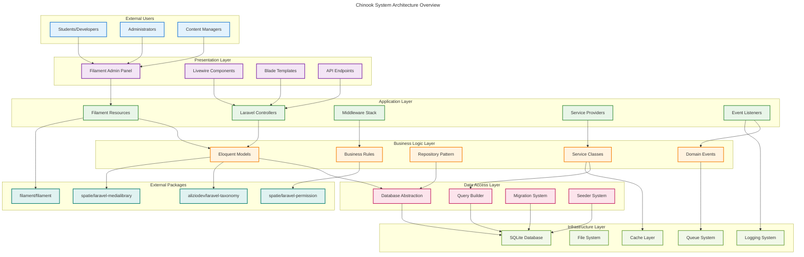
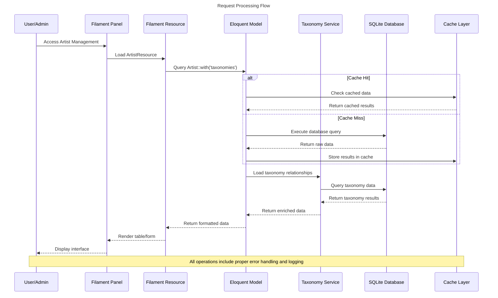
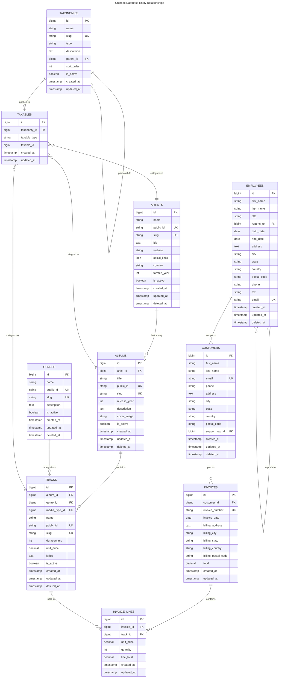
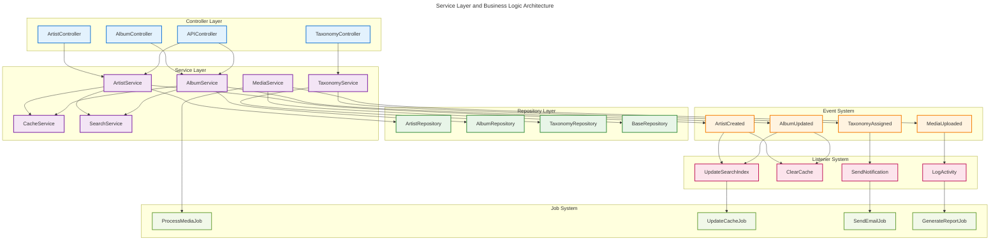
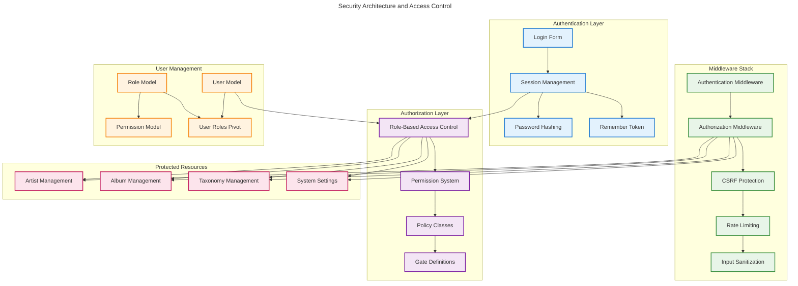
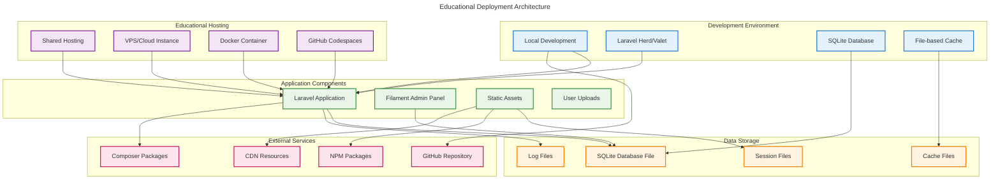

# Enhanced Architectural Diagrams

**Version:** 1.0  
**Created:** 2025-07-16  
**Last Updated:** 2025-07-16  
**Scope:** Comprehensive architectural visualization for Chinook project

## Table of Contents

1. [Overview](#1-overview)
2. [System Architecture](#2-system-architecture)
3. [Database Architecture](#3-database-architecture)
4. [Application Layer Architecture](#4-application-layer-architecture)
5. [Security Architecture](#5-security-architecture)
6. [Deployment Architecture](#6-deployment-architecture)

## 1. Overview

This document provides enhanced architectural diagrams for the Chinook project, offering comprehensive visual documentation that supports educational objectives and system understanding.

### 1.1 Diagram Standards

All diagrams follow the established visual documentation standards:
- **WCAG 2.1 AA compliant** color schemes and contrast ratios
- **Accessible markup** with proper alt text and descriptions
- **Educational focus** with clear labels and explanations
- **Consistent styling** across all architectural views

## 2. System Architecture

### 2.1 High-Level System Overview

### 2.2 Component Interaction Flow

## 3. Database Architecture

### 3.1 Entity Relationship Overview

## 4. Application Layer Architecture

### 4.1 Filament Resource Architecture

```mermaid
---
title: Filament Resource Component Architecture
---
graph TB
    subgraph "Resource Layer"
        R1[ArtistResource]
        R2[AlbumResource]
        R3[TrackResource]
        R4[TaxonomyResource]
    end

    subgraph "Page Components"
        P1[ListPage]
        P2[CreatePage]
        P3[EditPage]
        P4[ViewPage]
    end

    subgraph "Form Components"
        F1[TextInput]
        F2[Textarea]
        F3[Select]
        F4[FileUpload]
        F5[Repeater]
        F6[TaxonomySelect]
    end

    subgraph "Table Components"
        T1[TextColumn]
        T2[ImageColumn]
        T3[BadgeColumn]
        T4[SelectColumn]
        T5[TaxonomyColumn]
    end

    subgraph "Action Components"
        A1[CreateAction]
        A2[EditAction]
        A3[DeleteAction]
        A4[BulkAction]
        A5[TaxonomyAction]
    end

    subgraph "Model Layer"
        M1[Artist Model]
        M2[Album Model]
        M3[Track Model]
        M4[Taxonomy Model]
    end

    %% Resource to Page connections
    R1 --> P1
    R1 --> P2
    R1 --> P3
    R1 --> P4

    %% Page to Component connections
    P2 --> F1
    P2 --> F2
    P2 --> F6
    P3 --> F1
    P3 --> F2
    P3 --> F6

    P1 --> T1
    P1 --> T3
    P1 --> T5

    P1 --> A1
    P1 --> A2
    P1 --> A3
    P1 --> A4

    %% Component to Model connections
    F6 --> M4
    T5 --> M4
    A5 --> M4

    R1 --> M1
    R2 --> M2
    R3 --> M3
    R4 --> M4

    %% Styling
    classDef resourceLayer fill:#e3f2fd,stroke:#1976d2,stroke-width:2px
    classDef pageLayer fill:#f3e5f5,stroke:#7b1fa2,stroke-width:2px
    classDef componentLayer fill:#e8f5e8,stroke:#388e3c,stroke-width:2px
    classDef modelLayer fill:#fff3e0,stroke:#f57c00,stroke-width:2px

    class R1,R2,R3,R4 resourceLayer
    class P1,P2,P3,P4 pageLayer
    class F1,F2,F3,F4,F5,F6,T1,T2,T3,T4,T5,A1,A2,A3,A4,A5 componentLayer
    class M1,M2,M3,M4 modelLayer
```

### 4.2 Service Layer Architecture

## 5. Security Architecture

### 5.1 Authentication and Authorization Flow

## 6. Deployment Architecture

### 6.1 Educational Deployment Model

---

## Navigation

- **Previous:** [Visual Documentation Standards](./500-visual-documentation-standards.md)
- **Next:** [Performance Benchmarking Data](./700-performance-benchmarking-data.md)
- **Index:** [Chinook Documentation Index](./000-chinook-index.md)

## Related Documentation

- [Database Configuration Guide](./000-database-configuration-guide.md)
- [Filament Panel Architecture](./filament/diagrams/060-filament-panel-architecture.md)

---

**Last Updated:** 2025-07-16  
**Maintainer:** Technical Documentation Team  
**Source:** [GitHub Repository](https://github.com/s-a-c/chinook)
