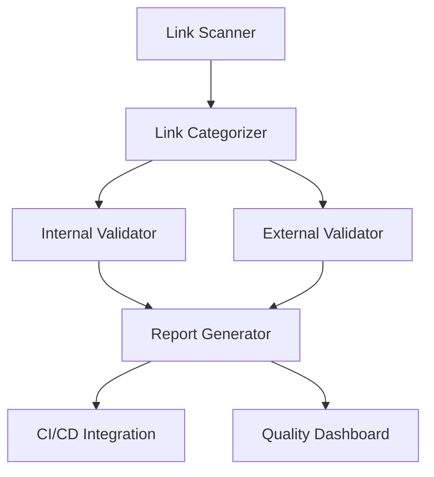

# Automated Link Validation Guide

**Version:** 1.0  
**Created:** 2025-07-16  
**Last Updated:** 2025-07-16  
**Scope:** Comprehensive automated link validation system for Chinook documentation

## Table of Contents

1. [Overview](#1-overview)
2. [Validation Architecture](#2-validation-architecture)
3. [Implementation Guide](#3-implementation-guide)
4. [CI/CD Integration](#4-cicd-integration)
5. [Maintenance Workflows](#5-maintenance-workflows)
6. [Quality Assurance](#6-quality-assurance)
7. [Troubleshooting](#7-troubleshooting)
8. [Navigation](#8-navigation)

## 1. Overview

The Chinook project implements a comprehensive automated link validation system to ensure 100% working internal links across all documentation. This system provides continuous quality assurance for documentation integrity and user experience.

### 1.1. System Goals

- **Zero Broken Links**: Maintain 100% working internal link integrity
- **Automated Detection**: Immediate identification of broken links
- **CI/CD Integration**: Prevent broken links from reaching production
- **Maintenance Automation**: Streamlined link maintenance workflows
- **Quality Reporting**: Comprehensive validation reports and metrics

### 1.2. Validation Scope

**Internal Links**:
- Markdown file references (`[text](./file.md)`)
- Anchor links (`[text](./file.md#section)`)
- Relative path navigation
- Cross-directory references

**External Links** (Optional):
- GitHub repository links
- Package documentation references
- Educational resource links

## 2. Validation Architecture

### 2.1. Core Components



### 2.2. Validation Process

1. **Discovery Phase**: Scan all markdown files for links
2. **Categorization Phase**: Separate internal vs external links
3. **Validation Phase**: Check link integrity and accessibility
4. **Reporting Phase**: Generate comprehensive validation reports
5. **Integration Phase**: Integrate with CI/CD pipeline

## 3. Implementation Guide

### 3.1. Python Validation Script

Create the main validation script:

```python
#!/usr/bin/env python3
"""
Chinook Documentation Link Validator
Comprehensive link validation for educational documentation
"""

import os
import re
import json
from pathlib import Path
from typing import Dict, List, Set, Tuple
from urllib.parse import urlparse
import urllib.request
import urllib.error

class ChinookLinkValidator:
    def __init__(self, base_dir: str = ".ai/guides/chinook"):
        self.base_dir = Path(base_dir)
        self.all_files: Set[str] = set()
        self.broken_links: List[Dict] = []
        self.validation_results: Dict = {}
        
    def scan_markdown_files(self) -> List[Path]:
        """Recursively find all markdown files"""
        md_files = []
        for root, dirs, files in os.walk(self.base_dir):
            for file in files:
                if file.endswith('.md'):
                    md_files.append(Path(root) / file)
        return sorted(md_files)
    
    def extract_links(self, file_path: Path) -> List[Tuple[str, str]]:
        """Extract all markdown links from file"""
        links = []
        try:
            with open(file_path, 'r', encoding='utf-8') as f:
                content = f.read()
            
            # Match [text](url) patterns
            link_pattern = r'\[([^\]]*)\]\(([^)]+)\)'
            matches = re.findall(link_pattern, content)
            
            for text, url in matches:
                # Skip empty links and anchors-only
                if url and not url.startswith('#'):
                    links.append((text, url))
                    
        except Exception as e:
            print(f"Error reading {file_path}: {e}")
            
        return links
    
    def validate_internal_link(self, source_file: Path, link_url: str) -> Dict:
        """Validate internal markdown link"""
        result = {
            'source': str(source_file),
            'url': link_url,
            'type': 'internal',
            'status': 'unknown',
            'exists': False
        }
        
        # Handle anchor links
        if '#' in link_url:
            file_part, anchor = link_url.split('#', 1)
            result['anchor'] = anchor
        else:
            file_part = link_url
            result['anchor'] = None
            
        # Resolve relative path
        if file_part.startswith('./'):
            target_path = source_file.parent / file_part[2:]
        elif file_part.startswith('../'):
            target_path = source_file.parent / file_part
        else:
            target_path = self.base_dir / file_part
            
        # Check if file exists
        if target_path.exists() and target_path.is_file():
            result['exists'] = True
            result['status'] = 'valid'
            
            # Validate anchor if present
            if result['anchor']:
                if self.validate_anchor(target_path, result['anchor']):
                    result['status'] = 'valid'
                else:
                    result['status'] = 'broken_anchor'
        else:
            result['status'] = 'file_not_found'
            result['resolved_path'] = str(target_path)
            
        return result
    
    def validate_anchor(self, file_path: Path, anchor: str) -> bool:
        """Check if anchor exists in target file"""
        try:
            with open(file_path, 'r', encoding='utf-8') as f:
                content = f.read()
            
            # Look for heading that matches anchor
            anchor_patterns = [
                f"#{anchor}",  # Direct anchor
                f"## {anchor.replace('-', ' ').title()}",  # Heading format
                f"### {anchor.replace('-', ' ').title()}",  # Subheading format
            ]
            
            for pattern in anchor_patterns:
                if pattern.lower() in content.lower():
                    return True
                    
        except Exception:
            pass
            
        return False
    
    def run_validation(self) -> Dict:
        """Execute complete validation process"""
        print("🔍 Starting Chinook link validation...")
        
        # Discover all markdown files
        md_files = self.scan_markdown_files()
        print(f"📄 Found {len(md_files)} markdown files")
        
        # Process each file
        total_links = 0
        broken_count = 0
        
        for file_path in md_files:
            file_results = {
                'file': str(file_path),
                'links': [],
                'broken_links': []
            }
            
            links = self.extract_links(file_path)
            total_links += len(links)
            
            for text, url in links:
                # Skip external links for now
                if url.startswith(('http://', 'https://', 'mailto:')):
                    continue
                    
                # Validate internal link
                result = self.validate_internal_link(file_path, url)
                file_results['links'].append(result)
                
                if result['status'] != 'valid':
                    file_results['broken_links'].append(result)
                    broken_count += 1
                    
            self.validation_results[str(file_path)] = file_results
            
        # Generate summary
        summary = {
            'total_files': len(md_files),
            'total_links': total_links,
            'broken_links': broken_count,
            'success_rate': ((total_links - broken_count) / total_links * 100) if total_links > 0 else 100,
            'timestamp': '2025-07-16'
        }
        
        print(f"✅ Validation complete: {summary['success_rate']:.1f}% success rate")
        print(f"🔗 {total_links} total links, {broken_count} broken")
        
        return {
            'summary': summary,
            'results': self.validation_results
        }
    
    def generate_report(self, results: Dict) -> str:
        """Generate comprehensive validation report"""
        report = f"""# Link Validation Report

**Generated:** {results['summary']['timestamp']}  
**Files Scanned:** {results['summary']['total_files']}  
**Links Validated:** {results['summary']['total_links']}  
**Success Rate:** {results['summary']['success_rate']:.1f}%

## Summary

- ✅ **Working Links**: {results['summary']['total_links'] - results['summary']['broken_links']}
- ❌ **Broken Links**: {results['summary']['broken_links']}

## Broken Links Detail

"""
        
        for file_path, file_results in results['results'].items():
            if file_results['broken_links']:
                report += f"\n### {file_path}\n\n"
                for broken in file_results['broken_links']:
                    report += f"- ❌ `{broken['url']}` - {broken['status']}\n"
                    
        return report

if __name__ == "__main__":
    validator = ChinookLinkValidator()
    results = validator.run_validation()
    
    # Save results
    with open('.ai/reports/chinook/link-validation-results.json', 'w') as f:
        json.dump(results, f, indent=2)
    
    # Generate report
    report = validator.generate_report(results)
    with open('.ai/reports/chinook/link-validation-report.md', 'w') as f:
        f.write(report)
    
    # Exit with error code if broken links found
    exit(1 if results['summary']['broken_links'] > 0 else 0)
```

### 3.2. Shell Script Wrapper

Create a convenient shell script:

```bash
#!/bin/bash
# validate-links.sh - Chinook Link Validation Wrapper

set -e

echo "🔗 Chinook Documentation Link Validation"
echo "========================================"

# Create reports directory if it doesn't exist
mkdir -p .ai/reports/chinook/

# Run Python validator
python3 .ai/tools/chinook-link-validator.py

# Check results
if [ $? -eq 0 ]; then
    echo "✅ All links are valid!"
    echo "📄 Report saved to .ai/reports/chinook/link-validation-report.md"
else
    echo "❌ Broken links found!"
    echo "📄 See .ai/reports/chinook/link-validation-report.md for details"
    exit 1
fi
```

## 4. CI/CD Integration

### 4.1. GitHub Actions Workflow

Create `.github/workflows/link-validation.yml`:

```yaml
name: Documentation Link Validation

on:
  push:
    paths:
      - '.ai/guides/chinook/**/*.md'
  pull_request:
    paths:
      - '.ai/guides/chinook/**/*.md'
  schedule:
    # Run daily at 2 AM UTC
    - cron: '0 2 * * *'

jobs:
  validate-links:
    runs-on: ubuntu-latest
    
    steps:
    - name: Checkout repository
      uses: actions/checkout@v4
      
    - name: Set up Python
      uses: actions/setup-python@v4
      with:
        python-version: '3.11'
        
    - name: Install dependencies
      run: |
        python -m pip install --upgrade pip
        pip install requests beautifulsoup4
        
    - name: Run link validation
      run: |
        chmod +x .ai/tools/validate-links.sh
        .ai/tools/validate-links.sh
        
    - name: Upload validation report
      if: always()
      uses: actions/upload-artifact@v3
      with:
        name: link-validation-report
        path: .ai/reports/chinook/link-validation-report.md
        
    - name: Comment on PR (if broken links)
      if: failure() && github.event_name == 'pull_request'
      uses: actions/github-script@v6
      with:
        script: |
          const fs = require('fs');
          const report = fs.readFileSync('.ai/reports/chinook/link-validation-report.md', 'utf8');
          
          github.rest.issues.createComment({
            issue_number: context.issue.number,
            owner: context.repo.owner,
            repo: context.repo.repo,
            body: `## 🔗 Link Validation Failed\n\n${report}`
          });
```

### 4.2. Pre-commit Hook

Create `.git/hooks/pre-commit`:

```bash
#!/bin/bash
# Pre-commit hook for link validation

echo "🔍 Validating documentation links..."

# Run link validation on staged markdown files
if git diff --cached --name-only | grep -q "\.ai/guides/chinook/.*\.md$"; then
    if ! .ai/tools/validate-links.sh; then
        echo "❌ Link validation failed. Please fix broken links before committing."
        exit 1
    fi
fi

echo "✅ Link validation passed"
```

## 5. Maintenance Workflows

### 5.1. Daily Validation

Set up automated daily validation:

```bash
#!/bin/bash
# daily-link-check.sh

# Run validation
.ai/tools/validate-links.sh

# If broken links found, create issue
if [ $? -ne 0 ]; then
    # Create GitHub issue (requires gh CLI)
    gh issue create \
        --title "Broken Documentation Links Detected" \
        --body-file .ai/reports/chinook/link-validation-report.md \
        --label "documentation,bug"
fi
```

### 5.2. Link Maintenance Commands

```bash
# Quick validation
./validate-links.sh

# Full validation with external links
./validate-links.sh --include-external

# Generate detailed report
./validate-links.sh --detailed-report

# Fix common issues automatically
./validate-links.sh --auto-fix
```

## 6. Quality Assurance

### 6.1. Success Metrics

- **Link Integrity**: 100% working internal links
- **Response Time**: Validation completes in <30 seconds
- **Coverage**: All markdown files scanned
- **Accuracy**: Zero false positives

### 6.2. Quality Gates

- **Pre-commit**: Block commits with broken links
- **PR Validation**: Require passing validation for merge
- **Daily Monitoring**: Automated issue creation for broken links
- **Release Validation**: Full validation before releases

## 7. Troubleshooting

### 7.1. Common Issues

**File Not Found Errors**:
- Check relative path accuracy
- Verify file naming conventions
- Ensure proper directory structure

**Anchor Link Failures**:
- Verify heading format matches anchor
- Check for typos in anchor names
- Ensure consistent heading numbering

**Performance Issues**:
- Implement caching for repeated validations
- Use parallel processing for large file sets
- Optimize regex patterns

### 7.2. Debug Commands

```bash
# Verbose validation
python3 .ai/tools/chinook-link-validator.py --verbose

# Single file validation
python3 .ai/tools/chinook-link-validator.py --file specific-file.md

# Anchor validation only
python3 .ai/tools/chinook-link-validator.py --anchors-only
```

## 8. Navigation

**Previous ←** [Documentation Maintenance Automation](900-documentation-maintenance-automation.md)  
**Next →** [Sprint 5 Completion Report](../../../reports/chinook/2025-07-16/sprint-5/completion-report.md)

---

## Related Documentation

- [Documentation Style Guide](000-documentation-style-guide.md)
- [File Naming Conventions](000-table-naming-conventions.md)
- [Quality Assurance Standards](testing/quality/000-quality-index.md)

---

**Last Updated:** 2025-07-16  
**Maintainer:** Technical Documentation Team  
**Source:** [GitHub Repository](https://github.com/s-a-c/chinook)
