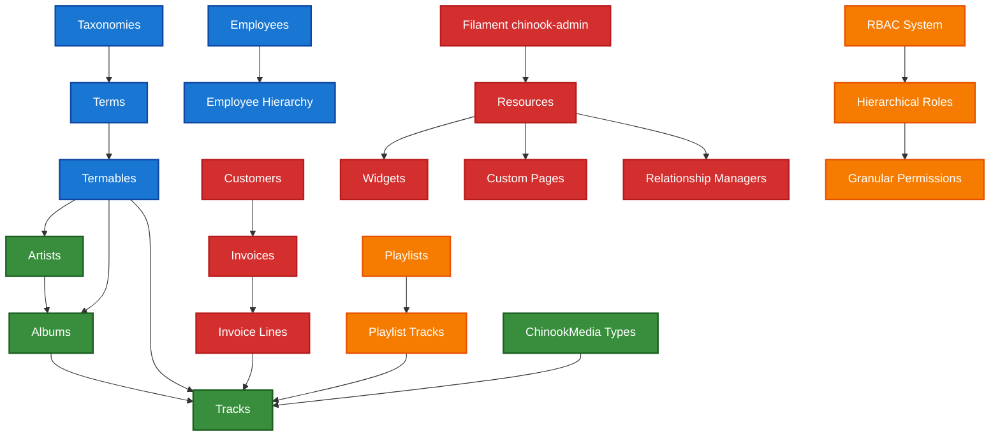

# 1. Chinook Database & Filament 4 Admin Panel Implementation Guide

**Refactored from:** `.ai/guides/chinook/README.md` on 2025-07-11

## 1.1 Greenfield Single Taxonomy System Implementation

This directory contains comprehensive documentation for implementing the Chinook music database with modern Laravel 12 features, **single taxonomy system** using `aliziodev/laravel-taxonomy`, enterprise-grade enhancements, and a production-ready Filament 4 admin panel named `chinook-admin`.

**🆕 Latest Update (2025-07-11):** ✅ **Greenfield Implementation** - Single taxonomy system using `aliziodev/laravel-taxonomy` package with complete elimination of custom Category models and Categorizable traits.

## 1.2 Table of Contents

- [1.3 Quick Navigation](#13-quick-navigation)
- [1.4 Key Features](#14-key-features)
- [1.5 Getting Started](#15-getting-started)
- [1.6 Architecture Overview](#16-architecture-overview)
- [1.7 Documentation Priority Order](#17-documentation-priority-order)
- [1.8 Critical Requirements](#18-critical-requirements)
- [1.9 Implementation Roadmap](#19-implementation-roadmap)

## 1.3 Quick Navigation

### 1.3.1 📚 Complete Guide Index

**[Chinook Index Guide](000-chinook-index.md)** - Comprehensive index with detailed descriptions, implementation checklist, and cross-references

### 1.3.2 🏗️ Core Database Implementation (✅ Greenfield Single Taxonomy)

1. **[Chinook Models Guide](010-chinook-models-guide.md)** - ✅ **Greenfield** Enterprise-grade Laravel Eloquent models with RBAC and single taxonomy system
2. **[Chinook Migrations Guide](020-chinook-migrations-guide.md)** - ✅ **Greenfield** Database schema with RBAC and single taxonomy integration
3. **[Chinook Factories Guide](030-chinook-factories-guide.md)** - ✅ **Greenfield** Advanced model factories with realistic data generation
4. **[Chinook Seeders Guide](040-chinook-seeders-guide.md)** - ✅ **Greenfield** Comprehensive database seeders with single taxonomy system
5. **[Chinook Advanced Features Guide](050-chinook-advanced-features-guide.md)** - ✅ **Greenfield** RBAC, performance optimization, and enterprise patterns
6. **[Chinook Media Library Guide](060-chinook-media-library-guide.md)** - ✅ **Greenfield** Spatie Media Library integration with taxonomy system
7. **[Chinook Hierarchy Comparison Guide](070-chinook-hierarchy-comparison-guide.md)** - ✅ **Greenfield** Single taxonomy architecture analysis
8. **[Visual Documentation Guide](080-visual-documentation-guide.md)** - ✅ **Greenfield** WCAG 2.1 AA compliant visual standards
9. **[Relationship Mapping Guide](090-relationship-mapping.md)** - ✅ **Greenfield** Modern Laravel 12 relationship patterns
10. **[Resource Testing Guide](100-resource-testing.md)** - ✅ **Greenfield** Comprehensive testing strategies
11. **[Authentication Flow Guide](115-authentication-flow.md)** - ✅ **Greenfield** Enterprise authentication and authorization
12. **[Laravel Query Builder Guide](120-laravel-query-builder-guide.md)** - ✅ **Greenfield** Advanced query building with taxonomy
13. **[Comprehensive Data Access Guide](130-comprehensive-data-access-guide.md)** - ✅ **Greenfield** CLI, web, and API access patterns

### 1.3.3 🏷️ Single Taxonomy System Documentation (✅ Greenfield Implementation)

**[Aliziodev Laravel Taxonomy Guide](packages/110-aliziodev-laravel-taxonomy-guide.md)** - ✅ **Greenfield** Complete single taxonomy system implementation with genre preservation strategy

**[Single Taxonomy Architecture](070-chinook-hierarchy-comparison-guide.md)** - ✅ **Greenfield** Visual documentation with WCAG 2.1 AA compliant Mermaid diagrams showing unified taxonomy system

### 1.3.4 🎛️ Filament 4 Admin Panel Documentation

14. **[Filament Panel Overview](filament/000-filament-index.md)** - Complete overview of the Filament admin panel implementation
15. **Panel Setup Guide** - Complete panel configuration, authentication, and RBAC integration *(Documentation pending)*
16. **[Model Standards](filament/models/000-models-index.md)** - Laravel 12 model implementations with required traits and modern patterns
17. **[Resource Documentation](filament/resources/000-resources-index.md)** - Detailed Filament resource configurations for all Chinook entities
18. **[Advanced Features](filament/features/000-features-index.md)** - Widgets, custom pages, dashboard configuration, and advanced functionality
19. **Testing Guide** - Comprehensive testing strategies and quality assurance *(Documentation pending)*
20. **[Deployment Guide](filament/deployment/000-deployment-index.md)** - Production deployment, optimization, and monitoring
21. **[Visual Documentation](filament/diagrams/000-diagrams-index.md)** - WCAG 2.1 AA compliant Mermaid ERDs and DBML schema files

### 1.3.5 🎨 Frontend Development

22. **[Frontend Index](frontend/000-frontend-index.md)** - Complete frontend development guide index
23. **[Frontend Architecture Overview](frontend/100-frontend-architecture-overview.md)** - Modern frontend architecture with Livewire/Volt
24. **[Volt Functional Patterns](frontend/110-volt-functional-patterns-guide.md)** - Functional programming patterns with Livewire Volt
25. **[Flux Component Integration](frontend/120-flux-component-integration-guide.md)** - Laravel Flux UI component integration
26. **[SPA Navigation Guide](frontend/130-spa-navigation-guide.md)** - Single Page Application navigation patterns
27. **[Accessibility WCAG Guide](frontend/140-accessibility-wcag-guide.md)** - WCAG 2.1 AA compliance implementation
28. **[Performance Optimization](frontend/150-performance-optimization-guide.md)** - Frontend performance optimization strategies
29. **[Testing Approaches](frontend/165-testing-approaches-guide.md)** - Frontend testing methodologies
30. **[Performance Monitoring](frontend/170-performance-monitoring-guide.md)** - Frontend performance monitoring tools
31. **[API Testing Guide](frontend/180-api-testing-guide.md)** - API testing strategies and patterns
32. **[CI/CD Integration](frontend/190-cicd-integration-guide.md)** - Continuous integration and deployment

### 1.3.6 📦 Laravel Package Integration

33. **[Essential Packages](packages/000-packages-index.md)** - Comprehensive implementation guides for Laravel packages (Backup, Pulse, Telescope, Octane, Horizon, Data, Fractal, Sanctum)

### 1.3.7 🧪 Testing Documentation

34. **[Testing Guide](testing/000-testing-index.md)** - Comprehensive testing strategies, examples, and best practices

### 1.3.8 📊 Database Schema Resources

- **[DBML Schema](chinook-schema.dbml)** - Complete database schema definition with aliziodev/laravel-taxonomy integration
- **SQL Schema** - SQL implementation reference for database setup *(External reference)*

### 1.3.9 📋 Documentation Audit

- **Documentation Quality Validation** - Comprehensive audit of all documentation with status tracking *(Documentation pending)*

## 1.4 Key Features

### 1.4.1 Modern Laravel 12 Implementation

- **Single Taxonomy System**: aliziodev/laravel-taxonomy package for all categorization needs
- **Polymorphic Relationships**: Flexible term assignment to any model via termables table
- **Role-Based Access Control**: Spatie Laravel Permission with hierarchical roles (Super Admin > Admin > Manager > Editor > Customer Service > User > Guest)
- **Modern Eloquent Features**: casts() method, secondary keys, slugs, user stamps
- **Enterprise Patterns**: Soft deletes, timestamps, audit logging

### 1.4.2 Production-Ready Filament 4 Admin Panel (`chinook-admin`)

- **Dedicated Panel**: Service provider registration with proper middleware
- **Native Authentication**: Filament's built-in auth with spatie/laravel-permission integration
- **Comprehensive Resources**: All Chinook entities with relationship managers
- **Advanced Widgets**: Real-time analytics, KPI dashboards, Chart.js integration
- **Custom Pages**: Employee hierarchy viewer, sales analytics, music discovery
- **Global Search**: Cross-resource search with weighted results
- **Import/Export**: CSV/Excel with validation and error reporting
- **WCAG 2.1 AA Compliant**: 4.5:1 contrast ratios, screen reader support

### 1.4.3 Enhanced Chinook Schema with Taxonomy Integration

- **11 Core Tables**: Artists, Albums, Tracks, Customers, Employees, Invoices, etc.
- **Taxonomy System**: Taxonomies, Terms, and Termables tables from aliziodev/laravel-taxonomy
- **Genre Preservation**: Bridge layer for existing genre data migration
- **Performance Optimized**: Strategic indexing and query optimization
- **Audit Logging**: spatie/laravel-activitylog for sensitive operations

## 1.5 Getting Started

### 1.5.1 Prerequisites

- Laravel 12.x with PHP 8.4+
- Filament 4.x
- Required packages: aliziodev/laravel-taxonomy, spatie/laravel-permission, spatie/laravel-activitylog, wildside/userstamps, glhd/bits

### 1.5.2 Database Implementation

1. **Review the Models Guide** to understand the enhanced data structure with taxonomy integration
2. **Run the Migrations** to create the database schema including taxonomy tables
3. **Configure RBAC** using the advanced features guide
4. **Seed Test Data** using the provided seeders with taxonomy terms
5. **Implement Media Library** for file management with taxonomy categorization

### 1.5.3 Filament Admin Panel Implementation

1. **Setup Panel Configuration** following the setup guide
2. **Configure Authentication** with RBAC integration
3. **Implement Resources** for all Chinook entities with taxonomy support
4. **Add Advanced Features** like widgets and custom pages
5. **Deploy to Production** using the deployment guide

## 1.6 Architecture Overview

**Accessibility Note:** This system architecture diagram shows the relationships between core Chinook entities including Artists, Albums, Tracks, Taxonomies, Terms, Customers, Invoices, Playlists, and the Filament admin panel. The diagram uses WCAG 2.1 AA compliant colors with high contrast ratios for optimal accessibility.

## 1.7 Documentation Priority Order

1. **Core database implementation** (010-130 series guides) with taxonomy integration
2. **Filament panel setup and authentication** (filament/setup/)
3. **Basic CRUD resource implementations** (filament/resources/) with taxonomy support
4. **Relationship managers and advanced filtering** (filament/features/) including taxonomy filters
5. **Custom pages and dashboard widgets** (filament/features/) with taxonomy analytics
6. **Frontend architecture and components** (frontend/) with taxonomy navigation
7. **Testing strategies and implementation** (testing/) including taxonomy testing
8. **Package integration and deployment** (packages/, filament/deployment/)

## 1.8 Critical Requirements

- All code examples use Laravel 12 modern syntax (casts() method, current framework patterns)
- Include required trait implementations (HasTaxonomies from aliziodev/laravel-taxonomy)
- Document spatie/laravel-permission integration with hierarchical role structure
- Provide WCAG 2.1 AA compliant visual documentation with proper contrast ratios
- Include Mermaid v10.6+ syntax for all diagrams
- Document aliziodev/laravel-taxonomy architecture for all categorization needs
- Ensure all examples follow established architectural preferences for maintainable, scalable solutions
- Complete elimination of custom Category models and Categorizable traits

## 1.9 Implementation Roadmap

### 1.9.1 Phase 1: Core Database Foundation (Weeks 1-2)

- **Models & Architecture**: Enterprise-grade Eloquent models with RBAC and taxonomy integration
- **Database Schema**: Migrations with aliziodev/laravel-taxonomy integration
- **Data Generation**: Advanced factories and comprehensive seeders with taxonomy terms
- **Testing Foundation**: Basic model and relationship testing including taxonomy

### 1.9.2 Phase 2: Advanced Features (Week 3)

- **RBAC Implementation**: Role-based access control with hierarchical permissions
- **Media Integration**: Spatie Media Library with taxonomy categorization
- **Performance Optimization**: Query optimization and caching strategies for taxonomy
- **Architecture Analysis**: Single taxonomy system data management

### 1.9.3 Phase 3: Filament Admin Panel (Weeks 4-5)

- **Panel Configuration**: Authentication, RBAC, and security setup
- **Resource Development**: Complete CRUD operations for all entities with taxonomy support
- **Advanced Features**: Widgets, custom pages, and analytics with taxonomy insights
- **Testing & QA**: Comprehensive admin panel testing including taxonomy operations

### 1.9.4 Phase 4: Frontend Development (Week 6)

- **Architecture Setup**: Livewire/Volt functional patterns with taxonomy navigation
- **UI Integration**: Flux UI components and SPA navigation with taxonomy filters
- **Accessibility**: WCAG 2.1 AA compliance implementation
- **Performance**: Frontend optimization and monitoring

### 1.9.5 Phase 5: Production Deployment (Week 7)

- **Environment Setup**: Production configuration and optimization
- **Package Integration**: Essential Laravel packages including aliziodev/laravel-taxonomy
- **Monitoring**: Performance and error tracking setup
- **Security Hardening**: Production security configurations

### 1.9.6 Phase 6: Documentation & Maintenance (Week 8)

- **Visual Documentation**: Mermaid diagrams and DBML schemas with taxonomy
- **Testing Coverage**: Comprehensive test suite completion
- **Performance Validation**: Load testing and optimization
- **Documentation Review**: Final documentation and cross-reference validation

---

**Next**: [Chinook Index Guide](000-chinook-index.md) | **Previous**: [Data Access Guide](130-comprehensive-data-access-guide.md)

---

*This README provides the primary entry point for the comprehensive Chinook implementation using Laravel 12, Filament 4, and the aliziodev/laravel-taxonomy package for unified taxonomy management.*

[⬆️ Back to Top](#1-chinook-database--filament-4-admin-panel-implementation-guide)
