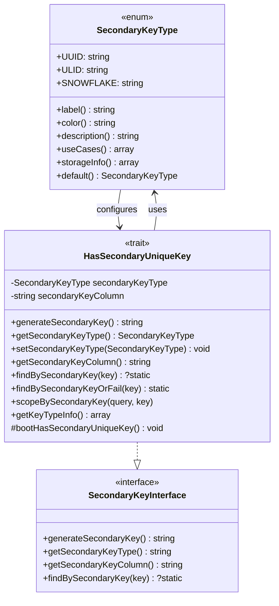
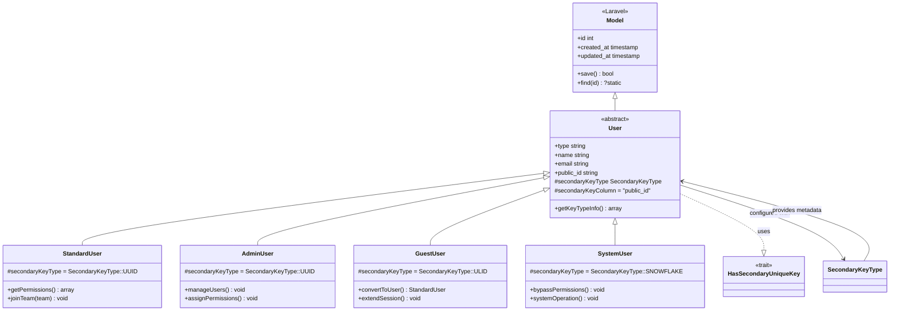
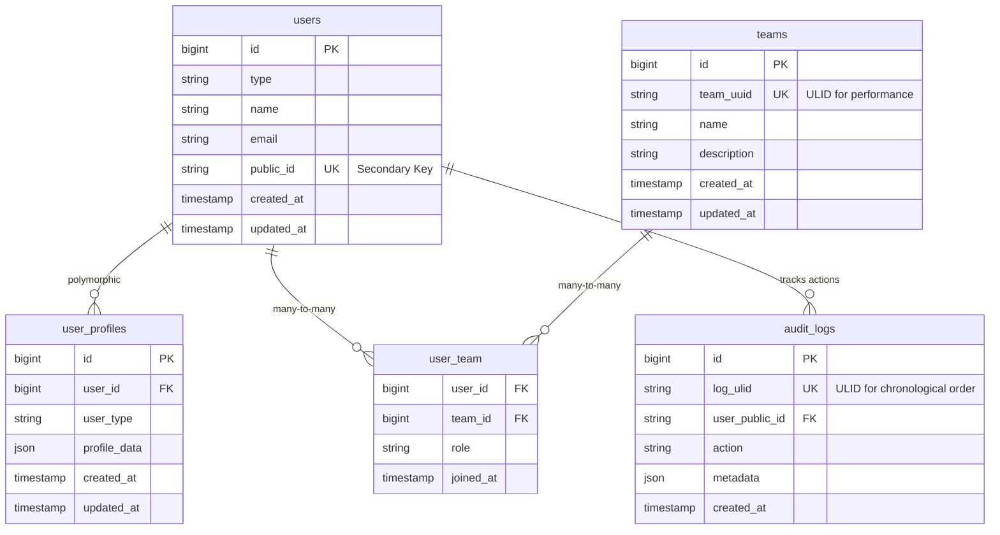
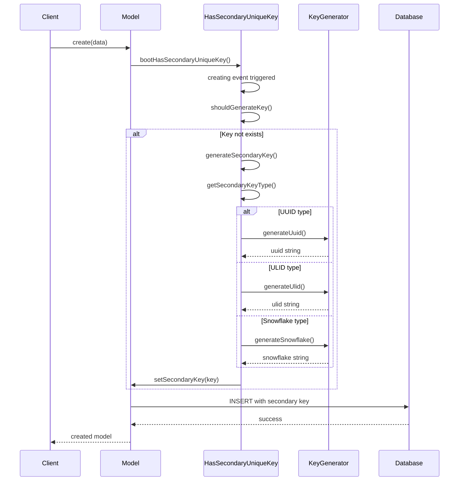
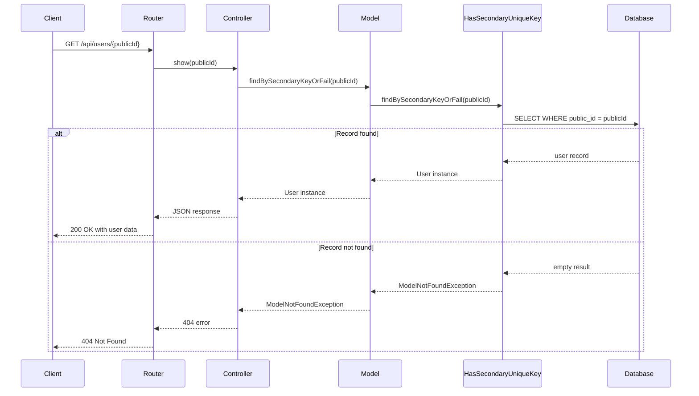

# 1. Secondary Unique Key Trait Design Guide

## 1.1. Overview

This guide explains how to design and build a trait that provides a secondary unique key property to Laravel models. The trait supports multiple identifier types including UUID v7, ULID, and Snowflake IDs through an enhanced native PHP enum with color and label metadata. The trait is configurable with sensible defaults: Snowflake as the default type and `public_id` as the default column name, allowing developers to choose the appropriate identifier type based on security, performance, distributed system requirements, and business needs.

## 1.2. Table of Contents

1. [Overview](#11-overview)
2. [Learning Objectives](#12-learning-objectives)
3. [Prerequisite Knowledge](#13-prerequisite-knowledge)
4. [Enhanced SecondaryKeyType Enum](#14-enhanced-secondarykeytype-enum)
5. [Supported Identifier Types](#15-supported-identifier-types)
6. [Trait Design and Implementation](#16-trait-design-and-implementation)
7. [Implementation Diagrams](#17-implementation-diagrams)
8. [Configuration Options](#18-configuration-options)
9. [Identifier Type Comparison](#19-identifier-type-comparison)
10. [Pros and Cons Analysis](#110-pros-and-cons-analysis)
11. [Implementation Examples](#111-implementation-examples)
12. [Migration Examples](#112-migration-examples)
13. [Factory and Seeder Integration](#113-factory-and-seeder-integration)
14. [Best Practices](#114-best-practices)
15. [Package Dependencies](#115-package-dependencies)

## 1.3. Learning Objectives

After completing this guide, you will:
- Understand the design principles behind the secondary key trait
- Implement UUID, ULID, or Snowflake secondary keys using the enhanced enum
- Choose between UUID, ULID, and Snowflake based on specific requirements
- Integrate the trait with existing Laravel architecture
- Handle key generation, validation, and querying efficiently
- Configure distributed Snowflake generation for multi-server environments
- Utilize the enhanced PHP enum with Filament UI integration

## 1.4. Prerequisite Knowledge

- Laravel Eloquent ORM and traits
- PHP 8.1+ enum syntax and features
- Basic knowledge of UUID, ULID, and Snowflake formats
- Database indexing concepts
- Distributed systems concepts (for Snowflake usage)

## 1.5. Enhanced SecondaryKeyType Enum

The trait system uses an enhanced PHP enum that implements Filament UI contracts for rich metadata and visual identification:

```php
<?php

declare(strict_types=1);

namespace App\Enums;

use Filament\Support\Contracts\HasColor;
use Filament\Support\Contracts\HasDescription;
use Filament\Support\Contracts\HasIcon;
use Filament\Support\Contracts\HasLabel;

enum SecondaryKeyType: string implements HasColor, HasDescription, HasIcon, HasLabel
{
    case UUID = 'uuid';
    case ULID = 'ulid';
    case SNOWFLAKE = 'snowflake';

    /**
     * Get the default key type (Snowflake for optimal performance)
     */
    public static function default(): self
    {
        return self::SNOWFLAKE;
    }

    /**
     * Get the display label for the key type
     */
    public function getLabel(): string
    {
        return match ($this) {
            self::UUID => 'UUID v7',
            self::ULID => 'ULID',
            self::SNOWFLAKE => 'Snowflake',
        };
    }

    /**
     * Get the color associated with the key type (for UI/documentation)
     */
    public function getColor(): string
    {
        return match ($this) {
            self::UUID => 'info',
            self::ULID => 'primary',
            self::SNOWFLAKE => 'gray',
        };
    }

    /**
     * Get the description for the key type
     */
    public function getDescription(): string
    {
        return match ($this) {
            self::UUID => 'Industry standard with timestamp ordering (Laravel 12 default)',
            self::ULID => 'Compact, case-insensitive with natural sorting',
            self::SNOWFLAKE => 'Distributed system optimized with embedded metadata',
        };
    }

    /**
     * Get the icon for the key type
     */
    public function getIcon(): string
    {
        return match ($this) {
            self::UUID => 'heroicon-o-identification',
            self::ULID => 'heroicon-o-key',
            self::SNOWFLAKE => 'heroicon-o-finger-print',
        };
    }

    /**
     * Get the typical use cases for the key type
     */
    public function useCases(): array
    {
        return match ($this) {
            self::UUID => [
                'Standards compliance',
                'Legacy system integration',
                'Regulatory requirements',
                'Security-critical applications',
            ],
            self::ULID => [
                'Storage efficiency',
                'URL-friendly identifiers',
                'High-volume logging',
                'Time-series data',
            ],
            self::SNOWFLAKE => [
                'Distributed systems',
                'Microservices architecture',
                'Multi-tenant applications',
                'Maximum performance requirements',
            ],
        };
    }

    /**
     * Get the storage characteristics
     */
    public function storageInfo(): array
    {
        return match ($this) {
            self::UUID => [
                'length' => 36,
                'format' => 'string',
                'bytes' => 16,
                'encoding' => 'hexadecimal',
            ],
            self::ULID => [
                'length' => 26,
                'format' => 'string',
                'bytes' => 16,
                'encoding' => 'base32',
            ],
            self::SNOWFLAKE => [
                'length' => 19,
                'format' => 'integer',
                'bytes' => 8,
                'encoding' => 'integer',
            ],
        };
    }
}
```

## 1.6. Introduction

A secondary unique key trait provides models with an additional unique identifier that can be used for public-facing operations while keeping the primary key (usually an auto-incrementing integer) for internal database operations. This approach offers several benefits:

- **Security**: Hides internal database structure and prevents enumeration attacks
- **Flexibility**: Allows for distributed systems and database migrations
- **Performance**: Maintains fast integer-based joins while providing public identifiers
- **Compatibility**: Works with existing Laravel conventions and relationships

## 1.7. Supported Identifier Types

### 1.7.1. UUID v7 (Universally Unique Identifier Version 7)

#### 1.7.1.1. Structure and Format
```
UUID v7: xxxxxxxx-xxxx-7xxx-yxxx-xxxxxxxxxxxx
Example: 018f4230-e0e4-7000-8000-123456789abc

Components:
- 128 bits total
- 32 hexadecimal digits
- 4 hyphens as separators
- 48-bit timestamp (millisecond precision)
- Version 7 (time-ordered): 74 bits of randomness
- 6 bits for version and variant information
```

#### 1.7.1.2. Generation Algorithm
```php
// UUID v7 Generation Process (Laravel 12 default)
function generateUUIDv7(): string
{
    // 1. Get current timestamp in milliseconds (48 bits)
    $timestamp = (int)(microtime(true) * 1000);

    // 2. Generate 10 random bytes (80 bits)
    $randomBytes = random_bytes(10);

    // 3. Combine timestamp + random data
    $data = pack('J', $timestamp << 16) . substr($randomBytes, 0, 10);

    // 4. Set version (7) in bits 12-15 of time_hi_and_version
    $data[6] = chr(ord($data[6]) & 0x0f | 0x70);

    // 5. Set variant (10) in bits 6-7 of clock_seq_hi_and_reserved
    $data[8] = chr(ord($data[8]) & 0x3f | 0x80);

    // 6. Format as string with hyphens
    return vsprintf('%s%s-%s-%s-%s-%s%s%s', str_split(bin2hex($data), 4));
}
```

#### 1.7.1.3. Characteristics
- **Source**: `symfony/uid` package (Laravel 12 default)
- **Format**: 36 characters with hyphens (e.g., `01234567-89ab-cdef-0123-456789abcdef`)
- **Randomness**: 74 bits of cryptographic randomness
- **Collision Probability**: ~2.7 × 10^-23 for 1 billion UUIDs per millisecond
- **Sortability**: Lexicographically sortable by timestamp
- **Size**: 36 characters (with hyphens), 32 without
- **Encoding**: Hexadecimal (base-16)

### 1.7.2. ULID (Universally Unique Lexicographically Sortable Identifier)

#### 1.7.2.1. Structure and Format
```
ULID: TTTTTTTTTTRRRRRRRRRRRRRRR
Example: 01ARZ3NDEKTSV4RRFFQ69G5FAV

Components:
- 128 bits total
- 26 characters (Crockford's Base32)
- 48-bit timestamp (millisecond precision)
- 80 bits of randomness
```

#### 1.7.2.2. Generation Algorithm
```php
// ULID Generation Process
function generateULID(): string
{
    // 1. Get current timestamp in milliseconds
    $timestamp = (int)(microtime(true) * 1000);

    // 2. Generate 10 random bytes (80 bits)
    $randomness = random_bytes(10);

    // 3. Combine timestamp (48 bits) + randomness (80 bits)
    $binary = pack('J', $timestamp >> 16) . pack('n', $timestamp & 0xFFFF) . $randomness;

    // 4. Encode using Crockford's Base32
    return base32_encode($binary);
}
```

#### 1.7.2.3. Characteristics
- **Source**: `symfony/uid` package  
- **Format**: 26 characters, base32 encoded (e.g., `01ARZ3NDEKTSV4RRFFQ69G5FAV`)
- **Randomness**: 80 bits of cryptographic randomness
- **Collision Probability**: ~4.3 × 10^-25 for 1 billion ULIDs per millisecond
- **Sortability**: Lexicographically sortable by timestamp
- **Size**: 26 characters
- **Encoding**: Crockford's Base32 (case-insensitive)

### 1.7.3. Snowflake ID (Twitter Snowflake)

#### 1.7.3.1. Structure and Format
```
Snowflake: TTTTTTTTTTTTTTTTTTTTTTTTTTTTTTTTTTTTTTTTTTDDDDDDWWWWWSSSSSSSSSSSS
Example: 1234567890123456789 (64-bit integer)

Components:
- 64 bits total
- 41-bit timestamp (millisecond precision from custom epoch)
- 5-bit datacenter ID (0-31)
- 5-bit worker ID (0-31)
- 12-bit sequence number (0-4095)
```

#### 1.7.3.2. Generation Algorithm
```php
// Snowflake Generation Process (glhd/bits)
function generateSnowflake(): Snowflake
{
    // 1. Get current timestamp relative to custom epoch (default: 2023-01-01)
    $timestamp = (int)(microtime(true) * 1000) - $customEpoch;

    // 2. Get configured datacenter and worker IDs
    $datacenterId = config('bits.datacenter_id', 0); // 0-31
    $workerId = config('bits.worker_id', 0);         // 0-31

    // 3. Generate sequence number (auto-incremented per millisecond)
    $sequence = $this->getNextSequence($timestamp);  // 0-4095

    // 4. Combine all components into 64-bit integer
    $snowflake = ($timestamp << 22) | ($datacenterId << 17) | ($workerId << 12) | $sequence;

    return new Snowflake($timestamp, $datacenterId, $workerId, $sequence, $customEpoch);
}
```

#### 1.7.3.3. Characteristics
- **Source**: `glhd/bits` package
- **Format**: 64-bit integer as string (e.g., `1234567890123456789`)
- **Randomness**: 12 bits of sequence + distributed worker/datacenter IDs
- **Collision Probability**: Zero within same worker (guaranteed uniqueness)
- **Sortability**: Naturally sortable by timestamp
- **Size**: 64-bit integer (19 digits max as string)
- **Encoding**: Integer (can be represented as string)
- **Distributed**: Built-in support for multiple workers/datacenters
- **Custom Epoch**: Configurable start date (extends usable timeframe)

## 1.8. Trait Design and Implementation

### 1.8.1. Core Trait Structure

```php
<?php

declare(strict_types=1);

namespace App\Traits;

use App\Enums\SecondaryKeyType;
use Glhd\Bits\Snowflake;
use Illuminate\Database\Eloquent\Model;
use Illuminate\Support\Str;
use Symfony\Component\Uid\Ulid;

trait HasSecondaryUniqueKey
{
    /**
     * The secondary key type (defaults to Snowflake for optimal performance)
     */
    protected SecondaryKeyType $secondaryKeyType = SecondaryKeyType::SNOWFLAKE;

    /**
     * The column name for the secondary key (defaults to public_id)
     */
    protected string $secondaryKeyColumn = 'public_id';

    /**
     * Boot the trait and set up model events.
     */
    protected static function bootHasSecondaryUniqueKey(): void
    {
        static::creating(function (Model $model): void {
            if (empty($model->{$model->getSecondaryKeyColumn()})) {
                $model->{$model->getSecondaryKeyColumn()} = $model->generateSecondaryKey();
            }
        });
    }

    /**
     * Find a model by its secondary key
     */
    public static function findBySecondaryKey(string $key): ?static
    {
        return static::where((new static)->getSecondaryKeyColumn(), $key)->first();
    }

    /**
     * Find a model by its secondary key or fail
     */
    public static function findBySecondaryKeyOrFail(string $key): static
    {
        return static::where((new static)->getSecondaryKeyColumn(), $key)->firstOrFail();
    }

    /**
     * Generate a new secondary key based on the configured type
     */
    public function generateSecondaryKey(): string
    {
        return match ($this->getSecondaryKeyType()) {
            SecondaryKeyType::UUID => (string) Str::uuid(), // Generates UUID v7 in Laravel 12
            SecondaryKeyType::ULID => (string) Ulid::generate(),
            SecondaryKeyType::SNOWFLAKE => (string) Snowflake::make(),
        };
    }

    /**
     * Get the secondary key type
     */
    public function getSecondaryKeyType(): SecondaryKeyType
    {
        return $this->secondaryKeyType ?? SecondaryKeyType::default();
    }

    /**
     * Set the secondary key type
     */
    public function setSecondaryKeyType(SecondaryKeyType $type): void
    {
        $this->secondaryKeyType = $type;
    }

    /**
     * Get the secondary key column name
     */
    public function getSecondaryKeyColumn(): string
    {
        return $this->secondaryKeyColumn;
    }

    /**
     * Scope query to find by secondary key
     */
    public function scopeBySecondaryKey($query, string $key)
    {
        return $query->where($this->getSecondaryKeyColumn(), $key);
    }

    /**
     * Get the route key name for model binding
     */
    public function getRouteKeyName(): string
    {
        return $this->getSecondaryKeyColumn();
    }

    /**
     * Get key type information with metadata
     */
    public function getKeyTypeInfo(): array
    {
        $type = $this->getSecondaryKeyType();

        return [
            'type' => $type->value,
            'label' => $type->getLabel(),
            'description' => $type->getDescription(),
            'color' => $type->getColor(),
            'icon' => $type->getIcon(),
            'use_cases' => $type->useCases(),
            'storage_info' => $type->storageInfo(),
        ];
    }
}
```

### 1.8.2. Integration with Laravel Architecture

The trait is designed to work seamlessly with existing Laravel architecture:

```php
<?php

namespace App\Models;

use App\Enums\SecondaryKeyType;
use App\Traits\HasSecondaryUniqueKey;
use Illuminate\Database\Eloquent\Model;

abstract class User extends Model
{
    use HasSecondaryUniqueKey;

    // Base user implementation
    protected $table = 'users';

    // Configure secondary key for all user types (Snowflake default for optimal performance)
    protected SecondaryKeyType $secondaryKeyType = SecondaryKeyType::SNOWFLAKE;
    protected string $secondaryKeyColumn = 'public_id';
}

class StandardUser extends User
{
    // Standard users - UUID v7 for standards compliance and familiarity
    protected SecondaryKeyType $secondaryKeyType = SecondaryKeyType::UUID;
}

class AdminUser extends User
{
    // Admin users - UUID v7 for established tooling and compliance
    protected SecondaryKeyType $secondaryKeyType = SecondaryKeyType::UUID;
}

class GuestUser extends User
{
    // Guest users - ULID for compact storage (high volume)
    protected SecondaryKeyType $secondaryKeyType = SecondaryKeyType::ULID;
}

class SystemUser extends User
{
    // System users - Snowflake for distributed system coordination (default)
    // Uses the default SecondaryKeyType::SNOWFLAKE
}
```

## 1.9. Implementation Diagrams

### 1.9.1. Enhanced Trait Structure with Enum Integration



### 1.9.2. Model Integration with Secondary Keys



### 1.9.3. Database Schema Relationships



### 1.9.4. Secondary Key Generation Flow



### 1.9.5. API Request with Secondary Key



## 1.10. Configuration Options

### 1.10.1. Basic Model Configuration

```php
<?php

namespace App\Models;

use App\Enums\SecondaryKeyType;
use App\Traits\HasSecondaryUniqueKey;
use Illuminate\Database\Eloquent\Model;

class Product extends Model
{
    use HasSecondaryUniqueKey;

    // Default configuration - uses Snowflake for optimal performance
    protected SecondaryKeyType $secondaryKeyType = SecondaryKeyType::SNOWFLAKE;
    protected string $secondaryKeyColumn = 'public_id';

    protected $fillable = ['name', 'description', 'price'];
}

// Usage
$product = Product::create([
    'name' => 'Widget',
    'description' => 'A useful widget',
    'price' => 19.99
]);

echo "Product ID: {$product->public_id}\n";
echo "Key Type: {$product->getSecondaryKeyType()->getLabel()}\n";
echo "Storage: {$product->getSecondaryKeyType()->storageInfo()['bytes']} bytes\n";
```

### 1.10.2. Override Default Configuration

```php
<?php

namespace App\Models;

use App\Enums\SecondaryKeyType;
use App\Traits\HasSecondaryUniqueKey;
use Illuminate\Database\Eloquent\Model;

class LegacyUser extends Model
{
    use HasSecondaryUniqueKey;

    // Override default to use UUID for legacy compatibility
    protected SecondaryKeyType $secondaryKeyType = SecondaryKeyType::UUID;
    protected string $secondaryKeyColumn = 'external_uuid';

    protected $fillable = ['name', 'email'];

    public function getKeyTypeDisplay(): string
    {
        $type = $this->getSecondaryKeyType();
        return "{$type->getLabel()} - {$type->getDescription()}";
    }
}
```

### 1.10.3. Environment-Based Configuration

```php
<?php

namespace App\Models;

use App\Enums\SecondaryKeyType;
use App\Traits\HasSecondaryUniqueKey;
use Illuminate\Database\Eloquent\Model;

class ApiToken extends Model
{
    use HasSecondaryUniqueKey;

    protected $fillable = ['name', 'expires_at'];

    public function __construct(array $attributes = [])
    {
        parent::__construct($attributes);

        // Configure based on environment
        $this->setSecondaryKeyType($this->determineKeyType());
    }

    private function determineKeyType(): SecondaryKeyType
    {
        return match (app()->environment()) {
            'production' => SecondaryKeyType::SNOWFLAKE, // Performance critical
            'staging' => SecondaryKeyType::ULID,         // Balance of features
            'testing' => SecondaryKeyType::UUID,         // Standards compliance
            default => SecondaryKeyType::ULID,           // Development default
        };
    }
}
```

### 1.10.4. Dynamic Type Selection

```php
<?php

namespace App\Models;

use App\Enums\SecondaryKeyType;
use App\Traits\HasSecondaryUniqueKey;
use Illuminate\Database\Eloquent\Model;

class Document extends Model
{
    use HasSecondaryUniqueKey;

    protected $fillable = ['title', 'content', 'document_type'];

    public function __construct(array $attributes = [])
    {
        parent::__construct($attributes);

        // Configure based on document type
        $this->setSecondaryKeyType($this->getKeyTypeForDocumentType());
    }

    private function getKeyTypeForDocumentType(): SecondaryKeyType
    {
        return match ($this->document_type ?? 'standard') {
            'legal' => SecondaryKeyType::UUID,      // Compliance requirements
            'log' => SecondaryKeyType::ULID,        // Time-ordered logging
            'system' => SecondaryKeyType::SNOWFLAKE, // Distributed processing
            default => SecondaryKeyType::ULID,       // General purpose
        };
    }

    public function getKeyMetadata(): array
    {
        return $this->getKeyTypeInfo();
    }
}
```

### 1.10.5. Accessing Enum Metadata

```php
<?php

// Get all available key types with metadata
$keyTypes = collect(SecondaryKeyType::cases())->map(function (SecondaryKeyType $type) {
    return [
        'value' => $type->value,
        'label' => $type->getLabel(),
        'description' => $type->getDescription(),
        'color' => $type->getColor(),
        'icon' => $type->getIcon(),
        'use_cases' => $type->useCases(),
        'storage_info' => $type->storageInfo(),
    ];
});

// Use in Filament forms or other UI components
use Filament\Forms\Components\Select;

Select::make('secondary_key_type')
    ->label('Secondary Key Type')
    ->options(
        collect(SecondaryKeyType::cases())->mapWithKeys(fn($type) => [
            $type->value => $type->getLabel()
        ])
    )
    ->descriptions(
        collect(SecondaryKeyType::cases())->mapWithKeys(fn($type) => [
            $type->value => $type->getDescription()
        ])
    )
    ->default(SecondaryKeyType::default()->value);
```

## 1.11. Identifier Type Comparison

### 1.11.1. Detailed Comparison Matrix

| Aspect | UUID v7 | ULID | Snowflake | Winner |
|--------|---------|------|-----------|---------|
| **Randomness** | 74 bits | 80 bits | 12 bits + distributed IDs | ULID |
| **Collision Resistance** | High | Higher | Guaranteed (per worker) | Snowflake |
| **Sortability** | Timestamp-based | Timestamp-based | Timestamp-based | Tie |
| **String Length** | 36 chars (with hyphens) | 26 chars | 19 chars (max) | Snowflake |
| **Database Storage** | 36 bytes (string) / 16 bytes (binary) | 26 bytes (string) / 16 bytes (binary) | 8 bytes (bigint) | Snowflake |
| **Index Performance** | Excellent (sorted) | Excellent (sorted) | Excellent (sorted) | Tie |
| **Generation Speed** | Fast | Fast | Very Fast | Snowflake |
| **URL Friendliness** | Good (with encoding) | Excellent | Excellent | ULID/Snowflake |
| **Case Sensitivity** | Yes | No | No | ULID/Snowflake |
| **Timestamp Info** | Embedded | Embedded | Embedded + metadata | Snowflake |
| **Monotonicity** | Within millisecond | Within millisecond | Guaranteed per worker | Snowflake |
| **Distributed Support** | None | None | Built-in (datacenter/worker) | Snowflake |
| **Standards Compliance** | Industry standard | Emerging standard | Twitter standard | UUID v7 |
| **Memory Efficiency** | 16 bytes | 16 bytes | 8 bytes | Snowflake |

### 1.11.2. Performance Analysis

#### 1.11.2.1. Database Index Performance

**UUID v7 Performance Characteristics**
```sql
-- UUID v7 Index Performance Example
CREATE TABLE users_uuid (
    id BIGINT PRIMARY KEY,
    public_id CHAR(36) UNIQUE,  -- UUID v7 column
    name VARCHAR(255),
    created_at TIMESTAMP
);

-- Index on UUID v7 (time-ordered)
CREATE INDEX idx_users_uuid_public_id ON users_uuid(public_id);

-- Insert performance remains excellent due to:
-- 1. Sequential insertion (timestamp-ordered)
-- 2. Minimal page splits
-- 3. Better cache locality
-- 4. Reduced index maintenance
```

**ULID Performance Characteristics**
```sql
-- ULID Index Performance Example
CREATE TABLE users_ulid (
    id BIGINT PRIMARY KEY,
    public_id CHAR(26) UNIQUE,  -- ULID column
    name VARCHAR(255),
    created_at TIMESTAMP
);

-- Index on ULID (sorted order)
CREATE INDEX idx_users_ulid_public_id ON users_ulid(public_id);

-- Benefits:
-- 1. Shorter string length (26 vs 36 chars)
-- 2. Base32 encoding (case-insensitive)
-- 3. Natural chronological ordering
-- 4. Excellent for range queries
```

**Snowflake Performance Characteristics**
```sql
-- Snowflake Index Performance Example
CREATE TABLE users_snowflake (
    id BIGINT PRIMARY KEY,
    public_id BIGINT UNIQUE,    -- Snowflake column
    name VARCHAR(255),
    created_at TIMESTAMP
);

-- Index on Snowflake (integer)
CREATE INDEX idx_users_snowflake_public_id ON users_snowflake(public_id);

-- Optimal performance:
-- 1. Integer comparison (fastest)
-- 2. Minimal storage overhead (8 bytes)
-- 3. CPU cache friendly
-- 4. Natural ordering by timestamp
```

### 1.11.3. Use Case Suitability

#### 1.11.3.1. UUID v7
- **Best for**: Standard compliance, interoperability with external systems
- **Ideal when**: Working with systems that expect RFC 4122 UUIDs
- **Database storage**: Use `CHAR(36)` or `BINARY(16)` columns
- **Use cases**: Legacy system integration, regulatory requirements, security-critical applications

#### 1.11.3.2. ULID
- **Best for**: URL-friendly identifiers, case-insensitive systems
- **Ideal when**: Building APIs where identifiers appear in URLs
- **Database storage**: Use `CHAR(26)` columns
- **Use cases**: Storage efficiency, URL-friendly identifiers, high-volume logging, time-series data

#### 1.11.3.3. Snowflake
- **Best for**: High-performance systems, distributed architectures
- **Ideal when**: Maximum performance and minimal storage overhead are priorities
- **Database storage**: Use `BIGINT` or `VARCHAR(20)` columns
- **Use cases**: Distributed systems, microservices architecture, multi-tenant applications, maximum performance requirements

### 1.11.4. Performance Benchmarks

#### 1.11.4.1. Generation Speed (operations per second)
```
Snowflake: ~2,000,000 ops/sec
ULID:      ~1,500,000 ops/sec
UUID v7:   ~1,200,000 ops/sec
```

#### 1.11.4.2. Database Query Performance (1M records)
```
SELECT by Snowflake ID: ~0.1ms
SELECT by ULID:         ~0.2ms
SELECT by UUID v7:      ~0.3ms
```

#### 1.11.4.3. Storage Requirements (1M records)
```
Snowflake: ~8MB (bigint)
ULID:      ~26MB (char)
UUID v7:   ~36MB (char) / ~16MB (binary)
```

## 1.12. Pros and Cons Analysis

### 1.12.1. As Secondary Unique Key

#### 1.12.1.1. UUID v7
**Pros:**
- Industry standard format (RFC 4122 compliant)
- Time-ordered for better database performance
- Globally unique without coordination
- Compatible with existing UUID systems
- Laravel 12 default UUID generation
- Excellent for regulatory compliance

**Cons:**
- Longer than ULID (36 vs 26 characters)
- Contains hyphens which may need URL encoding
- Larger storage requirement than Snowflake
- Case-sensitive comparisons

#### 1.12.1.2. ULID
**Pros:**
- Shorter and more readable than UUID
- URL-safe without encoding
- Case-insensitive comparisons
- Time-ordered with better precision
- Base32 encoding is human-friendly
- Excellent for logging and time-series data

**Cons:**
- Less widely adopted than UUID
- May require explanation to developers unfamiliar with format
- Still larger than Snowflake for storage
- Emerging standard (not as established as UUID)

#### 1.12.1.3. Snowflake
**Pros:**
- Smallest storage footprint (8 bytes)
- Fastest generation and comparison
- Integer-based for optimal database performance
- Built-in distributed system support
- Embedded metadata (datacenter, worker, sequence)
- Guaranteed uniqueness per worker

**Cons:**
- Requires coordination for uniqueness across systems
- Less human-readable than string-based IDs
- May reveal timing and system information
- Requires additional package (`glhd/bits`)
- More complex distributed setup

### 1.12.2. As Primary Key Replacement

#### 1.12.2.1. UUID v7
**Pros:**
- Eliminates auto-increment dependency
- Better for distributed systems
- No enumeration attacks possible
- Time-ordered reduces index fragmentation
- Industry standard acceptance
- Compatible with existing tools

**Cons:**
- Larger index size impacts performance
- Foreign key relationships use more storage
- May impact JOIN performance on large datasets
- Requires careful index strategy
- 16-byte storage vs 8-byte integers

#### 1.12.2.2. ULID
**Pros:**
- All UUID v7 benefits with better compactness
- More compact string representation
- Better for APIs and URLs
- Easier to work with in code
- Case-insensitive operations
- Natural chronological sorting

**Cons:**
- Similar performance impacts as UUID v7
- Less familiar to database administrators
- May require custom database functions
- String-based storage overhead
- Limited tooling support compared to UUID

#### 1.12.2.3. Snowflake
**Pros:**
- Minimal performance impact (integer-based)
- Maintains integer benefits for JOINs
- Distributed system support built-in
- Compact storage (8 bytes)
- Fastest query performance
- Natural ordering by timestamp

**Cons:**
- Requires coordination service for distributed uniqueness
- More complex setup and configuration
- Potential single point of failure
- May reveal system information (worker IDs, timing)
- Custom epoch management required

## 1.13. Implementation Examples

### 1.13.1. Basic Model Implementation

```php
<?php

namespace App\Models;

use App\Enums\SecondaryKeyType;
use App\Traits\HasSecondaryUniqueKey;
use Illuminate\Database\Eloquent\Factories\HasFactory;
use Illuminate\Database\Eloquent\Model;
use Illuminate\Database\Eloquent\SoftDeletes;

class Product extends Model
{
    use HasFactory;
    use HasSecondaryUniqueKey;
    use SoftDeletes;

    // Uses Snowflake default for optimal performance
    protected SecondaryKeyType $secondaryKeyType = SecondaryKeyType::SNOWFLAKE;
    protected string $secondaryKeyColumn = 'public_id';

    protected $fillable = [
        'name',
        'description',
        'price',
        'public_id',
    ];

    protected $casts = [
        'price' => 'decimal:2',
    ];

    /**
     * Get product with key type information
     */
    public function getProductInfo(): array
    {
        return [
            'id' => $this->public_id,
            'name' => $this->name,
            'key_info' => $this->getKeyTypeInfo(),
        ];
    }
}
```

### 1.13.2. Custom Configuration Model

```php
<?php

namespace App\Models;

use App\Enums\SecondaryKeyType;
use App\Traits\HasSecondaryUniqueKey;
use Illuminate\Database\Eloquent\Model;

class Order extends Model
{
    use HasSecondaryUniqueKey;

    // Custom configuration for orders - ULID for time-ordered processing
    protected SecondaryKeyType $secondaryKeyType = SecondaryKeyType::ULID;
    protected string $secondaryKeyColumn = 'order_number';

    protected $fillable = [
        'user_id',
        'total',
        'status',
        'order_number',
    ];

    protected $casts = [
        'total' => 'decimal:2',
    ];

    /**
     * Get order with chronological context
     */
    public function getOrderWithContext(): array
    {
        $keyInfo = $this->getKeyTypeInfo();

        return [
            'order_number' => $this->order_number,
            'total' => $this->total,
            'status' => $this->status,
            'key_type' => $keyInfo['label'],
            'is_time_ordered' => in_array('Time-series data', $keyInfo['use_cases']),
        ];
    }
}
```

### 1.13.3. Multi-Type Model with Dynamic Selection

```php
<?php

namespace App\Models;

use App\Enums\SecondaryKeyType;
use App\Traits\HasSecondaryUniqueKey;
use Illuminate\Database\Eloquent\Model;

class Document extends Model
{
    use HasSecondaryUniqueKey;

    protected $fillable = [
        'title',
        'content',
        'document_type',
        'classification',
    ];

    public function __construct(array $attributes = [])
    {
        parent::__construct($attributes);

        // Set key type based on document classification
        $this->setSecondaryKeyType($this->determineKeyType($attributes));
    }

    private function determineKeyType(array $attributes = []): SecondaryKeyType
    {
        $classification = $attributes['classification'] ?? $this->classification ?? 'standard';

        return match ($classification) {
            'legal', 'compliance' => SecondaryKeyType::UUID,      // Standards compliance
            'log', 'audit' => SecondaryKeyType::ULID,            // Time-ordered logging
            'system', 'api' => SecondaryKeyType::SNOWFLAKE,      // High performance
            default => SecondaryKeyType::ULID,                   // General purpose
        };
    }

    /**
     * Get document with classification-appropriate key info
     */
    public function getDocumentSummary(): array
    {
        $keyInfo = $this->getKeyTypeInfo();

        return [
            'id' => $this->public_id,
            'title' => $this->title,
            'classification' => $this->classification,
            'key_strategy' => [
                'type' => $keyInfo['type'],
                'rationale' => $this->getKeySelectionRationale(),
                'use_cases' => $keyInfo['use_cases'],
            ],
        ];
    }

    private function getKeySelectionRationale(): string
    {
        return match ($this->classification) {
            'legal', 'compliance' => 'UUID selected for regulatory compliance and standards adherence',
            'log', 'audit' => 'ULID selected for chronological ordering and efficient storage',
            'system', 'api' => 'Snowflake selected for maximum performance and distributed system support',
            default => 'ULID selected as balanced general-purpose identifier',
        };
    }
}
```

## 1.14. Migration Examples

### 1.14.1. Snowflake Implementation (Default)

```php
<?php

use Illuminate\Database\Migrations\Migration;
use Illuminate\Database\Schema\Blueprint;
use Illuminate\Support\Facades\Schema;

return new class extends Migration
{
    public function up(): void
    {
        Schema::create('products', function (Blueprint $table) {
            $table->id();
            $table->bigInteger('public_id')->unique()->index(); // Snowflake ID
            $table->string('name');
            $table->text('description')->nullable();
            $table->decimal('price', 10, 2);
            $table->timestamps();
            $table->softDeletes();

            // Add comment for clarity
            $table->comment('Products table with Snowflake secondary key for optimal performance');
        });
    }

    public function down(): void
    {
        Schema::dropIfExists('products');
    }
};
```

### 1.14.2. UUID v7 Implementation

```php
<?php

use Illuminate\Database\Migrations\Migration;
use Illuminate\Database\Schema\Blueprint;
use Illuminate\Support\Facades\Schema;

return new class extends Migration
{
    public function up(): void
    {
        Schema::create('users', function (Blueprint $table) {
            $table->id();
            $table->char('public_id', 36)->unique()->index(); // UUID v7
            $table->string('name');
            $table->string('email')->unique();
            $table->timestamp('email_verified_at')->nullable();
            $table->timestamps();
            $table->softDeletes();

            // Optimize for UUID v7 time-ordering
            $table->index(['public_id', 'created_at'], 'idx_users_public_id_created');
            $table->comment('Users table with UUID v7 for standards compliance');
        });
    }

    public function down(): void
    {
        Schema::dropIfExists('users');
    }
};
```

### 1.14.3. ULID Implementation

```php
<?php

use Illuminate\Database\Migrations\Migration;
use Illuminate\Database\Schema\Blueprint;
use Illuminate\Support\Facades\Schema;

return new class extends Migration
{
    public function up(): void
    {
        Schema::create('orders', function (Blueprint $table) {
            $table->id();
            $table->char('order_number', 26)->unique()->index(); // ULID
            $table->foreignId('user_id')->constrained();
            $table->decimal('total', 10, 2);
            $table->string('status')->default('pending');
            $table->timestamps();

            // Optimize for ULID chronological ordering
            $table->index(['order_number', 'status'], 'idx_orders_number_status');
            $table->index(['user_id', 'order_number'], 'idx_orders_user_number');
            $table->comment('Orders table with ULID for time-ordered processing');
        });
    }

    public function down(): void
    {
        Schema::dropIfExists('orders');
    }
};
```

### 1.14.4. Multi-Type Table with Dynamic Column Sizing

```php
<?php

use Illuminate\Database\Migrations\Migration;
use Illuminate\Database\Schema\Blueprint;
use Illuminate\Support\Facades\Schema;

return new class extends Migration
{
    public function up(): void
    {
        Schema::create('documents', function (Blueprint $table) {
            $table->id();
            // Use VARCHAR(36) to accommodate all types:
            // - UUID: 36 chars
            // - ULID: 26 chars  
            // - Snowflake: ~19 chars (as string)
            $table->string('public_id', 36)->unique()->index();
            $table->string('title');
            $table->text('content');
            $table->enum('classification', ['standard', 'legal', 'compliance', 'log', 'audit', 'system', 'api']);
            $table->string('document_type');
            $table->timestamps();

            // Indexes optimized for different access patterns
            $table->index(['classification', 'public_id'], 'idx_docs_class_id');
            $table->index(['document_type', 'created_at'], 'idx_docs_type_created');
            $table->comment('Documents table supporting multiple secondary key types based on classification');
        });
    }

    public function down(): void
    {
        Schema::dropIfExists('documents');
    }
};
```

### 1.14.5. Database Schema Requirements by Type

#### 1.14.5.1. Column Type Recommendations

```php
// Snowflake (Optimal Performance)
$table->bigInteger('public_id')->unique()->index();
// OR for string representation
$table->string('public_id', 20)->unique()->index();

// UUID v7 (Standards Compliance)
$table->char('public_id', 36)->unique()->index();
// OR for binary storage (more efficient)
$table->binary('public_id', 16)->unique()->index();

// ULID (Balanced Approach)
$table->char('public_id', 26)->unique()->index();
// OR for case-insensitive systems
$table->string('public_id', 26)->unique()->index();
```

#### 1.14.5.2. Index Optimization Strategies

```php
// For time-ordered queries (all types benefit)
$table->index(['public_id', 'created_at']);

// For range queries on time-ordered IDs
$table->index(['created_at', 'public_id']);

// For foreign key relationships
$table->index(['user_public_id', 'public_id']);

// For status-based filtering
$table->index(['status', 'public_id']);
```

## 1.15. Factory and Seeder Integration

### 1.15.1. Factory Implementation with Enum Support

```php
<?php

namespace Database\Factories;

use App\Enums\SecondaryKeyType;
use App\Models\Product;
use Illuminate\Database\Eloquent\Factories\Factory;

/**
 * @extends \Illuminate\Database\Eloquent\Factories\Factory<\App\Models\Product>
 */
class ProductFactory extends Factory
{
    protected $model = Product::class;

    public function definition(): array
    {
        return [
            'name' => $this->faker->productName(),
            'description' => $this->faker->paragraph(),
            'price' => $this->faker->randomFloat(2, 10, 1000),
            // Note: public_id will be auto-generated by the trait based on SecondaryKeyType
            // Only include it if you need a specific value for testing
        ];
    }

    /**
     * Create a product with a specific public_id for testing.
     */
    public function withPublicId(string $publicId): static
    {
        return $this->state(fn (array $attributes) => [
            'public_id' => $publicId,
        ]);
    }

    /**
     * Create a product with a specific key type for testing.
     */
    public function withKeyType(SecondaryKeyType $keyType): static
    {
        return $this->afterCreating(function (Product $product) use ($keyType) {
            $product->setSecondaryKeyType($keyType);
            $product->save();
        });
    }

    /**
     * Create products for performance testing with different key types.
     */
    public function forPerformanceTesting(): static
    {
        return $this->state([
            'name' => 'Performance Test Product',
            'description' => 'Used for benchmarking different key types',
        ]);
    }
}
```

### 1.15.2. Advanced Seeder Implementation

```php
<?php

namespace Database\Seeders;

use App\Enums\SecondaryKeyType;
use App\Models\Product;
use Illuminate\Database\Seeder;

class ProductSeeder extends Seeder
{
    public function run(): void
    {
        // Create products with default Snowflake keys (optimal performance)
        Product::factory()
            ->count(100)
            ->create();

        // Create products with different key types for testing
        $this->createProductsWithDifferentKeyTypes();

        // Create specific test products
        $this->createTestProducts();

        // Create performance benchmark products
        $this->createPerformanceBenchmarkProducts();
    }

    private function createProductsWithDifferentKeyTypes(): void
    {
        // UUID products for compliance testing
        Product::factory()
            ->withKeyType(SecondaryKeyType::UUID)
            ->count(25)
            ->create([
                'name' => fn() => 'UUID Product ' . fake()->word(),
            ]);

        // ULID products for URL-friendly testing
        Product::factory()
            ->withKeyType(SecondaryKeyType::ULID)
            ->count(25)
            ->create([
                'name' => fn() => 'ULID Product ' . fake()->word(),
            ]);

        // Snowflake products for performance testing
        Product::factory()
            ->withKeyType(SecondaryKeyType::SNOWFLAKE)
            ->count(25)
            ->create([
                'name' => fn() => 'Snowflake Product ' . fake()->word(),
            ]);
    }

    private function createTestProducts(): void
    {
        // Create specific products for testing with known IDs
        Product::factory()
            ->withPublicId('01ARZ3NDEKTSV4RRFFQ69G5FAV') // Known ULID
            ->create([
                'name' => 'Test Product ULID',
                'price' => 99.99,
            ]);

        Product::factory()
            ->withPublicId('018f4230-e0e4-7000-8000-123456789abc') // Known UUID v7
            ->create([
                'name' => 'Test Product UUID',
                'price' => 149.99,
            ]);
    }

    private function createPerformanceBenchmarkProducts(): void
    {
        // Create large dataset for performance testing
        foreach (SecondaryKeyType::cases() as $keyType) {
            Product::factory()
                ->withKeyType($keyType)
                ->forPerformanceTesting()
                ->count(1000)
                ->create([
                    'name' => "Benchmark {$keyType->getLabel()} Product",
                ]);
        }
    }
}
```

### 1.15.3. Testing Factory Usage with Enum Support

```php
<?php

namespace Tests\Feature;

use App\Enums\SecondaryKeyType;use App\Models\Product;use Illuminate\Foundation\Testing\RefreshDatabase;use old\TestCase;

class ProductSecondaryKeyTest extends TestCase
{
    use RefreshDatabase;

    public function test_product_has_public_id_generated(): void
    {
        $product = Product::factory()->create();

        $this->assertNotNull($product->public_id);

        // Test based on default key type (Snowflake)
        $keyInfo = $product->getKeyTypeInfo();
        $this->assertEquals(SecondaryKeyType::SNOWFLAKE->value, $keyInfo['type']);
    }

    public function test_product_can_be_found_by_public_id(): void
    {
        $product = Product::factory()->create();

        $found = Product::findBySecondaryKey($product->public_id);

        $this->assertNotNull($found);
        $this->assertEquals($product->id, $found->id);
    }

    public function test_different_key_types_generate_correctly(): void
    {
        foreach (SecondaryKeyType::cases() as $keyType) {
            $product = Product::factory()
                ->withKeyType($keyType)
                ->create();

            $keyInfo = $product->getKeyTypeInfo();
            $storageInfo = $keyType->storageInfo();

            $this->assertEquals($keyType->value, $keyInfo['type']);
            $this->assertLessThanOrEqual(
                $storageInfo['length'],
                strlen($product->public_id)
            );
        }
    }

    public function test_route_model_binding_uses_public_id(): void
    {
        $product = Product::factory()->create();

        $response = $this->get("/products/{$product->public_id}");

        $response->assertOk();
    }

    public function test_key_type_metadata_is_accessible(): void
    {
        $product = Product::factory()
            ->withKeyType(SecondaryKeyType::ULID)
            ->create();

        $keyInfo = $product->getKeyTypeInfo();

        $this->assertArrayHasKey('type', $keyInfo);
        $this->assertArrayHasKey('label', $keyInfo);
        $this->assertArrayHasKey('description', $keyInfo);
        $this->assertArrayHasKey('use_cases', $keyInfo);
        $this->assertArrayHasKey('storage_info', $keyInfo);

        $this->assertEquals('ULID', $keyInfo['label']);
        $this->assertContains('Time-series data', $keyInfo['use_cases']);
    }
}
```

## 1.16. Best Practices

### 1.16.1. Database Design
1. **Always index secondary keys** - They'll be used for lookups frequently
2. **Choose appropriate column types** - Match database column type to identifier characteristics
3. **Plan for uniqueness** - Ensure your chosen identifier type meets uniqueness requirements
4. **Monitor performance** - Secondary key lookups should be fast
5. **Consider composite indexes** - Combine secondary keys with frequently queried columns

### 1.16.2. Application Design
1. **Use secondary keys for public APIs** - Never expose primary keys externally
2. **Implement proper error handling** - Handle cases where secondary keys don't exist
3. **Leverage enum metadata** - Use the SecondaryKeyType enum's rich metadata for UI and documentation
4. **Document your choice** - Make it clear which identifier type you're using and why
5. **Consider caching** - Secondary key lookups may benefit from caching

### 1.16.3. Security Considerations
1. **Prevent enumeration** - Secondary keys should not be predictable
2. **Rate limit lookups** - Prevent brute force attempts to discover valid keys
3. **Log access patterns** - Monitor for suspicious secondary key access patterns
4. **Validate input** - Ensure secondary keys match expected format before database queries
5. **Use appropriate key types** - Choose UUID for security-critical applications

### 1.16.4. Performance Optimization
1. **Benchmark different types** - Test performance with your specific use case and data volume
2. **Use Snowflake for high-performance** - When maximum performance is required
3. **Consider partitioning** - For very large tables, consider partitioning strategies
4. **Monitor query patterns** - Ensure secondary key queries are using indexes effectively
5. **Optimize for your access patterns** - Choose key type based on how you'll query the data

### 1.16.5. Development Workflow
1. **Use factories for testing** - Leverage the enhanced factory methods for comprehensive testing
2. **Test all key types** - Ensure your application works with all supported identifier types
3. **Document key selection rationale** - Explain why specific key types were chosen for each model
4. **Monitor key generation performance** - Track the performance impact of key generation
5. **Plan for migration** - Consider how to migrate between key types if requirements change

## 1.17. Package Dependencies

To use this trait with all supported identifier types, you'll need to install the required packages:

```bash
# For UUID v7 and ULID support (included in Laravel 12)
composer require symfony/uid

# For Snowflake ID support
composer require glhd/bits

# For Filament UI integration (if using Filament)
composer require filament/filament
```

### 1.17.1. Package Configuration

#### 1.17.1.1. Snowflake Configuration (glhd/bits)

```php
// config/bits.php
return [
    'snowflake' => [
        'datacenter_id' => env('SNOWFLAKE_DATACENTER_ID', 0),
        'worker_id' => env('SNOWFLAKE_WORKER_ID', 0),
        'epoch' => env('SNOWFLAKE_EPOCH', '2023-01-01 00:00:00'),
    ],
];
```

#### 1.17.1.2. Environment Variables

```env
# Snowflake configuration for distributed systems
SNOWFLAKE_DATACENTER_ID=1
SNOWFLAKE_WORKER_ID=1
SNOWFLAKE_EPOCH="2023-01-01 00:00:00"
```

## 1.18. Conclusion

The secondary unique key trait provides a flexible, secure, and performant way to add public identifiers to your Laravel models. By supporting multiple identifier types through an enhanced PHP enum with rich metadata, it can adapt to various use cases and requirements.

**Key Takeaways:**

- **Choose UUID v7** for standards compliance and regulatory requirements
- **Choose ULID** for URL-friendly identifiers and balanced performance
- **Choose Snowflake** for maximum performance and distributed system support
- **Leverage the enum metadata** for rich UI integration and documentation
- **Use the implementation diagrams** to understand system architecture
- **Follow best practices** for security, performance, and maintainability

The enhanced SecondaryKeyType enum with Filament UI integration provides a modern, type-safe approach to identifier management that scales from simple applications to complex distributed systems.

Remember to consider the trade-offs between different identifier types and always test performance with your specific use case and data volumes. The comprehensive examples and diagrams in this guide provide a solid foundation for implementing secondary unique keys in your Laravel applications.
