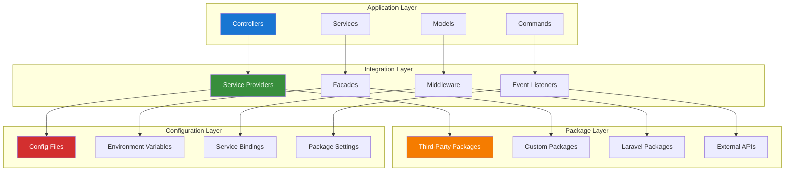

# Package Integration Patterns

## Table of Contents

- [Overview](#overview)
- [Service Provider Integration](#service-provider-integration)
- [Facade Pattern Implementation](#facade-pattern-implementation)
- [Event-Driven Integration](#event-driven-integration)
- [Middleware Integration](#middleware-integration)
- [Command Integration](#command-integration)
- [Configuration Management](#configuration-management)
- [Testing Integration Patterns](#testing-integration-patterns)
- [Performance Optimization](#performance-optimization)
- [Best Practices](#best-practices)

## Overview

This guide provides comprehensive patterns for integrating third-party packages into Laravel applications, focusing on maintainable, testable, and performant integration strategies.

### Integration Principles

- **Loose Coupling**: Minimize dependencies between packages and application code
- **Configuration-Driven**: Use configuration files for package behavior
- **Event-Driven**: Leverage Laravel's event system for package communication
- **Testable**: Ensure all integrations are easily testable
- **Performance-Aware**: Consider performance implications of package integrations

### Architecture Overview



## Service Provider Integration

### Custom Service Provider Pattern

```php
<?php

namespace App\Providers;

use Illuminate\Support\ServiceProvider;
use App\Services\PackageIntegrationService;
use App\Contracts\PackageIntegrationInterface;

class PackageIntegrationServiceProvider extends ServiceProvider
{
    /**
     * Register services
     */
    public function register(): void
    {
        // Bind interface to implementation
        $this->app->bind(
            PackageIntegrationInterface::class,
            PackageIntegrationService::class
        );

        // Register singleton services
        $this->app->singleton('package.integration', function ($app) {
            return new PackageIntegrationService(
                $app['config']['packages.integration'],
                $app['cache'],
                $app['log']
            );
        });

        // Conditional service registration
        if ($this->app->environment('production')) {
            $this->app->singleton('package.monitor', function ($app) {
                return new PackageMonitoringService($app['log']);
            });
        }
    }

    /**
     * Bootstrap services
     */
    public function boot(): void
    {
        // Publish configuration
        $this->publishes([
            __DIR__.'/../../config/package-integration.php' => config_path('package-integration.php'),
        ], 'config');

        // Register event listeners
        $this->registerEventListeners();

        // Register middleware
        $this->registerMiddleware();

        // Register commands
        $this->registerCommands();
    }

    /**
     * Register event listeners
     */
    private function registerEventListeners(): void
    {
        $this->app['events']->listen(
            'package.integration.started',
            'App\Listeners\PackageIntegrationStartedListener'
        );

        $this->app['events']->listen(
            'package.integration.failed',
            'App\Listeners\PackageIntegrationFailedListener'
        );
    }

    /**
     * Register middleware
     */
    private function registerMiddleware(): void
    {
        $this->app['router']->aliasMiddleware(
            'package.auth',
            \App\Http\Middleware\PackageAuthenticationMiddleware::class
        );
    }

    /**
     * Register commands
     */
    private function registerCommands(): void
    {
        if ($this->app->runningInConsole()) {
            $this->commands([
                \App\Console\Commands\PackageIntegrationCommand::class,
                \App\Console\Commands\PackageHealthCheckCommand::class,
            ]);
        }
    }
}
```

## Facade Pattern Implementation

### Package Integration Facade

```php
<?php

namespace App\Facades;

use Illuminate\Support\Facades\Facade;

class PackageIntegration extends Facade
{
    /**
     * Get the registered name of the component
     */
    protected static function getFacadeAccessor(): string
    {
        return 'package.integration';
    }
}
```

### Usage Example

```php
<?php

namespace App\Http\Controllers;

use App\Facades\PackageIntegration;
use Illuminate\Http\Request;

class IntegrationController extends Controller
{
    public function processData(Request $request)
    {
        // Using facade for clean API
        $result = PackageIntegration::processData($request->all());
        
        return response()->json($result);
    }

    public function getStatus()
    {
        // Check integration health
        $status = PackageIntegration::healthCheck();
        
        return response()->json([
            'status' => $status['healthy'] ? 'ok' : 'error',
            'details' => $status,
        ]);
    }
}
```

## Event-Driven Integration

### Package Event System

```php
<?php

namespace App\Events;

use Illuminate\Foundation\Events\Dispatchable;
use Illuminate\Queue\SerializesModels;

class PackageIntegrationEvent
{
    use Dispatchable, SerializesModels;

    public function __construct(
        public string $packageName,
        public string $action,
        public array $data = [],
        public ?string $userId = null
    ) {}
}
```

### Event Listener

```php
<?php

namespace App\Listeners;

use App\Events\PackageIntegrationEvent;
use Illuminate\Contracts\Queue\ShouldQueue;
use Illuminate\Queue\InteractsWithQueue;
use Illuminate\Support\Facades\Log;

class PackageIntegrationListener implements ShouldQueue
{
    use InteractsWithQueue;

    public function handle(PackageIntegrationEvent $event): void
    {
        Log::info('Package integration event', [
            'package' => $event->packageName,
            'action' => $event->action,
            'user_id' => $event->userId,
            'data_size' => count($event->data),
        ]);

        // Process integration based on action
        match($event->action) {
            'sync' => $this->handleSync($event),
            'update' => $this->handleUpdate($event),
            'delete' => $this->handleDelete($event),
            default => Log::warning('Unknown integration action', ['action' => $event->action]),
        };
    }

    private function handleSync(PackageIntegrationEvent $event): void
    {
        // Handle synchronization logic
    }

    private function handleUpdate(PackageIntegrationEvent $event): void
    {
        // Handle update logic
    }

    private function handleDelete(PackageIntegrationEvent $event): void
    {
        // Handle deletion logic
    }
}
```

## Middleware Integration

### Package Authentication Middleware

```php
<?php

namespace App\Http\Middleware;

use Closure;
use Illuminate\Http\Request;
use Illuminate\Http\Response;
use App\Services\PackageAuthService;

class PackageAuthenticationMiddleware
{
    public function __construct(
        private PackageAuthService $authService
    ) {}

    public function handle(Request $request, Closure $next): Response
    {
        // Validate package authentication
        if (!$this->authService->validateRequest($request)) {
            return response()->json([
                'error' => 'Invalid package authentication',
            ], 401);
        }

        // Add package context to request
        $request->merge([
            'package_context' => $this->authService->getContext($request),
        ]);

        return $next($request);
    }
}
```

## Command Integration

### Package Management Command

```php
<?php

namespace App\Console\Commands;

use Illuminate\Console\Command;
use App\Services\PackageIntegrationService;

class PackageIntegrationCommand extends Command
{
    protected $signature = 'package:integrate 
                           {package : Package name to integrate}
                           {--sync : Sync existing data}
                           {--force : Force integration even if already configured}';

    protected $description = 'Integrate a package with the application';

    public function handle(PackageIntegrationService $service): int
    {
        $packageName = $this->argument('package');
        $sync = $this->option('sync');
        $force = $this->option('force');

        $this->info("Integrating package: {$packageName}");

        try {
            $result = $service->integrate($packageName, [
                'sync' => $sync,
                'force' => $force,
            ]);

            $this->info("Package integrated successfully");
            $this->table(['Metric', 'Value'], [
                ['Records Processed', $result['processed']],
                ['Errors', $result['errors']],
                ['Duration', $result['duration'] . 's'],
            ]);

            return 0;
        } catch (\Exception $e) {
            $this->error("Integration failed: {$e->getMessage()}");
            return 1;
        }
    }
}
```

## Configuration Management

### Package Configuration

```php
<?php

// config/package-integration.php
return [
    /*
     * Default package integration settings
     */
    'default' => [
        'timeout' => 30,
        'retry_attempts' => 3,
        'retry_delay' => 1000, // milliseconds
        'batch_size' => 100,
    ],

    /*
     * Package-specific configurations
     */
    'packages' => [
        'spatie/laravel-activitylog' => [
            'enabled' => env('ACTIVITYLOG_ENABLED', true),
            'queue' => env('ACTIVITYLOG_QUEUE', false),
            'retention_days' => env('ACTIVITYLOG_RETENTION_DAYS', 365),
        ],
        
        'spatie/laravel-permission' => [
            'enabled' => env('PERMISSION_ENABLED', true),
            'cache_expiration' => env('PERMISSION_CACHE_EXPIRATION', 86400),
            'teams' => env('PERMISSION_TEAMS_ENABLED', false),
        ],
        
        'spatie/laravel-media-library' => [
            'enabled' => env('MEDIA_LIBRARY_ENABLED', true),
            'disk' => env('MEDIA_LIBRARY_DISK', 'public'),
            'max_file_size' => env('MEDIA_LIBRARY_MAX_SIZE', 10485760), // 10MB
        ],
    ],

    /*
     * Integration monitoring
     */
    'monitoring' => [
        'enabled' => env('PACKAGE_MONITORING_ENABLED', true),
        'log_level' => env('PACKAGE_MONITORING_LOG_LEVEL', 'info'),
        'alert_threshold' => env('PACKAGE_MONITORING_ALERT_THRESHOLD', 10),
    ],

    /*
     * Performance settings
     */
    'performance' => [
        'cache_enabled' => env('PACKAGE_CACHE_ENABLED', true),
        'cache_ttl' => env('PACKAGE_CACHE_TTL', 3600),
        'async_processing' => env('PACKAGE_ASYNC_PROCESSING', false),
    ],
];
```

## Testing Integration Patterns

### Integration Test Base Class

```php
<?php

namespace Tests\Integration;

use Illuminate\Foundation\Testing\RefreshDatabase;use old\TestCase;

abstract class PackageIntegrationTestCase extends TestCase
{
    use RefreshDatabase;

    protected function setUp(): void
    {
        parent::setUp();
        
        // Set up package-specific test environment
        $this->setupPackageEnvironment();
        
        // Mock external services
        $this->mockExternalServices();
    }

    protected function setupPackageEnvironment(): void
    {
        config([
            'package-integration.packages.test-package.enabled' => true,
            'package-integration.monitoring.enabled' => false,
        ]);
    }

    protected function mockExternalServices(): void
    {
        // Mock external API calls
        $this->mock('external.api.client', function ($mock) {
            $mock->shouldReceive('get')->andReturn(['status' => 'success']);
            $mock->shouldReceive('post')->andReturn(['id' => 123]);
        });
    }

    protected function assertPackageIntegrationWorking(string $packageName): void
    {
        $this->assertTrue(
            app('package.integration')->isHealthy($packageName),
            "Package {$packageName} integration is not working"
        );
    }
}
```

## Performance Optimization

### Caching Integration Results

```php
<?php

namespace App\Services;

use Illuminate\Support\Facades\Cache;
use Illuminate\Support\Facades\Log;

class CachedPackageIntegrationService
{
    public function __construct(
        private PackageIntegrationService $integrationService,
        private int $cacheTtl = 3600
    ) {}

    public function getIntegrationData(string $packageName, array $params = []): array
    {
        $cacheKey = $this->generateCacheKey($packageName, $params);
        
        return Cache::remember($cacheKey, $this->cacheTtl, function () use ($packageName, $params) {
            Log::info('Cache miss for package integration', [
                'package' => $packageName,
                'params' => $params,
            ]);
            
            return $this->integrationService->getData($packageName, $params);
        });
    }

    public function invalidateCache(string $packageName, array $params = []): void
    {
        $cacheKey = $this->generateCacheKey($packageName, $params);
        Cache::forget($cacheKey);
    }

    private function generateCacheKey(string $packageName, array $params): string
    {
        return 'package_integration:' . $packageName . ':' . md5(serialize($params));
    }
}
```

## Best Practices

### Implementation Guidelines

1. **Service Provider Organization**
   - Use dedicated service providers for complex integrations
   - Register services in the `register()` method
   - Bootstrap functionality in the `boot()` method
   - Use conditional registration for environment-specific services

2. **Configuration Management**
   - Use environment variables for sensitive configuration
   - Provide sensible defaults in configuration files
   - Document all configuration options
   - Use validation for critical configuration values

3. **Error Handling**
   - Implement comprehensive error handling for package failures
   - Use logging for debugging integration issues
   - Provide fallback mechanisms for critical functionality
   - Monitor integration health continuously

4. **Performance Considerations**
   - Cache integration results when appropriate
   - Use queues for time-consuming operations
   - Implement batch processing for bulk operations
   - Monitor performance metrics

5. **Testing Strategy**
   - Write integration tests for all package integrations
   - Mock external dependencies in tests
   - Test error scenarios and edge cases
   - Use feature flags for gradual rollouts

This comprehensive guide provides the foundation for implementing robust, maintainable package integrations in Laravel applications.

---

**Next Steps:**

- Review [Enhanced Spatie ActivityLog Guide](packages/150-spatie-activitylog-guide.md) for specific package integration
- Explore [Laravel Database Optimization Guide](packages/141-laravel-optimize-database-guide.md) for performance optimization
- Check [Modern Testing with Pest Guide](packages/testing/010-pest-testing-guide.md) for testing strategies
