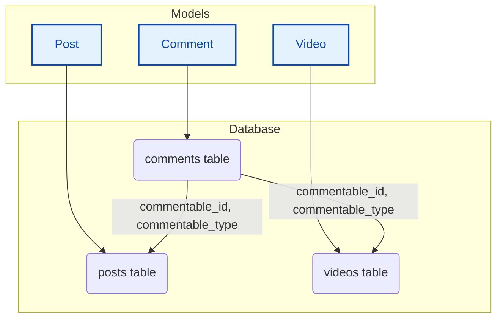
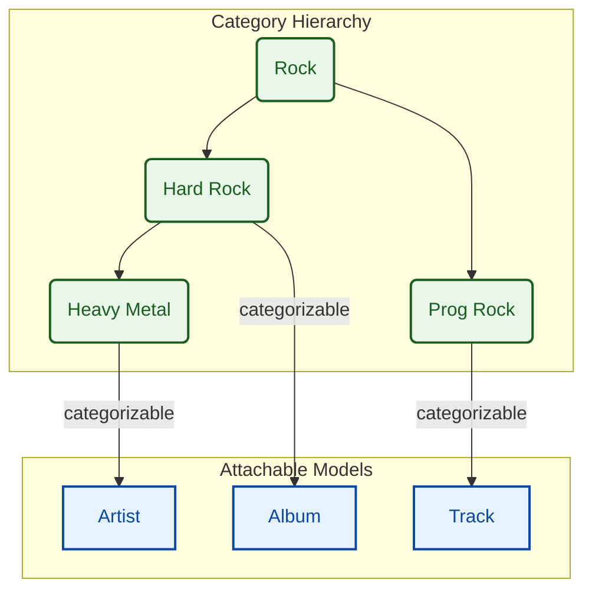

# Polymorphic and Hierarchical Category System Design Guide

## 1. Overview

This guide provides a comprehensive, junior-developer-friendly explanation of how to design and implement a category system that is both **hierarchical** (supports parent-child relationships, like `Music > Rock > Hard Rock`) and **polymorphic** (can be attached to different kinds of models, like `Artist`, `Album`, or `Track`).

We will explore different strategies, compare their pros and cons, and provide a final recommendation that balances performance, simplicity, and power, aligning with the standards of this project.

## 2. Table of Contents

1. Overview
2. Table of Contents
3. Understanding Polymorphic Relationships
    - 3.1. What Are They?
    - 3.2. How Laravel Implements Them
4. The Challenge: Combining Hierarchy and Polymorphism
5. Strategies for Storing Hierarchical Data
    - 5.1. Approach 1: Adjacency List
    - 5.2. Approach 2: Closure Table
6. Comparison and Recommendations
    - 6.1. Feature Comparison: Adjacency List vs. Closure Table
    - 6.2. The Recommended Hybrid: Materialized Path
7. Putting It All Together: The Final Implementation
    - 7.1. The `categories` Migration
    - 7.2. The `categorizables` Polymorphic Pivot Migration
    - 7.3. The `Category` Model
    - 7.4. Attaching Categories to Other Models
8. Conclusion
9. See Also

## 3. Understanding Polymorphic Relationships

### 3.1. What Are They?

Imagine you have a `Comment` model. You want users to be able to comment on `Posts` and also on `Videos`.

Without polymorphism, you might need two separate pivot tables: `comment_post` and `comment_video`. This can get complicated quickly.

A **polymorphic relationship** allows a model (like `Comment`) to belong to more than one other type of model on a single association. It's a "one-to-many" or "many-to-many" relationship that isn't tied to just one specific model type.

### 3.2. How Laravel Implements Them

Laravel handles this elegantly. Instead of multiple pivot tables, you have one `comments` table with two special columns:

- `commentable_id`: Stores the ID of the parent model (e.g., the `Post` ID or `Video` ID).
- `commentable_type`: Stores the class name of the parent model (e.g., `App\Models\Post` or `App\Models\Video`).

This allows a single `Comment` record to be associated with any other model in your application.



## 4. The Challenge: Combining Hierarchy and Polymorphism

Our goal is to create a `Category` system that has two key features:

1.  **Hierarchical**: Categories can have parents and children, creating a tree-like structure.
2.  **Polymorphic**: These categories can be assigned to `Artists`, `Albums`, `Tracks`, or any other model.



To build this, we first need to decide how to store the hierarchical data.

## 5. Strategies for Storing Hierarchical Data

Let's compare the two most common methods for storing tree structures in a relational database.

### 5.1. Approach 1: Adjacency List

This is the most straightforward approach. Each category in the `categories` table has a `parent_id` column that points to its direct parent.

**Database Schema:**

```
categories
  - id (PK)
  - name
  - parent_id (FK to categories.id)
```

**Eloquent Model:**

```php
class Category extends Model
{
    public function parent(): BelongsTo
    {
        return $this->belongsTo(Category::class, 'parent_id');
    }

    public function children(): HasMany
    {
        return $this->hasMany(Category::class, 'parent_id');
    }
}
```

**Pros (Top 5):**
1.  **Simple to Implement**: Very easy to set up and understand.
2.  **Intuitive Data Structure**: The `parent_id` concept is natural for developers.
3.  **Minimal Storage**: No extra tables or columns are needed, just one `parent_id`.
4.  **Easy to Modify**: Moving a node or an entire subtree only requires updating one `parent_id` value.
5.  **Fast Writes**: Adding a new category is a single, fast `INSERT` operation.

**Cons (Top 5):**
1.  **Hard to Query Deep Trees**: Getting all descendants of a node (e.g., all sub-genres of "Rock") is difficult.
2.  **Requires Recursive Queries**: Fetching a full tree often requires multiple database queries (one for each level), which is inefficient.
3.  **Performance Issues**: The recursive nature can lead to N+1 query problems and slow performance on large, deep trees.
4.  **Complex Ancestor Retrieval**: Finding all parents of a given category is just as difficult as finding all children.
5.  **Database Intensive**: Most of the tree logic must be handled in the application code, putting more load on PHP.

**Recommendation**: Best for simple, shallow hierarchies (max 2-3 levels) where you primarily work with direct parents or children. Example: A blog where posts have a main category and an optional sub-category.

### 5.2. Approach 2: Closure Table

This approach uses a separate table to store all possible paths in the category tree. It explicitly maps every ancestor to every one of its descendants.

**Database Schema:**

```
categories
  - id (PK)
  - name

category_closure
  - ancestor_id (FK to categories.id)
  - descendant_id (FK to categories.id)
  - depth
  (Primary Key: ancestor_id, descendant_id)
```

For a category `C` that is a child of `B`, which is a child of `A`, the `category_closure` table would have entries like:
- `(A, A, 0)`
- `(A, B, 1)`
- `(A, C, 2)`
- `(B, B, 0)`
- `(B, C, 1)`
- `(C, C, 0)`

**Eloquent Model:**

```php
class Category extends Model
{
    public function descendants(): BelongsToMany
    {
        return $this->belongsToMany(Category::class, 'category_closure', 'ancestor_id', 'descendant_id');
    }

    public function ancestors(): BelongsToMany
    {
        return $this->belongsToMany(Category::class, 'category_closure', 'descendant_id', 'ancestor_id');
    }
}
```

**Pros (Top 5):**
1.  **Extremely Fast Reads**: Getting all descendants or ancestors is a single, simple `JOIN` query.
2.  **Avoids Recursion**: All tree-based queries are non-recursive and performant.
3.  **Depth Information**: The `depth` column makes it easy to query nodes at a specific level.
4.  **Database-Level Integrity**: Can use foreign key constraints to ensure data integrity.
5.  **Scales Well**: Handles very deep and wide trees efficiently for read-heavy applications.

**Cons (Top 5):**
1.  **Complex to Implement**: Requires more setup and application logic to maintain the closure table.
2.  **Requires More Storage**: The closure table can grow very large (`O(n^2)` in the worst case).
3.  **Slower Writes**: Adding or moving a category requires multiple `INSERT` and `DELETE` operations on the closure table.
4.  **Less Intuitive**: The concept can be harder for new developers to grasp compared to a simple `parent_id`.
5.  **Maintenance Overhead**: Requires careful logic (or database triggers) to keep the closure table in sync.

**Recommendation**: Best for read-heavy applications with deep, complex hierarchies where query performance for subtrees is critical. Example: A large e-commerce site with thousands of product categories.

## 6. Comparison and Recommendations

### 6.1. Feature Comparison: Adjacency List vs. Closure Table

| Feature | Adjacency List | Closure Table |
| :--- | :--- | :--- |
| **Read Performance** | Poor for subtrees | Excellent |
| **Write Performance** | Excellent | Fair to Poor |
| **Storage Space** | Minimal | High |
| **Implementation** | Simple | Complex |
| **Query Simplicity** | Hard (Recursive) | Easy (JOINs) |
| **Best For** | Shallow trees, write-heavy apps | Deep trees, read-heavy apps |

### 6.2. The Recommended Hybrid: Materialized Path

For most modern applications, a third option, **Materialized Path**, offers the best balance. It's an enhancement of the Adjacency List model.

In this pattern, we still use `parent_id`, but we also add a `path` column that stores the full ancestor path as a string.

**Database Schema:**

```
categories
  - id (PK)
  - name
  - parent_id (FK to categories.id)
  - path (e.g., "1/5/12/")
  - depth
```

**How it Works:**
- A root category with `id=1` has a path of `1/`.
- Its child with `id=5` has a path of `1/5/`.
- Its grandchild with `id=12` has a path of `1/5/12/`.

**Querying for all descendants of category `5` is now simple and fast:**

```sql
SELECT * FROM categories WHERE path LIKE '1/5/%';
```

This approach is what the **Chinook Enterprise guides** in this project use. It provides a great balance:
- **Fast Reads**: Almost as fast as Closure Table for most common tree queries.
- **Simple Writes**: Only slightly more complex than Adjacency List (need to update the `path`).
- **Intuitive**: The `parent_id` is still there, and the `path` is easy to understand.

This is the recommended approach for this project as it provides excellent performance without the high complexity and storage overhead of a Closure Table.

## 7. Putting It All Together: The Final Implementation

Here is how to build the complete hierarchical and polymorphic system using the recommended **Materialized Path** approach.

### 7.1. The `categories` Migration

This migration sets up the `categories` table with hierarchy support.

```php
Schema::create('categories', function (Blueprint $table) {
    $table->id();
    $table->string('name', 120);
    $table->text('description')->nullable();
    $table->enum('type', ['genre', 'mood', 'theme', /* ... */])->index();

    // For Hierarchy (Adjacency List + Materialized Path)
    $table->foreignId('parent_id')->nullable()->constrained('categories')->onDelete('cascade');
    $table->integer('depth')->default(0)->index();
    $table->string('path')->nullable()->index(); // Materialized Path

    $table->timestamps();
    $table->softDeletes();
});
```

### 7.2. The `categorizables` Polymorphic Pivot Migration

This migration creates the special pivot table that will link categories to any other model.

```php
Schema::create('categorizables', function (Blueprint $table) {
    $table->id();

    // The link to the category
    $table->foreignId('category_id')->constrained('categories')->onDelete('cascade');

    // The polymorphic columns
    $table->morphs('categorizable'); // Creates categorizable_id (e.g., 15) and categorizable_type (e.g., "App\Models\Artist")

    // Unique constraint to prevent duplicates
    $table->unique(['category_id', 'categorizable_type', 'categorizable_id'], 'categorizables_unique');
});
```

### 7.3. The `Category` Model

The model contains the logic for both the hierarchy and the polymorphic relationships.

```php
<?php

declare(strict_types=1);

namespace App\Models;

use Illuminate\Database\Eloquent\Model;
use Illuminate\Database\Eloquent\Relations\BelongsTo;
use Illuminate\Database\Eloquent\Relations\HasMany;
use Illuminate\Database\Eloquent\Relations\MorphToMany;

class Category extends Model
{
    // ... fillable, casts, etc.

    /**
     * Get the parent category. (Adjacency List)
     */
    public function parent(): BelongsTo
    {
        return $this->belongsTo(Category::class, 'parent_id');
    }

    /**
     * Get the child categories. (Adjacency List)
     */
    public function children(): HasMany
    {
        return $this->hasMany(Category::class, 'parent_id');
    }

    /**
     * Get all of the artists that are assigned this category.
     */
    public function artists(): MorphToMany
    {
        return $this->morphedByMany(Artist::class, 'categorizable');
    }

    /**
     * Get all of the albums that are assigned this category.
     */
    public function albums(): MorphToMany
    {
        return $this->morphedByMany(Album::class, 'categorizable');
    }

    /**
     * Get all of the tracks that are assigned this category.
     */
    public function tracks(): MorphToMany
    {
        return $this->morphedByMany(Track::class, 'categorizable');
    }

    // ... other model logic for maintaining path, etc.
}
```

### 7.4. Attaching Categories to Other Models

Any model that needs to be "categorizable" will define the inverse polymorphic relationship.

**Example: `Track` Model**

```php
<?php

declare(strict_types=1);

namespace App\Models;

use Illuminate\Database\Eloquent\Model;
use Illuminate\Database\Eloquent\Relations\MorphToMany;

class Track extends Model
{
    /**
     * Get all of the categories for the track.
     */
    public function categories(): MorphToMany
    {
        return $this->morphToMany(Category::class, 'categorizable');
    }

    /**
     * Helper scope to find tracks by a specific category name.
     */
    public function scopeByCategory(Builder $query, string $categoryName): Builder
    {
        return $query->whereHas('categories', function ($q) use ($categoryName) {
            $q->where('name', $categoryName);
        });
    }
}
```

**Usage:**

```php
$track = Track::find(1);
$rockCategory = Category::where('name', 'Rock')->first();

// Assign a category
$track->categories()->attach($rockCategory);

// Get all categories for a track
$categories = $track->categories;

// Get all tracks in the "Rock" category
$rockTracks = Track::byCategory('Rock')->get();
```

## 8. Conclusion

By combining the **Materialized Path** pattern for hierarchy with Laravel's built-in **polymorphic relationships**, you can create an extremely powerful, flexible, and performant categorization system.

This approach provides the best of all worlds:
- The simplicity and intuitive nature of the Adjacency List.
- The read-performance benefits approaching that of a Closure Table.
- The flexibility to attach your category tree to any model in your application without schema changes.

This design is robust enough for enterprise applications while remaining accessible for junior developers to understand and maintain.

## 9. See Also

- **Chinook Models Guide**: See a full implementation of this `Category` model.
- **Chinook Migrations Guide**: Review the migrations for the `categories` and `categorizables` tables.
- Laravel Documentation: Polymorphic Relationships
