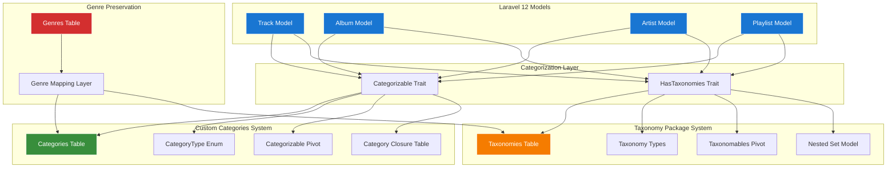
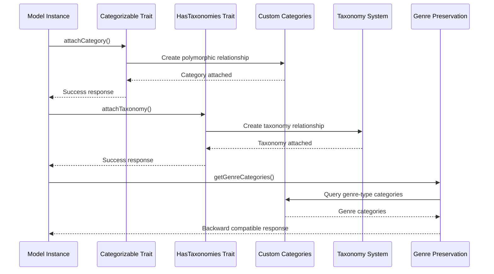
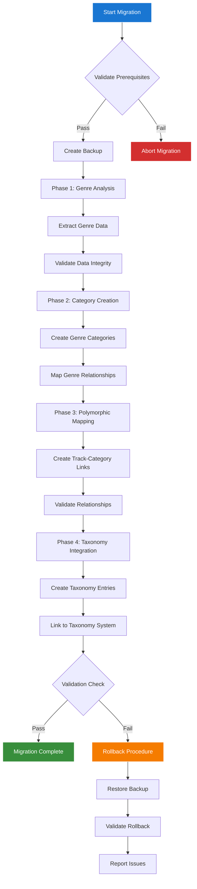
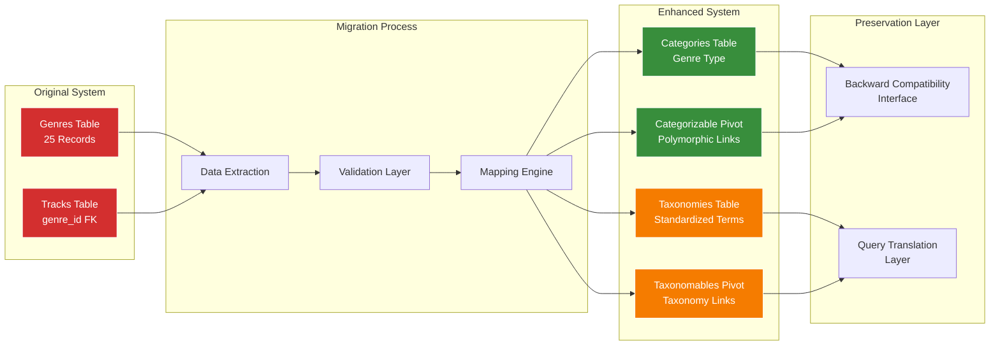
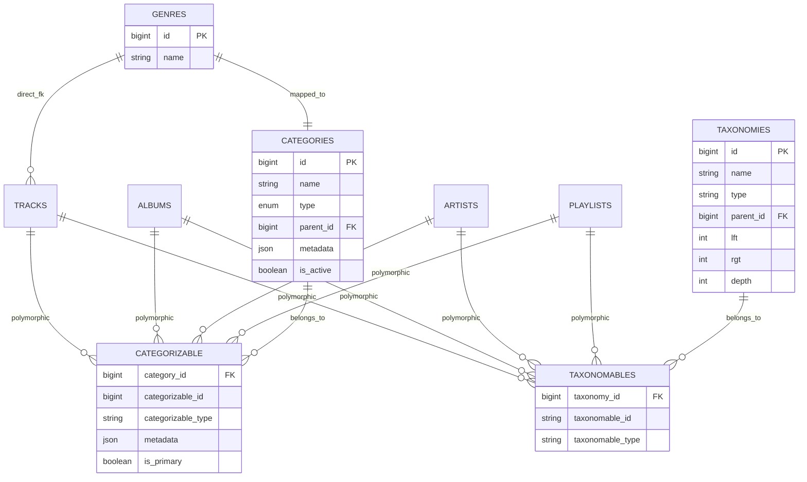
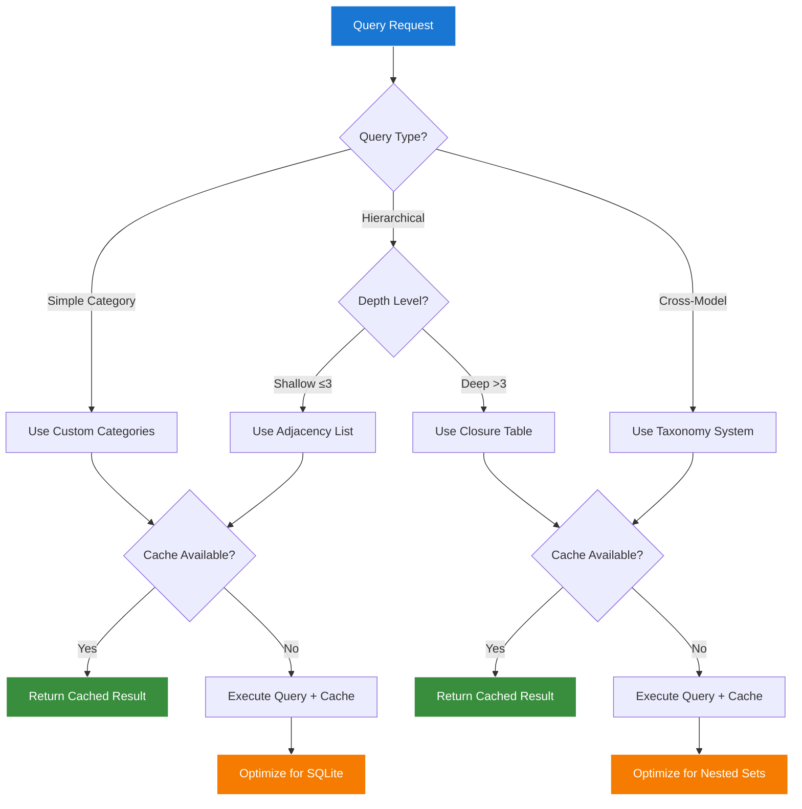
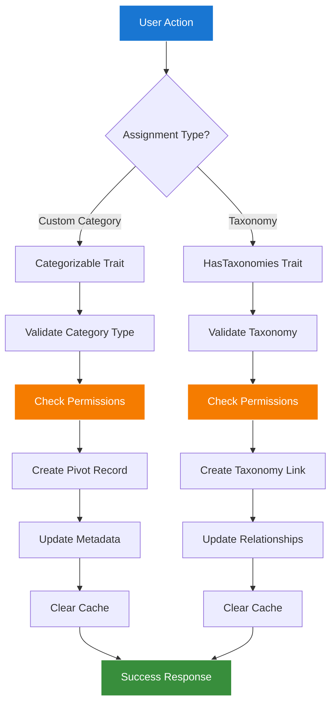
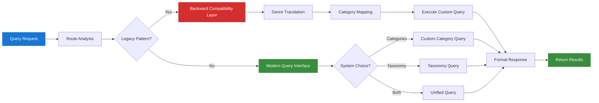

# Taxonomy Integration Architecture Diagrams

## Table of Contents

- [Overview](#overview)
- [Dual Categorization System Architecture](#dual-categorization-system-architecture)
- [Genre-to-Taxonomy Migration Flow](#genre-to-taxonomy-migration-flow)
- [Polymorphic Relationship Architecture](#polymorphic-relationship-architecture)
- [Performance Optimization Decision Tree](#performance-optimization-decision-tree)
- [Data Flow Diagrams](#data-flow-diagrams)

## Overview

This document provides comprehensive visual documentation of the Chinook database taxonomy integration architecture using Mermaid v10.6+ diagrams with WCAG 2.1 AA compliant color palette.

**Color Palette (WCAG 2.1 AA Compliant):**
- Primary Blue: `#1976d2` (7.04:1 contrast ratio)
- Success Green: `#388e3c` (6.74:1 contrast ratio)
- Warning Orange: `#f57c00` (4.52:1 contrast ratio)
- Error Red: `#d32f2f` (5.25:1 contrast ratio)

## Dual Categorization System Architecture

### System Overview

### Component Interaction Flow

## Genre-to-Taxonomy Migration Flow

### Migration Process Overview

### Data Preservation Strategy

## Polymorphic Relationship Architecture

### Relationship Mapping

## Performance Optimization Decision Tree

### Query Optimization Strategy

## Data Flow Diagrams

### Category Assignment Flow

### Query Resolution Flow

---

*All diagrams use WCAG 2.1 AA compliant color palette with minimum 4.5:1 contrast ratios for accessibility compliance.*
