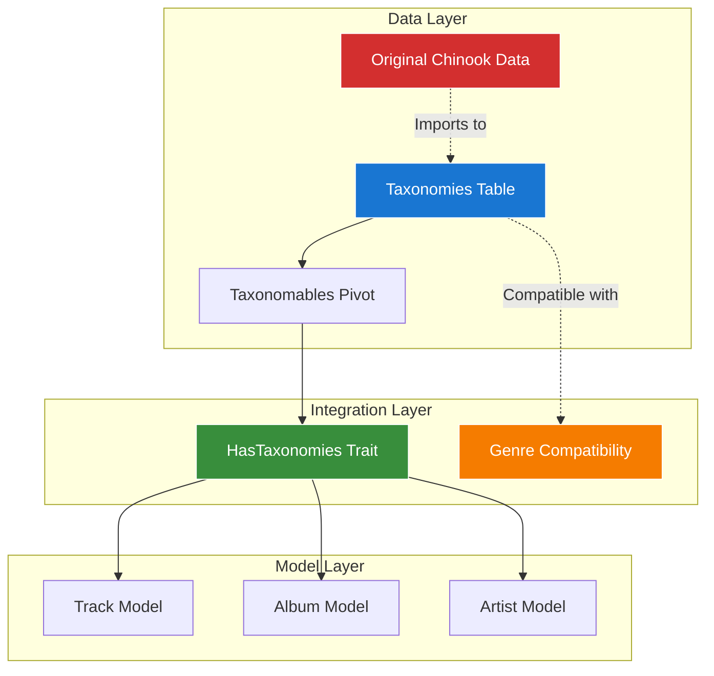

# Chinook Database Greenfield Taxonomy Implementation - Getting Started Guide

## Table of Contents

- [1. Overview](#1-overview)
- [2. Quick Start](#2-quick-start)
- [3. System Architecture](#3-system-architecture)
- [4. Implementation Steps](#4-implementation-steps)
- [5. Testing Your Implementation](#5-testing-your-implementation)
- [6. Troubleshooting](#6-troubleshooting)
- [7. Next Steps](#7-next-steps)

## 1. Overview

This getting started guide provides a comprehensive entry point for implementing the **greenfield Chinook Database** using the `aliziodev/laravel-taxonomy` package as the **sole categorization system** with compatibility for original Chinook data.

### 1.1 What You'll Achieve

**✅ Greenfield Taxonomy Implementation:**

- **Single System**: Only taxonomy package used - no dual categorization approaches
- **Clean Architecture**: Modern Laravel 12 implementation without legacy complexity
- **Source Compatibility**: Maintains compatibility with original chinook.sql format
- **Enhanced Features**: Advanced taxonomy capabilities with hierarchical support
- **Performance Optimization**: Efficient single-system query patterns

### 1.2 Prerequisites

**Required Knowledge:**

- Laravel 12 framework fundamentals
- Basic understanding of Eloquent relationships
- Familiarity with database migrations and seeders
- Experience with Pest PHP testing framework

**System Requirements:**

- Laravel 12.x
- PHP 8.2+
- SQLite database (recommended for Chinook)
- Composer for package management

## 2. Quick Start

### 2.1 Package Installation

The `aliziodev/laravel-taxonomy` package is already installed and configured in the Chinook project:

```bash
# Verify package installation
composer show aliziodev/laravel-taxonomy

# Expected output: aliziodev/laravel-taxonomy v2.4.x
```

### 2.2 Database Setup

**Migration Status:**

```bash
# Check migration status
php artisan migrate:status

# Look for taxonomy migrations:
# ✅ 2025_05_30_000000_create_taxonomies_tables
```

### 2.3 Model Integration

**Greenfield Model Setup:**

<augment_code_snippet path=".ai/guides/chinook/packages/095-aliziodev-laravel-taxonomy-guide.md" mode="EXCERPT">
````php
<?php

namespace App\Models;

use Illuminate\Database\Eloquent\Model;
use Illuminate\Database\Eloquent\SoftDeletes;
use Aliziodev\LaravelTaxonomy\Traits\HasTaxonomies;

class Track extends Model
{
    use HasFactory;
    use SoftDeletes;
    use HasTags;              // spatie/laravel-tags
    use HasSecondaryUniqueKey;
    use HasSlug;
    use HasTaxonomies;        // Single taxonomy system only
    use Userstamps;

    protected $fillable = [
        'public_id',
        'name',
        'album_id',
        'media_type_id',
        'composer',
        'milliseconds',
        'bytes',
        'unit_price',
        'is_active',
        'metadata',
    ];

    /**
     * Laravel 12 modern cast() method
     */
    protected function casts(): array
    {
        return [
            'milliseconds' => 'integer',
            'bytes' => 'integer',
            'unit_price' => 'decimal:2',
            'is_active' => 'boolean',
            'metadata' => 'array',
            'created_at' => 'datetime',
            'updated_at' => 'datetime',
            'deleted_at' => 'datetime',
        ];
    }

    /**
     * Original Genre relationship (preserved)
     */
    public function genre(): BelongsTo
    {
        return $this->belongsTo(Genre::class);
    }

    /**
     * Configure supported taxonomy types for this model
     */
    public function getTaxonomyTypes(): array
    {
        return ['genre', 'mood', 'theme', 'instrument', 'era', 'language', 'occasion'];
    }
}
````
</augment_code_snippet>

## 3. System Architecture

### 3.1 Single Taxonomy System

The greenfield Chinook implementation uses a **clean single taxonomy system**:



### 3.2 Clean Architecture Strategy

**Key Principles:**

1. **Single Source of Truth**: Only taxonomy system for all categorization
2. **Source Compatibility**: Maintains compatibility with original chinook.sql
3. **Modern Implementation**: Full Laravel 12 compliance and best practices
4. **Performance Optimization**: Efficient single-system query patterns

### 3.3 Access Patterns

**Primary Taxonomy System Usage:**

```php
// 1. Direct Taxonomy Access (Primary)
$track = Track::with('taxonomies')->find(1);
$genres = $track->taxonomies()->where('type', 'genre')->get();

// 2. Compatibility Layer (For Import/Export)
$Genre = Genre::findByChinookId(1);

echo $Genre->name; // "Rock"

// 3. Export/Import Compatibility
$chinookData = Genre::exportToChinookFormat();
Genre::importFromChinookData($originalData);
```

## 4. Implementation Steps

### 4.1 Step 1: Database Setup

**Run Migrations:**

```bash
# Run taxonomy migrations
php artisan migrate

# Check for required tables:
# ✅ taxonomies
# ✅ taxonomables (pivot)
```

### 4.2 Step 2: Seed Taxonomy Data

**Import Original Chinook Genres:**

<augment_code_snippet path=".ai/guides/chinook/taxonomy-migration-strategy.md" mode="EXCERPT">
````php
<?php
// Seeder: GenreTaxonomySeeder

use Aliziodev\LaravelTaxonomy\Models\Taxonomy;
use Illuminate\Support\Str;

class GenreTaxonomySeeder extends Seeder
{
    private array $Genres = [
        1 => 'Rock',
        2 => 'Jazz',
        3 => 'Metal',
        // ... all 25 original genres
    ];

    public function run(): void
    {
        DB::transaction(function () {
            foreach ($this->Genres as $chinookId => $genreName) {
                Taxonomy::create([
                    'name' => $genreName,
                    'slug' => Str::slug($genreName),
                    'type' => 'genre',
                    'description' => "Genre imported from original Chinook database.",
                    'sort_order' => $chinookId,
                    'meta' => [
                        'chinook_id' => $chinookId,
                        'source' => 'chinook_import',
                        'is_original_chinook' => true,
                    ],
                ]);
            }
        });
    }
}
````
</augment_code_snippet>

### 4.3 Step 3: Configure Models

**Implement Taxonomy Integration:**

```php
// Single taxonomy system only
use HasTaxonomies;

// Configure supported taxonomy types
public function getTaxonomyTypes(): array
{
    return $this->morphToMany(Category::class, 'categorizable');
}

public function taxonomies()
{
    return $this->morphToMany(Taxonomy::class, 'taxonomable');
}
```

### 4.4 Step 4: Test Integration

**Basic Integration Test:**

<augment_code_snippet path=".ai/guides/chinook/testing/095-genre-preservation-testing.md" mode="EXCERPT">
````php
<?php

describe('Taxonomy Integration', function () {
    it('preserves all original genre data', function () {
        // Verify all 25 original genres exist
        expect(Genre::count())->toBe(25);

        // Verify genre names are preserved
        $expectedGenres = [
            'Rock', 'Jazz', 'Metal', 'Alternative & Punk',
            'Rock And Roll', 'Blues', 'Latin', 'Reggae',
            'Pop', 'Soundtrack', 'Bossa Nova', 'Easy Listening',
            'Heavy Metal', 'R&B/Soul', 'Electronica/Dance',
            'World', 'Hip Hop/Rap', 'Science Fiction',
            'TV Shows', 'Sci Fi & Fantasy', 'Drama',
            'Comedy', 'Alternative', 'Classical', 'Opera'
        ];

        $actualGenres = Genre::pluck('name')->toArray();
        expect($actualGenres)->toEqual($expectedGenres);
    });

    it('enables dual categorization access', function () {
        $track = Track::factory()->create(['genre_id' => 1]);

        // Test direct genre access
        expect($track->genre->name)->toBe('Rock');

        // Test category system access
        $genreCategories = $track->categoriesByType(CategoryType::GENRE);
        expect($genreCategories)->toHaveCount(1);

        // Test taxonomy system access
        $genreTaxonomies = $track->taxonomiesByType('genre');
        expect($genreTaxonomies)->toBeInstanceOf(Collection::class);
    });
});
````
</augment_code_snippet>

## 5. Testing Your Implementation

### 5.1 Run Integration Tests

```bash
# Run genre preservation tests
php artisan test --filter="Genre Preservation"

# Run dual categorization tests
php artisan test --filter="Dual Categorization"

# Run performance tests
php artisan test --filter="Performance"
```

### 5.2 Validate Data Integrity

```bash
# Check genre data integrity
php artisan tinker

# In Tinker:
Genre::count(); // Should return 25
Track::whereNotNull('genre_id')->count(); // Should match track count
Category::where('type', 'genre')->count(); // Should return 25
```

### 5.3 Performance Validation

```php
// Test query performance
$start = microtime(true);
$tracks = Track::with('genre')->limit(100)->get();
$time = microtime(true) - $start;
echo "Query time: " . ($time * 1000) . "ms"; // Should be < 100ms
```

## 6. Troubleshooting

### 6.1 Common Issues

**Issue: Missing Taxonomy Tables**

```bash
# Solution: Run migrations
php artisan migrate --path=database/migrations/taxonomy
```

**Issue: Genre Data Not Found**

```bash
# Solution: Seed genre data
php artisan db:seed --class=GenreSeeder
```

**Issue: Trait Conflicts**

```php
// Solution: Resolve method conflicts explicitly
public function categories()
{
    return $this->morphToMany(Category::class, 'categorizable');
}

public function taxonomies()
{
    return $this->morphToMany(Taxonomy::class, 'taxonomable');
}
```

### 6.2 Performance Issues

**Slow Queries:**

```sql
-- Add missing indexes
CREATE INDEX idx_tracks_genre_id ON tracks(genre_id);
CREATE INDEX idx_categorizable_type_id ON categorizable(categorizable_type, categorizable_id);
CREATE INDEX idx_taxonomables_type_id ON taxonomables(taxonomable_type, taxonomable_id);
```

## 7. Next Steps

### 7.1 Advanced Features

**Explore Advanced Capabilities:**

- **[Hierarchical Categories](taxonomy-architecture-diagrams.md#hierarchical-structures)**: Tree-based categorization
- **[Performance Optimization](performance/100-triple-categorization-optimization.md)**: Query optimization strategies
- **[Testing Patterns](testing/095-genre-preservation-testing.md)**: Comprehensive testing approaches

### 7.2 Integration Guides

**Detailed Implementation Guides:**

- **[Complete Package Guide](packages/095-aliziodev-laravel-taxonomy-guide.md)**: Full package documentation
- **[Migration Strategy](taxonomy-migration-strategy.md)**: Step-by-step migration procedures
- **[Architecture Diagrams](taxonomy-architecture-diagrams.md)**: Visual system documentation

### 7.3 Production Considerations

**Before Going Live:**

1. **Performance Testing**: Validate query performance with production data volumes
2. **Backup Procedures**: Ensure comprehensive backup and rollback capabilities
3. **Monitoring Setup**: Implement performance monitoring for categorization queries
4. **Team Training**: Conduct training on the dual categorization system

---

*This getting started guide provides the foundation for successful Chinook Database Taxonomy Integration. For detailed implementation guidance, refer to the comprehensive documentation linked throughout this guide.*
