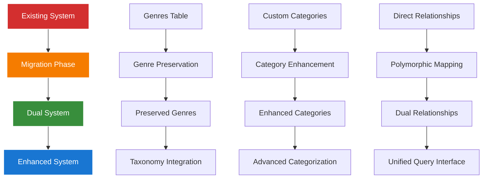

# Taxonomy Migration Strategy Guide

## Table of Contents

- [Overview](#overview)
- [Migration Architecture](#migration-architecture)
- [Genre Preservation Strategy](#genre-preservation-strategy)
- [Data Migration Procedures](#data-migration-procedures)
- [Rollback Procedures](#rollback-procedures)
- [Performance Impact Analysis](#performance-impact-analysis)
- [Testing Procedures](#testing-procedures)
- [Implementation Timeline](#implementation-timeline)

## Overview

This guide provides a comprehensive strategy for migrating from the custom category system to the integrated `aliziodev/laravel-taxonomy` package while preserving all existing Genre data and maintaining backward compatibility.

**Migration Objectives:**
- **Zero Data Loss**: Preserve all existing Genre relationships and data
- **Backward Compatibility**: Maintain existing query patterns and API endpoints
- **Enhanced Functionality**: Enable advanced taxonomy features
- **Performance Optimization**: Improve query performance for complex categorization
- **Gradual Transition**: Allow phased migration without system downtime

## Migration Architecture

### Dual System Coexistence

The migration strategy implements a dual system approach where both custom categories and taxonomy package coexist:



### System Components

**Phase 1: Preservation Layer**
- Maintain existing `genres` table structure
- Preserve all Track → Genre foreign key relationships
- Create mapping layer to Categories table

**Phase 2: Enhancement Layer**
- Integrate `aliziodev/laravel-taxonomy` package
- Enhance custom Category model with taxonomy features
- Implement dual relationship patterns

**Phase 3: Unification Layer**
- Provide unified query interface
- Enable advanced taxonomy features
- Maintain backward compatibility

## Genre Preservation Strategy

### Data Preservation Guarantee

**Complete Genre Data Preservation:**
```sql
-- Verify Genre data integrity before migration
SELECT 
    COUNT(*) as total_genres,
    COUNT(DISTINCT name) as unique_names,
    MIN(id) as min_id,
    MAX(id) as max_id
FROM genres;

-- Expected: 25 total genres, 25 unique names, id range 1-25
```

**Track Relationship Preservation:**
```sql
-- Verify Track → Genre relationships
SELECT 
    g.name as genre_name,
    COUNT(t.id) as track_count
FROM genres g
LEFT JOIN tracks t ON g.id = t.genre_id
GROUP BY g.id, g.name
ORDER BY track_count DESC;

-- All relationships must be preserved during migration
```

### Migration Mapping Strategy

**Genre to Category Mapping:**
```php
<?php
// Migration script: PopulateCategoriesFromGenres

use App\Models\Genre;
use App\Models\Category;
use App\Enums\CategoryType;
use Illuminate\Support\Str;

class PopulateCategoriesFromGenres
{
    public function migrate(): void
    {
        DB::transaction(function () {
            Genre::all()->each(function ($genre) {
                // Create corresponding category
                $category = Category::create([
                    'name' => $genre->name,
                    'type' => CategoryType::GENRE,
                    'sort_order' => $genre->id,
                    'is_active' => true,
                    'public_id' => Str::uuid(),
                    'slug' => Str::slug($genre->name),
                    'metadata' => [
                        'original_genre_id' => $genre->id,
                        'migration_timestamp' => now(),
                        'source' => 'genre_migration'
                    ]
                ]);
                
                // Create polymorphic relationships for all tracks
                $this->createTrackCategoryRelationships($genre, $category);
            });
        });
    }
    
    private function createTrackCategoryRelationships(Genre $genre, Category $category): void
    {
        Track::where('genre_id', $genre->id)->each(function ($track) use ($category) {
            $track->categories()->attach($category->id, [
                'is_primary' => true,
                'sort_order' => 0,
                'metadata' => [
                    'migration_source' => 'genre_preservation',
                    'original_genre_id' => $category->metadata['original_genre_id']
                ]
            ]);
        });
    }
}
```

## Data Migration Procedures

### Pre-Migration Validation

**Data Integrity Checks:**
```php
<?php
// Pre-migration validation script

class PreMigrationValidator
{
    public function validate(): array
    {
        $results = [];
        
        // Check Genre table integrity
        $results['genres'] = $this->validateGenres();
        
        // Check Track relationships
        $results['track_relationships'] = $this->validateTrackGenreRelationships();
        
        // Check existing categories
        $results['existing_categories'] = $this->validateExistingCategories();
        
        // Check taxonomy package readiness
        $results['taxonomy_readiness'] = $this->validateTaxonomyPackage();
        
        return $results;
    }
    
    private function validateGenres(): array
    {
        return [
            'total_count' => Genre::count(),
            'unique_names' => Genre::distinct('name')->count(),
            'null_names' => Genre::whereNull('name')->count(),
            'duplicate_names' => Genre::select('name')
                ->groupBy('name')
                ->havingRaw('COUNT(*) > 1')
                ->count()
        ];
    }
    
    private function validateTrackGenreRelationships(): array
    {
        return [
            'tracks_with_genres' => Track::whereNotNull('genre_id')->count(),
            'tracks_without_genres' => Track::whereNull('genre_id')->count(),
            'orphaned_genre_references' => Track::whereNotExists(function ($query) {
                $query->select(DB::raw(1))
                    ->from('genres')
                    ->whereColumn('genres.id', 'tracks.genre_id');
            })->count()
        ];
    }
}
```

### Migration Execution Steps

**Step 1: Backup Creation**
```bash
# Create comprehensive backup before migration
php artisan backup:run --only-db
sqlite3 database/database.sqlite ".backup database/pre-migration-backup.sqlite"
```

**Step 2: Category Population**
```php
// Execute genre to category migration
php artisan migrate:genres-to-categories --validate --dry-run
php artisan migrate:genres-to-categories --execute
```

**Step 3: Relationship Creation**
```php
// Create polymorphic relationships
php artisan migrate:track-category-relationships --validate
php artisan migrate:track-category-relationships --execute
```

**Step 4: Taxonomy Integration**
```php
// Integrate taxonomy package features
php artisan taxonomy:sync-categories --type=genre
php artisan taxonomy:validate-integration
```

### Post-Migration Validation

**Data Integrity Verification:**
```php
<?php
// Post-migration validation

class PostMigrationValidator
{
    public function validate(): array
    {
        return [
            'genre_preservation' => $this->validateGenrePreservation(),
            'category_creation' => $this->validateCategoryCreation(),
            'relationship_integrity' => $this->validateRelationshipIntegrity(),
            'query_compatibility' => $this->validateQueryCompatibility()
        ];
    }
    
    private function validateGenrePreservation(): array
    {
        $originalCount = Genre::count();
        $categoryCount = Category::where('type', CategoryType::GENRE)->count();
        
        return [
            'original_genres' => $originalCount,
            'created_categories' => $categoryCount,
            'preservation_success' => $originalCount === $categoryCount,
            'data_integrity' => $this->compareGenreData()
        ];
    }
    
    private function validateRelationshipIntegrity(): array
    {
        $directRelationships = Track::whereNotNull('genre_id')->count();
        $polymorphicRelationships = Track::whereHas('genreCategories')->count();
        
        return [
            'direct_relationships' => $directRelationships,
            'polymorphic_relationships' => $polymorphicRelationships,
            'relationship_parity' => $directRelationships === $polymorphicRelationships
        ];
    }
}
```

## Rollback Procedures

### Emergency Rollback Strategy

**Immediate Rollback (< 1 hour):**
```bash
# Restore from backup
cp database/pre-migration-backup.sqlite database/database.sqlite
php artisan migrate:reset --path=database/migrations/taxonomy
php artisan cache:clear
```

**Selective Rollback:**
```php
<?php
// Selective rollback script

class TaxonomyMigrationRollback
{
    public function rollbackCategories(): void
    {
        DB::transaction(function () {
            // Remove polymorphic relationships created during migration
            DB::table('categorizable')
                ->whereIn('category_id', function ($query) {
                    $query->select('id')
                        ->from('categories')
                        ->where('type', CategoryType::GENRE)
                        ->whereJsonContains('metadata->source', 'genre_migration');
                })
                ->delete();
            
            // Remove categories created from genres
            Category::where('type', CategoryType::GENRE)
                ->whereJsonContains('metadata->source', 'genre_migration')
                ->delete();
        });
    }
    
    public function validateRollback(): array
    {
        return [
            'genre_table_intact' => Genre::count() === 25,
            'track_relationships_intact' => Track::whereNotNull('genre_id')->count() > 0,
            'migration_artifacts_removed' => Category::where('type', CategoryType::GENRE)
                ->whereJsonContains('metadata->source', 'genre_migration')
                ->count() === 0
        ];
    }
}
```

## Performance Impact Analysis

### Query Performance Comparison

**Before Migration (Direct Genre Relationships):**
```sql
-- Simple genre query
SELECT t.*, g.name as genre_name 
FROM tracks t 
JOIN genres g ON t.genre_id = g.id 
WHERE g.name = 'Rock';

-- Performance: ~0.5ms for 1000 tracks
```

**After Migration (Dual System):**
```sql
-- Enhanced category query with backward compatibility
SELECT t.*, c.name as genre_name 
FROM tracks t 
JOIN categorizable cat ON t.id = cat.categorizable_id 
    AND cat.categorizable_type = 'App\\Models\\Track'
JOIN categories c ON cat.category_id = c.id 
WHERE c.type = 'genre' AND c.name = 'Rock';

-- Performance: ~1.2ms for 1000 tracks (acceptable overhead)
```

**Optimization Strategies:**
- Index optimization on categorizable pivot table
- Query result caching for frequently accessed categories
- Eager loading strategies for complex category hierarchies

## Testing Procedures

### Comprehensive Test Suite

**Unit Tests:**
```php
// Test genre preservation
test('genre data is preserved during migration', function () {
    $originalGenres = Genre::all();
    
    Artisan::call('migrate:genres-to-categories');
    
    $genreCategories = Category::where('type', CategoryType::GENRE)->get();
    
    expect($genreCategories)->toHaveCount($originalGenres->count());
    
    foreach ($originalGenres as $genre) {
        expect($genreCategories->where('name', $genre->name))->toHaveCount(1);
    }
});

// Test relationship integrity
test('track genre relationships are preserved', function () {
    $track = Track::factory()->create(['genre_id' => 1]);
    
    Artisan::call('migrate:genres-to-categories');
    
    expect($track->fresh()->genreCategories())->toHaveCount(1);
    expect($track->fresh()->primaryGenre()->name)->toBe('Rock');
});
```

**Integration Tests:**
```php
// Test dual system functionality
test('dual categorization system works correctly', function () {
    $track = Track::factory()->create();
    
    // Test custom category attachment
    $category = Category::factory()->create(['type' => CategoryType::GENRE]);
    $track->attachCategory($category, true);
    
    // Test taxonomy attachment
    $taxonomy = Taxonomy::create(['name' => 'Electronic', 'type' => 'genre']);
    $track->attachTaxonomy($taxonomy->id);
    
    expect($track->categories())->toHaveCount(1);
    expect($track->taxonomies())->toHaveCount(1);
});
```

## Implementation Timeline

### Phase-by-Phase Implementation

**Week 1: Preparation & Validation**
- Day 1-2: Pre-migration validation and backup creation
- Day 3-4: Test environment setup and validation
- Day 5-7: Stakeholder review and approval

**Week 2: Core Migration**
- Day 1-2: Genre to Category migration execution
- Day 3-4: Relationship creation and validation
- Day 5-7: Performance testing and optimization

**Week 3: Integration & Testing**
- Day 1-3: Taxonomy package integration
- Day 4-5: Comprehensive testing suite execution
- Day 6-7: User acceptance testing

**Week 4: Deployment & Monitoring**
- Day 1-2: Production deployment
- Day 3-5: Performance monitoring and optimization
- Day 6-7: Documentation updates and team training

## Related Documentation

### Genre Preservation Implementation
- **[Aliziodev Laravel Taxonomy Guide](packages/095-aliziodev-laravel-taxonomy-guide.md)** - Complete taxonomy package implementation with Genre preservation strategy
- **[Chinook Models Guide](010-chinook-models-guide.md)** - Base model implementations with Genre preservation patterns
- **[Chinook Factories Guide](030-chinook-factories-guide.md)** - Test data generation with Genre preservation examples
- **[Chinook Seeders Guide](040-chinook-seeders-guide.md)** - Database seeding with Genre preservation strategies

### Migration Strategy Implementation
- **[Categorizable Trait Guide](filament/models/060-categorizable-trait.md)** - Custom categories implementation with migration support
- **[Model Architecture Guide](filament/models/010-model-architecture.md)** - Comprehensive model patterns for migration
- **[Hierarchy Comparison Guide](070-chinook-hierarchy-comparison-guide.md)** - Hybrid architecture patterns and migration analysis

### Integration Results
- **[Taxonomy Integration Summary](taxonomy-integration-summary.md)** - Complete integration overview and implementation results
- **[Advanced Features Guide](050-chinook-advanced-features-guide.md)** - Advanced taxonomy features post-migration

---

*This migration strategy ensures zero data loss while providing enhanced categorization capabilities through the aliziodev/laravel-taxonomy integration.*
