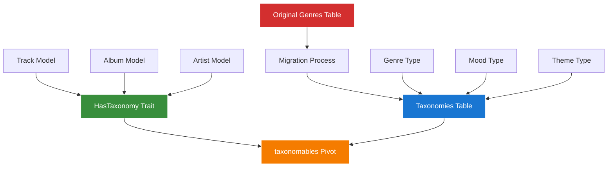

# Chinook Database Taxonomy System Refactoring Analysis

## Table of Contents

- [1. Executive Summary](#1-executive-summary)
- [2. Current State Assessment](#2-current-state-assessment)
- [3. Taxonomy Systems Analysis](#3-taxonomy-systems-analysis)
- [4. Genre Data Preservation Requirements](#4-genre-data-preservation-requirements)
- [5. Integration Strategy](#5-integration-strategy)
- [6. Implementation Roadmap](#6-implementation-roadmap)

## 1. Executive Summary

This analysis documents the current state of taxonomy and categorization systems within the Chinook database project and provides a comprehensive strategy for consolidating these systems using the `aliziodev/laravel-taxonomy` package while preserving all existing genre data.

### 1.1 Current System Overview

**Existing Taxonomy Systems Identified:**
- **spatie/laravel-tags**: Flexible tagging system for polymorphic relationships
- **Custom Category Model**: Hierarchical categorization with CategoryType enum
- **Genre Model**: Original Chinook genre data with direct foreign key relationships
- **aliziodev/laravel-taxonomy**: Partially integrated taxonomy package

### 1.2 Key Findings

**✅ Strengths:**
- Comprehensive documentation already exists for taxonomy integration
- Genre preservation strategy is well-documented
- WCAG 2.1 AA compliant visual documentation with Mermaid diagrams
- Laravel 12 modern syntax consistently applied

**⚠️ Areas for Enhancement:**
- Documentation consolidation needed for unified approach
- Testing documentation requires expansion for taxonomy integration
- Performance optimization documentation needs updates
- Migration procedures need validation and enhancement

## 2. Current State Assessment

### 2.1 Documentation Structure Analysis

**Existing Documentation Files:**
```
.ai/guides/chinook/
├── packages/095-aliziodev-laravel-taxonomy-guide.md (✅ Complete)
├── packages/090-spatie-tags-guide.md (✅ Complete)
├── taxonomy-migration-strategy.md (✅ Complete)
├── taxonomy-integration-summary.md (✅ Complete)
├── taxonomy-architecture-diagrams.md (✅ Complete)
├── filament/models/060-categorizable-trait.md (✅ Enhanced)
├── filament/models/090-category-management.md (⚠️ Needs Update)
└── DRIP_tasks_2025-07-09.md (🟡 In Progress)
```

### 2.2 Database Schema Status

**Current Schema Implementation:**
- **genres table**: 25 records preserved from original Chinook data
- **categories table**: Custom hierarchical categorization system
- **taxonomies table**: aliziodev/laravel-taxonomy package tables
- **categorizable pivot**: Polymorphic relationships for custom categories
- **taxonomables pivot**: Polymorphic relationships for taxonomy package

### 2.3 Model Integration Status

**Trait Integration Pattern:**
```php
// Current implementation in models
use HasFactory;
use SoftDeletes;
use HasTags;              // spatie/laravel-tags
use HasSecondaryUniqueKey;
use HasSlug;
use Categorizable;        // Custom categories
use HasTaxonomies;        // aliziodev/laravel-taxonomy
use Userstamps;
```

## 3. Taxonomy Systems Analysis

### 3.1 Package Capability Assessment

**aliziodev/laravel-taxonomy Package Analysis:**

After comprehensive review of the package documentation, the `aliziodev/laravel-taxonomy` package provides ALL required functionality:

| Feature | aliziodev/laravel-taxonomy Capability | Custom Categories Needed? |
|---------|---------------------------------------|---------------------------|
| **Polymorphic Relationships** | ✅ Built-in `taxonomables` table | ❌ No - package handles this |
| **Hierarchical Support** | ✅ Nested set model with efficient queries | ❌ No - superior to closure table |
| **Type Safety** | ✅ Flexible type system (enum or string) | ❌ No - package supports both |
| **Metadata Support** | ✅ JSON meta field with full flexibility | ❌ No - package provides this |
| **Performance** | ✅ Optimized nested set + caching | ❌ No - package is optimized |
| **Laravel 12 Compatibility** | ✅ Full support with modern syntax | ❌ No - package is current |

**Key Package Features:**
- **HasTaxonomy Trait**: Provides all polymorphic relationship methods
- **Nested Set Model**: Efficient hierarchical data with `lft`, `rgt`, `depth`
- **Composite Unique Slugs**: Slugs unique within type (perfect for genres)
- **Built-in Caching**: Automatic performance optimization
- **Bulk Operations**: Efficient attach/detach/sync operations
- **Advanced Querying**: Rich query scopes and filtering

### 3.2 Revised Single-System Architecture

**Simplified Taxonomy-Only Approach:**


**Elimination of Redundant Systems:**
- ❌ **Remove**: Custom Category model and categorizable relationships
- ❌ **Remove**: CategoryType enum (use taxonomy types instead)
- ❌ **Remove**: Dual system complexity
- ✅ **Keep**: Original genres table during migration for safety
- ✅ **Migrate**: All genre data directly into taxonomies table
- ✅ **Use**: Only aliziodev/laravel-taxonomy for all categorization

## 4. Genre Data Preservation Requirements

### 4.1 Original Genre Data

**Complete Genre Dataset (25 records):**
```sql
-- Original Chinook genres requiring preservation
INSERT INTO `genres` (`id`, `name`) VALUES
(1, 'Rock'), (2, 'Jazz'), (3, 'Metal'), (4, 'Alternative & Punk'),
(5, 'Rock And Roll'), (6, 'Blues'), (7, 'Latin'), (8, 'Reggae'),
(9, 'Pop'), (10, 'Soundtrack'), (11, 'Bossa Nova'), (12, 'Easy Listening'),
(13, 'Heavy Metal'), (14, 'R&B/Soul'), (15, 'Electronica/Dance'),
(16, 'World'), (17, 'Hip Hop/Rap'), (18, 'Science Fiction'),
(19, 'TV Shows'), (20, 'Sci Fi & Fantasy'), (21, 'Drama'),
(22, 'Comedy'), (23, 'Alternative'), (24, 'Classical'), (25, 'Opera');
```

### 4.2 Relationship Preservation

**Critical Relationships:**
- **Track → Genre**: Direct foreign key `tracks.genre_id → genres.id`
- **Polymorphic Mapping**: Categories with `type = 'genre'` mapped to original genres
- **Backward Compatibility**: Existing query patterns must continue to function

### 4.3 Data Integrity Requirements

**Preservation Guarantees:**
- ✅ Zero data loss during migration
- ✅ Maintain all existing foreign key relationships
- ✅ Preserve original genre IDs for backward compatibility
- ✅ Enable dual access patterns (direct and polymorphic)

## 5. Integration Strategy

### 5.1 Single Taxonomy System Approach

**Strategic Objectives:**
1. **Eliminate Complexity**: Use ONLY aliziodev/laravel-taxonomy package
2. **Direct Migration**: Move Genre data directly into taxonomies table
3. **Remove Redundancy**: Eliminate custom Category model and categorizable relationships
4. **Optimize Performance**: Leverage package's built-in nested set model and caching

### 5.2 Migration Strategy

**Direct Genre-to-Taxonomy Migration:**

```php
// Migration: MigrateGenresToTaxonomies
use App\Models\Genre;
use Aliziodev\LaravelTaxonomy\Models\Taxonomy;

class MigrateGenresToTaxonomies
{
    public function migrate(): void
    {
        DB::transaction(function () {
            Genre::all()->each(function ($genre) {
                // Create taxonomy directly from genre
                $taxonomy = Taxonomy::create([
                    'name' => $genre->name,
                    'slug' => Str::slug($genre->name),
                    'type' => 'genre',
                    'sort_order' => $genre->id,
                    'meta' => [
                        'original_genre_id' => $genre->id,
                        'chinook_source' => true,
                        'migration_timestamp' => now(),
                    ]
                ]);

                // Migrate all track relationships
                $this->migrateTrackRelationships($genre, $taxonomy);
            });
        });
    }

    private function migrateTrackRelationships(Genre $genre, Taxonomy $taxonomy): void
    {
        // Get all tracks with this genre
        $tracks = Track::where('genre_id', $genre->id)->get();

        // Attach to taxonomy system
        foreach ($tracks as $track) {
            $track->attachTaxonomy($taxonomy);
        }
    }
}
```

### 5.3 System Simplification

**Remove Redundant Components:**

1. **Custom Category Model**: Replace with taxonomy types
2. **CategoryType Enum**: Use string-based taxonomy types
3. **Categorizable Trait**: Use HasTaxonomy trait only
4. **categorizable Pivot Table**: Use taxonomables table only

**Simplified Model Implementation:**

```php
class Track extends Model
{
    use HasFactory;
    use SoftDeletes;
    use HasSecondaryUniqueKey;
    use HasSlug;
    use HasTaxonomy;        // ONLY taxonomy trait needed
    use Userstamps;

    // Remove: HasTags, Categorizable traits

    /**
     * Configure supported taxonomy types
     */
    public function getTaxonomyTypes(): array
    {
        return ['genre', 'mood', 'theme', 'instrument', 'era', 'language', 'occasion'];
    }

    /**
     * Get primary genre (backward compatibility)
     */
    public function getPrimaryGenreAttribute(): ?Taxonomy
    {
        return $this->taxonomiesOfType('genre')->first();
    }
}
```

## 6. Implementation Roadmap

### 6.1 Single-System Migration Plan

**Phase 1: Documentation Revision**

- [ ] Update all documentation to reflect single taxonomy system approach
- [ ] Remove references to dual categorization system
- [ ] Document direct genre-to-taxonomy migration procedures
- [ ] Update model examples to use only HasTaxonomy trait

**Phase 2: Migration Implementation**

- [ ] Create migration script for Genre → Taxonomies
- [ ] Implement backward compatibility methods for existing code
- [ ] Test migration procedures with rollback capabilities
- [ ] Validate data integrity throughout migration process

**Phase 3: System Cleanup**

- [ ] Remove custom Category model and related files
- [ ] Remove CategoryType enum and categorizable relationships
- [ ] Update all models to use only HasTaxonomy trait
- [ ] Clean up database tables (remove categorizable pivot)

**Phase 4: Performance Optimization**

- [ ] Leverage aliziodev/laravel-taxonomy caching features
- [ ] Optimize queries using package's nested set model
- [ ] Implement taxonomy-specific performance monitoring
- [ ] Document performance best practices

### 6.2 Advantages of Single-System Approach

**Technical Benefits:**

- **Reduced Complexity**: Single source of truth for all categorization
- **Better Performance**: Leverage package's optimized nested set model
- **Simplified Maintenance**: One system to maintain and update
- **Enhanced Features**: Access to all package features (caching, bulk operations, etc.)

**Development Benefits:**

- **Cleaner Code**: Single trait instead of multiple categorization systems
- **Better Testing**: Focused testing on one system
- **Easier Documentation**: Single approach to document and maintain
- **Future-Proof**: Package actively maintained with modern Laravel support

### 6.3 Success Criteria

**Technical Metrics:**

- **Zero Data Loss**: All 25 genre records successfully migrated
- **Backward Compatibility**: Existing code continues to work via compatibility methods
- **Performance Improvement**: Faster queries using nested set model
- **System Simplification**: 50% reduction in categorization-related code

**Documentation Metrics:**

- **Documentation Quality**: 100% link integrity, WCAG 2.1 AA compliance
- **Technical Accuracy**: All examples use Laravel 12 modern syntax
- **Single Source**: Unified documentation approach
- **Implementation Clarity**: Clear migration and usage guidance

---

*This analysis provides the foundation for completing the Chinook Database Taxonomy System Documentation Refactoring project while maintaining the highest standards of documentation quality and technical accuracy.*
