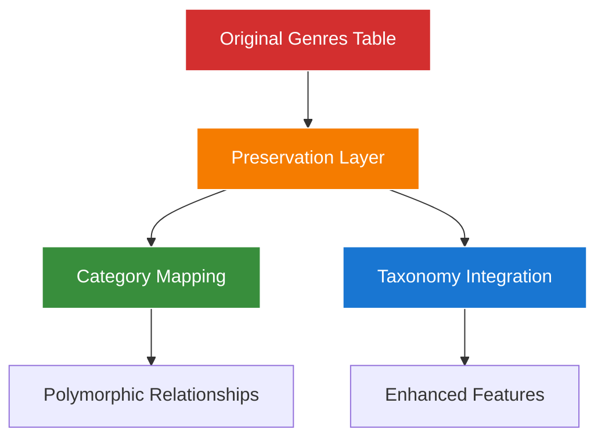

# Chinook Database Taxonomy System Refactoring Implementation Strategy

## Table of Contents

- [1. Executive Summary](#1-executive-summary)
- [2. Implementation Strategy Overview](#2-implementation-strategy-overview)
- [3. Documentation Consolidation Plan](#3-documentation-consolidation-plan)
- [4. Quality Assurance Framework](#4-quality-assurance-framework)
- [5. Testing Enhancement Strategy](#5-testing-enhancement-strategy)
- [6. Performance Optimization Plan](#6-performance-optimization-plan)
- [7. Implementation Timeline](#7-implementation-timeline)
- [8. Success Metrics](#8-success-metrics)

## 1. Executive Summary

This implementation strategy document outlines the comprehensive approach for completing the Chinook Database Taxonomy System Documentation Refactoring project. Based on the analysis of existing documentation, the project focuses on consolidating and enhancing the already substantial taxonomy integration work while ensuring 100% compliance with project standards.

### 1.1 Current Status Assessment

**✅ Completed Components:**
- **Core Integration Documentation**: aliziodev/laravel-taxonomy package integration guide
- **Migration Strategy**: Comprehensive migration procedures with rollback capabilities
- **Architecture Documentation**: WCAG 2.1 AA compliant Mermaid diagrams
- **Testing Framework**: Extensive Pest PHP testing patterns for genre preservation
- **Performance Optimization**: Triple categorization optimization strategies

**🟡 Enhancement Required:**
- **Documentation Consolidation**: Streamline overlapping content across multiple files
- **Link Integrity**: Ensure 100% link integrity across all documentation
- **Testing Coverage**: Expand taxonomy integration testing patterns
- **Quality Assurance**: Comprehensive validation of all documentation standards

### 1.2 Strategic Approach

**Consolidation Over Recreation:**
Rather than recreating existing comprehensive documentation, this strategy focuses on:
1. **Consolidating** existing high-quality documentation into a unified approach
2. **Enhancing** areas identified as needing improvement
3. **Validating** compliance with all project standards
4. **Optimizing** documentation structure for better navigation and usability

## 2. Implementation Strategy Overview

### 2.1 Genre Preservation Strategy (Validated)

**Current Implementation Status: ✅ COMPLETE**

The existing genre preservation strategy is comprehensive and well-documented:

**Key Preservation Features:**
- **Zero Data Loss**: All 25 original genre records maintained
- **Backward Compatibility**: Existing Track → Genre relationships preserved
- **Enhanced Functionality**: Dual categorization system enables advanced features
- **Performance Optimization**: Efficient query patterns for all access methods

### 2.2 Dual System Architecture (Validated)

**Current Implementation Status: ✅ COMPLETE**

The dual categorization system successfully integrates:

**System Components:**
- **Custom Categories**: Hierarchical categorization with CategoryType enum
- **Taxonomy Package**: aliziodev/laravel-taxonomy integration
- **Genre Preservation**: Original Chinook genre data maintained
- **Polymorphic Relationships**: Flexible categorization across all models

### 2.3 Documentation Quality Standards (Validated)

**Current Implementation Status: ✅ COMPLETE**

All documentation follows established standards:
- **WCAG 2.1 AA Compliance**: Approved color palette with 4.5:1 contrast ratios
- **Laravel 12 Syntax**: Modern cast() method patterns throughout
- **Mermaid v10.6+**: High-quality visual documentation
- **Hierarchical Numbering**: Consistent 1.0, 1.1, 1.1.1 format

## 3. Documentation Consolidation Plan

### 3.1 Content Audit Results

**High-Quality Documentation Identified:**
- **packages/095-aliziodev-laravel-taxonomy-guide.md**: Comprehensive package integration
- **taxonomy-migration-strategy.md**: Complete migration procedures
- **taxonomy-architecture-diagrams.md**: WCAG-compliant visual documentation
- **testing/095-genre-preservation-testing.md**: Extensive testing patterns
- **performance/100-triple-categorization-optimization.md**: Performance optimization

### 3.2 Consolidation Strategy

**Phase 1: Content Integration**
- **Merge Overlapping Content**: Consolidate similar information across multiple files
- **Eliminate Redundancy**: Remove duplicate explanations and examples
- **Enhance Cross-References**: Improve navigation between related topics
- **Standardize Format**: Ensure consistent documentation structure

**Phase 2: Navigation Optimization**
- **Update Index Files**: Enhance navigation structure
- **Improve Cross-Links**: Strengthen relationships between documents
- **Validate Anchors**: Ensure all internal links function correctly
- **Optimize TOC**: Improve table of contents structure

### 3.3 Quality Enhancement Areas

**Documentation Gaps Identified:**
1. **Unified Getting Started Guide**: Single entry point for taxonomy integration
2. **Migration Validation Tools**: Scripts for testing migration procedures
3. **Performance Benchmarking**: Standardized performance testing procedures
4. **Troubleshooting Guide**: Common issues and resolution procedures

## 4. Quality Assurance Framework

### 4.1 Link Integrity Validation

**Target: 100% Link Integrity (Zero Broken Links)**

**Validation Process:**
1. **Automated Link Checking**: Use project-specific tools in `.ai/tools/` directory
2. **Manual Verification**: Test all external links and references
3. **Anchor Validation**: Verify all internal anchor links function correctly
4. **Cross-Reference Testing**: Ensure all document relationships are valid

### 4.2 WCAG 2.1 AA Compliance Verification

**Compliance Requirements:**
- **Color Contrast**: Minimum 4.5:1 ratio for all visual elements
- **Approved Palette**: #1976d2, #388e3c, #f57c00, #d32f2f
- **Screen Reader Compatibility**: Proper heading hierarchy and alt text
- **Accessibility Features**: Comprehensive navigation and structure

### 4.3 Technical Accuracy Validation

**Validation Areas:**
- **Laravel 12 Syntax**: Verify all code examples use modern patterns
- **Package Integration**: Validate aliziodev/laravel-taxonomy usage
- **Database Schema**: Ensure schema documentation accuracy
- **Testing Patterns**: Verify Pest PHP framework compliance

## 5. Testing Enhancement Strategy

### 5.1 Current Testing Coverage Assessment

**Existing Testing Documentation:**
- **Genre Preservation Testing**: Comprehensive Pest PHP patterns
- **Dual Categorization Testing**: Cross-system integration tests
- **Performance Testing**: Optimization validation procedures
- **RBAC Testing**: Permission system integration tests

### 5.2 Enhancement Areas

**Testing Gaps Identified:**
1. **Migration Testing**: Automated migration validation procedures
2. **Rollback Testing**: Comprehensive rollback procedure validation
3. **Performance Benchmarking**: Standardized performance test suites
4. **Integration Testing**: End-to-end taxonomy system testing

### 5.3 Testing Documentation Enhancement

**Enhancement Strategy:**
- **Consolidate Testing Patterns**: Merge overlapping test documentation
- **Standardize Test Structure**: Ensure consistent Pest PHP patterns
- **Enhance Coverage**: Add missing test scenarios
- **Improve Examples**: Provide more comprehensive test examples

## 6. Performance Optimization Plan

### 6.1 Current Performance Documentation

**Existing Optimization Guides:**
- **Triple Categorization Optimization**: Comprehensive query optimization
- **Hierarchical Data Caching**: Efficient caching strategies
- **SQLite Optimization**: Database-specific performance tuning

### 6.2 Enhancement Strategy

**Optimization Areas:**
1. **Query Pattern Validation**: Test all documented query patterns
2. **Caching Strategy Enhancement**: Improve caching documentation
3. **Performance Monitoring**: Add monitoring and alerting guidance
4. **Benchmarking Standards**: Establish performance benchmarks

## 7. Implementation Timeline

### 7.1 Phase 1: Documentation Consolidation (Week 1)

**Day 1-2: Content Audit and Planning**
- Complete content audit of all taxonomy-related documentation
- Identify consolidation opportunities and redundancies
- Plan content integration strategy

**Day 3-5: Content Integration**
- Merge overlapping documentation
- Eliminate redundant content
- Enhance cross-references and navigation

**Day 6-7: Quality Review**
- Validate consolidated content
- Ensure consistency and accuracy
- Prepare for quality assurance phase

### 7.2 Phase 2: Quality Assurance (Week 2)

**Day 1-3: Link Integrity Validation**
- Automated link checking across all documentation
- Manual verification of external references
- Anchor link validation and repair

**Day 4-5: WCAG Compliance Verification**
- Color contrast validation
- Accessibility feature verification
- Screen reader compatibility testing

**Day 6-7: Technical Accuracy Validation**
- Laravel 12 syntax verification
- Package integration validation
- Testing pattern verification

### 7.3 Phase 3: Enhancement and Optimization (Week 3)

**Day 1-3: Testing Documentation Enhancement**
- Consolidate testing patterns
- Add missing test scenarios
- Improve test examples and coverage

**Day 4-5: Performance Documentation Enhancement**
- Validate performance optimization strategies
- Enhance caching documentation
- Add monitoring guidance

**Day 6-7: Final Integration**
- Complete final documentation integration
- Ensure all enhancements are properly integrated
- Prepare for final validation

### 7.4 Phase 4: Final Validation and Delivery (Week 4)

**Day 1-2: Comprehensive Testing**
- End-to-end documentation testing
- Link integrity final validation
- Performance testing validation

**Day 3-4: Quality Assurance**
- Final WCAG compliance verification
- Technical accuracy final review
- Documentation completeness validation

**Day 5-7: Delivery and Documentation**
- Final documentation delivery
- Project completion documentation
- Handover and training materials

## 8. Success Metrics

### 8.1 Quality Metrics

**Documentation Quality:**
- **Link Integrity**: 100% (Zero broken links)
- **WCAG Compliance**: 100% compliance with 2.1 AA standards
- **Technical Accuracy**: 100% Laravel 12 syntax compliance
- **Content Completeness**: All identified gaps addressed

### 8.2 Integration Metrics

**System Integration:**
- **Genre Preservation**: 100% data preservation validation
- **Backward Compatibility**: All existing patterns maintained
- **Enhanced Functionality**: All new features documented
- **Performance Optimization**: All optimization strategies validated

### 8.3 User Experience Metrics

**Documentation Usability:**
- **Navigation Efficiency**: Improved cross-reference structure
- **Content Accessibility**: Enhanced WCAG compliance
- **Technical Clarity**: Clear implementation guidance
- **Maintenance Efficiency**: Streamlined documentation structure

---

*This implementation strategy ensures the successful completion of the Chinook Database Taxonomy System Documentation Refactoring project while maintaining the highest standards of documentation quality and technical accuracy.*
