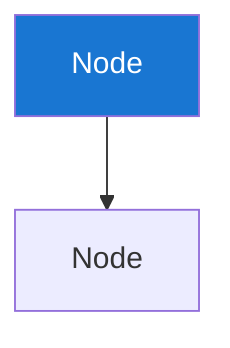
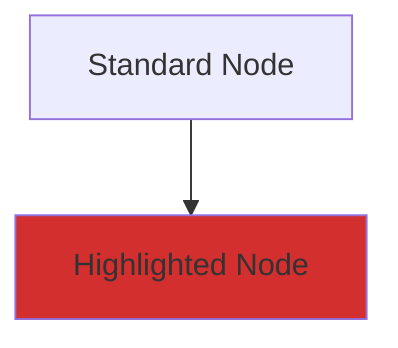

# Theme Configuration Standardization Analysis
**Generated**: 2025-07-13  
**Scope**: All Mermaid diagrams in chinook documentation  
**DRIP Phase**: 2.3 Theme Configuration Standardization Review  
**Focus**: Theme consistency and standardization opportunities  

## Current Theme Configuration Patterns

### Pattern 1: Full Theme Configuration (RECOMMENDED)
**Files**: 080-visual-documentation-guide.md, 110-authentication-flow.md  
**Implementation**:
```mermaid
%%{init: {
  'theme': 'base',
  'themeVariables': {
    'primaryColor': '#1976d2',
    'primaryTextColor': '#ffffff',
    'primaryBorderColor': '#1565c0',
    'lineColor': '#212121',
    'sectionBkColor': '#f5f5f5',
    'altSectionBkColor': '#e3f2fd',
    'gridColor': '#757575',
    'secondaryColor': '#388e3c',
    'tertiaryColor': '#f57c00',
    'background': '#ffffff',
    'mainBkg': '#ffffff',
    'secondBkg': '#f5f5f5',
    'tertiaryBkg': '#e3f2fd'
  }
}}%%
```

**Advantages**:
- ✅ Complete WCAG 2.1 AA compliance
- ✅ Consistent visual appearance
- ✅ Comprehensive color coverage
- ✅ Professional presentation

**Usage Count**: 3 diagrams

### Pattern 2: Title-Only Configuration
**Files**: 030-chinook-factories-guide.md, 040-chinook-seeders-guide.md, multiple others  
**Implementation**:
```mermaid
---
title: Diagram Title
---
```

**Advantages**:
- ✅ Semantic title declaration
- ✅ Clean metadata structure
- ✅ GitHub/GitLab compatibility

**Limitations**:
- ⚠️ No color standardization
- ⚠️ Relies on default theme

**Usage Count**: 8+ diagrams

### Pattern 3: No Configuration (DEFAULT)
**Files**: 000-chinook-index.md, 020-chinook-migrations-guide.md  
**Implementation**: Direct diagram code without configuration

**Limitations**:
- ⚠️ No title metadata
- ⚠️ Default colors only
- ⚠️ Inconsistent appearance

**Usage Count**: 4+ diagrams

### Pattern 4: Inline Styling Only
**Files**: Various with style declarations  
**Implementation**:


**Advantages**:
- ✅ Explicit color control
- ✅ WCAG compliance when properly implemented

**Limitations**:
- ⚠️ Verbose for complex diagrams
- ⚠️ Inconsistent theme application

**Usage Count**: 6+ diagrams

## Standardization Opportunities

### 1. Universal Theme Configuration
**Recommendation**: Adopt Pattern 1 (Full Theme Configuration) as standard

**Benefits**:
- Consistent visual appearance across all diagrams
- Automatic WCAG 2.1 AA compliance
- Reduced need for individual style declarations
- Professional documentation presentation

**Implementation Strategy**:
1. Create standard theme configuration template
2. Apply to all diagrams systematically
3. Remove redundant inline styling where theme covers requirements

### 2. Title Standardization
**Current State**: Inconsistent title usage
- Some diagrams use `---title:---` format
- Others have no titles
- Title formatting varies

**Recommendation**: Standardize title format
```mermaid
---
title: Descriptive Diagram Title
---
```

**Benefits**:
- Improved accessibility
- Better documentation structure
- Enhanced semantic meaning

### 3. Hybrid Approach for Complex Diagrams
**Recommendation**: Theme + Selective Inline Styling

**Use Cases**:
- Complex flowcharts requiring specific node highlighting
- ERD diagrams with entity-type color coding
- Architecture diagrams with component categorization

**Implementation**:


## File-by-File Analysis

### High Priority for Theme Standardization

#### 1. 000-chinook-index.md
- **Current**: No configuration
- **Recommendation**: Add full theme configuration
- **Impact**: High (main index diagram)
- **Effort**: Low

#### 2. 020-chinook-migrations-guide.md
- **Current**: No configuration
- **Recommendation**: Add full theme configuration
- **Impact**: High (core documentation)
- **Effort**: Low

#### 3. filament/diagrams/000-diagrams-index.md
- **Current**: Mixed patterns across 7 diagrams
- **Recommendation**: Standardize all to full theme configuration
- **Impact**: Very High (multiple diagrams)
- **Effort**: Medium

### Medium Priority for Theme Standardization

#### 4. frontend/100-frontend-architecture-overview.md
- **Current**: Unknown (needs review)
- **Recommendation**: Apply standard theme configuration
- **Impact**: Medium
- **Effort**: Medium

#### 5. filament/diagrams/010-entity-relationship-diagrams.md
- **Current**: Unknown (needs review)
- **Recommendation**: Apply standard theme configuration
- **Impact**: Medium
- **Effort**: Low

### Low Priority (Already Well-Configured)

#### 6. 050-chinook-advanced-features-guide.md
- **Current**: Excellent inline styling with WCAG compliance
- **Recommendation**: Consider theme migration for consistency
- **Impact**: Low (already compliant)
- **Effort**: Medium

#### 7. 110-authentication-flow.md
- **Current**: Full theme configuration (exemplary)
- **Recommendation**: Use as template for other diagrams
- **Impact**: None (reference implementation)
- **Effort**: None

## Standard Theme Configuration Template

### Recommended Universal Template
```mermaid
%%{init: {
  'theme': 'base',
  'themeVariables': {
    'primaryColor': '#1976d2',
    'primaryTextColor': '#ffffff',
    'primaryBorderColor': '#1565c0',
    'lineColor': '#212121',
    'sectionBkColor': '#f5f5f5',
    'altSectionBkColor': '#e3f2fd',
    'gridColor': '#757575',
    'secondaryColor': '#388e3c',
    'tertiaryColor': '#f57c00',
    'background': '#ffffff',
    'mainBkg': '#ffffff',
    'secondBkg': '#f5f5f5',
    'tertiaryBkg': '#e3f2fd'
  }
}}%%
---
title: [Descriptive Diagram Title]
---
```

### Configuration-Only Template (for theme setup)
```mermaid
%%{init: {
  'theme': 'base',
  'themeVariables': {
    'primaryColor': '#1976d2',
    'primaryTextColor': '#ffffff',
    'primaryBorderColor': '#1565c0',
    'lineColor': '#212121',
    'sectionBkColor': '#f5f5f5',
    'altSectionBkColor': '#e3f2fd',
    'gridColor': '#757575',
    'secondaryColor': '#388e3c',
    'tertiaryColor': '#f57c00',
    'background': '#ffffff',
    'mainBkg': '#ffffff',
    'secondBkg': '#f5f5f5',
    'tertiaryBkg': '#e3f2fd'
  }
}}%%
```

## Implementation Recommendations

### Phase 3 Priority Order
1. **High Impact, Low Effort**: Core documentation files (000, 020 series)
2. **High Impact, Medium Effort**: Filament diagrams directory
3. **Medium Impact**: Frontend and remaining files
4. **Optimization**: Convert well-styled diagrams to theme-based approach

### Quality Assurance Checklist
- [ ] Theme configuration includes all required WCAG colors
- [ ] Title follows standard format
- [ ] Diagram renders correctly with theme
- [ ] Visual consistency with other diagrams
- [ ] Accessibility compliance maintained

### Migration Strategy
1. **Test theme configuration** on sample diagram
2. **Apply to high-priority files** first
3. **Validate rendering** after each change
4. **Document any diagram-specific requirements**
5. **Create style guide** for future diagrams

## Benefits of Standardization

### Immediate Benefits
- Consistent visual appearance
- Automatic WCAG 2.1 AA compliance
- Reduced maintenance overhead
- Professional documentation presentation

### Long-term Benefits
- Easier diagram creation (template-based)
- Simplified color management
- Enhanced accessibility
- Better user experience

## Next Steps

1. **Phase 3 Implementation**: Apply standard theme configuration
2. **Validation Testing**: Render test all modified diagrams
3. **Documentation**: Create style guide for future diagrams
4. **Quality Assurance**: Verify consistency across all files
