# Database Schema Diagrams and Entity Relationships

**Report Date:** 2025-07-19  
**Project:** Chinook SQLite Architecture Evaluation  
**Focus:** Visual representation of current and proposed database architectures

## 1. Current Single-Database Architecture

### 1.1. Current Schema Overview

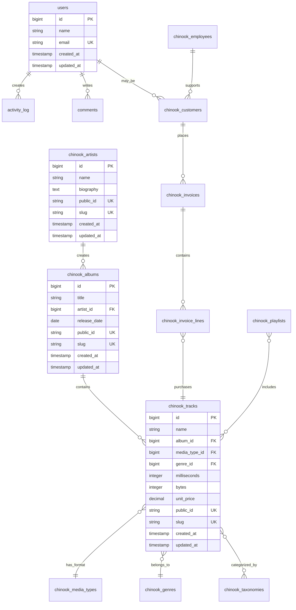

### 1.2. Current Performance Characteristics

**Database File Structure:**
```
database/
├── database.sqlite (50MB)
├── database.sqlite-wal (variable)
└── database.sqlite-shm (32KB)
```

**Connection Configuration:**
```yaml
Single Connection Pool:
  - Max Connections: 1 (SQLite limitation)
  - WAL Mode: Enabled
  - Cache Size: 64MB
  - Memory Mapping: 256MB
  - Concurrent Readers: Unlimited
  - Concurrent Writers: 1
```

## 2. Proposed Three-Database Architecture

### 2.1. Database Separation Strategy

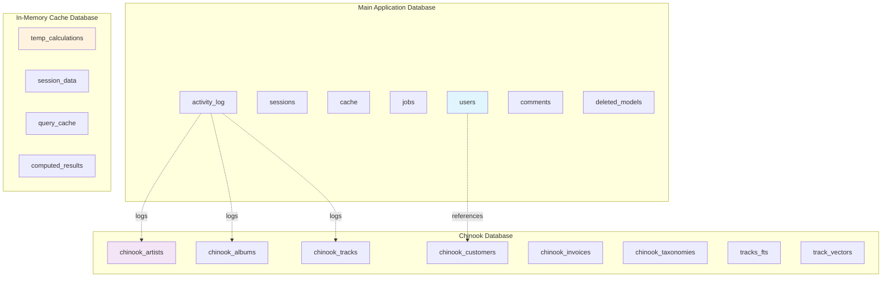

### 2.2. Proposed Schema Relationships

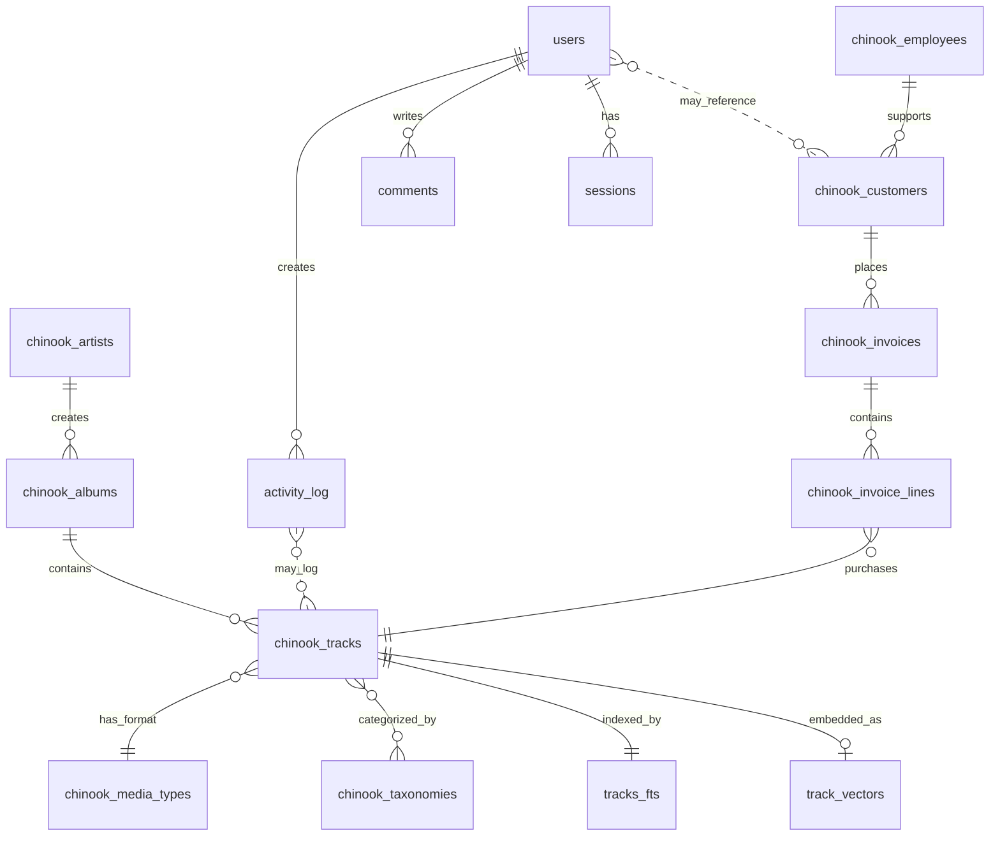

### 2.3. Connection Pool Architecture

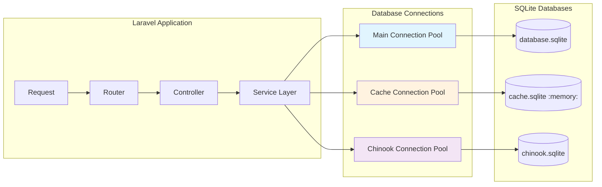

## 3. Data Flow Analysis

### 3.1. Current Data Flow (Single Database)

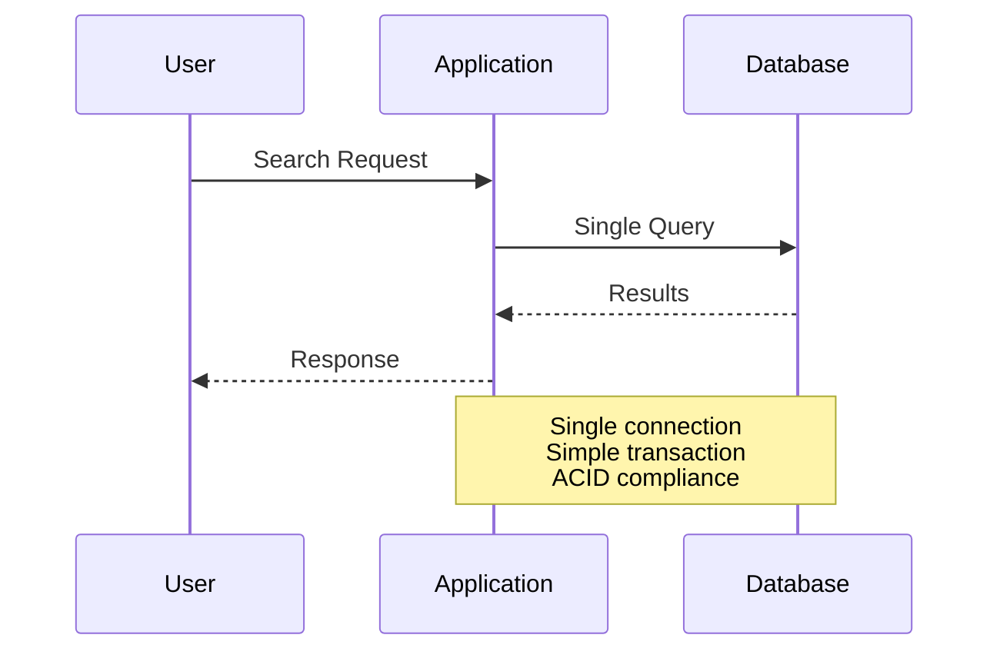

### 3.2. Proposed Data Flow (Three Databases)

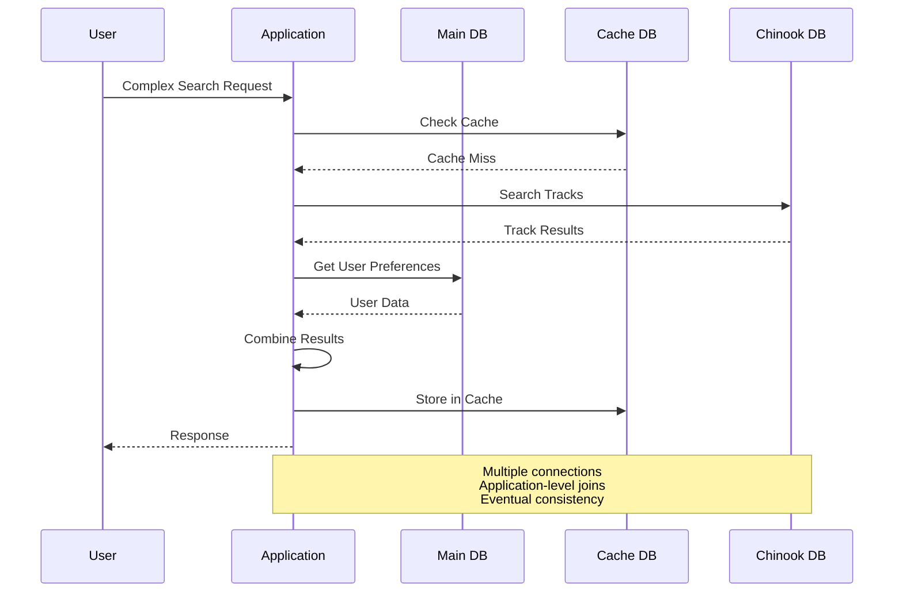

## 4. Performance Impact Analysis

### 4.1. Query Performance Comparison

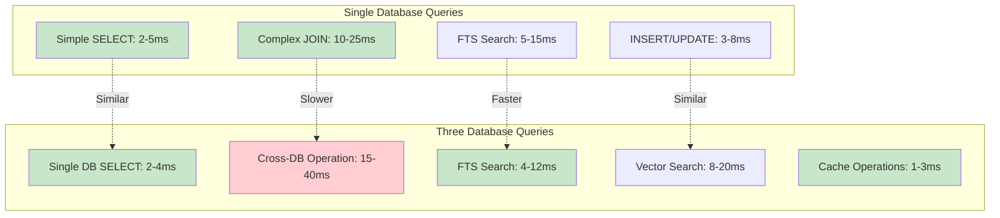

### 4.2. Memory Usage Distribution


## 5. Extension Integration Diagrams

### 5.1. FTS5 Integration Architecture

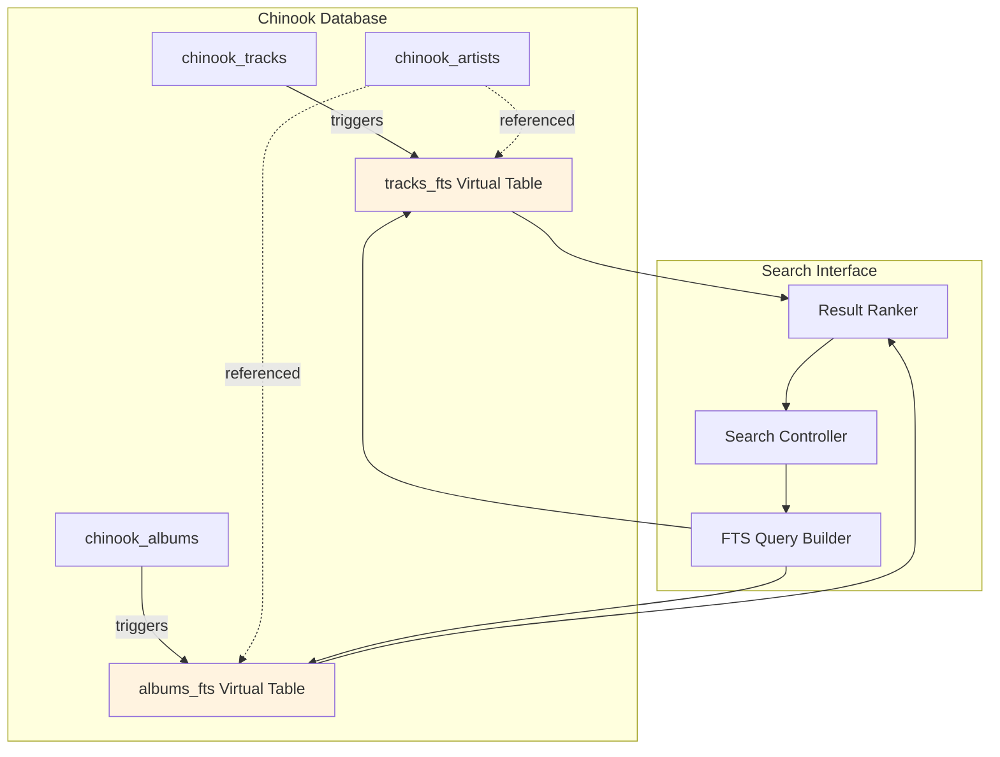

### 5.2. Vector Search Integration

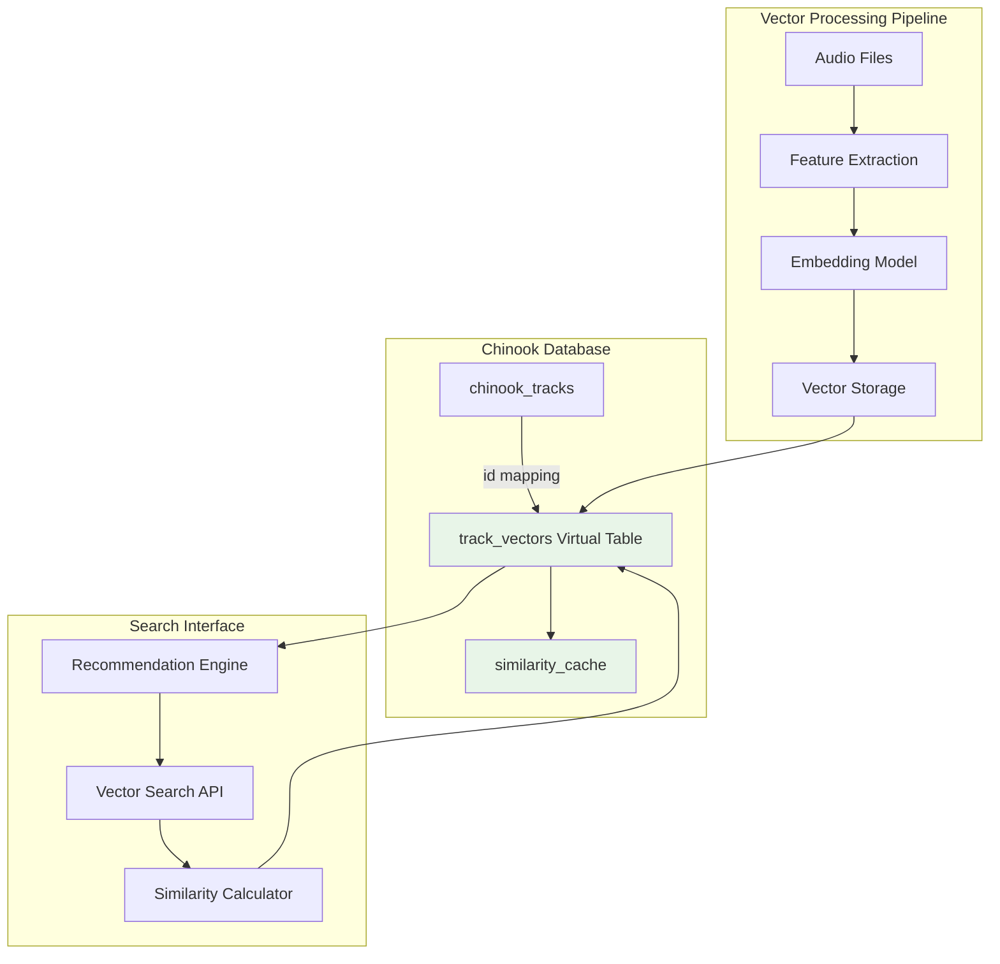

## 6. Migration Flow Diagrams

### 6.1. Data Migration Strategy

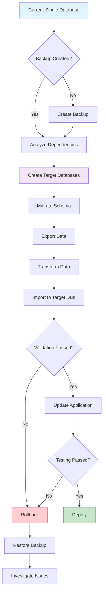

### 6.2. Rollback Procedure

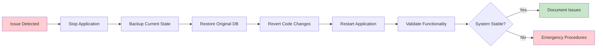

## 7. Operational Monitoring Diagrams

### 7.1. Multi-Database Monitoring Architecture

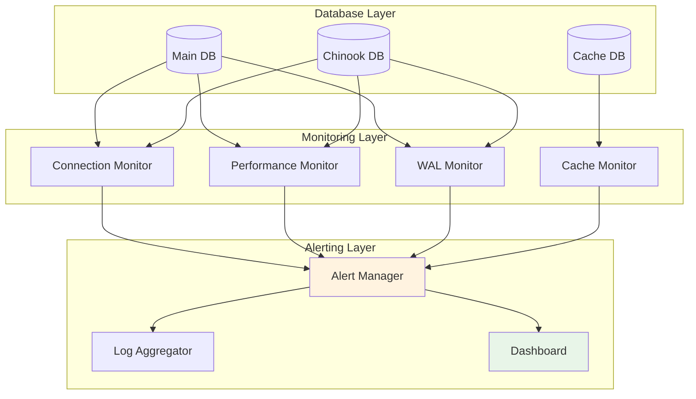

### 7.2. Backup Strategy Visualization

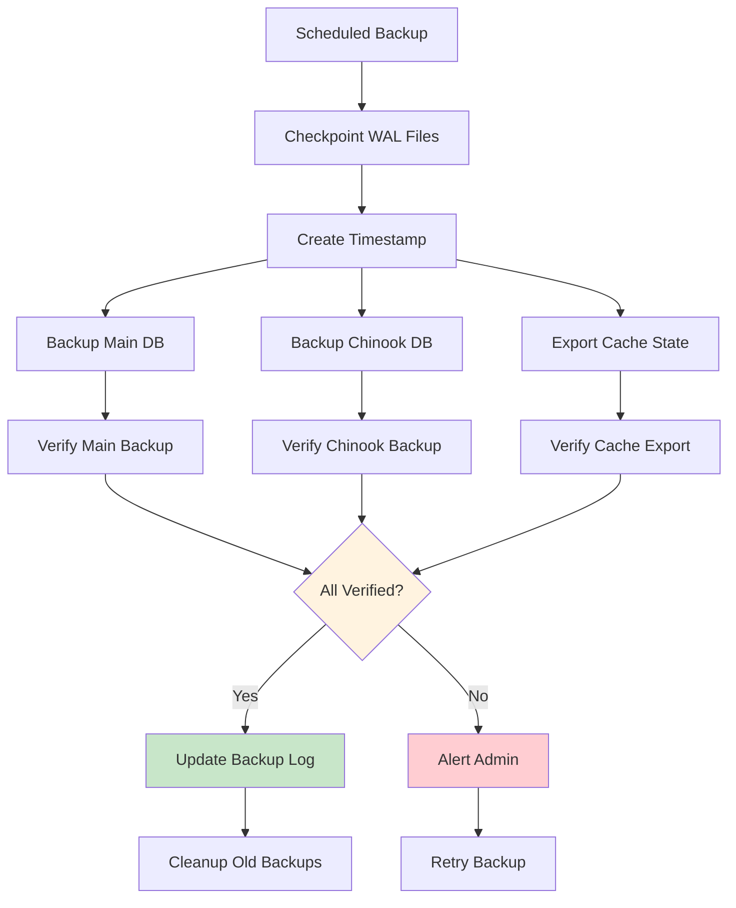

## 8. Security Architecture Diagrams

### 8.1. File Permission Structure

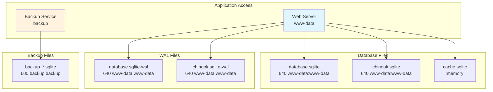

### 8.2. Connection Security Model

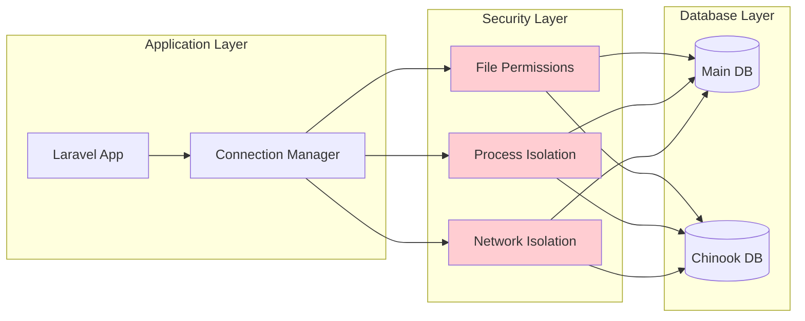

## 9. Conclusion

These diagrams illustrate the complexity increase when moving from a single-database to a three-database architecture. Key observations:

1. **Relationship Complexity:** Cross-database relationships require application-level management
2. **Performance Trade-offs:** Some operations become faster, others slower
3. **Operational Overhead:** Significantly more complex monitoring and backup procedures
4. **Security Considerations:** Multiple files and connections to secure

The visual analysis supports the recommendation to enhance the current single-database architecture rather than implementing the three-database approach for the educational scope of the Chinook project.

---

**Document Version:** 1.0  
**Last Updated:** 2025-07-19  
**Related Documents:** sqlite-architecture-evaluation.md
