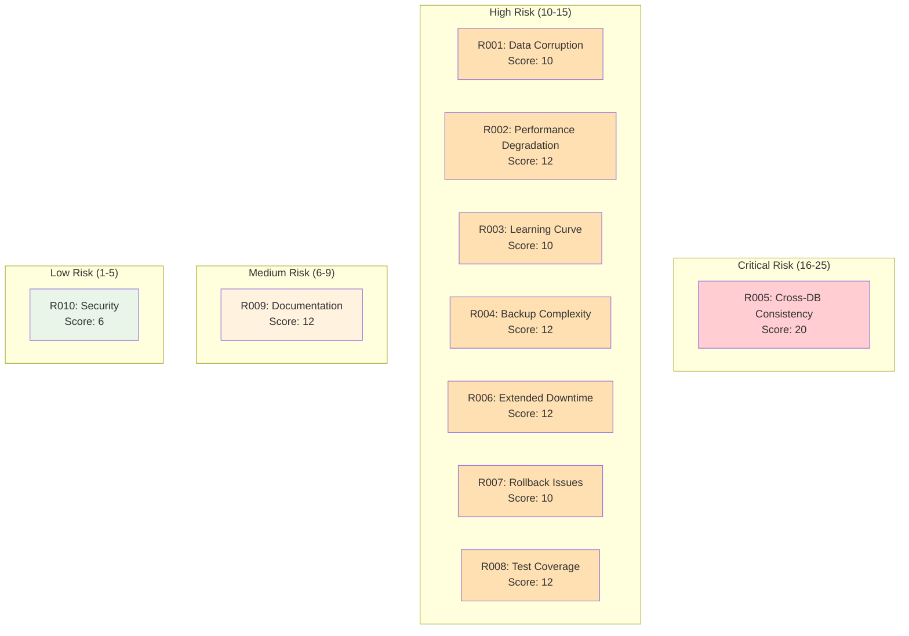
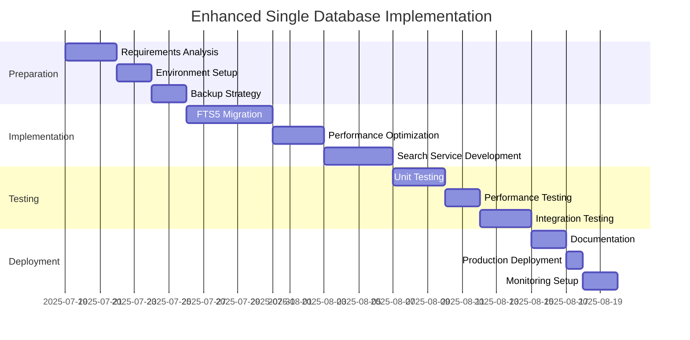
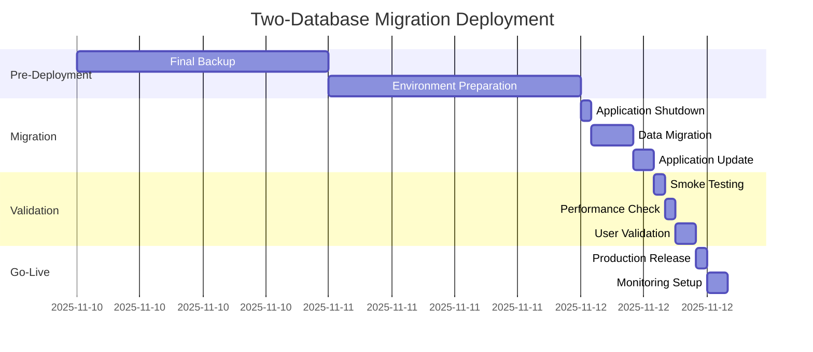

# Risk Assessment Matrix and Migration Roadmap

**Report Date:** 2025-07-19  
**Project:** Chinook SQLite Architecture Implementation  
**Focus:** Risk analysis and detailed migration planning

## 1. Comprehensive Risk Assessment Matrix

### 1.1. Risk Categories and Scoring

**Risk Probability Scale:**
- **Low (1-2):** Unlikely to occur (0-25% chance)
- **Medium (3-4):** Possible occurrence (26-75% chance)  
- **High (5):** Likely to occur (76-100% chance)

**Impact Scale:**
- **Low (1-2):** Minor disruption, quick recovery
- **Medium (3-4):** Moderate disruption, some downtime
- **Critical (5):** Major disruption, significant downtime or data loss

**Risk Score = Probability × Impact**

### 1.2. Detailed Risk Analysis

| Risk ID | Risk Category | Description | Probability | Impact | Score | Priority |
|---------|---------------|-------------|-------------|--------|-------|----------|
| R001 | Data Integrity | Data corruption during migration | 2 | 5 | 10 | High |
| R002 | Performance | Query performance degradation | 4 | 3 | 12 | High |
| R003 | Complexity | Development team learning curve | 5 | 2 | 10 | Medium |
| R004 | Operational | Backup/restore complexity increase | 4 | 3 | 12 | High |
| R005 | Consistency | Cross-database referential integrity | 5 | 4 | 20 | Critical |
| R006 | Availability | Extended downtime during migration | 3 | 4 | 12 | High |
| R007 | Rollback | Inability to revert changes | 2 | 5 | 10 | High |
| R008 | Testing | Incomplete test coverage | 3 | 4 | 12 | High |
| R009 | Documentation | Inadequate operational procedures | 4 | 3 | 12 | Medium |
| R010 | Security | Multiple database file vulnerabilities | 2 | 3 | 6 | Low |

### 1.3. Risk Heat Map



## 2. Risk Mitigation Strategies

### 2.1. Critical Risk Mitigation (R005: Cross-Database Consistency)

**Risk:** Cross-database referential integrity failures  
**Mitigation Strategy:**

```php
// Application-level integrity service
class DatabaseIntegrityService
{
    public function validateCrossDbReferences(): array
    {
        $violations = [];
        
        // Check user -> customer references
        $orphanedCustomers = DB::connection('chinook')
            ->table('chinook_customers')
            ->whereNotIn('user_id', function($query) {
                $query->select('id')->from('users');
            })
            ->get();
            
        if ($orphanedCustomers->isNotEmpty()) {
            $violations[] = [
                'type' => 'orphaned_customers',
                'count' => $orphanedCustomers->count(),
                'records' => $orphanedCustomers->pluck('id')->toArray()
            ];
        }
        
        return $violations;
    }
    
    public function enforceReferentialIntegrity(): void
    {
        // Implement compensating transactions
        // Log integrity violations
        // Trigger alerts for manual intervention
    }
}
```

**Implementation Timeline:** Week 1-2 of any multi-database implementation  
**Success Criteria:** Zero referential integrity violations in production

### 2.2. High Risk Mitigation Strategies

#### R001: Data Corruption Prevention

**Mitigation Approach:**
1. **Comprehensive Backup Strategy**
   ```bash
   # Pre-migration backup script
   #!/bin/bash
   TIMESTAMP=$(date +%Y%m%d_%H%M%S)
   
   # Checkpoint WAL files
   sqlite3 database/database.sqlite "PRAGMA wal_checkpoint(TRUNCATE);"
   
   # Create verified backup
   cp database/database.sqlite "backups/pre-migration-${TIMESTAMP}.sqlite"
   
   # Verify backup integrity
   sqlite3 "backups/pre-migration-${TIMESTAMP}.sqlite" "PRAGMA integrity_check;"
   ```

2. **Incremental Migration with Validation**
   ```php
   // Migration validation service
   class MigrationValidator
   {
       public function validateTableMigration(string $table): bool
       {
           $sourceCount = DB::table($table)->count();
           $targetCount = DB::connection('chinook')->table($table)->count();
           
           return $sourceCount === $targetCount;
       }
   }
   ```

#### R002: Performance Degradation Mitigation

**Monitoring Implementation:**
```php
// Performance monitoring middleware
class DatabasePerformanceMiddleware
{
    public function handle($request, Closure $next)
    {
        $start = microtime(true);
        
        $response = $next($request);
        
        $duration = (microtime(true) - $start) * 1000;
        
        if ($duration > 100) { // Log slow requests
            Log::warning('Slow database operation', [
                'duration_ms' => $duration,
                'route' => $request->route()->getName(),
                'queries' => DB::getQueryLog()
            ]);
        }
        
        return $response;
    }
}
```

#### R006: Extended Downtime Mitigation

**Blue-Green Deployment Strategy:**
1. **Preparation Phase** (Zero downtime)
   - Set up parallel environment
   - Migrate data to new structure
   - Run comprehensive tests

2. **Cutover Phase** (Minimal downtime)
   - Stop write operations
   - Sync final changes
   - Switch application configuration
   - Resume operations

3. **Validation Phase**
   - Monitor performance metrics
   - Validate data integrity
   - Confirm user functionality

## 3. Migration Roadmap

### 3.1. Recommended Approach: Enhanced Single Database

**Timeline: 6 weeks**  
**Risk Level: Low**  
**Effort: Medium**

#### Phase 1: Preparation (Week 1)


**Deliverables:**
- FTS5 search functionality
- Performance optimization
- Comprehensive testing
- Documentation updates

**Success Criteria:**
- Search response time < 50ms
- Zero data loss
- All existing functionality preserved
- Team training completed

#### Phase 2: Optional Vector Search (Week 7-8)
- Evaluate sqlite-vec integration
- Implement basic similarity search
- Performance testing and optimization

### 3.2. Alternative Approach: Two-Database Architecture

**Timeline: 16 weeks**  
**Risk Level: High**  
**Effort: High**

#### Phase 1: Planning and Preparation (Weeks 1-4)

**Week 1-2: Analysis and Design**
- Current state documentation
- Dependency mapping
- Architecture design
- Risk assessment refinement

**Week 3-4: Environment Preparation**
- Development environment setup
- Testing framework enhancement
- Backup and rollback procedures
- Team training initiation

#### Phase 2: Schema Migration (Weeks 5-8)

**Week 5-6: Database Creation**
- Create chinook.sqlite database
- Migrate table schemas
- Set up connection configurations
- Initial data validation

**Week 7-8: Data Migration**
- Implement migration scripts
- Execute data transfer
- Validate data integrity
- Performance baseline testing

#### Phase 3: Application Updates (Weeks 9-12)

**Week 9-10: Model Configuration**
- Update Chinook models
- Implement connection management
- Modify relationship definitions
- Unit test updates

**Week 11-12: Query Optimization**
- Implement cross-database queries
- Optimize performance
- Cache strategy implementation
- Integration testing

#### Phase 4: Testing and Validation (Weeks 13-15)

**Week 13: Comprehensive Testing**
- Functional testing
- Performance testing
- Load testing
- Security testing

**Week 14: User Acceptance Testing**
- Stakeholder validation
- Documentation review
- Training material preparation
- Deployment planning

**Week 15: Pre-Production Validation**
- Production environment setup
- Final data migration test
- Rollback procedure validation
- Go-live preparation

#### Phase 5: Deployment (Week 16)

**Deployment Schedule:**


## 4. Success Metrics and KPIs

### 4.1. Technical Success Metrics

| Metric | Current Baseline | Target (Enhanced) | Target (Two-DB) |
|--------|------------------|-------------------|-----------------|
| Average Query Time | 50-100ms | 40-80ms | 40-120ms |
| Search Response Time | N/A | <50ms | <50ms |
| Database Size | 50MB | 55MB | 60MB |
| Memory Usage | 70MB | 75MB | 95MB |
| Concurrent Users | 10-50 | 10-50 | 10-50 |
| Backup Time | 5 seconds | 8 seconds | 15 seconds |

### 4.2. Operational Success Metrics

| Metric | Current | Enhanced | Two-Database |
|--------|---------|----------|--------------|
| Deployment Complexity | Low | Low | High |
| Maintenance Overhead | Low | Low | Medium |
| Team Learning Curve | N/A | 1 week | 4 weeks |
| Documentation Pages | 10 | 15 | 25 |
| Monitoring Points | 5 | 8 | 15 |

### 4.3. Educational Success Metrics

| Metric | Current | Enhanced | Two-Database |
|--------|---------|----------|--------------|
| Student Understanding | High | High | Medium |
| Setup Complexity | Simple | Simple | Complex |
| Troubleshooting Difficulty | Easy | Easy | Difficult |
| Learning Value | Good | Excellent | Good |

## 5. Contingency Plans

### 5.1. Migration Failure Response

**Immediate Actions (0-1 hour):**
1. Stop all write operations
2. Assess scope of failure
3. Initiate rollback if data integrity compromised
4. Communicate status to stakeholders

**Short-term Actions (1-24 hours):**
1. Complete rollback to previous state
2. Analyze failure root cause
3. Update migration procedures
4. Plan remediation approach

**Long-term Actions (1-7 days):**
1. Implement fixes for identified issues
2. Enhanced testing procedures
3. Updated risk mitigation strategies
4. Revised migration timeline

### 5.2. Performance Degradation Response

**Detection Triggers:**
- Query response time > 200ms
- User complaints about slowness
- Automated monitoring alerts

**Response Procedures:**
1. **Immediate:** Enable query logging and performance monitoring
2. **Short-term:** Identify and optimize slow queries
3. **Medium-term:** Review and adjust database configuration
4. **Long-term:** Consider architecture modifications

### 5.3. Data Integrity Issues

**Detection Methods:**
- Automated integrity checks
- User-reported data inconsistencies
- Scheduled validation procedures

**Response Actions:**
1. **Immediate:** Isolate affected data
2. **Assessment:** Determine scope and impact
3. **Recovery:** Restore from backup if necessary
4. **Prevention:** Implement additional validation

## 6. Recommendations Summary

### 6.1. Primary Recommendation: Enhanced Single Database

**Rationale:**
- **Low Risk:** Minimal architectural changes
- **High Value:** Significant search capability improvement
- **Educational Fit:** Maintains simplicity for learning
- **Quick Implementation:** 6-week timeline

**Key Benefits:**
- FTS5 search capabilities
- Performance optimization
- Maintained simplicity
- Low operational overhead

### 6.2. Alternative Consideration: Defer Multi-Database

**Conditions for Reconsideration:**
- Clear performance bottlenecks identified
- Specific use cases requiring separation
- Team expertise in multi-database management
- Production deployment requirements

**Timeline for Review:** 6 months after enhanced single database implementation

## 7. Conclusion

The risk assessment clearly indicates that the enhanced single-database approach provides the optimal balance of benefits and risks for the Chinook educational project. The three-database architecture, while technically interesting, introduces significant complexity and operational overhead that may not be justified for the current scope and requirements.

**Final Recommendation:** Implement the enhanced single-database approach with FTS5 search capabilities, and defer consideration of multi-database architecture until specific performance or functional requirements justify the additional complexity.

---

**Document Version:** 1.0  
**Last Updated:** 2025-07-19  
**Next Review:** 2025-10-19  
**Related Documents:** sqlite-architecture-evaluation.md, implementation-guidance.md
