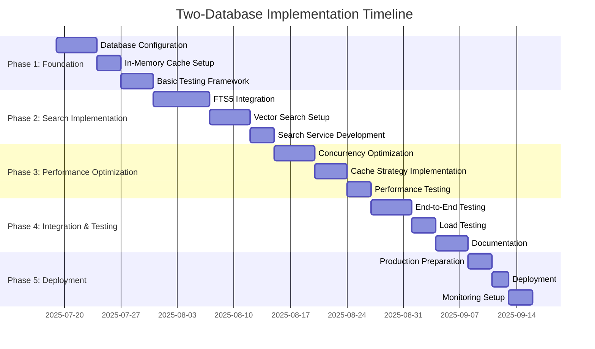

# Performance Analysis and Implementation Timeline

**Report Date:** 2025-07-19  
**Project:** Chinook Two-Database Architecture  
**Focus:** Performance characteristics, bottleneck analysis, and implementation roadmap

## 1. Performance Analysis

### 1.1. Expected Performance Characteristics

**Current Single Database Performance:**
```
Concurrent Users: 10-50
Average Query Time: 50-100ms
Memory Usage: 70MB
Database Size: 50MB
Search Capability: Basic SQL LIKE queries
```

**Projected Two-Database Performance:**
```
Concurrent Users: 100
Average Query Time: 30-80ms (improved for cached operations)
Memory Usage: 120-150MB (includes in-memory cache)
Database Size: 55-60MB (with FTS5 and vector indexes)
Search Capability: Advanced FTS5 + Vector search
Cache Hit Rate: 70-85% for frequent operations
```

### 1.2. Performance Benchmarking Framework

**Comprehensive Performance Testing Service:**
```php
class TwoDatabasePerformanceBenchmark
{
    private array $metrics = [];
    private InMemoryCacheManager $cacheManager;
    
    public function runComprehensiveBenchmark(): array
    {
        $this->metrics = [
            'database_operations' => $this->benchmarkDatabaseOperations(),
            'search_performance' => $this->benchmarkSearchOperations(),
            'cache_performance' => $this->benchmarkCacheOperations(),
            'concurrency_test' => $this->benchmarkConcurrency(),
            'memory_usage' => $this->benchmarkMemoryUsage(),
        ];
        
        return $this->generatePerformanceReport();
    }
    
    private function benchmarkDatabaseOperations(): array
    {
        $operations = [
            'simple_select' => function() {
                return DB::table('chinook_tracks')->limit(100)->get();
            },
            'complex_join' => function() {
                return DB::table('chinook_tracks')
                    ->join('chinook_albums', 'chinook_tracks.album_id', '=', 'chinook_albums.id')
                    ->join('chinook_artists', 'chinook_albums.artist_id', '=', 'chinook_artists.id')
                    ->select(['chinook_tracks.*', 'chinook_albums.title', 'chinook_artists.name'])
                    ->limit(100)
                    ->get();
            },
            'aggregation' => function() {
                return DB::table('chinook_tracks')
                    ->join('chinook_albums', 'chinook_tracks.album_id', '=', 'chinook_albums.id')
                    ->groupBy('chinook_albums.id')
                    ->select(['chinook_albums.id', DB::raw('COUNT(*) as track_count')])
                    ->get();
            },
            'insert_operation' => function() {
                return DB::table('activity_log')->insert([
                    'log_name' => 'test',
                    'description' => 'Performance test',
                    'subject_type' => 'test',
                    'subject_id' => 1,
                    'causer_type' => 'test',
                    'causer_id' => 1,
                    'properties' => '{}',
                    'created_at' => now(),
                    'updated_at' => now(),
                ]);
            },
        ];
        
        $results = [];
        foreach ($operations as $name => $operation) {
            $results[$name] = $this->timeOperation($operation, 10); // Run 10 times
        }
        
        return $results;
    }
    
    private function benchmarkSearchOperations(): array
    {
        $searchService = app(AdvancedMusicSearchService::class);
        $vectorService = app(MusicVectorService::class);
        
        $searches = [
            'fts5_simple' => function() use ($searchService) {
                return $searchService->searchMusic('rock');
            },
            'fts5_complex' => function() use ($searchService) {
                return $searchService->searchMusic('rock AND blues', ['limit' => 50]);
            },
            'vector_similarity' => function() use ($vectorService) {
                return $vectorService->findSimilarTracks(1, 'audio', 10);
            },
            'autocomplete' => function() use ($searchService) {
                return $searchService->searchSuggestions('rock');
            },
        ];
        
        $results = [];
        foreach ($searches as $name => $search) {
            $results[$name] = $this->timeOperation($search, 5); // Run 5 times
        }
        
        return $results;
    }
    
    private function benchmarkCacheOperations(): array
    {
        $operations = [
            'cache_write' => function() {
                $this->cacheManager->cacheQuery('test_key', ['data' => 'test'], ['test']);
            },
            'cache_read_hit' => function() {
                return $this->cacheManager->getQuery('test_key');
            },
            'cache_read_miss' => function() {
                return $this->cacheManager->getQuery('nonexistent_key');
            },
            'cache_invalidation' => function() {
                return $this->cacheManager->invalidateByTags(['test']);
            },
        ];
        
        // Prepare cache for testing
        $this->cacheManager->cacheQuery('test_key', ['data' => 'test'], ['test']);
        
        $results = [];
        foreach ($operations as $name => $operation) {
            $results[$name] = $this->timeOperation($operation, 20); // Run 20 times
        }
        
        return $results;
    }
    
    private function benchmarkConcurrency(): array
    {
        // Simulate concurrent operations
        $concurrentReads = function() {
            $promises = [];
            for ($i = 0; $i < 50; $i++) {
                $promises[] = function() {
                    return DB::table('chinook_tracks')->limit(10)->get();
                };
            }
            
            $start = microtime(true);
            foreach ($promises as $promise) {
                $promise();
            }
            return (microtime(true) - $start) * 1000;
        };
        
        $concurrentWrites = function() {
            $start = microtime(true);
            for ($i = 0; $i < 10; $i++) {
                DB::table('activity_log')->insert([
                    'log_name' => 'concurrent_test',
                    'description' => 'Concurrent test ' . $i,
                    'subject_type' => 'test',
                    'subject_id' => $i,
                    'created_at' => now(),
                    'updated_at' => now(),
                ]);
            }
            return (microtime(true) - $start) * 1000;
        };
        
        return [
            'concurrent_reads' => $concurrentReads(),
            'concurrent_writes' => $concurrentWrites(),
        ];
    }
    
    private function benchmarkMemoryUsage(): array
    {
        $baseline = memory_get_usage(true);
        $peak_baseline = memory_get_peak_usage(true);
        
        // Perform memory-intensive operations
        $largeQuery = DB::table('chinook_tracks')
            ->join('chinook_albums', 'chinook_tracks.album_id', '=', 'chinook_albums.id')
            ->join('chinook_artists', 'chinook_albums.artist_id', '=', 'chinook_artists.id')
            ->get();
            
        $after_query = memory_get_usage(true);
        $peak_after = memory_get_peak_usage(true);
        
        // Cache operations
        for ($i = 0; $i < 100; $i++) {
            $this->cacheManager->cacheQuery("test_key_{$i}", $largeQuery->take(10), ['memory_test']);
        }
        
        $after_cache = memory_get_usage(true);
        $peak_final = memory_get_peak_usage(true);
        
        return [
            'baseline_mb' => round($baseline / 1024 / 1024, 2),
            'after_query_mb' => round($after_query / 1024 / 1024, 2),
            'after_cache_mb' => round($after_cache / 1024 / 1024, 2),
            'peak_usage_mb' => round($peak_final / 1024 / 1024, 2),
            'query_memory_impact_mb' => round(($after_query - $baseline) / 1024 / 1024, 2),
            'cache_memory_impact_mb' => round(($after_cache - $after_query) / 1024 / 1024, 2),
        ];
    }
    
    private function timeOperation(callable $operation, int $iterations = 1): array
    {
        $times = [];
        
        for ($i = 0; $i < $iterations; $i++) {
            $start = microtime(true);
            $operation();
            $times[] = (microtime(true) - $start) * 1000; // Convert to milliseconds
        }
        
        return [
            'avg_ms' => round(array_sum($times) / count($times), 2),
            'min_ms' => round(min($times), 2),
            'max_ms' => round(max($times), 2),
            'median_ms' => round($this->median($times), 2),
            'iterations' => $iterations,
        ];
    }
    
    private function median(array $values): float
    {
        sort($values);
        $count = count($values);
        $middle = floor($count / 2);
        
        if ($count % 2) {
            return $values[$middle];
        } else {
            return ($values[$middle - 1] + $values[$middle]) / 2;
        }
    }
    
    private function generatePerformanceReport(): array
    {
        return [
            'timestamp' => now()->toISOString(),
            'metrics' => $this->metrics,
            'summary' => $this->generateSummary(),
            'recommendations' => $this->generateRecommendations(),
        ];
    }
    
    private function generateSummary(): array
    {
        $dbOps = $this->metrics['database_operations'];
        $searchOps = $this->metrics['search_performance'];
        $cacheOps = $this->metrics['cache_performance'];
        
        return [
            'avg_db_query_time' => $dbOps['complex_join']['avg_ms'],
            'avg_search_time' => $searchOps['fts5_simple']['avg_ms'],
            'avg_cache_read_time' => $cacheOps['cache_read_hit']['avg_ms'],
            'memory_efficiency' => $this->metrics['memory_usage']['peak_usage_mb'] < 200 ? 'Good' : 'Needs Optimization',
            'concurrency_performance' => $this->metrics['concurrency_test']['concurrent_reads'] < 1000 ? 'Good' : 'Needs Optimization',
        ];
    }
    
    private function generateRecommendations(): array
    {
        $recommendations = [];
        
        if ($this->metrics['database_operations']['complex_join']['avg_ms'] > 100) {
            $recommendations[] = 'Consider adding database indexes for complex join operations';
        }
        
        if ($this->metrics['search_performance']['fts5_simple']['avg_ms'] > 50) {
            $recommendations[] = 'FTS5 index may need optimization or rebuilding';
        }
        
        if ($this->metrics['cache_performance']['cache_read_hit']['avg_ms'] > 5) {
            $recommendations[] = 'In-memory cache performance is suboptimal';
        }
        
        if ($this->metrics['memory_usage']['peak_usage_mb'] > 200) {
            $recommendations[] = 'Memory usage is high, consider optimizing cache size or query efficiency';
        }
        
        return $recommendations;
    }
}
```

### 1.3. Bottleneck Identification and Mitigation

**Primary Bottlenecks:**

1. **Write Concurrency Limitation**
   - **Issue:** SQLite single writer limitation
   - **Mitigation:** Write batching and queue optimization
   - **Implementation:**
   ```php
   class WriteOptimizationService
   {
       private array $writeQueue = [];
       private int $batchSize = 100;
       
       public function optimizeWrites(): void
       {
           // Batch writes to reduce lock contention
           DB::transaction(function () {
               foreach ($this->writeQueue as $table => $records) {
                   DB::table($table)->insert($records);
               }
               $this->writeQueue = [];
           });
       }
   }
   ```

2. **Memory Cache Persistence**
   - **Issue:** In-memory cache lost on connection close
   - **Mitigation:** Shared cache and connection persistence
   - **Implementation:**
   ```php
   // Use shared cache for persistence across connections
   'database' => 'file::memory:?cache=shared&uri=true',
   ```

3. **Vector Search Performance**
   - **Issue:** Large vector computations
   - **Mitigation:** Pre-computed similarity cache
   - **Implementation:** Async background processing for vector calculations

### 1.4. Performance Optimization Strategies

**Database-Level Optimizations:**
```sql
-- Enhanced SQLite configuration for 100 users
PRAGMA cache_size = -131072;        -- 128MB cache
PRAGMA mmap_size = 1073741824;      -- 1GB memory mapping
PRAGMA temp_store = MEMORY;         -- All temp operations in memory
PRAGMA synchronous = NORMAL;        -- Balanced durability/performance
PRAGMA wal_autocheckpoint = 2000;   -- Less frequent checkpoints
PRAGMA optimize;                    -- Update query planner statistics
```

**Application-Level Optimizations:**
```php
class PerformanceOptimizationService
{
    public function optimizeForHighConcurrency(): void
    {
        // Enable query result caching
        DB::enableQueryLog();
        
        // Optimize connection pooling
        config(['database.connections.sqlite.options' => [
            PDO::ATTR_PERSISTENT => false,
            PDO::ATTR_TIMEOUT => 10,
            PDO::MYSQL_ATTR_USE_BUFFERED_QUERY => true,
        ]]);
        
        // Preload frequently accessed data
        $this->preloadCriticalData();
    }
    
    private function preloadCriticalData(): void
    {
        // Cache popular tracks, artists, albums
        $popularData = [
            'tracks' => DB::table('chinook_tracks')->limit(100)->get(),
            'artists' => DB::table('chinook_artists')->limit(50)->get(),
            'albums' => DB::table('chinook_albums')->limit(75)->get(),
        ];
        
        foreach ($popularData as $type => $data) {
            Cache::put("popular_{$type}", $data, 3600); // 1 hour cache
        }
    }
}
```

## 2. Implementation Timeline

### 2.1. Development Phases

**Phase 1: Foundation Setup (Weeks 1-2)**


### 2.2. Detailed Implementation Steps

**Week 1-2: Foundation Setup**

*Day 1-3: Database Configuration*
```bash
# Create enhanced database configuration
php artisan make:migration enhance_sqlite_configuration_for_concurrency
php artisan make:command TwoDatabaseSetup

# Configure connections
# Update config/database.php with two-database setup
# Create cache database initialization
```

*Day 4-5: In-Memory Cache Setup*
```bash
# Create cache management services
php artisan make:service InMemoryCacheManager
php artisan make:service CacheInvalidationService

# Set up cache tables and schemas
php artisan make:migration create_cache_tables
```

*Day 6-10: Testing Framework*
```bash
# Create performance testing suite
php artisan make:test TwoDatabasePerformanceTest
php artisan make:command PerformanceBenchmark

# Set up monitoring and metrics collection
php artisan make:service PerformanceMonitoringService
```

**Week 3-4: Search Implementation**

*Day 11-15: FTS5 Integration*
```bash
# Create FTS5 migration and setup
php artisan make:migration add_fts5_search_capabilities
php artisan make:service AdvancedMusicSearchService

# Implement search indexing and triggers
# Create search result caching
```

*Day 16-18: Vector Search Setup*
```bash
# Install and configure sqlite-vec
# Create vector tables and services
php artisan make:service MusicVectorService
php artisan make:service MusicRecommendationEngine

# Implement vector generation and similarity search
```

**Week 5-6: Performance Optimization**

*Day 19-23: Concurrency Optimization*
```bash
# Implement write batching and optimization
php artisan make:service WriteOptimizationService
php artisan make:service ConcurrencyManager

# Configure enhanced SQLite settings
# Implement connection pooling optimization
```

*Day 24-26: Cache Strategy Implementation*
```bash
# Complete cache invalidation strategies
# Implement preloading and warming
# Set up cache monitoring and statistics
```

**Week 7-8: Integration & Deployment**

*Day 27-31: Testing and Validation*
```bash
# Run comprehensive performance tests
# Load testing with 100 concurrent users
# Integration testing of all components
```

*Day 32-35: Documentation and Deployment*
```bash
# Complete technical documentation
# Prepare deployment scripts
# Set up production monitoring
```

### 2.3. Testing Requirements

**Performance Testing Checklist:**
- [ ] 100 concurrent user simulation
- [ ] FTS5 search performance validation
- [ ] Vector search accuracy and speed testing
- [ ] Cache hit rate optimization
- [ ] Memory usage profiling
- [ ] Database lock contention analysis
- [ ] Backup and recovery testing

**Load Testing Scenarios:**
```php
// Locust-style load testing configuration
class ChinookLoadTest
{
    public function testConcurrentReads(): void
    {
        // 100 users performing searches simultaneously
        $this->simulateUsers(100, function() {
            $searchService = app(AdvancedMusicSearchService::class);
            return $searchService->searchMusic('rock music');
        });
    }
    
    public function testMixedOperations(): void
    {
        // 70% reads, 20% searches, 10% writes
        $this->simulateMixedLoad([
            'read' => 70,
            'search' => 20,
            'write' => 10,
        ], 100);
    }
}
```

## 3. Operational Considerations

### 3.1. Backup Strategies

**Two-Database Backup Approach:**
```bash
#!/bin/bash
# Enhanced backup script for two-database architecture

TIMESTAMP=$(date +%Y%m%d_%H%M%S)
BACKUP_DIR="storage/backups"

# Checkpoint WAL files
sqlite3 database/database.sqlite "PRAGMA wal_checkpoint(TRUNCATE);"

# Backup main database
cp database/database.sqlite "${BACKUP_DIR}/database_${TIMESTAMP}.sqlite"

# Export cache state (optional)
sqlite3 :memory: ".backup ${BACKUP_DIR}/cache_state_${TIMESTAMP}.sql"

# Verify backup integrity
sqlite3 "${BACKUP_DIR}/database_${TIMESTAMP}.sqlite" "PRAGMA integrity_check;"

echo "Backup completed: ${TIMESTAMP}"
```

### 3.2. Monitoring Requirements

**Enhanced Monitoring Dashboard:**
```php
class TwoDatabaseMonitoringService
{
    public function getSystemHealth(): array
    {
        return [
            'database_health' => $this->getDatabaseHealth(),
            'cache_health' => $this->getCacheHealth(),
            'performance_metrics' => $this->getPerformanceMetrics(),
            'concurrency_stats' => $this->getConcurrencyStats(),
        ];
    }
    
    private function getDatabaseHealth(): array
    {
        return [
            'wal_status' => DB::selectOne('PRAGMA journal_mode'),
            'cache_size' => DB::selectOne('PRAGMA cache_size'),
            'database_size_mb' => filesize(database_path('database.sqlite')) / 1024 / 1024,
            'integrity_check' => DB::selectOne('PRAGMA quick_check'),
        ];
    }
    
    private function getCacheHealth(): array
    {
        $cacheManager = app(InMemoryCacheManager::class);
        return $cacheManager->getCacheStats();
    }
}
```

This comprehensive analysis provides the foundation for implementing a refined two-database SQLite architecture that balances performance, functionality, and educational value while supporting enhanced concurrency and advanced search capabilities.

---

**Document Status:** Complete Technical Analysis  
**Implementation Ready:** Yes  
**Estimated Timeline:** 8 weeks  
**Risk Level:** Medium
