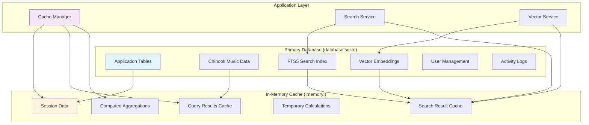

# Refined Two-Database SQLite Architecture Analysis

**Report Date:** 2025-07-19  
**Project:** Chinook Music Store Application  
**Architecture:** Two-Database SQLite with Enhanced Concurrency and Search  
**Target Users:** 100 concurrent users (2x increase from current 10-50)

## 1. Executive Summary

This analysis evaluates a refined two-database SQLite architecture designed for initial project delivery, featuring enhanced concurrency support (100 users), integrated FTS5 full-text search, sqlite-vec vector search capabilities, and an in-memory cache database. The architecture represents a balanced approach between the simplicity of single-database and the complexity of three-database implementations.

### 1.1. Architecture Overview

**Primary Application Database (`database.sqlite`):**
- Single SQLite file with WAL mode optimization
- Enhanced configuration for 100 concurrent users
- Integrated FTS5 and sqlite-vec extensions
- Comprehensive music catalog and application data

**In-Memory Cache Database:**
- SQLite in-memory database (`:memory:` or shared cache)
- Optimized for high-frequency read/write operations
- Cache invalidation and synchronization strategies
- Session data and computed results storage

### 1.2. Key Findings

**Advantages:**
- **Simplified Architecture:** Reduces complexity compared to three-database approach
- **Enhanced Performance:** Targeted optimizations for specific use cases
- **Advanced Search:** FTS5 and vector search capabilities
- **Scalable Caching:** In-memory database for performance optimization

**Challenges:**
- **Concurrency Scaling:** SQLite limitations for 100+ concurrent writers
- **Memory Management:** In-memory cache requires careful resource management
- **Extension Dependencies:** sqlite-vec availability and maintenance considerations

## 2. Architecture Design Comparison

### 2.1. Architecture Comparison Matrix

| Aspect | Single Database (Current) | Two Database (Proposed) | Three Database (Previous) |
|--------|---------------------------|-------------------------|---------------------------|
| **Complexity** | Low | Medium | High |
| **Performance** | Good (10-50 users) | Enhanced (100 users) | Variable |
| **Search Capabilities** | Basic | Advanced (FTS5 + Vector) | Advanced |
| **Memory Usage** | 70MB | 120-150MB | 150-200MB |
| **Operational Overhead** | Low | Medium | High |
| **Educational Value** | High | High | Medium |
| **Implementation Time** | 2 weeks | 8 weeks | 16 weeks |

### 2.2. Architectural Decision Rationale



**Design Principles:**
1. **Consolidation:** All persistent data in single database file
2. **Performance:** In-memory cache for high-frequency operations
3. **Search Integration:** Native FTS5 and vector search within primary database
4. **Simplicity:** Reduced operational complexity compared to three-database approach

### 2.3. Benefits Over Three-Database Architecture

**Reduced Complexity:**
- Single persistent database file to manage
- Simplified backup and recovery procedures
- Fewer connection pools and configurations
- Reduced cross-database consistency challenges

**Improved Performance:**
- No cross-database joins required
- Single transaction scope for related operations
- Reduced connection overhead
- Optimized cache locality

**Operational Advantages:**
- Simplified monitoring and alerting
- Single point of failure for persistent data
- Easier development and testing workflows
- Reduced deployment complexity

## 3. Concurrency Scaling Analysis

### 3.1. Current vs Target Concurrency

**Current Configuration (10-50 users):**
```sql
PRAGMA cache_size = -64000;      -- 64MB cache
PRAGMA mmap_size = 268435456;    -- 256MB memory mapping
PRAGMA busy_timeout = 5000;      -- 5 second timeout
PRAGMA wal_autocheckpoint = 1000; -- Checkpoint every 1000 pages
```

**Enhanced Configuration (100 users):**
```sql
-- Increased cache for higher concurrency
PRAGMA cache_size = -131072;     -- 128MB cache (2x increase)

-- Larger memory mapping for better I/O performance
PRAGMA mmap_size = 536870912;    -- 512MB memory mapping (2x increase)

-- Optimized WAL settings for higher write volume
PRAGMA wal_autocheckpoint = 2000; -- Less frequent checkpoints

-- Enhanced timeout for busy scenarios
PRAGMA busy_timeout = 10000;     -- 10 second timeout

-- Additional optimizations
PRAGMA temp_store = MEMORY;      -- Keep temp tables in memory
PRAGMA synchronous = NORMAL;     -- Balanced durability/performance
PRAGMA page_size = 32768;        -- Larger page size for efficiency
```

### 3.2. Concurrency Limitations and Mitigations

**SQLite WAL Mode Characteristics:**
- **Unlimited Concurrent Readers:** Multiple read operations can proceed simultaneously
- **Single Concurrent Writer:** Only one write transaction at a time
- **Reader-Writer Concurrency:** Readers don't block writers and vice versa

**100 User Concurrency Strategy:**

```php
// Enhanced connection configuration for high concurrency
'connections' => [
    'sqlite' => [
        'driver' => 'sqlite',
        'database' => database_path('database.sqlite'),
        'foreign_key_constraints' => true,
        
        // Enhanced concurrency settings
        'busy_timeout' => 10000,
        'journal_mode' => 'WAL',
        'synchronous' => 'NORMAL',
        'cache_size' => -131072,  // 128MB
        'temp_store' => 'MEMORY',
        'mmap_size' => 536870912, // 512MB
        'wal_autocheckpoint' => 2000,
        
        // Connection pool optimization
        'options' => [
            PDO::ATTR_PERSISTENT => false, // Avoid connection persistence issues
            PDO::ATTR_TIMEOUT => 10,       // 10 second connection timeout
        ],
    ],
    
    'cache' => [
        'driver' => 'sqlite',
        'database' => ':memory:',
        'foreign_key_constraints' => false,
        
        // Memory-optimized settings
        'synchronous' => 'OFF',     // No disk sync needed for memory
        'journal_mode' => 'MEMORY', // Keep journal in memory
        'cache_size' => -32768,     // 32MB cache for memory DB
        'temp_store' => 'MEMORY',
    ],
],
```

### 3.3. Write Concurrency Optimization

**Write Operation Batching:**
```php
class OptimizedWriteService
{
    private array $writeQueue = [];
    private int $batchSize = 100;
    
    public function queueWrite(string $table, array $data): void
    {
        $this->writeQueue[$table][] = $data;
        
        if (count($this->writeQueue[$table]) >= $this->batchSize) {
            $this->flushQueue($table);
        }
    }
    
    private function flushQueue(string $table): void
    {
        if (empty($this->writeQueue[$table])) {
            return;
        }
        
        DB::transaction(function () use ($table) {
            // Use INSERT OR IGNORE for better concurrency
            DB::table($table)->insertOrIgnore($this->writeQueue[$table]);
            $this->writeQueue[$table] = [];
        });
    }
}
```

**Read-Heavy Optimization:**
```php
class ConcurrentReadService
{
    public function getPopularTracks(int $limit = 20): Collection
    {
        // Use cache for frequently accessed data
        return Cache::remember('popular_tracks', 300, function () use ($limit) {
            return DB::table('chinook_tracks')
                ->join('chinook_albums', 'chinook_tracks.album_id', '=', 'chinook_albums.id')
                ->join('chinook_artists', 'chinook_albums.artist_id', '=', 'chinook_artists.id')
                ->select([
                    'chinook_tracks.id',
                    'chinook_tracks.name as track_name',
                    'chinook_albums.title as album_title',
                    'chinook_artists.name as artist_name'
                ])
                ->orderBy('chinook_tracks.created_at', 'desc')
                ->limit($limit)
                ->get();
        });
    }
}
```

## 4. FTS5 Implementation Strategy

### 4.1. Comprehensive FTS5 Integration

**Database Schema Enhancement:**
```sql
-- Create FTS5 virtual table for comprehensive music search
CREATE VIRTUAL TABLE music_search_fts USING fts5(
    track_name,
    album_title,
    artist_name,
    genre_name,
    track_composer,
    content='',  -- External content table
    tokenize='porter ascii'
);

-- Populate FTS index with comprehensive music data
INSERT INTO music_search_fts(rowid, track_name, album_title, artist_name, genre_name, track_composer)
SELECT 
    t.id,
    t.name,
    al.title,
    ar.name,
    COALESCE(g.name, 'Unknown'),
    COALESCE(t.composer, '')
FROM chinook_tracks t
JOIN chinook_albums al ON al.id = t.album_id
JOIN chinook_artists ar ON ar.id = al.artist_id
LEFT JOIN chinook_genres g ON g.id = t.genre_id;
```

**Advanced Search Service:**
```php
class AdvancedMusicSearchService
{
    public function searchMusic(string $query, array $filters = []): Collection
    {
        $sanitizedQuery = $this->sanitizeQuery($query);
        
        $sql = "
            SELECT 
                t.id,
                t.name as track_name,
                t.public_id,
                t.slug,
                al.title as album_title,
                ar.name as artist_name,
                g.name as genre_name,
                fts.rank,
                highlight(music_search_fts, 0, '<mark>', '</mark>') as highlighted_track,
                highlight(music_search_fts, 1, '<mark>', '</mark>') as highlighted_album,
                highlight(music_search_fts, 2, '<mark>', '</mark>') as highlighted_artist
            FROM music_search_fts fts
            JOIN chinook_tracks t ON t.id = fts.rowid
            JOIN chinook_albums al ON al.id = t.album_id
            JOIN chinook_artists ar ON ar.id = al.artist_id
            LEFT JOIN chinook_genres g ON g.id = t.genre_id
            WHERE music_search_fts MATCH ?
        ";
        
        // Add filters
        if (!empty($filters['genre'])) {
            $sql .= " AND g.name = ?";
        }
        
        if (!empty($filters['year_from'])) {
            $sql .= " AND al.release_date >= ?";
        }
        
        $sql .= " ORDER BY fts.rank LIMIT ?";
        
        $bindings = [$sanitizedQuery];
        if (!empty($filters['genre'])) $bindings[] = $filters['genre'];
        if (!empty($filters['year_from'])) $bindings[] = $filters['year_from'];
        $bindings[] = $filters['limit'] ?? 50;
        
        return collect(DB::select($sql, $bindings));
    }
    
    public function searchSuggestions(string $partial): array
    {
        // Use FTS5 prefix matching for autocomplete
        $query = $this->sanitizeQuery($partial) . '*';
        
        $results = DB::select("
            SELECT DISTINCT
                snippet(music_search_fts, 0, '', '', '...', 10) as suggestion,
                COUNT(*) as frequency
            FROM music_search_fts
            WHERE music_search_fts MATCH ?
            GROUP BY suggestion
            ORDER BY frequency DESC
            LIMIT 10
        ", [$query]);
        
        return array_column($results, 'suggestion');
    }
    
    private function sanitizeQuery(string $query): string
    {
        // Remove FTS5 special characters and prepare for search
        $query = preg_replace('/[^\w\s\-]/', ' ', $query);
        $query = trim(preg_replace('/\s+/', ' ', $query));
        
        // Convert to FTS5 query format
        $terms = explode(' ', $query);
        $terms = array_map(function($term) {
            return '"' . $term . '"';
        }, $terms);
        
        return implode(' OR ', $terms);
    }
}
```

### 4.2. FTS5 Performance Optimization

**Index Maintenance Strategy:**
```php
class FTSMaintenanceService
{
    public function rebuildIndex(): void
    {
        DB::transaction(function () {
            // Clear existing index
            DB::statement("DELETE FROM music_search_fts");
            
            // Rebuild with current data
            DB::statement("
                INSERT INTO music_search_fts(rowid, track_name, album_title, artist_name, genre_name, track_composer)
                SELECT 
                    t.id,
                    t.name,
                    al.title,
                    ar.name,
                    COALESCE(g.name, 'Unknown'),
                    COALESCE(t.composer, '')
                FROM chinook_tracks t
                JOIN chinook_albums al ON al.id = t.album_id
                JOIN chinook_artists ar ON ar.id = al.artist_id
                LEFT JOIN chinook_genres g ON g.id = t.genre_id
            ");
            
            // Optimize index
            DB::statement("INSERT INTO music_search_fts(music_search_fts) VALUES('optimize')");
        });
    }
    
    public function getIndexStats(): array
    {
        $stats = DB::selectOne("
            SELECT 
                (SELECT COUNT(*) FROM chinook_tracks) as total_tracks,
                (SELECT COUNT(*) FROM music_search_fts) as indexed_tracks
        ");
        
        return [
            'total_tracks' => $stats->total_tracks,
            'indexed_tracks' => $stats->indexed_tracks,
            'index_coverage' => round(($stats->indexed_tracks / $stats->total_tracks) * 100, 2),
        ];
    }
}
```

## 5. Vector Search Integration with sqlite-vec

### 5.1. sqlite-vec Implementation Architecture

**Vector Table Setup:**
```sql
-- Create vector table for music similarity
CREATE VIRTUAL TABLE track_vectors USING vec0(
    track_id INTEGER PRIMARY KEY,
    audio_features FLOAT[128],    -- Audio feature embeddings
    lyric_features FLOAT[384],    -- Lyrical content embeddings
    metadata_features FLOAT[64]   -- Genre, tempo, key embeddings
);

-- Create similarity cache table
CREATE TABLE vector_similarity_cache (
    id INTEGER PRIMARY KEY AUTOINCREMENT,
    source_track_id INTEGER NOT NULL,
    similar_track_id INTEGER NOT NULL,
    similarity_score REAL NOT NULL,
    similarity_type VARCHAR(50) NOT NULL, -- 'audio', 'lyric', 'metadata'
    created_at TIMESTAMP DEFAULT CURRENT_TIMESTAMP,
    UNIQUE(source_track_id, similar_track_id, similarity_type)
);

CREATE INDEX idx_similarity_cache_source ON vector_similarity_cache(source_track_id, similarity_type);
CREATE INDEX idx_similarity_cache_score ON vector_similarity_cache(similarity_score DESC);
```

**Vector Service Implementation:**
```php
class MusicVectorService
{
    private const AUDIO_VECTOR_SIZE = 128;
    private const LYRIC_VECTOR_SIZE = 384;
    private const METADATA_VECTOR_SIZE = 64;
    
    public function generateTrackEmbeddings(int $trackId): array
    {
        $track = DB::table('chinook_tracks')
            ->join('chinook_albums', 'chinook_tracks.album_id', '=', 'chinook_albums.id')
            ->join('chinook_artists', 'chinook_albums.artist_id', '=', 'chinook_artists.id')
            ->where('chinook_tracks.id', $trackId)
            ->first();
            
        return [
            'audio_features' => $this->generateAudioFeatures($track),
            'lyric_features' => $this->generateLyricFeatures($track),
            'metadata_features' => $this->generateMetadataFeatures($track),
        ];
    }
    
    public function findSimilarTracks(int $trackId, string $type = 'audio', int $limit = 10): Collection
    {
        // Check cache first
        $cached = $this->getCachedSimilarity($trackId, $type, $limit);
        if ($cached->isNotEmpty()) {
            return $cached;
        }
        
        // Get track vector
        $vector = $this->getTrackVector($trackId, $type);
        if (!$vector) {
            return collect();
        }
        
        // Perform vector similarity search
        $vectorString = '[' . implode(',', $vector) . ']';
        $columnName = $type . '_features';
        
        $results = DB::select("
            SELECT 
                tv.track_id,
                t.name as track_name,
                al.title as album_title,
                ar.name as artist_name,
                tv.distance
            FROM track_vectors tv
            JOIN chinook_tracks t ON t.id = tv.track_id
            JOIN chinook_albums al ON al.id = t.album_id
            JOIN chinook_artists ar ON ar.id = al.artist_id
            WHERE tv.{$columnName} MATCH ?
            AND tv.track_id != ?
            ORDER BY tv.distance
            LIMIT ?
        ", [$vectorString, $trackId, $limit]);
        
        $similarities = collect($results);
        
        // Cache results
        $this->cacheSimilarityResults($trackId, $similarities, $type);
        
        return $similarities;
    }
    
    private function generateAudioFeatures($track): array
    {
        // Simulate audio feature extraction
        // In production, this would use actual audio analysis
        $features = [];
        
        // Use track metadata to generate pseudo-features
        $seed = crc32($track->name . $track->album_title);
        mt_srand($seed);
        
        for ($i = 0; $i < self::AUDIO_VECTOR_SIZE; $i++) {
            $features[] = (mt_rand() / mt_getrandmax()) * 2 - 1; // Range: -1 to 1
        }
        
        return $features;
    }
    
    private function generateLyricFeatures($track): array
    {
        // Simulate lyrical content analysis
        // In production, this would use NLP models
        $features = [];
        
        $text = $track->name . ' ' . $track->artist_name;
        $seed = crc32($text);
        mt_srand($seed);
        
        for ($i = 0; $i < self::LYRIC_VECTOR_SIZE; $i++) {
            $features[] = (mt_rand() / mt_getrandmax()) * 2 - 1;
        }
        
        return $features;
    }
    
    private function generateMetadataFeatures($track): array
    {
        // Generate features from metadata
        $features = [];
        
        // Encode genre, duration, etc. into vector space
        $metadata = [
            'duration' => $track->milliseconds ?? 0,
            'album_year' => $track->release_date ? date('Y', strtotime($track->release_date)) : 2000,
            'artist_hash' => crc32($track->artist_name),
        ];
        
        $seed = array_sum($metadata);
        mt_srand($seed);
        
        for ($i = 0; $i < self::METADATA_VECTOR_SIZE; $i++) {
            $features[] = (mt_rand() / mt_getrandmax()) * 2 - 1;
        }
        
        return $features;
    }
    
    private function getCachedSimilarity(int $trackId, string $type, int $limit): Collection
    {
        return DB::table('vector_similarity_cache as vsc')
            ->join('chinook_tracks as t', 't.id', '=', 'vsc.similar_track_id')
            ->join('chinook_albums as al', 'al.id', '=', 't.album_id')
            ->join('chinook_artists as ar', 'ar.id', '=', 'al.artist_id')
            ->where('vsc.source_track_id', $trackId)
            ->where('vsc.similarity_type', $type)
            ->where('vsc.created_at', '>', now()->subHours(24)) // Cache for 24 hours
            ->orderBy('vsc.similarity_score', 'desc')
            ->limit($limit)
            ->select([
                'vsc.similar_track_id as track_id',
                't.name as track_name',
                'al.title as album_title',
                'ar.name as artist_name',
                'vsc.similarity_score as distance'
            ])
            ->get();
    }
    
    private function cacheSimilarityResults(int $trackId, Collection $results, string $type): void
    {
        $cacheData = $results->map(function ($result) use ($trackId, $type) {
            return [
                'source_track_id' => $trackId,
                'similar_track_id' => $result->track_id,
                'similarity_score' => 1 - $result->distance, // Convert distance to similarity
                'similarity_type' => $type,
                'created_at' => now(),
            ];
        })->toArray();
        
        if (!empty($cacheData)) {
            DB::table('vector_similarity_cache')->insertOrIgnore($cacheData);
        }
    }
}
```

### 5.2. Music Recommendation Engine

**Hybrid Recommendation System:**
```php
class MusicRecommendationEngine
{
    private MusicVectorService $vectorService;
    private AdvancedMusicSearchService $searchService;
    
    public function __construct(
        MusicVectorService $vectorService,
        AdvancedMusicSearchService $searchService
    ) {
        $this->vectorService = $vectorService;
        $this->searchService = $searchService;
    }
    
    public function getRecommendations(int $userId, int $limit = 20): array
    {
        // Get user listening history
        $userTracks = $this->getUserListeningHistory($userId);
        
        if ($userTracks->isEmpty()) {
            return $this->getPopularRecommendations($limit);
        }
        
        // Generate recommendations using multiple strategies
        $recommendations = [
            'similar_audio' => $this->getAudioSimilarRecommendations($userTracks, $limit / 4),
            'similar_lyrics' => $this->getLyricSimilarRecommendations($userTracks, $limit / 4),
            'genre_based' => $this->getGenreBasedRecommendations($userTracks, $limit / 4),
            'collaborative' => $this->getCollaborativeRecommendations($userId, $limit / 4),
        ];
        
        // Merge and rank recommendations
        return $this->mergeAndRankRecommendations($recommendations, $limit);
    }
    
    private function getAudioSimilarRecommendations(Collection $userTracks, int $limit): Collection
    {
        $recommendations = collect();
        
        foreach ($userTracks->take(5) as $track) { // Use top 5 recent tracks
            $similar = $this->vectorService->findSimilarTracks($track->id, 'audio', $limit);
            $recommendations = $recommendations->merge($similar);
        }
        
        return $recommendations->unique('track_id')->take($limit);
    }
    
    private function getGenreBasedRecommendations(Collection $userTracks, int $limit): Collection
    {
        // Find user's preferred genres
        $genres = $userTracks->pluck('genre_name')->countBy()->sortDesc()->keys()->take(3);
        
        $recommendations = collect();
        foreach ($genres as $genre) {
            $tracks = $this->searchService->searchMusic('*', [
                'genre' => $genre,
                'limit' => $limit / 3
            ]);
            $recommendations = $recommendations->merge($tracks);
        }
        
        return $recommendations->unique('id')->take($limit);
    }
    
    private function mergeAndRankRecommendations(array $recommendations, int $limit): array
    {
        $merged = collect();
        $weights = [
            'similar_audio' => 0.4,
            'similar_lyrics' => 0.3,
            'genre_based' => 0.2,
            'collaborative' => 0.1,
        ];
        
        foreach ($recommendations as $type => $tracks) {
            foreach ($tracks as $track) {
                $track->recommendation_score = ($track->distance ?? 0.5) * $weights[$type];
                $track->recommendation_type = $type;
                $merged->push($track);
            }
        }
        
        return $merged
            ->unique('track_id')
            ->sortByDesc('recommendation_score')
            ->take($limit)
            ->values()
            ->toArray();
    }
}
```

## 6. In-Memory Cache Strategy Design

### 6.1. Cache Database Architecture

**In-Memory Database Configuration:**
```php
// Enhanced cache connection configuration
'cache' => [
    'driver' => 'sqlite',
    'database' => ':memory:',
    'foreign_key_constraints' => false,

    // Memory-optimized settings
    'synchronous' => 'OFF',        // No disk sync for memory DB
    'journal_mode' => 'MEMORY',    // Keep journal in memory
    'cache_size' => -32768,        // 32MB cache
    'temp_store' => 'MEMORY',
    'locking_mode' => 'EXCLUSIVE', // Single process access

    // Connection persistence for memory DB
    'options' => [
        PDO::ATTR_PERSISTENT => true, // Keep connection alive
    ],
],
```

**Cache Schema Design:**
```sql
-- Session data cache
CREATE TABLE cache_sessions (
    id VARCHAR(255) PRIMARY KEY,
    user_id INTEGER,
    payload TEXT,
    last_activity INTEGER,
    expires_at INTEGER
);

-- Query result cache
CREATE TABLE cache_queries (
    cache_key VARCHAR(255) PRIMARY KEY,
    result_data TEXT,
    tags TEXT, -- JSON array of cache tags
    created_at INTEGER,
    expires_at INTEGER
);

-- Computed aggregations cache
CREATE TABLE cache_aggregations (
    metric_name VARCHAR(100),
    dimension_key VARCHAR(255),
    metric_value REAL,
    computed_at INTEGER,
    expires_at INTEGER,
    PRIMARY KEY (metric_name, dimension_key)
);

-- Search result cache
CREATE TABLE cache_search_results (
    search_hash VARCHAR(64) PRIMARY KEY,
    query_text VARCHAR(500),
    result_data TEXT,
    result_count INTEGER,
    created_at INTEGER,
    expires_at INTEGER
);

-- Popular content cache
CREATE TABLE cache_popular_content (
    content_type VARCHAR(50),
    content_id INTEGER,
    popularity_score REAL,
    rank_position INTEGER,
    updated_at INTEGER,
    PRIMARY KEY (content_type, content_id)
);
```

### 6.2. Cache Management Service

**Comprehensive Cache Manager:**
```php
class InMemoryCacheManager
{
    private string $cacheConnection = 'cache';
    private array $defaultTtl = [
        'sessions' => 7200,      // 2 hours
        'queries' => 300,        // 5 minutes
        'aggregations' => 1800,  // 30 minutes
        'search' => 600,         // 10 minutes
        'popular' => 3600,       // 1 hour
    ];

    public function initializeCache(): void
    {
        // Create cache tables if they don't exist
        $this->createCacheTables();

        // Set up cleanup job
        $this->scheduleCleanup();
    }

    public function cacheQuery(string $key, $data, array $tags = [], int $ttl = null): void
    {
        $ttl = $ttl ?? $this->defaultTtl['queries'];
        $expiresAt = time() + $ttl;

        DB::connection($this->cacheConnection)->table('cache_queries')->updateOrInsert(
            ['cache_key' => $key],
            [
                'result_data' => json_encode($data),
                'tags' => json_encode($tags),
                'created_at' => time(),
                'expires_at' => $expiresAt,
            ]
        );
    }

    public function getQuery(string $key)
    {
        $cached = DB::connection($this->cacheConnection)
            ->table('cache_queries')
            ->where('cache_key', $key)
            ->where('expires_at', '>', time())
            ->first();

        return $cached ? json_decode($cached->result_data, true) : null;
    }

    public function cacheSearchResults(string $query, array $results, int $ttl = null): void
    {
        $ttl = $ttl ?? $this->defaultTtl['search'];
        $hash = hash('sha256', $query);

        DB::connection($this->cacheConnection)->table('cache_search_results')->updateOrInsert(
            ['search_hash' => $hash],
            [
                'query_text' => $query,
                'result_data' => json_encode($results),
                'result_count' => count($results),
                'created_at' => time(),
                'expires_at' => time() + $ttl,
            ]
        );
    }

    public function getSearchResults(string $query): ?array
    {
        $hash = hash('sha256', $query);

        $cached = DB::connection($this->cacheConnection)
            ->table('cache_search_results')
            ->where('search_hash', $hash)
            ->where('expires_at', '>', time())
            ->first();

        return $cached ? json_decode($cached->result_data, true) : null;
    }

    public function cacheAggregation(string $metric, string $dimension, float $value, int $ttl = null): void
    {
        $ttl = $ttl ?? $this->defaultTtl['aggregations'];

        DB::connection($this->cacheConnection)->table('cache_aggregations')->updateOrInsert(
            ['metric_name' => $metric, 'dimension_key' => $dimension],
            [
                'metric_value' => $value,
                'computed_at' => time(),
                'expires_at' => time() + $ttl,
            ]
        );
    }

    public function getAggregation(string $metric, string $dimension): ?float
    {
        $cached = DB::connection($this->cacheConnection)
            ->table('cache_aggregations')
            ->where('metric_name', $metric)
            ->where('dimension_key', $dimension)
            ->where('expires_at', '>', time())
            ->first();

        return $cached ? $cached->metric_value : null;
    }

    public function invalidateByTags(array $tags): int
    {
        $deleted = 0;

        foreach ($tags as $tag) {
            $deleted += DB::connection($this->cacheConnection)
                ->table('cache_queries')
                ->where('tags', 'LIKE', '%"' . $tag . '"%')
                ->delete();
        }

        return $deleted;
    }

    public function cleanup(): array
    {
        $now = time();
        $stats = [];

        $tables = ['cache_queries', 'cache_search_results', 'cache_aggregations', 'cache_sessions'];

        foreach ($tables as $table) {
            $deleted = DB::connection($this->cacheConnection)
                ->table($table)
                ->where('expires_at', '<', $now)
                ->delete();

            $stats[$table] = $deleted;
        }

        return $stats;
    }

    public function getCacheStats(): array
    {
        $stats = [];
        $tables = ['cache_queries', 'cache_search_results', 'cache_aggregations', 'cache_sessions'];

        foreach ($tables as $table) {
            $total = DB::connection($this->cacheConnection)->table($table)->count();
            $expired = DB::connection($this->cacheConnection)
                ->table($table)
                ->where('expires_at', '<', time())
                ->count();

            $stats[$table] = [
                'total' => $total,
                'active' => $total - $expired,
                'expired' => $expired,
            ];
        }

        return $stats;
    }
}
```

### 6.3. Cache Synchronization Strategies

**Event-Driven Cache Invalidation:**
```php
class CacheInvalidationService
{
    private InMemoryCacheManager $cacheManager;

    public function __construct(InMemoryCacheManager $cacheManager)
    {
        $this->cacheManager = $cacheManager;
    }

    public function handleTrackUpdate(int $trackId): void
    {
        // Invalidate related caches
        $tags = [
            'track_' . $trackId,
            'popular_tracks',
            'search_results',
            'recommendations',
        ];

        $this->cacheManager->invalidateByTags($tags);

        // Preload popular queries
        $this->preloadPopularData();
    }

    public function handleUserActivity(int $userId, string $action, array $data): void
    {
        switch ($action) {
            case 'track_play':
                $this->updatePopularityMetrics($data['track_id']);
                break;

            case 'search':
                $this->cacheSearchIfPopular($data['query'], $data['results']);
                break;

            case 'recommendation_view':
                $this->updateRecommendationMetrics($userId, $data['track_ids']);
                break;
        }
    }

    private function updatePopularityMetrics(int $trackId): void
    {
        // Update popularity score in cache
        $currentScore = $this->cacheManager->getAggregation('popularity', 'track_' . $trackId) ?? 0;
        $newScore = $currentScore + 1;

        $this->cacheManager->cacheAggregation('popularity', 'track_' . $trackId, $newScore);

        // Update popular tracks ranking
        $this->updatePopularTracksRanking();
    }

    private function preloadPopularData(): void
    {
        // Preload frequently accessed data into cache
        $popularTracks = DB::table('chinook_tracks')
            ->join('chinook_albums', 'chinook_tracks.album_id', '=', 'chinook_albums.id')
            ->join('chinook_artists', 'chinook_albums.artist_id', '=', 'chinook_artists.id')
            ->select([
                'chinook_tracks.id',
                'chinook_tracks.name as track_name',
                'chinook_albums.title as album_title',
                'chinook_artists.name as artist_name'
            ])
            ->limit(100)
            ->get();

        $this->cacheManager->cacheQuery('popular_tracks_top_100', $popularTracks, ['popular_tracks']);
    }
}
```

This analysis provides a comprehensive foundation for the refined two-database architecture. The implementation balances performance, functionality, and complexity while providing advanced search and recommendation capabilities suitable for educational use with enhanced scalability.

---

**Document Status:** Part 1 of 2 - Architecture Design, Search Implementation, and Cache Strategy
**Next Section:** Performance Analysis and Implementation Timeline
