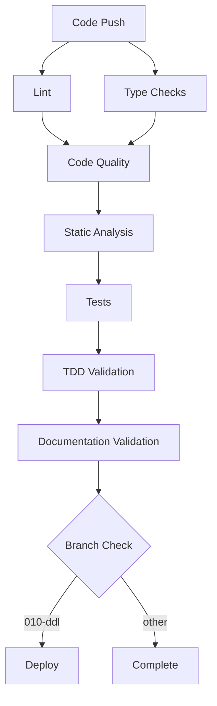

# CI/CD Pipeline Documentation

**Date:** January 22, 2025  
**Project:** Laravel Zero validate-links Documentation Enhancement  
**Phase:** CI/CD Pipeline Documentation

## Executive Summary

This document provides comprehensive documentation for the validate-links CI/CD pipeline, including all GitHub Actions workflows, deployment processes, rollback procedures, and troubleshooting guidance for maintaining a robust continuous integration and deployment system.

## Pipeline Architecture Overview

The validate-links project implements a sophisticated CI/CD pipeline with 10 specialized GitHub Actions workflows covering testing, code quality, deployment, and validation processes.

### Workflow Categories
1. **Quality Assurance** - Code quality, linting, static analysis
2. **Testing** - Unit tests, integration tests, TDD validation
3. **Deployment** - Production deployment and asset building
4. **Validation** - Documentation validation, type checking
5. **Specialized** - Playwright testing, PR-specific workflows

## GitHub Actions Workflows

### 1. Tests Workflow (`tests.yml`)

**Purpose:** Execute comprehensive test suite with coverage reporting

**Trigger Conditions:**
- Push to `develop` or `main` branches
- Pull requests targeting `develop` or `main` branches

**Environment:** Testing

**Key Steps:**
```yaml
- Checkout code (actions/checkout@v4)
- Setup PHP 8.4 with Xdebug coverage
- Setup Node.js 22 with npm cache
- Install Node dependencies
- Configure Flux UI credentials (if applicable)
- Install Composer dependencies
- Copy .env.example to .env
- Generate application key
- Build assets
- Run Pest test suite
```

**Dependencies:**
- `FLUX_USERNAME` secret
- `FLUX_LICENSE_KEY` secret
- `.env.example` file (currently missing)

**Issues Identified:**
- References `.env.example` which doesn't exist
- Flux UI setup may not be relevant for CLI application
- Missing coverage reporting and artifact upload

### 2. Code Quality Workflow (`code-quality.yml`)

**Purpose:** Enforce code quality standards and static analysis

**Trigger Conditions:**
- Push to `010-ddl` or `develop` branches
- Pull requests targeting `010-ddl` or `develop` branches

**Key Steps:**
```yaml
- Checkout code
- Setup PHP 8.4 with extensions
- Install Composer dependencies (production mode)
- Run Laravel Pint code style check
- Execute PHPStan static analysis
- Run Rector dry-run analysis
- Execute PHP Insights with 90% thresholds
```

**Quality Thresholds:**
- Minimum Quality: 90%
- Minimum Complexity: 90%
- Minimum Architecture: 90%
- Minimum Style: 90%

**Missing Composer Scripts:**
- `pint:test` - Code style testing
- `phpstan` - Static analysis
- `rector:dry-run` - Refactoring analysis
- `insights` - Code quality metrics

### 3. Deploy Workflow (`deploy.yml`)

**Purpose:** Deploy application to production environment

**Trigger Conditions:**
- Push to `010-ddl` branch only

**Key Steps:**
```yaml
- Checkout code
- Setup PHP 8.4 with extensions
- Install Composer dependencies (optimized)
- Setup Node.js 20
- Install NPM dependencies
- Build production assets
- Deploy using deployphp/action
```

**Dependencies:**
- `DEPLOY_KEY` secret (SSH private key)
- `deploy.php` configuration file
- Production server access

### 4. Code Quality PR Workflow (`code-quality-pr.yml`)

**Purpose:** PR-specific code quality checks

**Trigger Conditions:**
- Pull request events
- Focused on PR-specific quality gates

### 5. Static Analysis Workflow (`static-analysis.yml`)

**Purpose:** Dedicated static analysis execution

**Trigger Conditions:**
- Comprehensive static analysis beyond basic code quality
- Advanced type checking and code analysis

### 6. Type Checks Workflow (`type-checks.yml`)

**Purpose:** PHP type safety validation

**Trigger Conditions:**
- Type coverage analysis
- Strict type checking enforcement

### 7. Lint Workflow (`lint.yml`)

**Purpose:** Code linting and formatting validation

**Trigger Conditions:**
- Code style and formatting checks
- Complementary to code quality workflow

### 8. Documentation Validation Workflow (`documentation-validation.yml`)

**Purpose:** Validate documentation integrity and links

**Trigger Conditions:**
- Documentation changes
- Link validation and integrity checks

### 9. TDD Validation Workflow (`tdd-validation.yml`)

**Purpose:** Test-driven development validation

**Trigger Conditions:**
- TDD compliance checking
- Test coverage validation

### 10. Playwright Workflow (`playwright.yml`)

**Purpose:** End-to-end testing with Playwright

**Trigger Conditions:**
- Browser-based testing (may not be applicable for CLI)
- UI testing validation

## Branch Strategy and Workflow Dependencies

### Branch Hierarchy
```
main (production)
├── develop (integration)
├── 010-ddl (deployment branch)
└── feature/* (feature branches)
```

### Workflow Execution Matrix

| Workflow | main | develop | 010-ddl | PR to main | PR to develop |
|----------|------|---------|---------|------------|---------------|
| tests.yml | ✅ | ✅ | ❌ | ✅ | ✅ |
| code-quality.yml | ❌ | ✅ | ✅ | ❌ | ✅ |
| deploy.yml | ❌ | ❌ | ✅ | ❌ | ❌ |
| code-quality-pr.yml | ❌ | ❌ | ❌ | ✅ | ✅ |

### Workflow Dependencies


## Environment Variables and Secrets

### Required Secrets
| Secret | Purpose | Workflows | Notes |
|--------|---------|-----------|-------|
| `FLUX_USERNAME` | Flux UI authentication | tests.yml | May not be needed |
| `FLUX_LICENSE_KEY` | Flux UI license | tests.yml | May not be needed |
| `DEPLOY_KEY` | SSH deployment key | deploy.yml | Production deployment |

### Environment Variables
| Variable | Default | Purpose | Workflows |
|----------|---------|---------|-----------|
| `PHP_VERSION` | 8.4 | PHP runtime version | All PHP workflows |
| `NODE_VERSION` | 20/22 | Node.js version | Asset building |
| `COMPOSER_CACHE` | Auto | Composer cache | Dependency installation |

## Deployment Process

### Production Deployment Pipeline

#### Prerequisites
1. **Code Quality Gates**
   - All tests passing
   - Code quality thresholds met (90%)
   - Static analysis clean
   - Type coverage requirements met

2. **Branch Requirements**
   - Code must be on `010-ddl` branch
   - All PR checks must pass
   - Manual approval (if configured)

#### Deployment Steps
```bash
# 1. Automated CI/CD Pipeline
git push origin 010-ddl

# 2. GitHub Actions Execution
- Code checkout
- PHP 8.4 environment setup
- Dependency installation (production)
- Asset compilation
- Deployment via deployphp/action

# 3. Production Server Updates
- Code deployment
- Dependency updates
- Asset optimization
- Service restart (if applicable)
```

#### Deployment Configuration (`deploy.php`)
```php
<?php
// Expected deployment configuration
namespace Deployer;

require 'recipe/laravel.php';

// Configuration
set('application', 'validate-links');
set('repository', 'git@github.com:s-a-c/validate-links.git');
set('git_tty', true);

// Hosts
host('production')
    ->set('hostname', 'your-server.com')
    ->set('remote_user', 'deploy')
    ->set('deploy_path', '/var/www/validate-links');

// Tasks
task('build', function () {
    run('cd {{release_path}} && composer install --no-dev --optimize-autoloader');
    run('cd {{release_path}} && npm ci && npm run build');
});

after('deploy:update_code', 'build');
```

### Rollback Procedures

#### Automatic Rollback Triggers
- Deployment failure
- Health check failures
- Critical error detection

#### Manual Rollback Process
```bash
# 1. Via Deployer (if configured)
dep rollback production

# 2. Manual Git Rollback
git revert <commit-hash>
git push origin 010-ddl

# 3. Emergency Rollback
# Restore previous release directory
# Update symlinks
# Restart services
```

#### Rollback Verification
```bash
# 1. Health Check
curl -f https://your-app.com/health

# 2. Functionality Test
./validate-links --version
./validate-links validate --help

# 3. Log Monitoring
tail -f /var/log/validate-links/app.log
```

## Monitoring and Debugging

### Workflow Monitoring

#### GitHub Actions Dashboard
- Monitor workflow execution status
- Review job logs and artifacts
- Track success/failure rates
- Identify bottlenecks and failures

#### Key Metrics to Monitor
- **Build Success Rate:** Target >95%
- **Average Build Time:** Target <10 minutes
- **Test Success Rate:** Target 100%
- **Deployment Frequency:** Track deployment cadence
- **Mean Time to Recovery:** Target <30 minutes

### Debugging Procedures

#### Workflow Failure Investigation
```bash
# 1. Check GitHub Actions logs
# Navigate to Actions tab in GitHub repository
# Select failed workflow run
# Review job logs and error messages

# 2. Local Reproduction
git checkout <failing-commit>
composer install
composer quality  # Reproduce quality checks
composer test     # Reproduce test failures

# 3. Environment Debugging
# Check PHP version compatibility
php -v
# Verify extensions
php -m | grep -E "(curl|mbstring|json)"
```

#### Common Issues and Solutions

##### 1. Composer Dependency Issues
```bash
# Problem: Dependency resolution failures
# Solution:
composer clear-cache
rm -rf vendor/ composer.lock
composer install

# Problem: Memory limit exceeded
# Solution:
php -d memory_limit=2G composer install
```

##### 2. Test Failures
```bash
# Problem: Tests failing in CI but passing locally
# Solution:
# Check environment differences
# Verify .env.example exists and is correct
# Check database/cache configuration

# Problem: Parallel test failures
# Solution:
vendor/bin/pest --no-parallel
```

##### 3. Asset Build Failures
```bash
# Problem: NPM build failures
# Solution:
npm cache clean --force
rm -rf node_modules/ package-lock.json
npm install
npm run build
```

##### 4. Deployment Failures
```bash
# Problem: SSH connection issues
# Solution:
# Verify DEPLOY_KEY secret is correct
# Check server SSH configuration
# Validate deploy.php configuration

# Problem: Permission issues
# Solution:
# Check file permissions on server
# Verify deploy user permissions
# Update directory ownership
```

### Performance Optimization

#### Workflow Optimization Strategies
1. **Dependency Caching**
   - Composer cache for PHP dependencies
   - NPM cache for Node.js dependencies
   - Docker layer caching (if applicable)

2. **Parallel Execution**
   - Run independent jobs in parallel
   - Utilize matrix builds for multiple environments
   - Optimize test execution with parallel runners

3. **Artifact Management**
   - Cache build artifacts between jobs
   - Minimize artifact size
   - Clean up old artifacts regularly

#### Example Optimized Workflow
```yaml
jobs:
  setup:
    runs-on: ubuntu-latest
    steps:
      - uses: actions/checkout@v4
      - name: Cache Dependencies
        uses: actions/cache@v3
        with:
          path: |
            vendor/
            node_modules/
          key: deps-${{ hashFiles('composer.lock', 'package-lock.json') }}

  quality:
    needs: setup
    runs-on: ubuntu-latest
    strategy:
      matrix:
        check: [pint, phpstan, rector, insights]
    steps:
      - name: Run ${{ matrix.check }}
        run: composer ${{ matrix.check }}
```

## Security Considerations

### Secret Management
- Rotate deployment keys regularly
- Use environment-specific secrets
- Implement least-privilege access
- Monitor secret usage and access

### Security Scanning
- Dependency vulnerability scanning
- Code security analysis
- Container security (if applicable)
- Infrastructure security validation

### Compliance Requirements
- Audit trail maintenance
- Change approval processes
- Security review gates
- Compliance reporting

## Maintenance and Updates

### Regular Maintenance Tasks
- **Weekly:** Review workflow performance metrics
- **Monthly:** Update GitHub Actions versions
- **Quarterly:** Review and optimize workflow configurations
- **Annually:** Security audit and secret rotation

### Update Procedures
```bash
# 1. Update GitHub Actions versions
# Check for newer versions of actions
# Update workflow files
# Test in feature branch first

# 2. Update PHP/Node versions
# Update version numbers in workflows
# Test compatibility locally
# Update documentation

# 3. Update dependencies
composer update
npm update
# Test thoroughly before deployment
```

## Issues and Recommendations

### Current Issues Identified
1. **Missing .env.example file** - Referenced in tests.yml but doesn't exist
2. **Missing Composer scripts** - Several scripts referenced in workflows not defined
3. **Flux UI dependencies** - May not be relevant for CLI application
4. **Inconsistent Node.js versions** - Different versions used across workflows
5. **Missing coverage reporting** - No coverage artifacts or reporting configured

### Recommendations
1. **Create .env.example file** with all required environment variables
2. **Add missing Composer scripts** to composer.json
3. **Remove Flux UI dependencies** if not needed
4. **Standardize Node.js version** across all workflows
5. **Implement coverage reporting** with artifact upload
6. **Add workflow status badges** to README
7. **Implement deployment notifications** (Slack, email, etc.)
8. **Add performance monitoring** and alerting
9. **Create staging environment** deployment workflow
10. **Implement automated rollback** procedures

## Next Steps

1. **Fix identified issues** in workflows and configuration
2. **Implement missing Composer scripts**
3. **Add comprehensive coverage reporting**
4. **Create staging deployment workflow**
5. **Implement monitoring and alerting**
6. **Document emergency procedures**
7. **Create workflow status dashboard**
8. **Implement automated security scanning**
