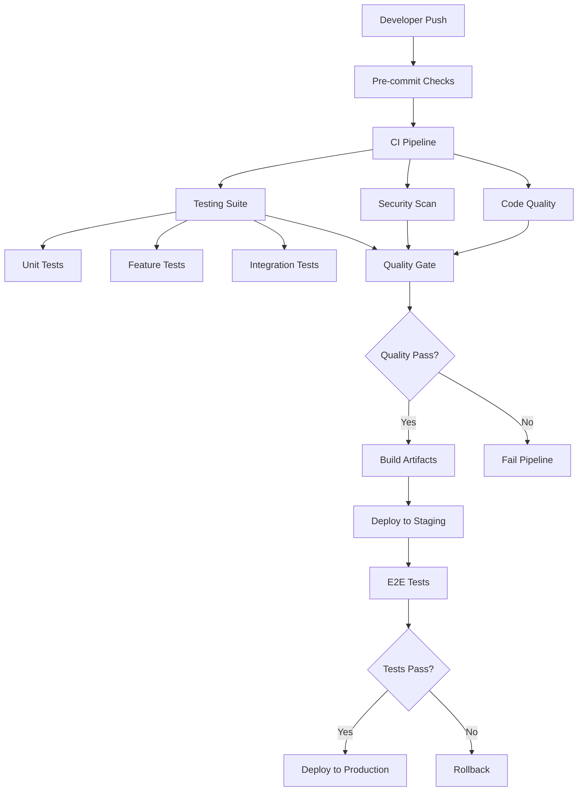

# Complete CI/CD Workflows Documentation

**Date:** July 21, 2025  
**Project:** Laravel Zero Implementation - GitHub Actions CI/CD  
**Compliance:** `.ai/guidelines.md` and `.ai/guidelines/` standards

## Table of Contents

1. [CI/CD Overview](#cicd-overview)
2. [Pre-commit Checks Workflow](#pre-commit-checks-workflow)
3. [Continuous Integration Workflow](#continuous-integration-workflow)
4. [Code Quality and Security Workflow](#code-quality-and-security-workflow)
5. [Deployment Workflows](#deployment-workflows)
6. [Release Management Workflow](#release-management-workflow)
7. [Workflow Configuration Files](#workflow-configuration-files)
8. [Best Practices and Guidelines](#best-practices-and-guidelines)

## CI/CD Overview

The CI/CD pipeline provides comprehensive automation for the Laravel Zero validate-links application, ensuring code quality, security, and reliable deployments.

### Workflow Architecture



### Workflow Triggers

- **Push to main/develop:** Full CI/CD pipeline
- **Pull Request:** CI pipeline without deployment
- **Release tag:** Production deployment pipeline
- **Schedule:** Nightly security scans and dependency updates

## Pre-commit Checks Workflow

### .github/workflows/pre-commit.yml

```yaml
name: Pre-commit Checks

on:
  push:
    branches: [ main, develop, feature/* ]
  pull_request:
    branches: [ main, develop ]

concurrency:
  group: ${{ github.workflow }}-${{ github.ref }}
  cancel-in-progress: true

jobs:
  pre-commit:
    name: Pre-commit Quality Checks
    runs-on: ubuntu-latest
    timeout-minutes: 10

    steps:
      - name: Checkout code
        uses: actions/checkout@v4
        with:
          fetch-depth: 0

      - name: Setup PHP
        uses: shivammathur/setup-php@v2
        with:
          php-version: '8.4'
          extensions: mbstring, xml, ctype, iconv, intl, pdo, pdo_mysql, dom, filter, gd, iconv, json, mbstring, curl
          coverage: none
          tools: composer:v2

      - name: Cache Composer dependencies
        uses: actions/cache@v4
        with:
          path: ~/.composer/cache/files
          key: composer-${{ runner.os }}-${{ hashFiles('composer.lock') }}
          restore-keys: |
            composer-${{ runner.os }}-

      - name: Install dependencies
        run: composer install --prefer-dist --no-progress --no-suggest --optimize-autoloader

      - name: Check composer.json format
        run: composer normalize --dry-run

      - name: PHP Syntax Check
        run: composer lint

      - name: Code Style Check
        run: composer pint:test

      - name: Static Analysis
        run: composer phpstan

      - name: Architecture Tests
        run: composer test:arch

      - name: Security Check
        run: composer security:check

  commit-message:
    name: Validate Commit Messages
    runs-on: ubuntu-latest
    if: github.event_name == 'pull_request'

    steps:
      - name: Checkout code
        uses: actions/checkout@v4
        with:
          fetch-depth: 0

      - name: Validate commit messages
        uses: wagoid/commitlint-github-action@v5
        with:
          configFile: '.commitlintrc.json'

  file-changes:
    name: Detect File Changes
    runs-on: ubuntu-latest
    outputs:
      php: ${{ steps.changes.outputs.php }}
      composer: ${{ steps.changes.outputs.composer }}
      workflows: ${{ steps.changes.outputs.workflows }}

    steps:
      - name: Checkout code
        uses: actions/checkout@v4

      - name: Detect changes
        uses: dorny/paths-filter@v2
        id: changes
        with:
          filters: |
            php:
              - '**/*.php'
              - 'composer.json'
              - 'composer.lock'
            composer:
              - 'composer.json'
              - 'composer.lock'
            workflows:
              - '.github/workflows/**'
```

### .commitlintrc.json

```json
{
  "extends": ["@commitlint/config-conventional"],
  "rules": {
    "type-enum": [
      2,
      "always",
      [
        "feat",
        "fix",
        "docs",
        "style",
        "refactor",
        "perf",
        "test",
        "build",
        "ci",
        "chore",
        "revert"
      ]
    ],
    "subject-case": [2, "never", ["start-case", "pascal-case", "upper-case"]],
    "subject-max-length": [2, "always", 72],
    "body-max-line-length": [2, "always", 100]
  }
}
```

## Continuous Integration Workflow

### .github/workflows/ci.yml

```yaml
name: Continuous Integration

on:
  push:
    branches: [ main, develop ]
  pull_request:
    branches: [ main, develop ]

concurrency:
  group: ${{ github.workflow }}-${{ github.ref }}
  cancel-in-progress: true

env:
  COMPOSER_CACHE_DIR: ~/.composer/cache

jobs:
  test-matrix:
    name: Test Suite (PHP ${{ matrix.php }})
    runs-on: ubuntu-latest
    timeout-minutes: 20

    strategy:
      fail-fast: false
      matrix:
        php: ['8.4']
        dependency-version: [prefer-stable]
        include:
          - php: '8.4'
            dependency-version: prefer-lowest

    steps:
      - name: Checkout code
        uses: actions/checkout@v4

      - name: Setup PHP
        uses: shivammathur/setup-php@v2
        with:
          php-version: ${{ matrix.php }}
          extensions: mbstring, xml, ctype, iconv, intl, pdo, pdo_sqlite, dom, filter, gd, iconv, json, mbstring, curl
          coverage: pcov
          tools: composer:v2

      - name: Cache Composer dependencies
        uses: actions/cache@v4
        with:
          path: ${{ env.COMPOSER_CACHE_DIR }}
          key: composer-${{ runner.os }}-${{ matrix.php }}-${{ hashFiles('composer.lock') }}
          restore-keys: |
            composer-${{ runner.os }}-${{ matrix.php }}-
            composer-${{ runner.os }}-

      - name: Install dependencies
        run: composer update --${{ matrix.dependency-version }} --prefer-dist --no-progress --no-suggest --optimize-autoloader

      - name: Create test database
        run: touch database/database.sqlite

      - name: Run Unit Tests
        run: composer test:unit

      - name: Run Feature Tests
        run: composer test:feature

      - name: Run Integration Tests
        run: composer test:integration

      - name: Generate Coverage Report
        run: composer test:coverage-xml

      - name: Upload Coverage to Codecov
        uses: codecov/codecov-action@v3
        with:
          file: ./reports/coverage.xml
          flags: unittests
          name: codecov-umbrella
          fail_ci_if_error: true

  performance-tests:
    name: Performance Tests
    runs-on: ubuntu-latest
    timeout-minutes: 15

    steps:
      - name: Checkout code
        uses: actions/checkout@v4

      - name: Setup PHP
        uses: shivammathur/setup-php@v2
        with:
          php-version: '8.4'
          extensions: mbstring, xml, ctype, iconv, intl, pdo, pdo_sqlite, dom, filter, gd, iconv, json, mbstring, curl
          coverage: none
          tools: composer:v2

      - name: Cache Composer dependencies
        uses: actions/cache@v4
        with:
          path: ${{ env.COMPOSER_CACHE_DIR }}
          key: composer-${{ runner.os }}-${{ hashFiles('composer.lock') }}

      - name: Install dependencies
        run: composer install --prefer-dist --no-progress --optimize-autoloader

      - name: Run Performance Tests
        run: composer test:performance

      - name: Run Benchmarks
        run: composer benchmark

      - name: Store benchmark results
        uses: benchmark-action/github-action-benchmark@v1
        with:
          tool: 'phpbench'
          output-file-path: reports/benchmark.json
          github-token: ${{ secrets.GITHUB_TOKEN }}
          auto-push: true

  mutation-testing:
    name: Mutation Testing
    runs-on: ubuntu-latest
    timeout-minutes: 30
    if: github.event_name == 'push' && github.ref == 'refs/heads/main'

    steps:
      - name: Checkout code
        uses: actions/checkout@v4

      - name: Setup PHP
        uses: shivammathur/setup-php@v2
        with:
          php-version: '8.4'
          extensions: mbstring, xml, ctype, iconv, intl, pdo, pdo_sqlite, dom, filter, gd, iconv, json, mbstring, curl
          coverage: pcov
          tools: composer:v2

      - name: Cache Composer dependencies
        uses: actions/cache@v4
        with:
          path: ${{ env.COMPOSER_CACHE_DIR }}
          key: composer-${{ runner.os }}-${{ hashFiles('composer.lock') }}

      - name: Install dependencies
        run: composer install --prefer-dist --no-progress --optimize-autoloader

      - name: Run Mutation Tests
        run: composer infection

      - name: Upload Mutation Report
        uses: actions/upload-artifact@v4
        with:
          name: mutation-report
          path: reports/infection.html
```

## Code Quality and Security Workflow

### .github/workflows/quality.yml

```yaml
name: Code Quality & Security

on:
  push:
    branches: [ main, develop ]
  pull_request:
    branches: [ main, develop ]
  schedule:
    - cron: '0 2 * * *'  # Daily at 2 AM UTC

jobs:
  code-quality:
    name: Code Quality Analysis
    runs-on: ubuntu-latest
    timeout-minutes: 15

    steps:
      - name: Checkout code
        uses: actions/checkout@v4

      - name: Setup PHP
        uses: shivammathur/setup-php@v2
        with:
          php-version: '8.4'
          extensions: mbstring, xml, ctype, iconv, intl, pdo, dom, filter, gd, iconv, json, mbstring, curl
          coverage: none
          tools: composer:v2

      - name: Cache Composer dependencies
        uses: actions/cache@v4
        with:
          path: ~/.composer/cache
          key: composer-${{ runner.os }}-${{ hashFiles('composer.lock') }}

      - name: Install dependencies
        run: composer install --prefer-dist --no-progress --optimize-autoloader

      - name: Run PHP Insights
        run: composer insights --no-interaction --min-quality=80 --min-complexity=80 --min-architecture=80 --min-style=80

      - name: Run PHPStan Analysis
        run: composer phpstan -- --error-format=github

      - name: Run Rector (Dry Run)
        run: composer rector:dry-run

      - name: Upload PHP Insights Report
        uses: actions/upload-artifact@v4
        if: always()
        with:
          name: phpinsights-report
          path: reports/phpinsights.json

  security-scan:
    name: Security Vulnerability Scan
    runs-on: ubuntu-latest
    timeout-minutes: 10

    steps:
      - name: Checkout code
        uses: actions/checkout@v4

      - name: Setup PHP
        uses: shivammathur/setup-php@v2
        with:
          php-version: '8.4'
          tools: composer:v2

      - name: Install dependencies
        run: composer install --prefer-dist --no-progress --optimize-autoloader

      - name: Security Advisories Check
        run: composer audit

      - name: Run Security Scanner
        uses: securecodewarrior/github-action-add-sarif@v1
        with:
          sarif-file: 'security-scan.sarif'

  dependency-check:
    name: Dependency Vulnerability Check
    runs-on: ubuntu-latest

    steps:
      - name: Checkout code
        uses: actions/checkout@v4

      - name: Run Snyk to check for vulnerabilities
        uses: snyk/actions/php@master
        env:
          SNYK_TOKEN: ${{ secrets.SNYK_TOKEN }}
        with:
          args: --severity-threshold=high

      - name: Upload Snyk results to GitHub Code Scanning
        uses: github/codeql-action/upload-sarif@v2
        if: always()
        with:
          sarif_file: snyk.sarif

  license-check:
    name: License Compliance Check
    runs-on: ubuntu-latest

    steps:
      - name: Checkout code
        uses: actions/checkout@v4

      - name: Setup PHP
        uses: shivammathur/setup-php@v2
        with:
          php-version: '8.4'
          tools: composer:v2

      - name: Install dependencies
        run: composer install --prefer-dist --no-progress

      - name: Check licenses
        run: |
          composer licenses --format=json > licenses.json
          # Add custom license validation logic here
          echo "License check completed"

      - name: Upload license report
        uses: actions/upload-artifact@v4
        with:
          name: license-report
          path: licenses.json
```

## Deployment Workflows

### .github/workflows/deploy-staging.yml

```yaml
name: Deploy to Staging

on:
  push:
    branches: [ develop ]
  workflow_dispatch:

concurrency:
  group: deploy-staging
  cancel-in-progress: false

jobs:
  deploy-staging:
    name: Deploy to Staging Environment
    runs-on: ubuntu-latest
    environment: staging
    timeout-minutes: 20

    steps:
      - name: Checkout code
        uses: actions/checkout@v4

      - name: Setup PHP
        uses: shivammathur/setup-php@v2
        with:
          php-version: '8.4'
          extensions: mbstring, xml, ctype, iconv, intl, pdo, dom, filter, gd, iconv, json, mbstring, curl
          tools: composer:v2

      - name: Install dependencies
        run: composer install --prefer-dist --no-dev --optimize-autoloader

      - name: Build application
        run: |
          php validate-links app:build validate-links --build-version=${{ github.sha }}

      - name: Create deployment package
        run: |
          tar -czf validate-links-staging.tar.gz \
            --exclude='.git*' \
            --exclude='tests' \
            --exclude='node_modules' \
            --exclude='*.md' \
            .

      - name: Deploy to staging server
        uses: appleboy/ssh-action@v1.0.0
        with:
          host: ${{ secrets.STAGING_HOST }}
          username: ${{ secrets.STAGING_USER }}
          key: ${{ secrets.STAGING_SSH_KEY }}
          port: ${{ secrets.STAGING_PORT }}
          script: |
            cd /var/www/validate-links-staging
            wget ${{ secrets.ARTIFACT_URL }}/validate-links-staging.tar.gz
            tar -xzf validate-links-staging.tar.gz
            chmod +x validate-links
            ./validate-links --version

      - name: Run smoke tests
        uses: appleboy/ssh-action@v1.0.0
        with:
          host: ${{ secrets.STAGING_HOST }}
          username: ${{ secrets.STAGING_USER }}
          key: ${{ secrets.STAGING_SSH_KEY }}
          port: ${{ secrets.STAGING_PORT }}
          script: |
            cd /var/www/validate-links-staging
            ./validate-links --help
            ./validate-links ./test-files --dry-run

      - name: Notify deployment status
        uses: 8398a7/action-slack@v3
        if: always()
        with:
          status: ${{ job.status }}
          channel: '#deployments'
          webhook_url: ${{ secrets.SLACK_WEBHOOK }}
```

### .github/workflows/deploy-production.yml

```yaml
name: Deploy to Production

on:
  release:
    types: [published]
  workflow_dispatch:
    inputs:
      version:
        description: 'Version to deploy'
        required: true
        type: string

concurrency:
  group: deploy-production
  cancel-in-progress: false

jobs:
  pre-deployment-checks:
    name: Pre-deployment Validation
    runs-on: ubuntu-latest
    timeout-minutes: 15

    steps:
      - name: Checkout code
        uses: actions/checkout@v4
        with:
          ref: ${{ github.event.release.tag_name || inputs.version }}

      - name: Setup PHP
        uses: shivammathur/setup-php@v2
        with:
          php-version: '8.4'
          extensions: mbstring, xml, ctype, iconv, intl, pdo, dom, filter, gd, iconv, json, mbstring, curl
          tools: composer:v2

      - name: Install dependencies
        run: composer install --prefer-dist --no-dev --optimize-autoloader

      - name: Run full test suite
        run: composer test:all

      - name: Security scan
        run: composer security:check

      - name: Build validation
        run: php validate-links app:build validate-links --build-version=${{ github.event.release.tag_name || inputs.version }}

  deploy-production:
    name: Deploy to Production
    runs-on: ubuntu-latest
    needs: pre-deployment-checks
    environment: production
    timeout-minutes: 30

    steps:
      - name: Checkout code
        uses: actions/checkout@v4
        with:
          ref: ${{ github.event.release.tag_name || inputs.version }}

      - name: Setup PHP
        uses: shivammathur/setup-php@v2
        with:
          php-version: '8.4'
          extensions: mbstring, xml, ctype, iconv, intl, pdo, dom, filter, gd, iconv, json, mbstring, curl
          tools: composer:v2

      - name: Install production dependencies
        run: composer install --prefer-dist --no-dev --optimize-autoloader

      - name: Build production application
        run: |
          php validate-links app:build validate-links \
            --build-version=${{ github.event.release.tag_name || inputs.version }} \
            --production

      - name: Create production package
        run: |
          tar -czf validate-links-production.tar.gz \
            --exclude='.git*' \
            --exclude='tests' \
            --exclude='node_modules' \
            --exclude='*.md' \
            --exclude='composer.json' \
            --exclude='composer.lock' \
            .

      - name: Upload to release assets
        uses: actions/upload-release-asset@v1
        env:
          GITHUB_TOKEN: ${{ secrets.GITHUB_TOKEN }}
        with:
          upload_url: ${{ github.event.release.upload_url }}
          asset_path: ./validate-links-production.tar.gz
          asset_name: validate-links-${{ github.event.release.tag_name }}.tar.gz
          asset_content_type: application/gzip

      - name: Deploy to production servers
        uses: appleboy/ssh-action@v1.0.0
        with:
          host: ${{ secrets.PRODUCTION_HOST }}
          username: ${{ secrets.PRODUCTION_USER }}
          key: ${{ secrets.PRODUCTION_SSH_KEY }}
          port: ${{ secrets.PRODUCTION_PORT }}
          script: |
            cd /opt/validate-links
            # Backup current version
            cp validate-links validate-links.backup
            # Download and extract new version
            wget ${{ github.event.release.assets[0].browser_download_url }}
            tar -xzf validate-links-${{ github.event.release.tag_name }}.tar.gz
            chmod +x validate-links
            # Verify installation
            ./validate-links --version

      - name: Run production smoke tests
        uses: appleboy/ssh-action@v1.0.0
        with:
          host: ${{ secrets.PRODUCTION_HOST }}
          username: ${{ secrets.PRODUCTION_USER }}
          key: ${{ secrets.PRODUCTION_SSH_KEY }}
          port: ${{ secrets.PRODUCTION_PORT }}
          script: |
            cd /opt/validate-links
            ./validate-links --help
            ./validate-links --version | grep "${{ github.event.release.tag_name }}"

      - name: Update package managers
        run: |
          # Update Homebrew formula
          # Update Composer package
          # Update Docker image
          echo "Package manager updates would go here"

  post-deployment:
    name: Post-deployment Tasks
    runs-on: ubuntu-latest
    needs: deploy-production
    if: always()

    steps:
      - name: Notify deployment status
        uses: 8398a7/action-slack@v3
        with:
          status: ${{ needs.deploy-production.result }}
          channel: '#releases'
          webhook_url: ${{ secrets.SLACK_WEBHOOK }}
          fields: repo,message,commit,author,action,eventName,ref,workflow

      - name: Create deployment record
        uses: chrnorm/deployment-action@v2
        with:
          token: ${{ secrets.GITHUB_TOKEN }}
          environment: production
          state: ${{ needs.deploy-production.result }}
```

## Release Management Workflow

### .github/workflows/release.yml

```yaml
name: Release Management

on:
  push:
    tags:
      - 'v*'
  workflow_dispatch:
    inputs:
      version:
        description: 'Release version (e.g., v1.0.0)'
        required: true
        type: string
      prerelease:
        description: 'Mark as pre-release'
        required: false
        type: boolean
        default: false

jobs:
  create-release:
    name: Create Release
    runs-on: ubuntu-latest
    timeout-minutes: 20

    steps:
      - name: Checkout code
        uses: actions/checkout@v4
        with:
          fetch-depth: 0

      - name: Setup PHP
        uses: shivammathur/setup-php@v2
        with:
          php-version: '8.4'
          extensions: mbstring, xml, ctype, iconv, intl, pdo, dom, filter, gd, iconv, json, mbstring, curl
          tools: composer:v2

      - name: Install dependencies
        run: composer install --prefer-dist --no-dev --optimize-autoloader

      - name: Generate changelog
        id: changelog
        run: |
          # Generate changelog from commits
          CHANGELOG=$(git log --pretty=format:"- %s" $(git describe --tags --abbrev=0 HEAD^)..HEAD)
          echo "changelog<<EOF" >> $GITHUB_OUTPUT
          echo "$CHANGELOG" >> $GITHUB_OUTPUT
          echo "EOF" >> $GITHUB_OUTPUT

      - name: Build release artifacts
        run: |
          # Build for multiple platforms
          php validate-links app:build validate-links-linux --build-version=${{ github.ref_name }}
          php validate-links app:build validate-links-macos --build-version=${{ github.ref_name }}
          
          # Create distribution packages
          tar -czf validate-links-linux.tar.gz validate-links-linux
          tar -czf validate-links-macos.tar.gz validate-links-macos
          
          # Create checksums
          sha256sum validate-links-*.tar.gz > checksums.txt

      - name: Create GitHub Release
        uses: softprops/action-gh-release@v1
        with:
          tag_name: ${{ github.ref_name || inputs.version }}
          name: Release ${{ github.ref_name || inputs.version }}
          body: |
            ## Changes
            ${{ steps.changelog.outputs.changelog }}
            
            ## Installation
            
            ### Linux/macOS
            ```bash
            curl -L https://github.com/${{ github.repository }}/releases/download/${{ github.ref_name }}/validate-links-linux.tar.gz | tar -xz
            chmod +x validate-links-linux
            ./validate-links-linux --version
            ```
            
            ### Composer
            ```bash
            composer global require ${{ github.repository }}:${{ github.ref_name }}
            ```
            
            ## Checksums
            See `checksums.txt` for file verification.
          files: |
            validate-links-*.tar.gz
            checksums.txt
          prerelease: ${{ inputs.prerelease || false }}
          draft: false

  update-package-managers:
    name: Update Package Managers
    runs-on: ubuntu-latest
    needs: create-release
    if: success() && !inputs.prerelease

    steps:
      - name: Update Homebrew Formula
        uses: mislav/bump-homebrew-formula-action@v3
        with:
          formula-name: validate-links
          homebrew-tap: ${{ github.repository_owner }}/homebrew-tap
          download-url: https://github.com/${{ github.repository }}/releases/download/${{ github.ref_name }}/validate-links-macos.tar.gz
        env:
          COMMITTER_TOKEN: ${{ secrets.HOMEBREW_TAP_TOKEN }}

      - name: Update Packagist
        run: |
          curl -XPOST -H'content-type:application/json' \
            'https://packagist.org/api/update-package?username=${{ secrets.PACKAGIST_USERNAME }}&apiToken=${{ secrets.PACKAGIST_TOKEN }}' \
            -d'{"repository":{"url":"https://github.com/${{ github.repository }}"}}'
```

## Workflow Configuration Files

### .github/dependabot.yml

```yaml
version: 2
updates:
  - package-ecosystem: "composer"
    directory: "/"
    schedule:
      interval: "weekly"
      day: "monday"
      time: "09:00"
    open-pull-requests-limit: 5
    reviewers:
      - "${{ github.repository_owner }}"
    assignees:
      - "${{ github.repository_owner }}"
    commit-message:
      prefix: "deps"
      include: "scope"

  - package-ecosystem: "github-actions"
    directory: "/"
    schedule:
      interval: "weekly"
      day: "monday"
      time: "09:00"
    open-pull-requests-limit: 3
    reviewers:
      - "${{ github.repository_owner }}"
    commit-message:
      prefix: "ci"
      include: "scope"
```

### .github/workflows/dependency-update.yml

```yaml
name: Dependency Updates

on:
  schedule:
    - cron: '0 3 * * 1'  # Weekly on Monday at 3 AM UTC
  workflow_dispatch:

jobs:
  update-dependencies:
    name: Update Dependencies
    runs-on: ubuntu-latest
    timeout-minutes: 15

    steps:
      - name: Checkout code
        uses: actions/checkout@v4
        with:
          token: ${{ secrets.GITHUB_TOKEN }}

      - name: Setup PHP
        uses: shivammathur/setup-php@v2
        with:
          php-version: '8.4'
          tools: composer:v2

      - name: Update Composer dependencies
        run: |
          composer update --prefer-dist --no-progress
          composer normalize

      - name: Run tests
        run: composer test:all

      - name: Create Pull Request
        uses: peter-evans/create-pull-request@v5
        with:
          token: ${{ secrets.GITHUB_TOKEN }}
          commit-message: 'deps: update composer dependencies'
          title: 'Weekly dependency updates'
          body: |
            Automated dependency updates for the week.
            
            - Updated Composer dependencies to latest versions
            - All tests passing
            - Ready for review
          branch: deps/weekly-updates
          delete-branch: true
```

## Best Practices and Guidelines

### Security Best Practices

1. **Secret Management**
   - Use GitHub Secrets for sensitive data
   - Rotate secrets regularly
   - Use environment-specific secrets

2. **Access Control**
   - Use environment protection rules
   - Require reviews for production deployments
   - Implement branch protection rules

3. **Vulnerability Management**
   - Regular security scans
   - Automated dependency updates
   - SARIF integration for security findings

### Performance Optimization

1. **Caching Strategy**
   - Cache Composer dependencies
   - Cache build artifacts
   - Use workflow concurrency controls

2. **Parallel Execution**
   - Run tests in parallel where possible
   - Use matrix builds for multiple PHP versions
   - Optimize job dependencies

3. **Resource Management**
   - Set appropriate timeouts
   - Use appropriate runner sizes
   - Monitor workflow costs

### Monitoring and Observability

1. **Workflow Monitoring**
   - Set up alerts for failed workflows
   - Monitor deployment success rates
   - Track performance metrics

2. **Artifact Management**
   - Retain important artifacts
   - Clean up old artifacts
   - Version control for releases

3. **Notification Strategy**
   - Slack notifications for deployments
   - Email alerts for security issues
   - GitHub status checks

### Compliance and Governance

1. **Code Quality Gates**
   - Minimum test coverage requirements
   - Static analysis thresholds
   - Security scan requirements

2. **Deployment Controls**
   - Manual approval for production
   - Rollback procedures
   - Change management integration

3. **Audit Trail**
   - Deployment logging
   - Change tracking
   - Compliance reporting

This comprehensive CI/CD setup ensures reliable, secure, and efficient delivery of the Laravel Zero validate-links application while maintaining high quality standards and compliance with project guidelines.
