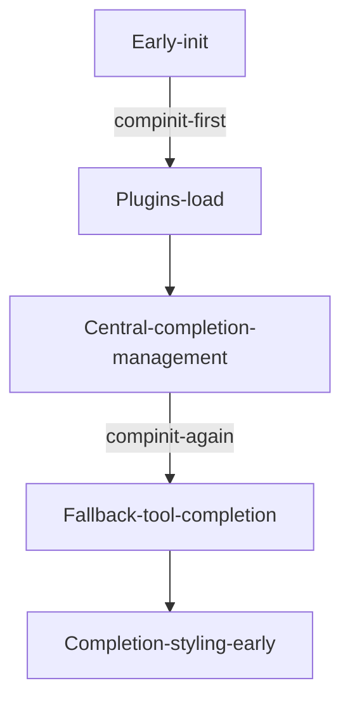
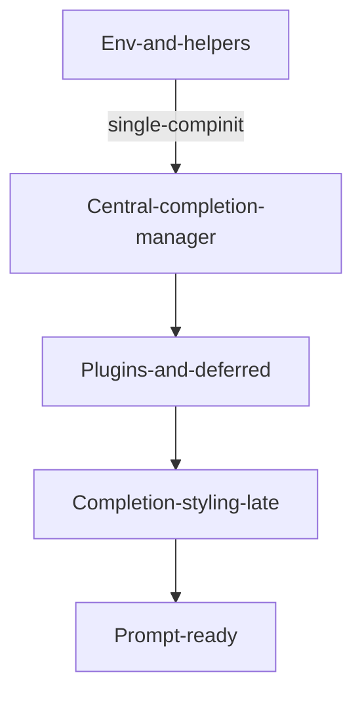

# Completion System Architecture & Audit

Return: [Index](../README.md) | Back: [Sourcing Flow](020-sourcing-flow.md)

## 1. Current Intended Design
The repository contains a comprehensive centralized completion management module (`.zshrc.d/00_03-completion-management.zsh`) whose goals:
- Single authoritative `.zcompdump` location & filename
- Locking to avoid concurrent rebuild corruption
- Scheduled rebuild (age > threshold, directories newer, or missing)
- Cleanup of legacy scattered `.zcompdump*` files
- Compiling dump to `.zwc` for faster load
- Exposing utility commands: `rebuild-completions`, `completion-status`, `cleanup-old-completions`

## 2. Actual Observed Initialization Paths
| Source File | Action | Notes | Issue |
|-------------|--------|-------|-------|
| `.zshrc.pre-plugins.d/01-completion-init.zsh` | `autoload -U compinit; compinit (-C conditional)` | EARLY before plugins | Duplicate init (should be removed) |
| `.zshrc.d/00_03-completion-management.zsh` | Central init (`compinit -d` or `-C`) | Desired canonical | OK |
| `.zshrc.d/10_17-completion.zsh` | Conditional fallback: may call `compinit -i` if central not loaded | Adds fragility | Keep only style supplement; remove fallback |
| `tools/safe-completion-init.zsh` | Simple safety init (`compinit -i`) | Utility/emergency path | Should become on-demand tool only |
| `tools/minimal-completion-init.zsh` | Minimal initialization | Utility for reduced environment | OK if NOT auto-sourced |
| `tools/rebuild-completions.zsh` | Rebuild helper (`compinit -d`) | Overlaps central logic | Refactor to call central function instead |

## 3. `.zcompdump` Path Analysis
| Variable Definition Point | Value Behavior | Conflict |
|---------------------------|----------------|----------|
| `.zshenv` sets `ZSH_COMPDUMP` | Host+version specific in cache dir | Overridden later | Causes multiple potential dump files |
| Central manager | Sets `ZSH_COMPDUMP_FILE` and overrides `ZSH_COMPDUMP` | Canonical | Should be standardized earlier |

Recommendation: In `.zshenv` export a neutral placeholder path identical to canonical path (e.g., `${ZDOTDIR}/.completions/zcompdump`) and let manager handle creation & compile.

## 4. Workflow Diagram (Current)

## 5. Workflow Diagram (Target)

## 6. Identified Issues & Severity
| Severity | Issue | Detail | Action |
|----------|-------|--------|--------|
| Critical | Multiple `compinit` executions | Early + central + fallback bombs | Remove early & fallback; enforce single site |
| Major | Dual dump path definitions | `.zshenv` vs manager override | Standardize in `.zshenv` |
| Major | Rebuild duplication | `tools/rebuild-completions.zsh` replicates logic | Replace with call to exported central function |
| Minor | Style duplication | Some zstyles in `.zshrc` and finalization | Consolidate after single init |
| Minor | Log noise gating | DEBUG checks inconsistent | Use `_comp_log` wrapper consistently |

## 7. Performance Considerations
| Aspect | Effect | Improvement |
|--------|--------|------------|
| Duplicate compinit | Extra filesystem stat + hash verification | Single invocation with `-C` fast path |
| Large styling file early | Blocks prompt due to parse overhead | Postpone styling (already done) + consider compiled style module |
| Cleanup scanning patterns | Multiple glob expansions | Cache previous cleanup run timestamp to skip within same day |

## 8. Proposed Refactor Steps
1. Delete or empty `01-completion-init.zsh` (retain comment sentinel).
2. Edit `10_17-completion.zsh` to remove fallback `compinit`, only light styles & bashcompinit if needed (and only if central loaded performed compinit; else warn).
3. Move `05-completion-finalization.zsh` to `30_99-completion-styles.zsh` (late styling phase).
4. Adjust `.zshenv` to set `ZSH_COMPDUMP` canonical path ahead of manager.
5. Refactor `tools/rebuild-completions.zsh` to call `rebuild-completions` function if present; fallback to central script sourcing.
6. Add automated test: spawn subshell, trace `typeset -f compinit` call count via injected debug hook or PS4 + `set -x` capturing occurrences.

## 9. Test Assertions (Target)
| Test | Success Criteria |
|------|------------------|
| Single compinit | Exactly one occurrence in trace |
| Dump file creation | Canonical path exists & non-zero size |
| Lock avoidance | Parallel 2 shells produce 1 consistent dump (no corruption) |
| Rebuild threshold | Touch older timestamp -> rebuild triggers |
| Rebuild skip | Fresh file (< threshold) -> fast path (-C) |

## 10. KPIs After Optimization
| Metric | Baseline (est.) | Target |
|--------|-----------------|--------|
| Startup (first interactive) | ~X + 120ms duplicate compinit | -100ms (remove duplicate) |
| Subsequent shells | ~Fast but double scan | Single fast compinit (-C) only |
| Dump proliferation | 2-4 scattered files | Only 1 canonical |

## 11. Task Mapping
See Improvement Plan tasks: COMP-01 .. COMP-08.

---
Generated: 2025-08-23
