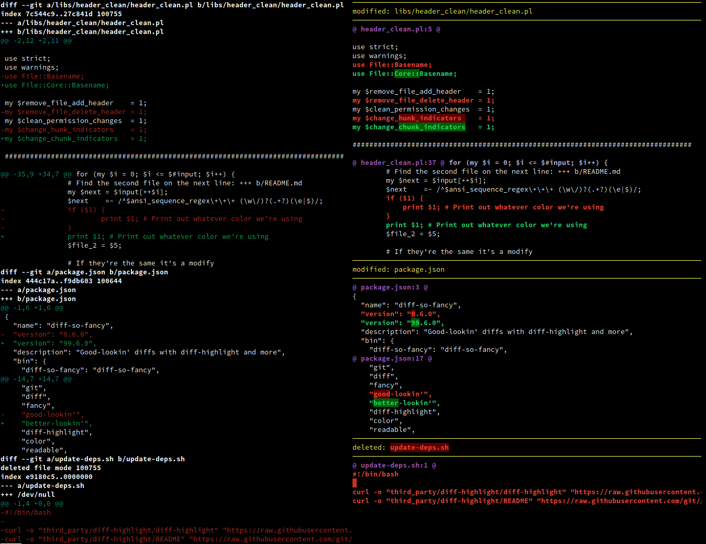

# 🎩 diff-so-fancy  [](https://circleci.com/gh/so-fancy/diff-so-fancy) [](https://ci.appveyor.com/project/stevemao/diff-so-fancy/branch/master)

`diff-so-fancy` strives to make your diffs **human** readable instead of machine readable. This helps improve code quality and helps you spot defects faster.

## 🖼️ Screenshot

Vanilla `git diff` vs `git` and `diff-so-fancy`



## 📦 Install

Simply copy the `diff-so-fancy` script from the latest release into your `$PATH` and you're done. Alternately to test development features you can clone this repo and then put the `diff-so-fancy` script (symlink will work) into your `$PATH`. The `lib/` directory will need to be kept relative to the core script.

`diff-so-fancy` is also available from the [NPM registry](https://www.npmjs.com/package/diff-so-fancy), [brew](https://formulae.brew.sh/formula/diff-so-fancy), [Fedora](https://packages.fedoraproject.org/pkgs/diff-so-fancy/diff-so-fancy/), in the [Arch extra repo](https://archlinux.org/packages/extra/any/diff-so-fancy/), and as [ppa:aos for Debian/Ubuntu Linux](https://github.com/aos/dsf-debian).

Issues relating to packaging ("installation does not work", "version is out of date", etc.) should be directed to those packages' repositories/issue trackers where applicable.

## ✨ Usage

### With git

Configure git to use `diff-so-fancy` for all diff output:

```shell
git config --global core.pager "diff-so-fancy | less --tabs=4 -RF"
git config --global interactive.diffFilter "diff-so-fancy --patch"
```

### Manually with diff

Use `-u` with `diff` for unified output, and pipe the output to `diff-so-fancy`:

```shell
diff -u file_a file_b | diff-so-fancy
```

It also supports the recursive mode of diff with `-r` or `--recursive` as **first argument**

```shell
diff -r -u folder_a folder_b | diff-so-fancy
```

```shell
diff --recursive -u folder_a folder_b | diff-so-fancy
```
## ⚒️ Options

### markEmptyLines

Should the first block of an empty line be colored. (Default: true)

```shell
git config --bool --global diff-so-fancy.markEmptyLines false
```

### changeHunkIndicators

Simplify git header chunks to a more human readable format. (Default: true)

```shell
git config --bool --global diff-so-fancy.changeHunkIndicators false
```

### stripLeadingSymbols

Should the pesky `+` or `-` at line-start be removed. (Default: true)

```shell
git config --bool --global diff-so-fancy.stripLeadingSymbols false
```

### useUnicodeRuler

By default, the separator for the file header uses Unicode line-drawing characters. If this is causing output errors on your terminal, set this to `false` to use ASCII characters instead. (Default: true)

```shell
git config --bool --global diff-so-fancy.useUnicodeRuler false
```

### rulerWidth

By default, the separator for the file header spans the full width of the terminal. Use this setting to set the width of the file header manually.

```shell
git config --global diff-so-fancy.rulerWidth 80
```

## 👨 The diff-so-fancy team

| Person                | Role             |
| --------------------- | ---------------- |
| @scottchiefbaker      | Project lead     |
| @OJFord               | Bug triage       |
| @GenieTim             | Travis OSX fixes |
| @AOS                  | Debian packager  |
| @Stevemao/@Paul Irish | NPM release team |

## 🧬 Contributing

Pull requests are quite welcome, and should target the [`next` branch](https://github.com/so-fancy/diff-so-fancy/tree/next). We are also looking for any feedback or ideas on how to make `diff-so-fancy` even *fancier*.

### Other documentation

* [Pro-tips on advanced usage](pro-tips.md)
* [Reporting Bugs](reporting-bugs.md)
* [Hacking and Testing](hacking-and-testing.md)
* [History](history.md)

## 🔃 Alternatives

* [Delta](https://github.com/dandavison/delta)
* [Lazygit](https://github.com/jesseduffield/lazygit) with diff-so-fancy [integration](https://github.com/jesseduffield/lazygit/blob/master/docs/Custom_Pagers.md#diff-so-fancy)

## 🏛️ License

MIT
