# ZSH Configuration Architecture Overview

## 🏗️ System Architecture

This ZSH configuration implements a modular, layered architecture designed for performance, maintainability, and extensibility. The system integrates with both system-level and user-level ZSH initialization files, supporting all ZSH session types.

## 🔧 ZSH Session Types and System Files

### Session Types
- **Login Sessions**: First shell when logging into system
- **Interactive Non-Login**: Additional shells within existing session
- **Non-Interactive (Scripts)**: Automated script execution

### System Files Integration

| File | All Sessions | Login Only | Interactive Only |
|------|--------------|------------|------------------|
| `/etc/zshenv` | ✓ | | |
| `/etc/zshrc` | | | ✓ |
| `~/.zshenv` | ✓ | | |
| `~/.zshrc` | | | ✓ |

**Current System Files**:
- `/etc/zshenv`: Nix environment for SSH connections
- `/etc/zshrc`: Nix environment for interactive shells
- `~/.zshenv`: Core environment, XDG paths, zgenom setup
- `~/.zshrc`: Main configuration via zsh-quickstart-kit

## 📁 Directory Structure

```mermaid
graph TB
    A[🏠 ~/.config/zsh/] --> B[📄 Main .zshrc]
    A --> C[📁 .zshrc.pre-plugins.d/]
    A --> D[📁 .zshrc.add-plugins.d/]
    A --> E[📁 .zshrc.d/]
    A --> F[📁 .zshrc.Darwin.d/]
    A --> G[📁 docs/]
    A --> H[📁 zgenom/]
    
    C --> C1[00-fzf-setup.zsh]
    C --> C2[01-completion-init.zsh]
    C --> C3[02-nvm-npm-fix.zsh]
    
    D --> D1[010-add-plugins.zsh]
    
    E --> E1[📊 00_]
    E --> E2[🛠️ 10_]
    E --> E3[🔌 20_]
    E --> E4[🎨 30_]
    E --> E5[🎯 90_/]
    
    F --> F1[100-macos-defaults.zsh]
    
    E1 --> E1A[01-environment.zsh]
    E1 --> E1B[02-path-system.zsh]
    E1 --> E1C[03-options.zsh]
    E1 --> E1D[04-functions-core.zsh]
    E1 --> E1E[05-completion-finalization.zsh]
    E1 --> E1F[07-utility-functions.zsh]
    
    %% Styling
    classDef main fill:#e17055,stroke:#d63031,stroke-width:3px,color:#fff
    classDef prePlugin fill:#74b9ff,stroke:#0984e3,stroke-width:2px,color:#fff
    classDef plugin fill:#00b894,stroke:#00a085,stroke-width:2px,color:#fff
    classDef core fill:#fdcb6e,stroke:#e17055,stroke-width:2px,color:#000
    classDef os fill:#a29bfe,stroke:#6c5ce7,stroke-width:2px,color:#fff
    classDef docs fill:#fd79a8,stroke:#e84393,stroke-width:2px,color:#fff
    classDef system fill:#636e72,stroke:#2d3436,stroke-width:2px,color:#fff
    
    class A,B main
    class C,C1,C2,C3 prePlugin
    class D,D1,H plugin
    class E,E1,E2,E3,E4,E5,E1A,E1B,E1C,E1D,E1E,E1F core
    class F,F1 os
    class G docs
```

## 🔄 Loading Phases

### Phase 1: Pre-Plugin Initialization
**Directory**: `.zshrc.pre-plugins.d/`
**Purpose**: Critical setup that must happen before any plugins load

| File | Purpose | Dependencies |
|------|---------|-------------|
| `00-fzf-setup.zsh` | FZF path detection and early integration | None |
| `01-completion-init.zsh` | Completion system initialization | None |
| `02-nvm-npm-fix.zsh` | NVM/NPM environment preparation | Bun binary |

### Phase 2: Plugin Management
**Directory**: `.zshrc.add-plugins.d/`
**Purpose**: Define and load all ZSH plugins

| File | Purpose | Dependencies |
|------|---------|-------------|
| `010-add-plugins.zsh` | Custom plugin definitions via zgenom | zgenom |

### Phase 3: Main Configuration
**Directory**: `.zshrc.d/`
**Purpose**: Primary system configuration (25 files)

#### 00_ (6 files)
- Environment variables and core settings
- PATH management and system paths  
- ZSH options and behavior configuration
- Core utility functions
- Completion system finalization

#### 10_ (8 files)
- Development tool configurations
- Language-specific environments
- Package manager setups
- Version control configurations
- Tool-specific optimizations

#### 20_ (4 files) 
- Plugin-specific configurations
- Plugin integration settings
- Performance optimizations
- Deferred loading configurations

#### 30_ (6 files)
- Prompt and theme configuration
- Aliases and shortcuts
- UI enhancements and customizations
- Keybindings and input handling
- Visual improvements

#### 90_/ (1 file)
- Final setup and splash screen
- System validation
- Performance reporting

### Phase 4: OS-Specific Configuration
**Directory**: `.zshrc.Darwin.d/`
**Purpose**: macOS-specific settings and optimizations

| File | Purpose | Dependencies |
|------|---------|-------------|
| `100-macos-defaults.zsh` | macOS system defaults and paths | macOS only |

## 🔧 Core Design Principles

### 1. **Layered Architecture**
- Each phase builds on previous phases
- Clean separation of concerns
- Minimal interdependencies

### 2. **Performance First**
- Early completion initialization
- Fast plugin loading
- Deferred non-critical operations
- PATH deduplication

### 3. **Maintainability**
- Modular file organization
- Consistent naming convention
- Comprehensive documentation
- Error handling and debugging

### 4. **Extensibility**
- Easy to add new configurations
- Plugin system integration
- OS-specific customizations
- Work environment support

## 🚀 Key Features

### ⚡ Performance Optimizations
- **Fast Completion**: `-C` flag for quick startup
- **Early FZF**: Prevents widget conflicts
- **Plugin Management**: Efficient loading via zgenom
- **PATH Deduplication**: Automatic cleanup

### 🛡️ Conflict Resolution
- **Widget Conflicts**: FZF loaded early
- **Environment Variables**: NVM/NPM compatibility
- **Plugin Dependencies**: Proper loading order
- **OS Compatibility**: Platform-specific configurations

### 📊 Monitoring & Debugging
- **Debug Mode**: ZSH_DEBUG=1 for verbose output
- **Performance Profiling**: Optional zprof integration
- **Startup Timing**: Built-in reporting
- **Error Handling**: Graceful fallbacks

## 📈 Configuration Statistics

| Metric | Value |
|--------|-------|
| **Total Active Files** | 30 |
| **Configuration Directories** | 4 |
| **Plugin Definitions** | 1 file |
| **Core Configurations** | 25 files |
| **OS-Specific Files** | 1 |
| **Archived Inactive Files** | 17 |

## 🔍 Integration Points

### External Tools
- **FZF**: Fuzzy finder integration
- **zgenom**: Plugin manager
- **P10k**: Prompt theme
- **NVM**: Node version manager
- **Git**: Version control integration

### System Integration
- **macOS**: Native system integration
- **Homebrew**: Package manager support
- **SSH**: Key management
- **Terminal**: Enhanced features

## 🎯 Future Extensibility

The architecture supports easy extension through:
- Additional OS-specific directories (`.zshrc.Linux.d/`)
- Work environment configurations (`.zshrc.work.d/`)
- Custom plugin additions
- Performance monitoring enhancements
