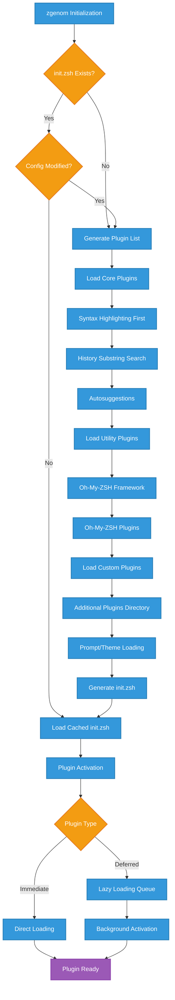

# Complete ZSH Startup Sequence and Plugin Architecture

## Complete ZSH Session Initialization Flow

```mermaid
flowchart TD
    A[👤 User Invokes ZSH] --> B{Session Type Detection}

    %% System-level files
    B -->|All Sessions| C[⚙️ /etc/zshenv]
    C -->|Nix SSH Setup| D[🏠 ~/.zshenv]

    D -->|Login Session| E[⚙️ /etc/zprofile]
    E -->|Login Session| F[🏠 ~/.zprofile]

    D -->|Interactive| G[⚙️ /etc/zshrc]
    F -->|Login Session| G
    G -->|Nix Environment| H[🏠 ~/.zshrc]

    %% User .zshrc processing
    H --> I[🚀 P10k Instant Prompt]
    I --> J[🎨 Font Mode Detection]
    J --> K[📁 Pre-Plugins Directory]

    %% Pre-plugins phase
    K --> L[🔍 00-fzf-setup.zsh]
    L --> M[⚡ 01-completion-init.zsh]
    M --> N[🔧 02-nvm-npm-fix.zsh]

    %% Plugin management
    N --> O[🔌 .zgen-setup Loading]
    O --> P{zgenom Check}
    P -->|Not Initialized| Q[📦 Plugin Installation]
    P -->|Initialized| R[🚄 Fast Plugin Load]
    Q --> R

    %% Core configuration
    R --> S[📊 Core Configuration]
    S --> T[🛠️ Tools Configuration]
    T --> U[🔌 Plugin Configuration]
    U --> V[🎨 UI Configuration]
    V --> W[🎯 Finalization]

    %% OS-specific
    W --> X{Operating System}
    X -->|macOS| Y[🍎 Darwin Config]
    X -->|Linux| Z[🐧 Linux Config]
    X -->|Other| AA[🔧 Generic Config]

    %% Final steps
    Y --> BB[🔗 PATH Deduplication]
    Z --> BB
    AA --> BB
    BB --> CC[✅ Completion Finalization]
    CC --> DD[🔑 SSH Key Management]
    DD --> EE[🎨 Theme Loading]

    %% Login completion
    D -->|Login Session| FF[⚙️ /etc/zlogin]
    EE -->|Login Session| FF
    FF -->|Login Session| GG[🏠 ~/.zlogin]

    %% Script execution
    B -->|Script| HH[📜 Script Execution]
    D --> HH

    %% Session ready
    EE --> II[✨ Interactive Session Ready]
    GG --> II
    HH --> JJ[📜 Script Complete]

    %% Styling
    classDef system fill:#e74c3c,stroke:#c0392b,stroke-width:2px,color:#fff
    classDef user fill:#3498db,stroke:#2980b9,stroke-width:2px,color:#fff
    classDef plugin fill:#2ecc71,stroke:#27ae60,stroke-width:2px,color:#fff
    classDef config fill:#f39c12,stroke:#e67e22,stroke-width:2px,color:#fff
    classDef final fill:#9b59b6,stroke:#8e44ad,stroke-width:2px,color:#fff

    class C,E,G,FF system
    class D,F,H,I,J user
    class K,L,M,N,O,P,Q,R plugin
    class S,T,U,V,W,X,Y,Z,AA config
    class BB,CC,DD,EE,II,GG,HH,JJ final
```

## ZSH Quickstart Kit and zgenom Integration Architecture

```mermaid
flowchart LR
    subgraph "🏠 User Environment"
        A[~/.zshenv] -->|Sets ZDOTDIR| B[~/.zshrc]
        C[zsh-quickstart-kit] -->|Provides| B
        B -->|Sources| D[.zgen-setup]
    end

    subgraph "📦 Plugin Management - zgenom"
        D -->|Initializes| E[zgenom Core]
        E -->|Clones to| F[~/.zgenom/]
        F --> G[Plugin Repository Clones]
        E -->|Generates| H[init.zsh]
        H -->|Fast Loading| I[Plugin Activation]
    end

    subgraph "🔌 Plugin Categories"
        I --> J[Core Plugins]
        J --> K[zsh-users/zsh-autosuggestions]
        J --> L[zdharma-continuum/fast-syntax-highlighting]
        J --> M[romkatv/powerlevel10k]

        I --> N[Utility Plugins]
        N --> O[unixorn/fzf-zsh-plugin]
        N --> P[unixorn/git-extra-commands]
        N --> Q[so-fancy/diff-so-fancy]

        I --> R[Oh-My-ZSH Plugins]
        R --> S[oh-my-zsh/git]
        R --> T[oh-my-zsh/brew]
        R --> U[oh-my-zsh/macos]

        I --> V[Custom Plugins]
        V --> W[olets/zsh-abbr]
        V --> X[hlissner/zsh-autopair]
        V --> Y[mroth/evalcache]
    end

    subgraph "⚙️ Configuration Loading"
        I --> Z[Pre-Plugins]
        Z --> AA[FZF Setup]
        Z --> BB[Completion Init]
        Z --> CC[Environment Fixes]

        I --> DD[Main Config]
        DD --> EE[00_]
        DD --> FF[10_]
        DD --> GG[20_]
        DD --> HH[30_]
        DD --> II[90_/]

        I --> JJ[OS-Specific]
        JJ --> KK[macOS Config]
        JJ --> LL[Linux Config]
    end

    %% Styling
    classDef env fill:#e74c3c,stroke:#c0392b,stroke-width:2px,color:#fff
    classDef plugin fill:#2ecc71,stroke:#27ae60,stroke-width:2px,color:#fff
    classDef config fill:#f39c12,stroke:#e67e22,stroke-width:2px,color:#fff
    classDef system fill:#3498db,stroke:#2980b9,stroke-width:2px,color:#fff

    class A,B,C,D env
    class E,F,G,H,I,J,K,L,M,N,O,P,Q,R,S,T,U,V,W,X,Y plugin
    class Z,AA,BB,CC,DD,EE,FF,GG,HH,II,JJ,KK,LL config
```

## Plugin Loading and Dependency Resolution

## Configuration File Processing Order

```mermaid
gantt
    title ZSH Configuration Loading Timeline
    dateFormat X
    axisFormat %L

    section System Files
    /etc/zshenv          :0, 50
    ~/.zshenv           :50, 100
    /etc/zshrc          :100, 120

    section Interactive Setup
    ~/.zshrc starts    :120, 140
    P10k instant prompt :140, 160
    Font detection      :160, 170

    section Pre-Plugins
    FZF setup          :170, 190
    Completion init    :190, 210
    NVM/NPM fixes      :210, 230

    section Plugin Loading
    zgenom init        :230, 280
    Plugin cloning     :280, 350
    Plugin activation  :350, 400

    section Main Config
    Core config        :400, 450
    Tools config       :450, 500
    Plugin config      :500, 530
    UI config          :530, 560

    section Finalization
    OS-specific        :560, 590
    PATH deduplication :590, 610
    Completion system  :610, 630
    Theme loading      :630, 650
    SSH keys          :650, 670
    Ready             :670, 680
```

## Session Type Comparison

| Aspect | Login Interactive | Non-Login Interactive | Script |
|--------|------------------|---------------------|--------|
| **Files Loaded** | All ZSH files | ~/.zshenv, /etc+~/.zshrc | ~/.zshenv only |
| **Plugins** | ✅ All plugins loaded | ✅ All plugins loaded | ❌ No plugins |
| **Completion** | ✅ Full completion system | ✅ Full completion system | ❌ Minimal |
| **Aliases** | ✅ All aliases available | ✅ All aliases available | ❌ No aliases |
| **Performance** | Slower startup (~1s) | Medium startup (~0.5s) | Fast startup (~0.1s) |
| **Environment** | Complete setup | Complete setup | Essential only |

## Plugin Performance Characteristics

| Plugin Category | Load Time | Memory Usage | Startup Impact |
|----------------|-----------|--------------|----------------|
| **Syntax Highlighting** | ~100ms | ~2MB | Medium |
| **Autosuggestions** | ~50ms | ~1MB | Low |
| **Completion Plugins** | ~150ms | ~3MB | High |
| **Utility Plugins** | ~20ms | ~0.5MB | Low |
| **Oh-My-ZSH Framework** | ~200ms | ~4MB | High |
| **Theme (P10k)** | ~80ms | ~1.5MB | Medium |
| **Custom Plugins** | ~30ms | ~0.8MB | Low |

This comprehensive view shows how your ZSH configuration integrates system files, session types, the zsh-quickstart-kit framework, zgenom plugin management, and custom configurations into a cohesive, high-performance shell environment.
