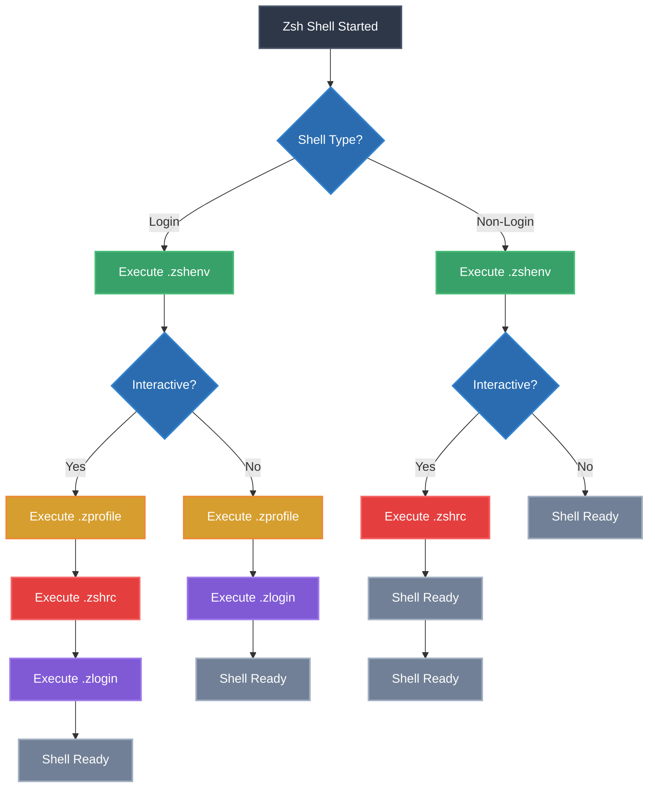
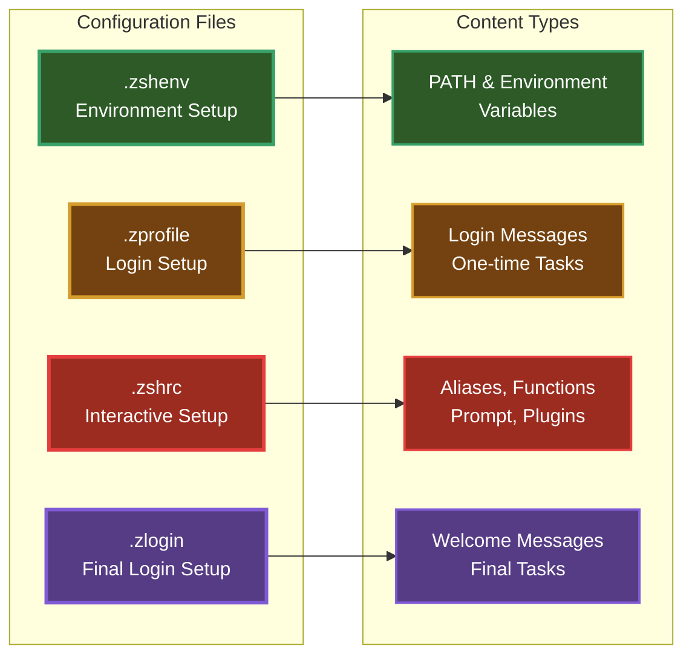
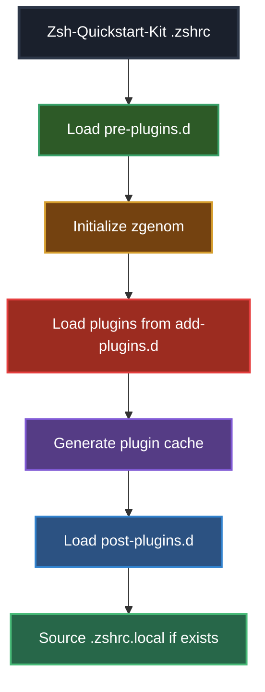

# Zsh Startup Process Guide

A comprehensive guide to understanding and customizing zsh shell startup processes, configuration files, and best practices.

## Table of Contents

1. [Overview](#overview)
2. [Startup File Execution Order](#startup-file-execution-order)
3. [Configuration File Purposes](#configuration-file-purposes)
4. [Startup Process Flow Diagram](#startup-process-flow-diagram)
5. [Customization Strategy](#customization-strategy)
6. [Best Practices](#best-practices)
7. [Zsh-Quickstart-Kit Addendum](#zsh-quickstart-kit-addendum)
8. [References](#references)

## Overview

Zsh (Z Shell) uses multiple configuration files that are executed in different contexts and orders. Understanding this process is crucial for effective shell customization and avoiding configuration conflicts.

### Shell Types and Contexts

Zsh recognizes three main shell contexts:

- **Login Shell**: Started when you log into the system (SSH, console login, `zsh -l`)
- **Interactive Shell**: Started for user interaction (terminal windows, `zsh -i`)
- **Non-Interactive Shell**: Used for running scripts and commands

### Key Configuration Files

The primary zsh configuration files are:

1. `.zshenv` - Always sourced first
2. `.zprofile` - Sourced for login shells
3. `.zshrc` - Sourced for interactive shells
4. `.zlogin` - Sourced after `.zshrc` for login shells
5. `.zlogout` - Sourced when login shells exit

## Startup File Execution Order

The execution order depends on the shell type and context:

### Login Interactive Shell
```
.zshenv → .zprofile → .zshrc → .zlogin
```

### Non-Login Interactive Shell (most terminal windows)
```
.zshenv → .zshrc
```

### Non-Interactive Shell (scripts)
```
.zshenv only
```

### Login Non-Interactive Shell
```
.zshenv → .zprofile → .zlogin
```

## Configuration File Purposes

### `.zshenv`
- **Purpose**: Environment variables and settings needed by all shells
- **When**: Always executed first, regardless of shell type
- **Use for**: 
  - `PATH` modifications
  - Essential environment variables
  - System-wide settings
- **Avoid**: Interactive features, aliases, functions

### `.zprofile`
- **Purpose**: Login shell initialization, similar to `.bash_profile`
- **When**: Only for login shells, before `.zshrc`
- **Use for**:
  - Login-specific environment setup
  - One-time initialization tasks
  - System announcements
- **Avoid**: Interactive shell customizations

### `.zshrc`
- **Purpose**: Interactive shell configuration
- **When**: Every interactive shell session
- **Use for**:
  - Aliases and functions
  - Key bindings
  - Prompt configuration
  - Plugin loading
  - Interactive features
- **Most customization goes here**

### `.zlogin`
- **Purpose**: Final login shell setup
- **When**: After `.zshrc` for login shells
- **Use for**:
  - Tasks that need the full environment
  - Welcome messages
  - Cleanup tasks
- **Rarely used**

### `.zlogout`
- **Purpose**: Cleanup when login shells exit
- **When**: Login shell termination
- **Use for**:
  - Cleanup tasks
  - Saving history
  - Logout messages
- **Optional**

## Startup Process Flow Diagram



### File-Specific Flow



## Customization Strategy

### Choosing the Right File

| Need | File | Reason |
|------|------|--------|
| Set PATH | `.zshenv` | Available to all shells, including non-interactive |
| Export variables | `.zshenv` | Ensures availability in scripts and subshells |
| Login greeting | `.zprofile` | Only shown once per login session |
| Aliases | `.zshrc` | Interactive feature, not needed in scripts |
| Functions | `.zshrc` | Interactive feature, not needed in scripts |
| Prompt setup | `.zshrc` | Only relevant for interactive shells |
| Plugin loading | `.zshrc` | Interactive features and performance |
| Key bindings | `.zshrc` | Interactive input handling |

### Directory-Based Organization

For complex configurations, consider organizing files in directories:

```
~/.config/zsh/
├── .zshenv
├── .zprofile  
├── .zshrc
├── pre-plugins.d/
│   ├── 001-paths.zsh
│   ├── 002-environment.zsh
│   └── 003-options.zsh
├── plugins.d/
│   ├── 010-plugin-manager.zsh
│   └── 020-load-plugins.zsh
└── post-plugins.d/
    ├── 100-aliases.zsh
    ├── 200-functions.zsh
    └── 900-prompt.zsh
```

### Loading Order Strategy

1. **Environment Setup** (`.zshenv`)
   - PATH modifications
   - Essential variables
   - XDG directories

2. **Pre-Plugin Setup** (`.zshrc` early)
   - Zsh options
   - Module loading
   - History configuration

3. **Plugin Loading** (`.zshrc` middle)
   - Plugin manager initialization
   - Plugin loading

4. **Post-Plugin Setup** (`.zshrc` late)
   - Aliases (may override plugin aliases)
   - Custom functions
   - Prompt configuration
   - Key bindings (may override plugin bindings)

## Best Practices

### Performance Optimization

1. **Lazy Loading**: Load heavy plugins and tools only when needed
2. **Conditional Loading**: Check if commands exist before configuring them
3. **Minimal .zshenv**: Keep it fast since it's always executed
4. **Profile Startup Time**: Use `zsh -xvs` to debug slow startups

### Maintainability

1. **Modular Configuration**: Split large configs into focused files
2. **Documentation**: Comment complex configurations
3. **Version Control**: Track your dotfiles with git
4. **Environment Detection**: Adapt to different systems and contexts

### Security

1. **Path Security**: Be cautious with PATH modifications in `.zshenv`
2. **Source Validation**: Verify third-party plugins and scripts
3. **Sensitive Data**: Use secure methods for API keys and passwords
4. **File Permissions**: Restrict access to configuration files

### Code Examples

#### Safe PATH modification in `.zshenv`:
```bash
# Add local bin to PATH if it exists and isn't already there
if [[ -d "$HOME/.local/bin" ]] && [[ ":$PATH:" != *":$HOME/.local/bin:"* ]]; then
    export PATH="$HOME/.local/bin:$PATH"
fi
```

#### Conditional plugin loading in `.zshrc`:
```bash
# Only load docker completion if docker is installed
if command -v docker >/dev/null 2>&1; then
    source "$HOME/.config/zsh/plugins/docker-completion.zsh"
fi
```

#### Performance timing:
```bash
# Add to top of .zshrc for debugging
[[ -n "$ZSH_DEBUG_STARTUP" ]] && zmodload zsh/zprof

# Add to bottom of .zshrc
[[ -n "$ZSH_DEBUG_STARTUP" ]] && zprof
```

## Zsh-Quickstart-Kit Addendum

When using [zsh-quickstart-kit](https://github.com/unixorn/zsh-quickstart-kit), the standard recommendations are modified as follows:

### Modified File Structure

The zsh-quickstart-kit uses a different approach:

- **Main .zshrc**: Provided by the kit, handles plugin management
- **Local customizations**: Go in `.zshrc.local` or custom directories
- **Plugin management**: Handled by zgenom (zgen successor)

### Recommended Approach with Zsh-Quickstart-Kit

#### 1. Environment Variables (`.zshenv`)
```bash
# Keep the same - environment setup
export XDG_CONFIG_HOME="$HOME/.config"
export EDITOR="nvim"
# PATH modifications for all shells
```

#### 2. Login Setup (`.zprofile`) 
```bash
# Keep the same - login-specific setup
# One-time login tasks
```

#### 3. Interactive Setup (Modified Strategy)

Instead of customizing `.zshrc` directly, use:

**Option A: .zshrc.local file**
```bash
# ~/.zshrc.local
# Your personal customizations here
# This file is sourced by zsh-quickstart-kit's .zshrc
```

**Option B: Modular directory structure** (as seen in your project)
```
~/.config/zsh/
├── dot-zshrc.pre-plugins.d/    # Before plugin loading
├── dot-zshrc.add-plugins.d/    # Plugin definitions  
└── dot-zshrc.d/                # After plugin loading
```

### Zsh-Quickstart-Kit Specific Considerations

#### Plugin Management
- Uses **zgenom** instead of manual plugin management
- Plugins defined in separate configuration files
- Auto-updating and caching handled by the kit

#### Directory Structure Benefits


#### File Placement Strategy

| Content Type | Standard Zsh | Zsh-Quickstart-Kit |
|--------------|--------------|-------------------|
| Environment vars | `.zshenv` | `.zshenv` (same) |
| Login setup | `.zprofile` | `.zprofile` (same) |
| Pre-plugin config | `.zshrc` (early) | `pre-plugins.d/*.zsh` |
| Plugin loading | `.zshrc` (manual) | `add-plugins.d/*.zsh` |
| Post-plugin config | `.zshrc` (late) | `dot-zshrc.d/*.zsh` |
| Personal overrides | `.zshrc` | `.zshrc.local` |

#### Example Configuration Files

**pre-plugins.d/010-options.zsh:**
```bash
# Zsh options that should be set before plugins load
setopt AUTO_CD
setopt GLOB_DOTS
setopt HIST_IGNORE_DUPS
```

**add-plugins.d/010-plugins.zsh:**
```bash
# Plugin definitions for zgenom
zgenom load zsh-users/zsh-syntax-highlighting
zgenom load zsh-users/zsh-autosuggestions
zgenom load ohmyzsh/ohmyzsh plugins/git
```

**dot-zshrc.d/100-aliases.zsh:**
```bash
# Custom aliases that may override plugin defaults
alias ll='ls -la'
alias vim='nvim'
```

### Migration Strategy

If migrating from standard zsh to zsh-quickstart-kit:

1. **Keep** `.zshenv` and `.zprofile` unchanged
2. **Split** your `.zshrc` into:
   - Pre-plugin setup → `pre-plugins.d/`
   - Plugin loading → `add-plugins.d/` 
   - Post-plugin customizations → `dot-zshrc.d/`
3. **Use** `.zshrc.local` for simple personal additions
4. **Test** the new setup incrementally

### Benefits of Zsh-Quickstart-Kit Approach

- **Organized**: Clear separation of concerns
- **Maintainable**: Easy to enable/disable specific configurations
- **Performance**: Optimized plugin loading and caching
- **Community**: Access to curated plugins and configurations
- **Updates**: Easy to update the kit while preserving customizations

## References

### Official Documentation
- [Zsh Manual - Startup/Shutdown Files](http://zsh.sourceforge.net/Doc/Release/Files.html#Startup_002fShutdown-Files) - Official zsh documentation on configuration files
- [Zsh Manual - Options](http://zsh.sourceforge.net/Doc/Release/Options.html) - Complete list of zsh options
- [Zsh Manual - Expansion](http://zsh.sourceforge.net/Doc/Release/Expansion.html) - Parameter and filename expansion

### Community Resources
- [Zsh-Quickstart-Kit](https://github.com/unixorn/zsh-quickstart-kit) - Curated collection of zsh plugins and configurations
- [Oh My Zsh](https://ohmyz.sh/) - Popular zsh configuration framework
- [Prezto](https://github.com/sorin-ionescu/prezto) - Configuration framework for zsh
- [Zgenom](https://github.com/jandamm/zgenom) - Lightweight plugin manager

### Performance and Debugging
- [Zsh Benchmark](https://github.com/romkatv/zsh-bench) - Benchmark zsh and its plugins
- [Zsh Performance Analysis](https://blog.jonlu.ca/posts/speeding-up-zsh) - Guide to optimizing zsh startup time

### Best Practices Guides  
- [XDG Base Directory Specification](https://specifications.freedesktop.org/basedir-spec/basedir-spec-latest.html) - Standard for organizing configuration files
- [Dotfiles Best Practices](https://dotfiles.github.io/) - Community guide to dotfiles management

---

*Last updated: August 2025*
*This guide is based on zsh 5.9 and current best practices as of 2025.*
