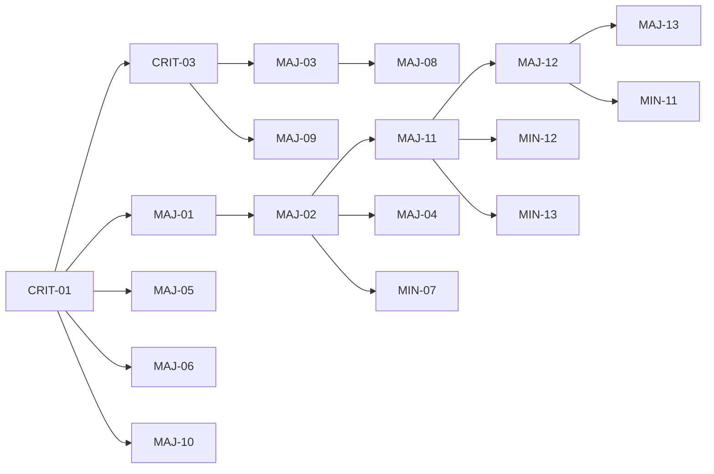

# Comprehensive Improvement Plan & Task Tracker

Return: [Index](../README.md) | See: [Findings](../020-review/010-findings.md) | [Sourcing Flow](../010-architecture/020-sourcing-flow.md)
Generated: 2025-08-23

## 1. Task Legend
- Status: ⬜ NOT_STARTED | 🔄 IN_PROGRESS | ✅ COMPLETE | ⛔ BLOCKED | ⏸️ DEFERRED
- Priority Icons (color‑blind friendly):
  - ❗ P0 Critical
  - ▲ P1 Major
  - ▪ P2 Minor
- Effort (icon + meaning): ⚡ QF (<30m) | 🕒 S (30–60m) | ⏳ M (1–2h) | 🧱 L (>2h)
- Impact (icon categories): 🚀 PERF | 🧹 MAINT | 🔧 FUNC | 🔐 SEC | 🎨 UX
- Severity ↔ Priority Mapping: ❗ (highest risk/perf or security) > ▲ (structural/maintainability) > ▪ (polish)
- Status scope: All docs now use the unified status set (including ⛔ BLOCKED, ⏸️ DEFERRED) for consistency.

## 2. Master Task Table
| Icon | ID | Priority | Title | Effort | Impact | Dependencies | Status |
|------|----|----------|-------|--------|--------|--------------|--------|
| ❗ | TASK-CRIT-01 | P0 | Remove duplicate compinit paths (early + fallback) | QF | PERF | (none) | ⬜ |
| ❗ | TASK-CRIT-02 | P0 | Replace aggressive hook wiping with targeted Warp removal | S | FUNC | (none) | ⬜ |
| ❗ | TASK-CRIT-03 | P0 | Standardize ZSH_COMPDUMP path in .zshenv | QF | PERF | TASK-CRIT-01 | ⬜ |
| ▲ | TASK-MAJ-01 | P1 | Relocate completion styling to late phase | QF | PERF/UX | TASK-CRIT-01 | ⬜ |
| ▲ | TASK-MAJ-02 | P1 | Split monolithic zstyle block into themed modules (phase 1 extraction) | M | MAINT | TASK-MAJ-01 | ⬜ |
| ▲ | TASK-MAJ-03 | P1 | Unify PATH management strategy | M | MAINT/PERF | TASK-CRIT-03 | 🔄 |
| ▲ | TASK-MAJ-04 | P1 | Remove duplicate zstyles from .zshrc | QF | MAINT | TASK-MAJ-01 | ⬜ |
| ▲ | TASK-MAJ-05 | P1 | Strip fallback compinit logic in 17-completion.zsh | QF | PERF | TASK-CRIT-01 | ⬜ |
| ▲ | TASK-MAJ-06 | P1 | Refactor rebuild-completions tool to call central function | QF | MAINT | TASK-CRIT-01 | ⬜ |
| ▲ | TASK-MAJ-07 | P1 | Document & decide on disabled fragments | S | MAINT | (none) | ⬜ |
| ▲ | TASK-MAJ-08 | P1 | Earlier PATH dedup or minimize additions | S | PERF | TASK-MAJ-03 | 🔄 |
| ▲ | TASK-MAJ-09 | P1 | Whitelist canonical compdump during cleanup | QF | MAINT | TASK-CRIT-03 | ⬜ |
| ▲ | TASK-MAJ-10 | P1 | Add single compinit trace test | S | PERF | TASK-CRIT-01 | ⬜ |
| ▲ | TASK-MAJ-11 | P1 | Establish styling module directory & palette core (phase 2) | M | MAINT/UX | TASK-MAJ-02 | 🔄 |
| ▲ | TASK-MAJ-12 | P1 | Implement style API + registration/finalizer | M | MAINT/PERF | TASK-MAJ-11 | ⬜ |
| ▲ | TASK-MAJ-13 | P1 | Remove legacy monolithic block & add rollback shim | QF | MAINT | TASK-MAJ-12 | ⬜ |
| ▪ | TASK-MIN-01 | P2 | Replace ls-based fragment loader with glob loop | QF | PERF/MAINT | (none) | ⬜ |
| ▪ | TASK-MIN-02 | P2 | Parameterize user in process completion style | QF | UX | TASK-MAJ-01 | ⬜ |
| ▪ | TASK-MIN-03 | P2 | Namespace completion functions (optional) | QF | MAINT | TASK-CRIT-01 | ⬜ |
| ▪ | TASK-MIN-04 | P2 | Guard _field_test behind debug flag | QF | MAINT | (none) | ⬜ |
| ▪ | TASK-MIN-05 | P2 | Validate zcompile return codes | QF | MAINT | TASK-CRIT-01 | ⬜ |
| ▪ | TASK-MIN-06 | P2 | Add lock contention parallel test | M | PERF | TASK-CRIT-01 | ⬜ |
| ▪ | TASK-MIN-07 | P2 | Introduce palette variables for color styles (phase 1) | S | MAINT | TASK-MAJ-02 | ⬜ |
| ▪ | TASK-MIN-08 | P2 | Conditional LC_ALL export | QF | MAINT | (none) | ⬜ |
| ▪ | TASK-MIN-09 | P2 | Single HISTFILE definition | QF | MAINT | (none) | ⬜ |
| ▪ | TASK-MIN-10 | P2 | Normalize quoting style | L | MAINT | (none) | ⬜ |
| ▪ | TASK-MIN-11 | P2 | Style snapshot diff test | QF | MAINT | TASK-MAJ-12 | ⬜ |
| ▪ | TASK-MIN-12 | P2 | Variant switching logic & theme selection | S | UX | TASK-MAJ-11 | ⬜ |
| ▪ | TASK-MIN-13 | P2 | Low-color / safe-mode palette fallback | S | UX | TASK-MAJ-11 | ⬜ |

## 2.b Phase Status Overview
| Phase | Status | Progress | Notes |
|-------|--------|----------|-------|
| [Phase 01](030-phases/010-phase-01-completion-core-cleanup.md) Completion Core Cleanup | ⬜ NOT_STARTED | 0% | Planning baseline; no code changes yet |
| [Phase 02](030-phases/phase-02-styling-modularization-extraction.md) Styling Extraction | ⬜ NOT_STARTED | 0% | Awaiting initiation after Phase 01 tasks begin |
| [Phase 03](030-phases/phase-03-styling-palette-and-api.md) Palette & API | 🔄 IN_PROGRESS | 5% | Phase doc scaffolded (palette/API design drafted) |
| [Phase 04](030-phases/phase-04-styling-variants-and-finalizer.md) Variants & Finalizer | ⬜ NOT_STARTED | 0% | Pending Phase 03 API completion |
| [Phase 05](030-phases/phase-05-path-env-unification.md) Path & Env Unification | ⬜ NOT_STARTED | 0% | Inventory step not executed yet |
| [Phase 06](030-phases/060-phase-06-performance-and-monitoring.md) Performance & Monitoring | ⬜ NOT_STARTED | 0% | Perf harness spec only (doc) |

> Phase status is updated when a phase document is created (DRAFT) and again when first code/test change lands (IN_PROGRESS). Completion requires exit checklist satisfied.

## 3. Dependency Graph

## 4. Quick Wins (First Pass)
| Task | Rationale |
|------|-----------|
| TASK-CRIT-01 | Removes largest perf duplication |
| TASK-CRIT-03 | Prevents path proliferation early |
| TASK-MAJ-05 | Eliminates fallback risk quickly |
| TASK-MAJ-06 | Reduces logic duplication |
| TASK-MAJ-10 | Locks regression guard |

## 5. Implementation Notes
- Perform completion consolidation before styling relocation to ensure ordering guarantees.
- Use feature branches or sequential commits grouped by task clusters (e.g., COMPINIT-CLEANUP, STYLING-SPLIT, PATH-UNIFY).
- After each cluster, run baseline timing `bin/zsh-performance-baseline` capturing cold/warm startup deltas.

## 6. KPIs & Measurement Plan
| KPI | Baseline Capture Tool | Target Improvement |
|-----|-----------------------|--------------------|
| Cold startup (ms) | zsh-profile-startup (with -x trace) | -100ms (remove duplicate compinit) |
| Warm startup (ms) | same | -50ms (style deferral & single compinit) |
| # .zcompdump files after 5 shells | `find` audit | 1 consistent |
| Path duplicate count | zsh_debug_echo $PATH | 0 duplicates earlier |

## 7. Work Tracker (Live Updates)
| ID | Pri | Status | Progress | Notes |
|----|-----|--------|----------|-------|
| TASK-CRIT-01 | ❗ | ⬜ | 0% | Pending removal edits |
| TASK-CRIT-02 | ❗ | ⬜ | 0% | Refactor warp hook cleaner |
| TASK-CRIT-03 | ❗ | ⬜ | 0% | Align .zshenv path |
| TASK-MAJ-01 | ▲ | ⬜ | 0% | Needs file move |
| TASK-MAJ-02 | ▲ | ⬜ | 0% | Extract zstyle groups (phase 1) |
| TASK-MAJ-03 | ▲ | 🔄 | 40% | Unified ordering + initial dedup implemented in .zshenv |
| TASK-MAJ-04 | ▲ | ⬜ | 0% | Remove duplicates |
| TASK-MAJ-05 | ▲ | ⬜ | 0% | Edit 17-completion.zsh |
| TASK-MAJ-06 | ▲ | ⬜ | 0% | Adjust tool script |
| TASK-MAJ-08 | ▲ | 🔄 | 30% | First-pass dedup logic added (single-run) |
| TASK-MAJ-09 | ▲ | ⬜ | 0% | Add whitelist logic |
| TASK-MAJ-10 | ▲ | ⬜ | 0% | Add test harness |
| TASK-MAJ-11 | ▲ | 🔄 | 5% | Phase 03 doc scaffolded |
| TASK-MAJ-12 | ▲ | ⬜ | 0% | Awaiting API foundation (Phase 03) |
| TASK-MAJ-13 | ▲ | ⬜ | 0% | Pending finalizer implementation |
| TASK-MIN-01 | ▪ | ⬜ | 0% | Fragment loader refactor |
| TASK-MIN-02 | ▪ | ⬜ | 0% | Replace hard-coded user |
| TASK-MIN-03 | ▪ | ⬜ | 0% | Optionally prefix functions |
| TASK-MIN-04 | ▪ | ⬜ | 0% | Wrap _field_test |
| TASK-MIN-05 | ▪ | ⬜ | 0% | Add zcompile status check |
| TASK-MIN-06 | ▪ | ⬜ | 0% | Parallel subshell script |
| TASK-MIN-07 | ▪ | ⬜ | 0% | Palette abstraction tokens (Phase 03) |
| TASK-MIN-08 | ▪ | ⬜ | 0% | Guard LC_ALL export |
| TASK-MIN-09 | ▪ | ⬜ | 0% | Single HISTFILE |
| TASK-MIN-10 | ▪ | ⬜ | 0% | Global quoting pass |
| TASK-MIN-11 | ▪ | ⬜ | 0% | Style snapshot diff test (Phase 04/06) |
| TASK-MIN-12 | ▪ | ⬜ | 0% | Variant switching logic |
| TASK-MIN-13 | ▪ | ⬜ | 0% | Low-color fallback |

_Add future automation: a script (`tools/update-task-status.zsh`) can update both Work Tracker and Phase Status (see Section 2.b) based on commit annotations._

## 8. Next Execution Batch (Recommended)
1. TASK-CRIT-01, TASK-CRIT-03, TASK-MAJ-05, TASK-MAJ-06 (completion-core-cleanup)
2. TASK-MAJ-01, TASK-MAJ-02, TASK-MAJ-11 (styling-relayout phase 1+2 scaffolding)
3. TASK-MAJ-12, TASK-MAJ-13, TASK-MIN-11 (style API & decommission legacy)
4. TASK-MIN-07, TASK-MIN-12, TASK-MIN-13 (palette refinement & variants)
5. TASK-MAJ-03, TASK-MAJ-08 (path-unify)
6. TASK-MAJ-10, TASK-MIN-06 (test-infra-completion)

## 9. Risk Mitigation
| Risk | Mitigation |
|------|------------|
| Removal breaks plugin assuming early compinit | Provide temporary shim stub logging deprecation |
| Styling relocation causes color regression | Snapshot pre/post, rollback shim (TASK-MAJ-13) |
| PATH unify introduces missing dirs | Add sanity test enumerating expected command availability |
| Style API failure blocks prompt | Guard finalizer; fallback to legacy shim if non-zero exit |
| Variant misuse | Validate variant file existence; fallback to core palette |
| Deferred styling tasks slip | Track explicit ⏸️ DEFERRED status & review weekly |

## 10. Exit Criteria (Completion Definition)
All P0/P1 tasks COMPLETE including TASK-MAJ-13 + style snapshot tests (TASK-MIN-11) green; KPIs at or above target; no legacy styling file sourced during startup.

---
