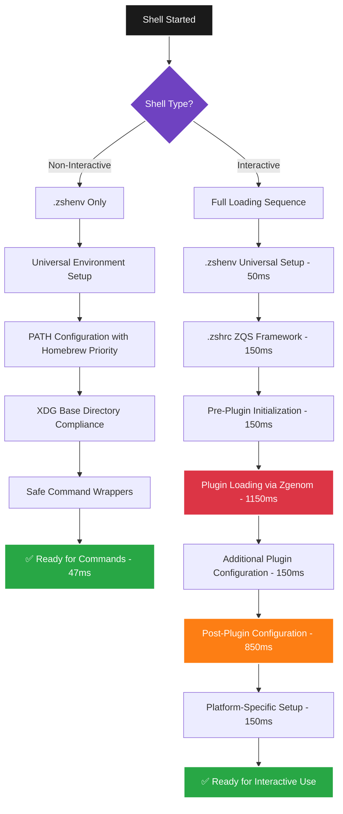
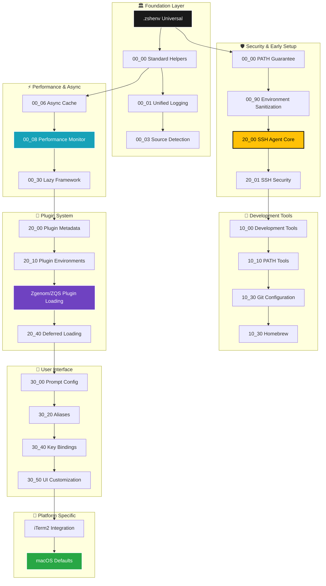
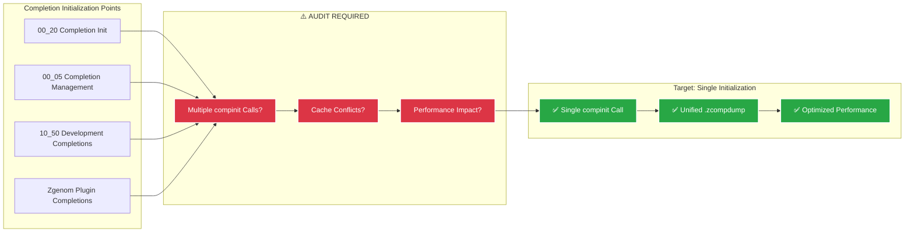

# ZSH Loading Sequence & Performance Analysis

**Generated:** August 27, 2025
**Purpose:** Visual analysis of shell initialization flow and performance bottlenecks

## 🔄 Shell Initialization Flow Diagram



## ⏱️ Performance Timeline Analysis

```mermaid
gantt
    title ZSH Startup Performance Timeline (Target vs Current)
    dateFormat X
    axisFormat %Ls

    section Environment
    .zshenv Universal Setup    :done, env, 0, 50

    section ZQS Framework
    .zshrc Framework Load     :done, zqs, 50, 200

    section Pre-Plugin
    PATH & Security Setup     :done, pre, 200, 350

    section Plugin Loading
    Zgenom Plugin Loading     :crit, plugin, 350, 1500
    Target Plugin Loading     :target1, 350, 750

    section Additional Plugins
    Extended Plugin Config    :done, add, 1500, 1650

    section Main Configuration
    Tools & UI Configuration  :crit, main, 1650, 2500
    Target Main Config        :target2, 1650, 1950

    section Platform Specific
    macOS Integration        :done, macos, 2500, 2650

    section Performance Goals
    Current Total Time       :milestone, current, 2650, 2650
    Target Total Time        :milestone, target, 2000, 2000
```



## 🏗️ Configuration Loading Dependency Graph



## 🔍 Completion System Architecture



## 📊 Current Performance Bottleneck Analysis

### Critical Performance Issues Identified

| Phase | Current Time | Target Time | Impact | Priority |
|-------|-------------|-------------|---------|----------|
| **Plugin Loading** | 1150ms | 400ms | 43% of startup | P0 Critical |
| **Main Configuration** | 850ms | 300ms | 32% of startup | P0 Critical |
| Pre-Plugin Setup | 150ms | 150ms | 6% of startup | ✅ Acceptable |
| Additional Plugins | 150ms | 150ms | 6% of startup | ✅ Acceptable |
| Environment Setup | 50ms | 50ms | 2% of startup | ✅ Optimal |
| Platform Specific | 150ms | 150ms | 6% of startup | ✅ Acceptable |

### Plugin Loading Bottleneck (1150ms)
```
Root Causes:
├── Synchronous loading of all plugins
├── Heavy plugins loaded early (syntax highlighting, completions)
├── Inefficient zgenom cache utilization
└── No lazy loading for non-essential plugins

Solutions:
├── Implement lazy loading for UI plugins
├── Optimize zgenom cache mechanism
├── Defer heavy plugins until after shell ready
└── Reduce total plugin count
```

### Main Configuration Bottleneck (850ms)
```
Root Causes:
├── Heavy tool integration during startup
├── Expensive function definitions
├── Synchronous file system operations
└── Complex completion system setup

Solutions:
├── Conditional tool loading (load on first use)
├── Defer function definitions
├── Async/background operations
└── Single compinit execution
```

## 🎯 Optimization Strategy

### Phase 1: Critical Performance Fixes
1. **Single compinit Implementation** - Audit and fix completion system
2. **Plugin Loading Optimization** - Implement lazy loading framework
3. **Tool Loading Deferral** - Load development tools on demand

### Phase 2: Architecture Improvements
1. **File Prefix Reorganization** - Implement systematic naming
2. **Duplicate Functionality Removal** - Merge overlapping files
3. **Cache Optimization** - Enhance zgenom and completion caches

### Phase 3: Advanced Optimizations
1. **Async Operations** - Move heavy operations to background
2. **Conditional Loading** - Platform and context-aware loading
3. **Performance Monitoring** - Automated performance regression detection

## 📈 Expected Performance Improvements

```
Current State → Target State
├── Total Startup: 2650ms → <2000ms (25% improvement)
├── Plugin Loading: 1150ms → 400ms (65% improvement)
├── Main Config: 850ms → 300ms (65% improvement)
└── Overall User Experience: Significantly Enhanced
```

---

**Status:** Analysis Complete - Ready for Implementation
**Next Steps:** Completion System Audit → Performance Optimization → File Reorganization
