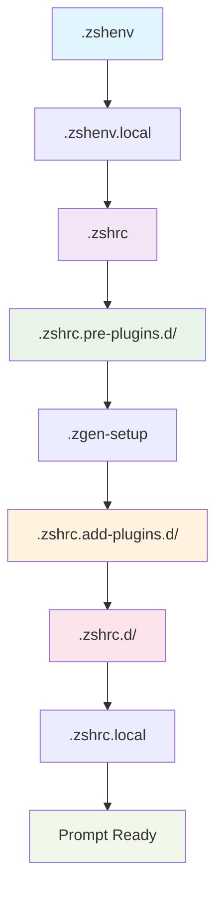

# Activation Flow & Loading Sequence

## Table of Contents

<details>
<summary>Click to expand</summary>

- [1. Top](#1-top)
- [2. Overview](#2-overview)
- [3. High-Level Flow](#3-high-level-flow)
- [4. Detailed Phase Analysis](#4-detailed-phase-analysis)
  - [4.1. **Phase 1: Environment Setup** (`.zshenv`)](#41-phase-1-environment-setup-zshenv)
    - [4.1.1. **1.1 Critical Startup Stanza** (Lines 1-70)](#411-11-critical-startup-stanza-lines-1-70)
    - [4.1.2. Key Variables Set:](#412-key-variables-set)
    - [4.1.3. **1.2 Emergency Protection** (Lines 86-97)](#413-12-emergency-protection-lines-86-97)
    - [4.1.4. **1.3 XDG Base Directory Setup** (Lines 105-111)](#414-13-xdg-base-directory-setup-lines-105-111)
    - [4.1.5. **1.4 ZDOTDIR Resolution** (Lines 120-161)](#415-14-zdotdir-resolution-lines-120-161)
    - [4.1.6. **1.5 Terminal Detection** (Lines 174-197)](#416-15-terminal-detection-lines-174-197)
    - [4.1.7. Detection Order:](#417-detection-order)
    - [4.1.8. **1.6 Performance Harness Setup** (Lines 259-260)](#418-16-performance-harness-setup-lines-259-260)
    - [4.1.9. **1.7 Debug Policy Application** (Lines 256-257)](#419-17-debug-policy-application-lines-256-257)
  - [4.2. **Phase 2: Main Configuration** (`.zshrc`)](#42-phase-2-main-configuration-zshrc)
    - [4.2.1. **2.1 Powerlevel10k Instant Prompt** (Lines 43-48)](#421-21-powerlevel10k-instant-prompt-lines-43-48)
    - [4.2.2. **2.2 Settings System Initialization** (Lines 59-65)](#422-22-settings-system-initialization-lines-59-65)
    - [4.2.3. **2.3 SSH Key Management** (Lines 331-422)](#423-23-ssh-key-management-lines-331-422)
    - [4.2.4. Components:](#424-components)
    - [4.2.5. **2.4 Pre-Plugin Directory Loading** (Lines 432-437)](#425-24-pre-plugin-directory-loading-lines-432-437)
  - [4.3. **Phase 3: Pre-Plugin Setup** (`.zshrc.pre-plugins.d/`)](#43-phase-3-pre-plugin-setup-zshrcpre-pluginsd)
    - [4.3.1. **3.1 Layer Set Marker** (`000-layer-set-marker.zsh`)](#431-31-layer-set-marker-000-layer-set-markerzsh)
    - [4.3.2. **3.2 Function Overrides for WARN_CREATE_GLOBAL** (`005-006-*.zsh`)](#432-32-function-overrides-for-warn_create_global-005-006-zsh)
    - [4.3.3. **3.3 Shell Safety** (`010-shell-safety-nounset.zsh`)](#433-33-shell-safety-010-shell-safety-nounsetzsh)
    - [4.3.4. Critical Protection:](#434-critical-protection)
    - [4.3.5. **3.4 XDG Extensions** (`020-xdg-extensions.zsh`)](#435-34-xdg-extensions-020-xdg-extensionszsh)
    - [4.3.6. **3.5 Delayed Nounset Activation** (`030-delayed-nounset-activation.zsh`)](#436-35-delayed-nounset-activation-030-delayed-nounset-activationzsh)
    - [4.3.7. **3.6 Log Rotation** (`040-log-rotation.zsh`)](#437-36-log-rotation-040-log-rotationzsh)
    - [4.3.8. **3.6 Segment Management** (`030-segment-management.zsh`)](#438-36-segment-management-030-segment-managementzsh)
    - [4.3.9. Performance Monitoring Setup:](#439-performance-monitoring-setup)
  - [4.4. **Phase 4: Plugin Manager Setup** (`.zgen-setup`)](#44-phase-4-plugin-manager-setup-zgen-setup)
    - [4.4.1. **4.1 Zgenom Source Detection** (`.zshenv` lines 742-774)](#441-41-zgenom-source-detection-zshenv-lines-742-774)
    - [4.4.2. Priority Order:](#442-priority-order)
    - [4.4.3. **4.2 Plugin Manager Initialization**](#443-42-plugin-manager-initialization)
  - [4.5. **Phase 5: Plugin Loading** (`.zshrc.add-plugins.d/`)](#45-phase-5-plugin-loading-zshrcadd-pluginsd)
    - [4.5.1. **5.1 Performance Core** (`100-perf-core.zsh`)](#451-51-performance-core-100-perf-corezsh)
    - [4.5.2. **5.2 Development Tools**](#452-52-development-tools)
    - [4.5.3. **5.3 Productivity Features**](#453-53-productivity-features)
  - [4.6. **Phase 6: Post-Plugin Integration** (`.zshrc.d/`)](#46-phase-6-post-plugin-integration-zshrcd)
    - [4.6.1. **6.1 Terminal Integration** (`100-terminal-integration.zsh`)](#461-61-terminal-integration-100-terminal-integrationzsh)
    - [4.6.2. **6.2 Prompt Setup** (`110-starship-prompt.zsh`)](#462-62-prompt-setup-110-starship-promptzsh)
    - [4.6.3. **6.3 Live Segment Capture** (`115-live-segment-capture.zsh`)](#463-63-live-segment-capture-115-live-segment-capturezsh)
    - [4.6.4. **6.4 Completion System** (`330-completions.zsh`, `335-completion-styles.zsh`)](#464-64-completion-system-330-completionszsh-335-completion-styleszsh)
    - [4.6.5. **6.5 History Management** (`300-shell-history.zsh`)](#465-65-history-management-300-shell-historyzsh)
  - [4.7. **Phase 7: Local Configuration** (`.zshrc.local`)](#47-phase-7-local-configuration-zshrclocal)
- [5. Timing and Performance](#5-timing-and-performance)
  - [5.1. **Startup Time Breakdown**](#51-startup-time-breakdown)
    - [5.1.1. Estimated Phase Timing:](#511-estimated-phase-timing)
  - [5.2. **Performance Monitoring Points**](#52-performance-monitoring-points)
    - [5.2.1. Segment Markers:](#521-segment-markers)
    - [5.2.2. Debug Integration:](#522-debug-integration)
- [6. Error Handling Flow](#6-error-handling-flow)
  - [6.1. **Error Recovery Strategy**](#61-error-recovery-strategy)
    - [6.1.1. Plugin Failures:](#611-plugin-failures)
    - [6.1.2. Environment Errors:](#612-environment-errors)
  - [6.2. **Debug Enablement**](#62-debug-enablement)
    - [6.2.1. Environment Variables:](#621-environment-variables)
- [7. Conditional Loading](#7-conditional-loading)
  - [7.1. **Platform-Specific Loading**](#71-platform-specific-loading)
    - [7.1.1. macOS Detection:](#711-macos-detection)
    - [7.1.2. Linux Detection:](#712-linux-detection)
  - [7.2. **Feature Toggles**](#72-feature-toggles)
    - [7.2.1. Environment-Based Control:](#721-environment-based-control)
- [8. Integration Points](#8-integration-points)
  - [8.1. **External Tool Integration**](#81-external-tool-integration)
    - [8.1.1. During Phase 5 (Plugin Loading):](#811-during-phase-5-plugin-loading)
    - [8.1.2. During Phase 6 (Post-Plugin):](#812-during-phase-6-post-plugin)
- [9. Troubleshooting Flow](#9-troubleshooting-flow)
  - [9.1. **Common Failure Points**](#91-common-failure-points)
    - [9.1.1. Plugin Load Failures:](#911-plugin-load-failures)
    - [9.1.2. Performance Issues:](#912-performance-issues)
    - [9.1.3. Environment Problems:](#913-environment-problems)
- [10. Assessment](#10-assessment)
  - [10.1. **Flow Efficiency**](#101-flow-efficiency)
  - [10.2. **Debuggability**](#102-debuggability)
  - [10.3. **Maintainability**](#103-maintainability)

</details>

---


## 1. Top

## 2. Overview

The ZSH configuration implements a sophisticated multi-stage activation process that ensures safe, performant, and modular shell initialization. This document details the complete startup sequence from shell invocation through prompt readiness.

## 3. High-Level Flow



## 4. Detailed Phase Analysis

### 4.1. **Phase 1: Environment Setup** (`.zshenv`)

**Timing:** Shell startup (all shell types)
**Purpose:** Establish core environment before any interactive configuration

#### 4.1.1. **1.1 Critical Startup Stanza** (Lines 1-70)

```bash

# Flag / Toggle Index - Comprehensive environment variable documentation

# Visual / Splash, Health / Instrumentation, Debug / Diagnostics, Security / Integrity

```

#### 4.1.2. Key Variables Set:

- `ZSH_DISABLE_SPLASH` - Splash screen control
- `ZSH_PERF_TRACK` - Performance monitoring
- `ZSH_DEBUG` - Debug logging
- `ZSH_SEC_DISABLE_AUTO_DEDUP` - Security features


#### 4.1.3. **1.2 Emergency Protection** (Lines 86-97)

```bash

# EMERGENCY IFS PROTECTION - Prevent corruption during startup

if [[ "$IFS" != $' \t\n' ]]; then
    unset IFS
    IFS=$' \t\n'
    export IFS
fi

# Emergency PATH fix if corrupted with literal $sep

if [[ "$PATH" == *'$sep'* ]]; then
    PATH="${PATH//\$sep/:}"
    export PATH
fi
```

#### 4.1.4. **1.3 XDG Base Directory Setup** (Lines 105-111)

```bash
export XDG_CONFIG_HOME="${XDG_CONFIG_HOME:-${HOME}/.config}"
export XDG_CACHE_HOME="${XDG_CACHE_HOME:-${HOME}/.cache}"
export XDG_DATA_HOME="${XDG_DATA_HOME:-${HOME}/.local/share}"
export XDG_STATE_HOME="${XDG_STATE_HOME:-${HOME}/.local/state}"
export XDG_BIN_HOME="${XDG_BIN_HOME:-${HOME}/.local/bin}"
```

#### 4.1.5. **1.4 ZDOTDIR Resolution** (Lines 120-161)

- **Primary:** `${HOME}/dotfiles/dot-config/zsh` (if exists)
- **Fallback:** XDG-compliant location
- **Canonicalization:** Resolves symlinks safely


#### 4.1.6. **1.5 Terminal Detection** (Lines 174-197)

#### 4.1.7. Detection Order:

1. **Alacritty** - `ALACRITTY_LOG` environment variable
2. **Apple Terminal** - Parent process name matching
3. **Ghostty** - Parent process name matching
4. **iTerm2** - `ITERM_SESSION_ID` variable
5. **Kitty** - `TERM` or `KITTY_PID` variables
6. **Warp** - `WARP_IS_LOCAL_SHELL_SESSION` variable
7. **WezTerm** - `WEZTERM_EXECUTABLE` or `WEZTERM_CONFIG_DIR`


#### 4.1.8. **1.6 Performance Harness Setup** (Lines 259-260)

```bash
export _PERFORMANCE_MONITORING_LOADED="${_PERFORMANCE_MONITORING_LOADED:-1}"
```

#### 4.1.9. **1.7 Debug Policy Application** (Lines 256-257)

```bash
zf::apply_debug_policy
```bash

### 4.2. **Phase 2: Main Configuration** (`.zshrc`)

**Timing:** Interactive shell startup
**Purpose:** Load core configuration and settings

#### 4.2.1. **2.1 Powerlevel10k Instant Prompt** (Lines 43-48)

```bash
if [[ -r "${XDG_CACHE_HOME:-$HOME/.cache}/p10k-instant-prompt-${(%):-%n}.zsh" ]]; then
    source "${XDG_CACHE_HOME:-$HOME/.cache}/p10k-instant-prompt-${(%):-%n}.zsh"
fi
```

#### 4.2.2. **2.2 Settings System Initialization** (Lines 59-65)

```bash
_ZQS_SETTINGS_DIR="${ZDOTDIR:-$HOME}/.zqs-settings"
export _ZQS_SETTINGS_DIR
```

#### 4.2.3. **2.3 SSH Key Management** (Lines 331-422)

#### 4.2.4. Components:

- **1Password Integration** - SSH agent support for macOS/Linux
- **Keychain Integration** - SSH agent forwarding
- **Manual Agent** - Fallback SSH agent management


#### 4.2.5. **2.4 Pre-Plugin Directory Loading** (Lines 432-437)

```bash
load-shell-fragments ${ZDOTDIR:-$HOME}/.zshrc.pre-plugins.d
load-shell-fragments "${ZDOTDIR:-$HOME}/.zshrc.pre-plugins.$(uname).d"
```bash

### 4.3. **Phase 3: Pre-Plugin Setup** (`.zshrc.pre-plugins.d/`)

**Timing:** Before zgenom initialization
**Purpose:** Security, safety, and environment preparation

#### 4.3.1. **3.1 Layer Set Marker** (`000-layer-set-marker.zsh`)

- Initializes layered configuration system
- Sets up version tracking


#### 4.3.2. **3.2 Function Overrides for WARN_CREATE_GLOBAL** (`005-006-*.zsh`)

**Purpose:** Override vendor functions to prevent spurious global variable warnings

##### **3.2.1 Load Fragments Override** (`005-load-fragments-no-warn.zsh`)

Overrides the `load-shell-fragments` function from `.zshrc` to suppress `WARN_CREATE_GLOBAL` warnings when sourcing vendor scripts:

```zsh
function load-shell-fragments() {
  # Suppress WARN_CREATE_GLOBAL only within this function
  setopt LOCAL_OPTIONS no_warn_create_global
  
  # Properly scope loop variable
  local _zqs_fragment
  
  # ... sourcing logic
}
```

**Why This is Needed:**
- Vendor scripts (FZF, Atuin, etc.) create global variables during initialization
- When sourced inside a function, ZSH reports them as "created globally in function"
- This override suppresses warnings for vendor code while preserving them for user code

##### **3.2.2 Settings Function Override** (`006-zqs-get-setting-no-warn.zsh`)

Overrides the `_zqs-get-setting` function from `.zshrc` to properly declare the `svalue` variable as local:

```zsh
_zqs-get-setting() {
  setopt LOCAL_OPTIONS no_warn_create_global
  
  local sfile="${_ZQS_SETTINGS_DIR}/${1}"
  local svalue  # Properly scoped as local
  
  # ... function logic
}
```

**See Also:** [150-troubleshooting-startup-warnings.md](150-troubleshooting-startup-warnings.md) for complete details on this issue and solution.


#### 4.3.3. **3.3 Shell Safety** (`010-shell-safety-nounset.zsh`)

#### 4.3.4. Critical Protection:
```bash

# Snapshot original option states

typeset -gA _ZQS_OPTION_SNAPSHOT

# Disable nounset for Oh-My-Zsh compatibility

if [[ -o nounset ]]; then
    export _ZQS_NOUNSET_WAS_ON=1
    unsetopt nounset
    export _ZQS_NOUNSET_DISABLED_FOR_OMZ=1
fi
```bash

#### 4.3.5. **3.4 XDG Extensions** (`020-xdg-extensions.zsh`)

- Ensures XDG directory existence
- Sets up localized cache and log directories


#### 4.3.6. **3.5 Delayed Nounset Activation** (`030-delayed-nounset-activation.zsh`)

```bash
zf::enable_nounset_safe() {
    # Controlled nounset re-enablement after environment stabilization
}
```bash

#### 4.3.7. **3.6 Log Rotation** (`040-log-rotation.zsh`)

- Manages debug and performance log rotation
- Prevents log directory bloat


#### 4.3.8. **3.6 Segment Management** (`030-segment-management.zsh`)

#### 4.3.9. Performance Monitoring Setup:
```bash
zf::segment() {
    local module_name="$1" action="$2" phase="${3:-other}"
    # Unified segment timing for all plugin phases
}
```

### 4.4. **Phase 4: Plugin Manager Setup** (`.zgen-setup`)

**Timing:** After pre-plugin setup, before plugin loading
**Purpose:** Initialize zgenom and prepare plugin environment

#### 4.4.1. **4.1 Zgenom Source Detection** (`.zshenv` lines 742-774)

#### 4.4.2. Priority Order:

1. `${ZDOTDIR}/.zqs-zgenom` (localized vendored)
2. `${ZDOTDIR}/zgenom` (stow-friendly)
3. `${ZDOTDIR}/.zgenom` (legacy)
4. `${HOME}/.zgenom` (user fallback)


#### 4.4.3. **4.2 Plugin Manager Initialization**

- Sets up zgenom paths and variables
- Configures cache and compdump locations
- Loads zgenom functions into `fpath`


### 4.5. **Phase 5: Plugin Loading** (`.zshrc.add-plugins.d/`)

**Timing:** After zgenom initialization
**Purpose:** Load and configure all plugins

#### 4.5.1. **5.1 Performance Core** (`100-perf-core.zsh`)

```bash
zgenom load mroth/evalcache    # Command output caching
zgenom load mafredri/zsh-async # Async job management
zgenom load romkatv/zsh-defer  # Deferred loading
```

#### 4.5.2. **5.2 Development Tools**

- **110-dev-php.zsh** - PHP, Composer, Herd integration
- **120-dev-node.zsh** - Node.js, nvm, npm, yarn, bun
- **130-dev-systems.zsh** - Rust, Go, Python, GitHub CLI
- **136-dev-python-uv.zsh** - Python with uv package manager


#### 4.5.3. **5.3 Productivity Features**

- **150-productivity-nav.zsh** - Enhanced navigation
- **160-productivity-fzf.zsh** - FZF integration
- **180-optional-autopair.zsh** - Auto-pairing
- **190-optional-abbr.zsh** - Abbreviations


### 4.6. **Phase 6: Post-Plugin Integration** (`.zshrc.d/`)

**Timing:** After all plugins are loaded
**Purpose:** Terminal integration and final setup

#### 4.6.1. **6.1 Terminal Integration** (`100-terminal-integration.zsh`)

- Terminal-specific optimizations
- Environment detection and setup


#### 4.6.2. **6.2 Prompt Setup** (`110-starship-prompt.zsh`)

```bash

# Starship prompt initialization

# Configured via ${ZDOTDIR:-$HOME}/.config/starship.toml

```bash

#### 4.6.3. **6.3 Live Segment Capture** (`115-live-segment-capture.zsh`)

- Real-time performance monitoring
- Integration with prompt system


#### 4.6.4. **6.4 Completion System** (`330-completions.zsh`, `335-completion-styles.zsh`)

```bash
zstyle ':completion:*' accept-exact '*(N)'
zstyle ':completion:*' use-cache on
zstyle ':completion:*' cache-path ${ZDOTDIR:-$HOME}/.zsh/cache
```bash

#### 4.6.5. **6.5 History Management** (`300-shell-history.zsh`)

```bash
export HISTSIZE=100000
export SAVEHIST=100000
export HISTFILE=${ZDOTDIR:-$HOME}/.zsh_history
setopt INC_APPEND_HISTORY SHARE_HISTORY
```bash

### 4.7. **Phase 7: Local Configuration** (`.zshrc.local`)

**Timing:** Final configuration step
**Purpose:** User-specific overrides and customizations

## 5. Timing and Performance

### 5.1. **Startup Time Breakdown**

**Target:** ~1.8 seconds total

#### 5.1.1. Estimated Phase Timing:

- **Phase 1 (.zshenv):** < 100ms
- **Phase 2 (.zshrc):** 200-400ms
- **Phase 3 (Pre-plugins):** 100-200ms
- **Phase 4 (zgenom init):** 50-100ms
- **Phase 5 (Plugin loading):** 800-1200ms ⚠️ **Performance critical**
- **Phase 6 (Post-plugins):** 200-400ms
- **Phase 7 (Local config):** < 50ms


### 5.2. **Performance Monitoring Points**

#### 5.2.1. Segment Markers:
```bash
zf::pre_segment "module" "start"    # Pre-plugin timing
zf::add_segment "module" "start"    # Plugin load timing
zf::post_segment "module" "start"   # Post-plugin timing
```

#### 5.2.2. Debug Integration:
```bash
zf::debug "# [module] Operation description"
```

## 6. Error Handling Flow

### 6.1. **Error Recovery Strategy**

#### 6.1.1. Plugin Failures:

1. **Detection:** zgenom load failure
2. **Logging:** Debug message emission
3. **Continuation:** Non-fatal, shell continues
4. **User Notification:** Optional warning messages


#### 6.1.2. Environment Errors:

1. **Directory Creation:** Silent failure, continue operation
2. **Permission Issues:** Graceful fallback to user home
3. **Command Absence:** Silent skipping with debug log


### 6.2. **Debug Enablement**

#### 6.2.1. Environment Variables:

- `ZSH_DEBUG=1` - Enable debug output
- `ZSH_PERF_TRACK=1` - Enable performance tracking
- `PERF_SEGMENT_LOG="/path/to/log"` - Specify log location


## 7. Conditional Loading

### 7.1. **Platform-Specific Loading**

#### 7.1.1. macOS Detection:
```bash
if [[ "$(uname -s)" == "Darwin" ]]; then
    load-shell-fragments ${ZDOTDIR:-$HOME}/.macos_aliases.d
fi
```

#### 7.1.2. Linux Detection:
```bash
if [[ "$(uname -s)" == "Linux" ]]; then
    load-shell-fragments "${ZDOTDIR:-$HOME}/.zshrc.pre-plugins.$(uname).d"
fi
```

### 7.2. **Feature Toggles**

#### 7.2.1. Environment-Based Control:

- `ZSH_DISABLE_SPLASH=1` - Disable visual splash
- `ZSH_MINIMAL=1` - Minimal configuration mode
- `ZSH_DEBUG=1` - Debug mode
- `ZSH_PERF_TRACK=1` - Performance monitoring


## 8. Integration Points

### 8.1. **External Tool Integration**

#### 8.1.1. During Phase 5 (Plugin Loading):

- **Atuin** - Shell history synchronization
- **FZF** - Fuzzy finder integration
- **Carapace** - Completion system
- **Starship** - Cross-shell prompt


#### 8.1.2. During Phase 6 (Post-Plugin):

- **Terminal detection** and optimization
- **History management** setup
- **Completion system** configuration
- **Environment-specific** customizations


## 9. Troubleshooting Flow

### 9.1. **Common Failure Points**

#### 9.1.1. Plugin Load Failures:
```bash

# Check zgenom status

ls -la ${ZDOTDIR}/.zgenom/

# Force plugin cache rebuild

rm -f ${ZDOTDIR}/.zgenom/init.zsh
```

#### 9.1.2. Performance Issues:
```bash

# Enable performance tracking

export ZSH_PERF_TRACK=1
export PERF_SEGMENT_LOG="${ZDOTDIR}/perf.log"

# Review timing data

cat ${ZDOTDIR}/perf.log
```

#### 9.1.3. Environment Problems:
```bash

# Verify ZDOTDIR

echo $ZDOTDIR

# Check for broken symlinks

find ${ZDOTDIR} -type l -exec test ! -e {} \; -print
```

## 10. Assessment

### 10.1. **Flow Efficiency**

- ✅ **Clear phase separation** prevents conflicts
- ✅ **Conditional loading** reduces startup time
- ✅ **Error handling** ensures robustness
- ⚠️ **Plugin loading** is the primary performance bottleneck


### 10.2. **Debuggability**

- ✅ **Comprehensive logging** at each phase
- ✅ **Performance monitoring** throughout
- ✅ **Error messages** guide troubleshooting


### 10.3. **Maintainability**

- ✅ **Modular structure** allows easy modifications
- ✅ **Standardized interfaces** ensure consistency
- ✅ **Documentation** supports understanding


*This activation flow documentation provides the complete startup sequence. For performance optimization, focus on Phase 5 (Plugin Loading) as it represents the largest timing segment.*

---

**Navigation:** [← Architecture](020-architecture.md) | [Top ↑](#activation-flow-loading-sequence) | [Security System →](040-security-system.md)

---

*Last updated: 2025-10-13*
